# Administration Architecture

## Document Status

This document is the official architectural reference for the Administration subsystem in the current Hospital Management System repository. It includes Phase 1 through Milestone 1.7.

It complements the following documents rather than replacing them:

- [SYSTEM_ARCHITECTURE.md](SYSTEM_ARCHITECTURE.md) — application-wide layers, encounter workflow, transactions, and module integration.
- [PERMISSION_MATRIX.md](PERMISSION_MATRIX.md) — permission catalogue, seeded role matrix, and module permission requirements.
- [DEPARTMENT_ARCHITECTURE.md](DEPARTMENT_ARCHITECTURE.md) — department catalogue, ownership rules, queue behavior, and clinical handoffs.
- [PROJECT_CONTEXT.md](PROJECT_CONTEXT.md), [DATABASE_CONTEXT.md](DATABASE_CONTEXT.md), and [WORKFLOW_CONTEXT.md](WORKFLOW_CONTEXT.md) — project conventions and enterprise workflow requirements.

Status labels used throughout this document:

| Status | Meaning |
|---|---|
| Implemented | Present in the schema, services, and active application routes. |
| Partially implemented | Supporting code exists, but an identified limitation or defect prevents the full intended capability. |
| Planned | Not implemented in the current repository. |

## 1. Administration Overview

The Administration subsystem manages the identities, organizational structures, authorization assignments, sessions, security records, and operational oversight required by every other hospital module.

Its purpose is to provide a controlled administrative plane for:

- user account lifecycle management;
- role and permission administration;
- department metadata and user membership;
- active department switching;
- session and account security monitoring;
- immutable audit inspection;
- operational dashboard statistics.

Administration does not own encounter clinical business rules. It supplies the users, roles, permissions, departments, security context, and oversight used by `VisitService`, `QueueService`, `EncounterStateService`, and future clinical services.

### Design goals

- Keep route controllers thin and move stateful rules into services.
- Preserve existing routes and public service APIs.
- Maintain compatibility with `users.department_id` while supporting multiple department memberships.
- Introduce database permissions without breaking legacy authorization behavior.
- Make every administrative mutation transactional and auditable.
- Preserve historical references by activating/deactivating records instead of deleting them.
- Use additive, reversible migrations for schema evolution.
- Centralize security-sensitive history without duplicating equivalent audit data.

### High-level components

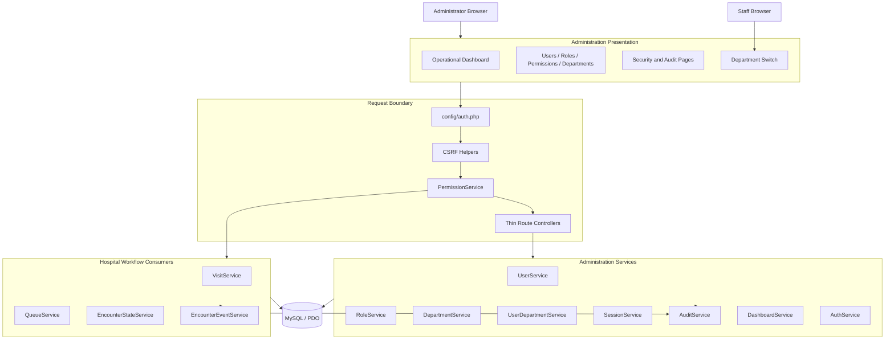

## 2. Administration Module Structure

The Administration module is implemented under `modules/administration/`. Existing shared layouts, helpers, CSS, authentication, PDO configuration, and service classes are reused.

```text
modules/administration/
├── dashboard/
│   └── index.php
├── users/
│   ├── index.php, view.php, create.php, edit.php
│   ├── save.php, update.php, action.php
│   ├── reset_password.php, reset_password_save.php
│   ├── departments.php, department_action.php
│   └── switch_department.php
├── roles/
│   ├── index.php, view.php, create.php, edit.php
│   └── save.php, update.php, action.php
├── permissions/
│   ├── index.php, create.php, edit.php
│   ├── save.php, update.php
│   └── matrix.php, matrix_save.php
├── departments/
│   ├── index.php, view.php, create.php, edit.php
│   └── save.php, update.php, action.php
├── security/
│   ├── bootstrap.php, dashboard.php
│   ├── active_sessions.php, terminate_session.php
│   ├── login_history.php, failed_logins.php
│   ├── account_lockouts.php, unlock_account.php
│   ├── password_history.php
│   └── audit_logs.php
├── settings/
│   ├── index.php, category.php, create.php, edit.php
│   ├── save.php, update.php, bulk_update.php
│   ├── reset.php, delete.php, history.php
│   ├── export.php, import.php
│   └── bootstrap.php, README.md
├── partials/
│   ├── bootstrap.php
│   ├── user_form.php
│   └── department_form.php
└── department_switch.php
```

The operational administrator dashboard remains at the backward-compatible route `dashboard/admin.php`. Its presentation stylesheet is `assets/css/admin-dashboard.css`.

| Area | Responsibility | Status |
|---|---|---|
| `dashboard/` | Administration landing page and links to administrative capabilities. | Implemented |
| `dashboard/admin.php` | Live operational administrator dashboard. | Implemented |
| `users/` | Account lifecycle, password reset, department membership, and user detail pages. | Partially implemented; see User Management Architecture. |
| `roles/` | Role CRUD-style lifecycle without physical deletion. | Implemented |
| `permissions/` | Permission catalogue and bulk role-permission assignment matrix. | Implemented |
| `departments/` | Department metadata, summaries, activation, and deactivation. | Implemented |
| `security/` | Sessions, login/security history, lockouts, audit viewer, and security dashboard. | Implemented |
| `partials/` | Shared administration bootstrap and reusable forms. | Implemented |
| `settings/` | Typed grouped settings, validation, bulk updates, history, search, export, and future import boundary. | Implemented; import execution and encrypted storage remain planned. |

`modules/administration/partials/bootstrap.php` loads authentication, database, helpers, administration services, and the administrator guard. `modules/administration/security/bootstrap.php` provides a security-specific boundary that supports administrator-only pages and self-service history/session pages.

## 3. User Management Architecture

### User model

`users` is the primary identity and account table. A user has a unique employee ID and username, one role, one compatibility primary department, account status, lock state, failed-login state, password state, and timestamps.

`user_departments` expands this model to multiple department memberships. `users.department_id` remains authoritative for legacy consumers and is synchronized when the primary membership changes.

### User lifecycle

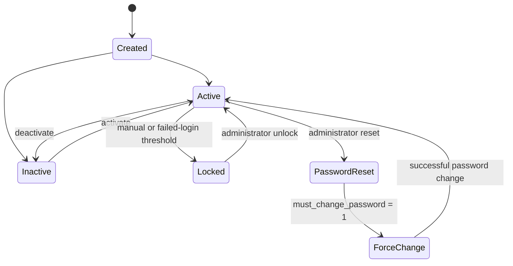

No administration route physically deletes a user. Historical foreign keys therefore remain valid.

### Request and transaction flow

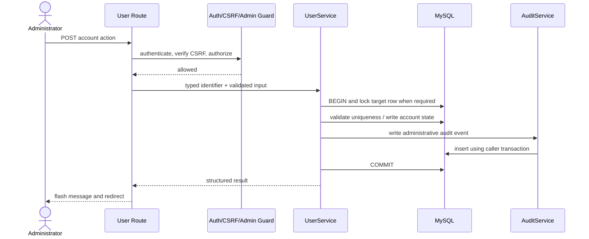

### `UserService` responsibilities

`UserService` currently provides:

- login and ID lookup;
- active-user and administration listings;
- username and employee-ID uniqueness checks;
- user creation;
- user editing;
- activation and deactivation;
- manual locking and unlocking;
- failed-login counting and automatic lockout;
- password updates and administrator resets;
- forced password-change flags;
- password history retrieval;
- role and department lookup for forms.

Mutations use transactions. Target rows are locked with `SELECT ... FOR UPDATE` for status, lock, password, and update operations. Passwords are hashed with PHP's `PASSWORD_DEFAULT` implementation.

### Administrative events

| Operation | Audit action |
|---|---|
| Create user | `USER_CREATED` |
| Update user | `USER_UPDATED` |
| Activate/deactivate | `USER_ACTIVATED`, `USER_DEACTIVATED` |
| Lock/unlock | `ACCOUNT_LOCKED`, `ACCOUNT_UNLOCKED` |
| Password reset | `PASSWORD_RESET` |
| Force change | `PASSWORD_FORCE_CHANGE` |
| User changes password | `PASSWORD_CHANGED` |

### Current implementation caveats

- User creation and editing synchronize `users.department_id` with one active primary `user_departments` membership inside the user transaction.
- Password history is recorded for password changes and administrator resets. Historical password reuse prevention is not implemented; the self-service change flow only prevents reuse of the current password.
- Password expiry columns and enforcement are not implemented. The schema and audit vocabulary are future-ready only.

## 4. Role Management Architecture

`RoleService` owns role creation, updates, activation, deactivation, retrieval, search, and listing.

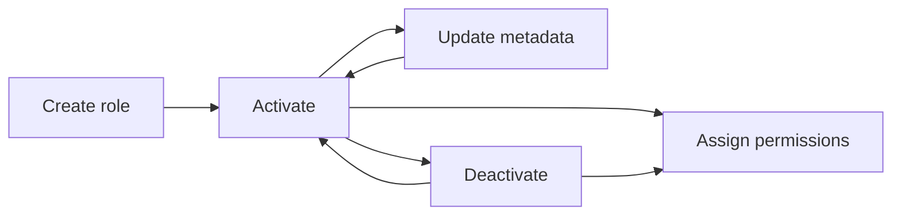

Role writes are transactional, validate non-empty names, prevent duplicate names, lock target role rows for state changes, and generate:

- `ROLE_CREATED`;
- `ROLE_UPDATED`;
- `ROLE_ACTIVATED`;
- `ROLE_DEACTIVATED`.

Roles are referenced by `users.role_id` and `role_permissions.role_id`. Deactivation does not remove users or permission history. `PermissionService` treats a known permission as denied when the associated role is inactive.

Role inheritance is **not implemented**. Roles are flat identities with direct permission assignments. There is no parent role, hierarchy table, or inherited permission resolution.

## 5. Permission Architecture

`PermissionService` is the centralized authorization and permission-administration service. The complete current catalogue and seeded matrix are maintained in [PERMISSION_MATRIX.md](PERMISSION_MATRIX.md).

### Permission resolution

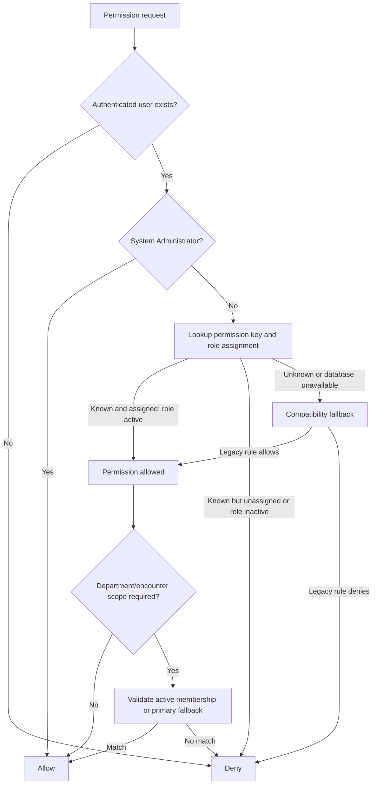

The database lookup joins `permissions`, `roles`, and `role_permissions`. An existing permission row is authoritative: absence of an assignment denies access. If the permission key does not exist or the database permission query is unavailable, the hardcoded compatibility rules preserve older workflows.

### Administrative capabilities

`PermissionService` supports:

- permission listing, creation, and update;
- role permission retrieval;
- transactional bulk replacement of role permissions;
- duplicate prevention through `UNIQUE(role_id, permission_id)`;
- assignment/removal audit events;
- encounter and department authorization helpers;
- security denial logging.

Bulk matrix updates lock the role, compare old and requested permission IDs, replace assignments in one transaction, and audit assigned, removed, and matrix-update events.

### Registering future permissions

Future modules should:

1. add a stable snake_case permission key through a versioned migration;
2. assign a human-readable name, owning module, description, and active state;
3. seed only the minimum roles that need the permission;
4. expose a semantic `PermissionService` method when the permission includes contextual rules;
5. call that method from both route and business-service boundaries where appropriate;
6. combine permission checks with department and encounter-state validation;
7. update [PERMISSION_MATRIX.md](PERMISSION_MATRIX.md).

Adding a permission row without an assignment changes fallback behavior for that key from compatibility evaluation to explicit denial. Permission migrations must therefore seed assignments deliberately.

## 6. Department Architecture

Department administration is implemented through `DepartmentService`, `UserDepartmentService`, and administration pages. Detailed department ownership, catalogue, queue behavior, and future clinical handoffs are documented in [DEPARTMENT_ARCHITECTURE.md](DEPARTMENT_ARCHITECTURE.md).

### Department administration

Administrators can create, view, edit, activate, and deactivate departments. Metadata includes code, name, description, location, extension, type, queue-enabled state, active state, and display order.

Department IDs are stable. Deactivation prevents new active use but does not rewrite historical encounters, transfers, queue records, audit events, or encounter events.

### Membership model

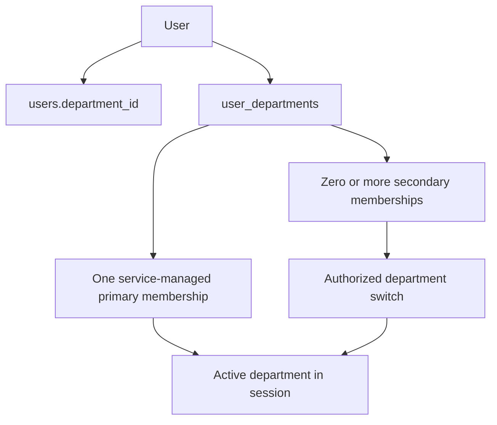

Implemented rules include:

- duplicate membership prevention;
- no new assignments to inactive departments;
- primary membership synchronization with `users.department_id`;
- prevention of direct primary-membership removal;
- active-department switching only to an active assigned department;
- administrator ability to switch another user, while ordinary users may switch only themselves;
- transactional assignment, removal, and primary changes;
- audit events for every membership and switching action.

One-primary enforcement is performed by service updates and row locking. The database has an index on `(user_id, is_primary)` but no conditional unique constraint guaranteeing one primary membership independently of the service.

## 7. Security Administration

Security administration combines authentication, persistent session tracking, lockout state, password history, audit records, and administrator/self-service views.

### Login and security lifecycle

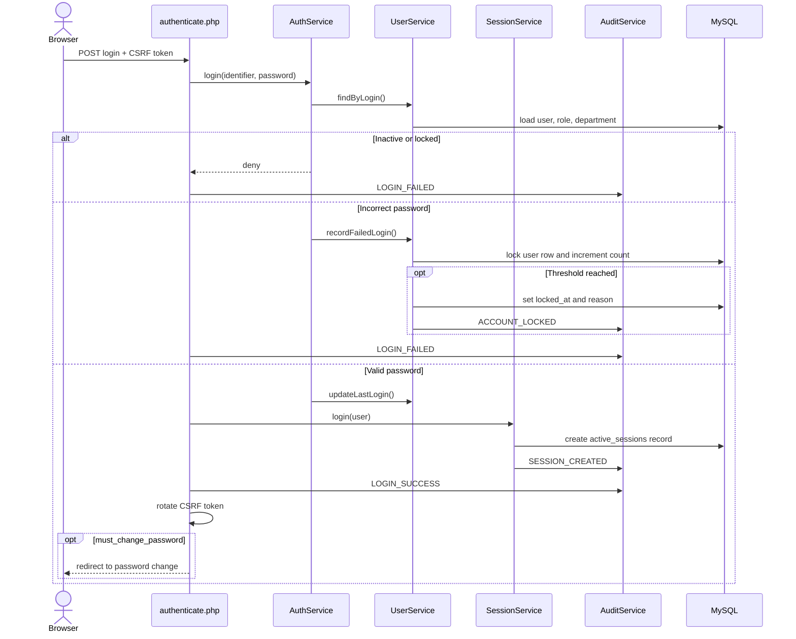

### Authentication

`AuthService` authenticates by username or employee ID through `UserService`, rejects inactive and locked users, verifies password hashes, increments failed-attempt counters, and updates the successful-login timestamp. Public response keys remain compatible with existing authentication routes.

`authentication/authenticate.php` enforces POST and CSRF, validates required credentials, creates the session, rotates the CSRF token, records login success/failure, and redirects forced-change users.

### Session lifecycle

`SessionService` manages both PHP session state and persistent `active_sessions` records:

1. regenerate session ID on login;
2. store user identity, role, primary department, and active department;
3. create a persistent session with login, activity, expiry, IP, user agent, and department;
4. refresh activity and expiry during authenticated requests;
5. expire idle sessions using the configured timeout;
6. terminate the persistent record on logout, administrative termination, or timeout;
7. clear the PHP session and cookie on logout.

Administrators can list and terminate any user's sessions. Non-administrators can list their own sessions and can terminate only sessions permitted by `SessionService` ownership checks. Session mutation uses transactions and row locking.

### Account lockout

The failed-login threshold is read from `config/app.php` and defaults to five attempts. `UserService::recordFailedLogin()` locks the user row, increments counters, and sets `locked_at`, `locked_by`, and `lock_reason` when the threshold is reached. Locked accounts are rejected by `AuthService`. Administrators can unlock accounts through the security module.

### Password history

`password_history` stores password hashes, change type, actor, and timestamp. History is displayed without exposing hashes. It supports auditability and future password-reuse policy, but full historical reuse enforcement and password expiry are not implemented.

### Security pages and scope

| Page | Administrator scope | Non-administrator scope |
|---|---|---|
| Security dashboard | Full security summary and recent security events | Denied |
| Active sessions | All active sessions | Own active sessions |
| Login history | Any selected user | Own history |
| Failed logins | All failed-login records | Denied |
| Account lockouts | All lockout records and unlock action | Denied |
| Password history | Any selected user | Own history |
| Audit viewer | All audit records | Denied |

Security-sensitive views generate `SECURITY_REPORT_VIEWED` or `AUDIT_LOG_VIEWED` where implemented. Session, login, lockout, password, CSRF, and authorization events use severity and event-type metadata.

### Current security limitations

- Password expiration is future-ready but not enforced.
- Password history does not yet prevent reuse of historical hashes.
- Session timeout is configured in PHP configuration rather than an administration settings interface.
- Development mode supplies an administrator fallback when no session exists. Production deployments must use `environment = production`.

## 8. Administrator Dashboard

The operational dashboard is implemented at `modules/administration/dashboard/index.php`, guarded by `PermissionService::isAdministrator()`, and backed by `DashboardService`.

### Widgets and statistics

| Group | Live data |
|---|---|
| Users | Total, active, inactive, locked, administrators, and counts by role. |
| Departments | Total, active, queue-enabled, user counts, and active encounter counts. |
| Encounters | Total, active, waiting, received, consultation, laboratory, pharmacy, completed, and cancelled. |
| Queue | Waiting, called, in-service, average active queue length, and queue by department. |
| Security | Active sessions, locked accounts, failed/successful logins today, password resets, and security events. |
| Audit | Recent overall, security, administration, and encounter-workflow events. |
| Charts | Encounter status distribution, queue-by-department presentation, seven-day login activity, and seven-day audit activity. |

The page provides quick links to users, roles, permissions, departments, security, and audit logs. Viewing the dashboard writes `ADMIN_DASHBOARD_VIEWED`; loading individual statistics creates no additional audits.

### Service dependencies

`DashboardService` owns dashboard-specific aggregation and uses `AuditService` for reusable audit searches and activity grouping. It reads from users, roles, departments, visits, queues, sessions, and audit logs. It does not mutate encounter or queue state.

### Query strategy

- Counts and grouping are performed in SQL.
- Role, status, queue, and department summaries use grouped aggregate queries.
- Recent activity is limited to small result sets.
- Audit viewer pagination remains in `AuditService::search()` rather than loading all records.
- Dashboard reads avoid per-user and per-encounter object loading.
- Existing foreign-key and status/date indexes support the primary filters.

There is no dashboard cache. Every request reads live data. This is suitable for the current deployment size but is a future scalability concern. A later cache must preserve permission scope, use short expirations, and invalidate safely without moving business rules into controllers or views.

The visualizations use HTML/CSS and remain readable when JavaScript is disabled. No external chart framework is introduced.

### System settings engine

`SettingsService` is the only supported application boundary for configurable settings. It provides typed retrieval (`string`, `integer`, `boolean`, `float`, and `array`), grouped and public retrieval, transactional CRUD, bulk updates, reset-to-default, search, export, validation, history, and request-local cache invalidation.

Settings are grouped into Hospital, General, Security, Encounters, Queue, Notifications, Reporting, Backup, and System categories. Validation rules are stored as JSON and support required values, allowed values, numeric minimum/maximum, string length, regular expressions, email/timezone formats, and registered custom callbacks.

Every mutation writes `system_setting_history` and an `AuditService` event in the same transaction. Sensitive values are replaced with `[REDACTED]` in history, audit descriptions, and exports. The schema reserves encryption metadata, but encrypted storage is intentionally rejected until an encryption provider and key-management policy are approved.

Caching is lazy and request-local: individual rows and groups are cached after first retrieval and invalidated after every mutation. Persistent cross-request caching is not implemented.

## 9. Service Interaction Map

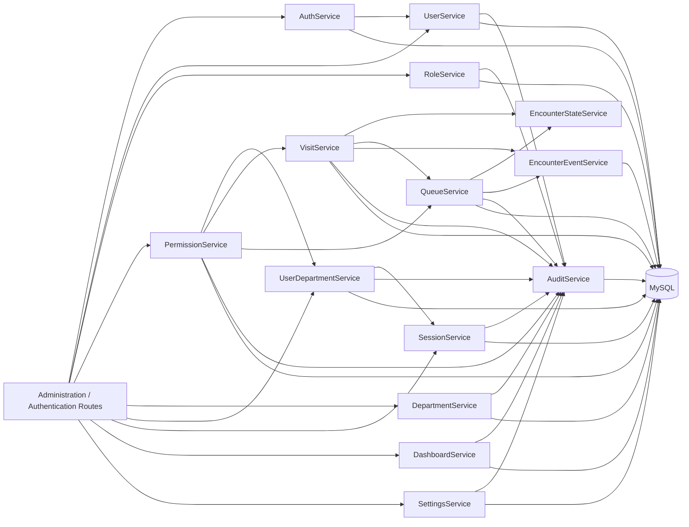

### Service responsibilities at the administration boundary

| Service | Administration relationship |
|---|---|
| `UserService` | Accounts, lockouts, password actions, user security history source. |
| `RoleService` | Role lifecycle and role availability. |
| `PermissionService` | Permission catalogue, role mapping, administrator override, department/encounter authorization. |
| `DepartmentService` | Department lifecycle, metadata, and summaries. |
| `UserDepartmentService` | Memberships, primary synchronization, and active switching. |
| `SessionService` | Current authentication state and persistent session administration. |
| `AuditService` | Transaction-aware audit writes, security summaries, searches, filtering, and activity aggregation. |
| `DashboardService` | Read-only operational aggregation and dashboard-view audit. |
| `SettingsService` | Typed configuration retrieval, validation, caching, CRUD, history, export, and audit integration. |
| `AuthService` | Credential and account-state authentication. |
| `QueueService` | Department queue ownership and lifecycle; supplies dashboard operational context through queue tables. |
| `VisitService` | Encounter ownership and workflow; consumes authorization and department identities. |
| `EncounterStateService` | Encounter transition and terminal-state rules, independent of administration CRUD. |
| `EncounterEventService` | Encounter timeline history; separate from administrative audit history. |

## 10. Authorization Flow

Authorization is layered. Authentication establishes identity; `PermissionService` establishes capability; department membership establishes organizational scope; encounter services establish workflow validity.

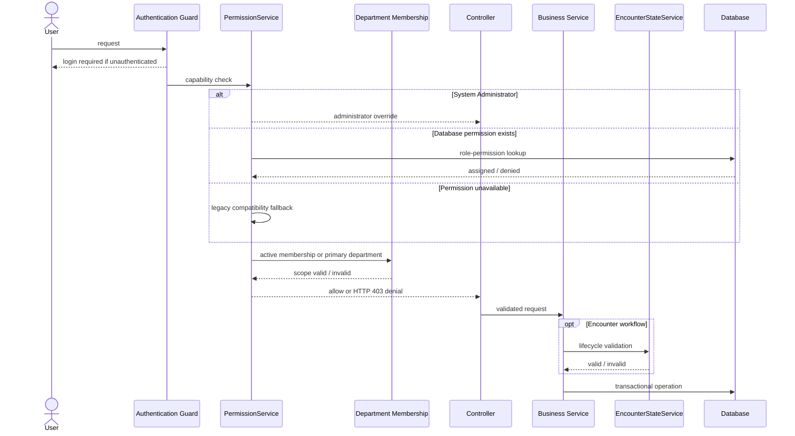

### Administrator override

`PermissionService::isAdministrator()` recognizes the exact `System Administrator` role name. Administrators bypass ordinary permission and department restrictions but remain subject to authentication, CSRF, input validation, and service business rules.

### Department restrictions

For ordinary users, department access requires the requested department to match an active session department backed by an active `user_departments` membership. `users.department_id` remains a compatibility fallback. Encounter operations additionally compare the encounter's current department and receipt/lifecycle state.

### Legacy compatibility

Hardcoded rules cover known Phase 0 permissions when database permission records are unavailable. They are a migration safety net, not the preferred model. New permission keys should be database-backed and explicitly assigned.

Administration pages use an administrator bootstrap guard. Security pages use a mixed model: administrator-only reports call `requireSecurityAdministrator()`, while own-session and own-history pages scope queries to the authenticated user.

## 11. Audit Flow

Audit records describe who performed an action, what happened, when, from where, in which department, and at what severity. They are distinct from encounter events, which describe the clinical/operational timeline of a specific encounter.

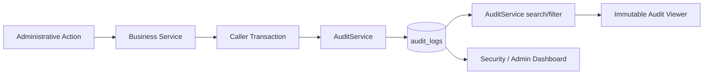

`AuditService::log()` joins an existing caller transaction when one exists and opens its own transaction otherwise. This allows administrative state and its audit record to commit or roll back together.

### Event categories

- user lifecycle and passwords;
- role and permission lifecycle;
- department and membership changes;
- login, logout, session, timeout, and lockout activity;
- denied authorization and invalid CSRF attempts;
- dashboard and security-report viewing;
- encounter and queue workflow actions.

### Search and filtering

The audit viewer supports module, action, event type, user, encounter, department, severity, and date-range filters. `AuditService::search()` uses prepared statements, total-count queries, bounded page sizes, and SQL limit/offset pagination.

Audit pages expose no edit or delete route. Immutability is enforced by application architecture and access design; the database does not independently prevent a privileged direct SQL update.

## 12. Database Relationships

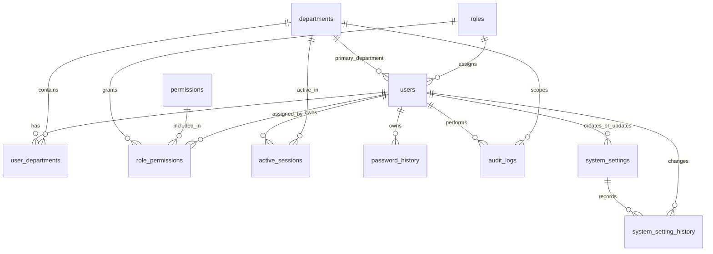

| Table | Administrative purpose | Important integrity/index rules |
|---|---|---|
| `users` | Identity, credentials, primary department, role, status, failed attempts, lock state, password flags. | Unique employee ID and username; indexed department, role, and lock timestamp; FKs to departments, roles, and locking actor. |
| `roles` | Named flat roles with active state. | Unique role name; active-state index. |
| `permissions` | Stable permission catalogue. | Unique permission key; module and active-state indexes. |
| `role_permissions` | Many-to-many role permission assignments. | Unique `(role_id, permission_id)`; indexed FKs; assignment actor retained with `SET NULL`. |
| `departments` | Stable organizational identity and metadata. | Unique code and name; type, active, and queue indexes. |
| `user_departments` | Primary and secondary memberships. | Unique `(user_id, department_id)`; user/department active indexes; primary index; restricted user/department deletion. |
| `active_sessions` | Persistent session registry and termination history. | Unique session ID; indexed user/status, activity, expiry, and department; restricted user deletion. |
| `password_history` | Password change/reset/forced history. | Indexed `(user_id, created_at)`; hashes are never rendered by UI. |
| `audit_logs` | Immutable application audit trail. | Indexed action/date, user/date, IP/date, department/date, encounter/date; department deletion sets scope to null. |
| `system_settings` | Unique typed configuration definitions and current values. | Unique setting key; grouped ordering, public, and system/editability indexes; creator/updater FKs. |
| `system_setting_history` | Immutable old/new configuration history. | Indexed setting/date, key/date, group/date, and actor/date; setting deletion preserves history with `SET NULL`. |

### Migration strategy

`database/hospital.sql` remains the fresh-install baseline. Phase 1 administration schema evolution is represented by paired additive migrations:

| Migration | Administration capability |
|---|---|
| `005_phase1_user_management` | Account lock metadata and locking actor relationship. |
| `006_phase1_roles_permissions` | Role activation, permissions, role-permission matrix, and initial permission seeds. |
| `007_phase1_departments_assignments` | Department metadata and multi-department memberships. |
| `008_phase1_security_administration` | Extended audit metadata, persistent sessions, and password history. |
| `009_phase1_system_settings` | Typed settings, setting history, `manage_settings`, and seeded enterprise categories. |
| `010_phase1_production_indexes` | Composite audit indexes for module, event type, severity, encounter, and date-filtered administration queries. |
| `011_phase1_visit_status_repair` | Reversible repair ledger and correction for historical invalid encounter ENUM sentinel values. |

Historical migrations are retained. Deployment must track applied migrations because the alignment scripts are not generally safe to replay. Down migrations require data-retention review before production use. The complete database policy is documented in `database/migrations/README.md` and [DATABASE_CONTEXT.md](DATABASE_CONTEXT.md).

## 13. Design Principles

| Principle | Administration application |
|---|---|
| Thin controllers | Routes authenticate, verify CSRF, collect input, call services, set messages, and redirect. |
| Service-oriented business logic | Lifecycle, validation, SQL, transactions, and audits reside in services. |
| Transaction safety | Administrative writes and their audit records commit atomically. |
| Database integrity | Foreign keys, unique constraints, indexes, and row locks protect relationships and concurrent writes. |
| Backward compatibility | Existing routes remain; `users.department_id` and legacy permission fallbacks remain supported. |
| Additive migrations | Phase 1 extends existing tables and introduces new tables without renaming or removing live columns. |
| Auditability | Administrative and security-sensitive actions generate immutable application history. |
| Security first | Authentication, CSRF, authorization, account lockouts, session tracking, and escaped output form layered controls. |
| Least privilege | Non-administrators are scoped by permission and active department; self-service security views are user-scoped. |
| Historical preservation | Users, roles, and departments are deactivated rather than physically deleted through administration routes. |
| Separation of histories | Audit records track system actors; encounter events track patient workflow. |
| Live operational visibility | Dashboard aggregation reads current state without mutating workflow records. |

## 14. Future Extensibility

Future modules integrate with Administration; they do not duplicate its identity, authorization, department, or audit mechanisms.

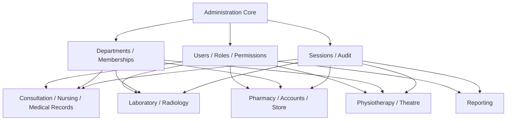

Each future module should:

- register explicit module permissions through a migration;
- assign permissions according to least privilege;
- use `PermissionService` and active department scope;
- link clinical/operational records to `visit_id` where applicable;
- validate encounter state through `EncounterStateService`;
- use transactions for writes;
- write audit logs and encounter events inside the same transaction;
- expose administrative counts through service-level aggregation rather than controller SQL;
- retain historical user and department IDs.

Planned integration examples:

| Module | Administration dependency |
|---|---|
| Medical Records | Records roles, release permissions, document audit history. |
| Consultation | Doctor permissions, active Doctor department, assigned encounter. |
| Nursing | Nursing permissions and department queue ownership. |
| Laboratory | Request/result permissions, Laboratory membership, security trace. |
| Radiology | Imaging/report permissions and diagnostic department membership. |
| Pharmacy | Verification/dispensing permissions and Pharmacy department. |
| Accounts | Invoice/payment permissions and financial audit events. |
| Physiotherapy | Referral/session permissions and department assignment. |
| Theatre | Scheduling/operation permissions and Theatre department. |
| Store | Stock receipt/issue/adjustment permissions and Store department. |
| Reporting | Report-specific permissions, data scopes, audit of sensitive report access. |

## 15. Implementation Status

### Implemented

| Capability | Evidence in current repository |
|---|---|
| Administration module foundation | Dedicated routes, shared bootstrap, layouts, and reusable forms. |
| User creation, listing, viewing | `UserService` and `modules/administration/users/`. |
| User activation/deactivation | Transactional service methods and audited action route. |
| Manual and automatic account lockout | `UserService`, `AuthService`, security lockout pages. |
| Administrator password reset and forced change | User service methods, reset routes, force-change login redirect. |
| Role lifecycle | `RoleService` and role administration pages. |
| Database permission catalogue | `permissions`, `role_permissions`, `PermissionService`. |
| Bulk role-permission matrix | Matrix pages and transactional assignment replacement. |
| Permission compatibility fallback | Database-first permission resolution with legacy fallback. |
| Department lifecycle and metadata | `DepartmentService`, migration 007, department pages. |
| Multi-department assignment and switching | `UserDepartmentService`, membership routes, active session department. |
| Persistent session administration | `active_sessions`, `SessionService`, session pages and termination. |
| Login, lockout, and password history views | Security administration routes and `AuditService`. |
| Audit viewer | Search, filters, pagination, immutable read-only UI. |
| Security dashboard | Live security summary and recent security events. |
| Administrator operational dashboard | `DashboardService`, live widgets, charts, quick actions, audited viewing. |
| Enterprise system settings | Nine setting categories, typed retrieval, validation, CRUD, bulk updates, reset, history, search, export, caching, and auditing. |
| Primary department synchronization | User creation and editing atomically synchronize the legacy primary column and membership table. |
| Password reset history | Administrator resets atomically persist password history and audit records. |
| Production regression suite | `test/phase1_regression_test.php` verifies Administration and the complete encounter workflow against MySQL. |
| Session cookie hardening | Strict cookie-only sessions, HttpOnly, SameSite=Lax, and conditional Secure cookies. |
| CSRF helpers and administration POST enforcement | Shared helpers, tokens in forms, and `requireCsrfToken()` in current administration POST routes. |
| Administrator direct-route enforcement | Permission guards and audited HTTP 403 denial. |

### Partially Implemented

| Capability | Current limitation |
|---|---|
| Password policy | Minimum length, current-password difference, lockout threshold, and force-change exist; historical reuse, complexity, expiry, and configurable UI are absent. |
| One-primary membership enforcement | Enforced transactionally in service code, not by a database conditional unique constraint. |
| Dashboard scalability | SQL aggregation is efficient for current scale, but there is no cache or read replica strategy. |
| Audit immutability | No application edit/delete route exists, but the database does not independently prohibit privileged SQL mutation. |
| Permission migration | Database permissions cover Phase 0 and Administration basics; future module permissions are not registered. |
| Development authentication posture | Development mode intentionally provides an administrator fallback; production must disable it. |
| Settings runtime adoption | Lockout threshold and persistent-session timeout use `SettingsService`; date/time formats, currency rendering, encounter numbering, queue defaults, and branding retain compatibility paths pending isolated migrations. |
| Settings encryption and import | Metadata and UI boundary exist, but encryption/key management and executable import are intentionally not implemented. |

### Planned

| Capability | Planned scope |
|---|---|
| Role inheritance | Parent/child role model and deterministic inherited permission resolution. |
| Password expiration | Policy configuration, expiry calculation, notification, and enforced renewal. |
| Historical password reuse prevention | Compare new credentials against retained password hashes according to policy. |
| Dashboard caching | Short-lived, permission-safe operational cache when scale requires it. |
| Specialized department administration | Module-specific departmental configuration beyond current metadata and queue flag. |
| Clinical permission groups | Consultation, nursing, laboratory, radiology, pharmacy, accounts, physiotherapy, theatre, store, records, and reporting permissions. |
| Formal migration runner | Applied-migration tracking, ordering, checksums, and controlled rollback orchestration. |
| Expanded automated tests | Concurrent-worker stress tests and browser-level UI automation beyond the current live service and HTTP route matrices. |

## Maintenance Guidance

Before extending Administration:

1. verify the capability is not already owned by an existing service;
2. preserve public APIs and routes;
3. add schema only through paired additive migrations;
4. keep `users.department_id` synchronized until compatibility removal is explicitly approved;
5. add permissions before exposing new administrative actions;
6. enforce authentication, CSRF, and authorization server-side;
7. keep writes and audits in one transaction;
8. use activation/deactivation instead of deleting referenced identities;
9. update this document and the specialized permission/department references;
10. clearly distinguish implemented behavior from future intent.
