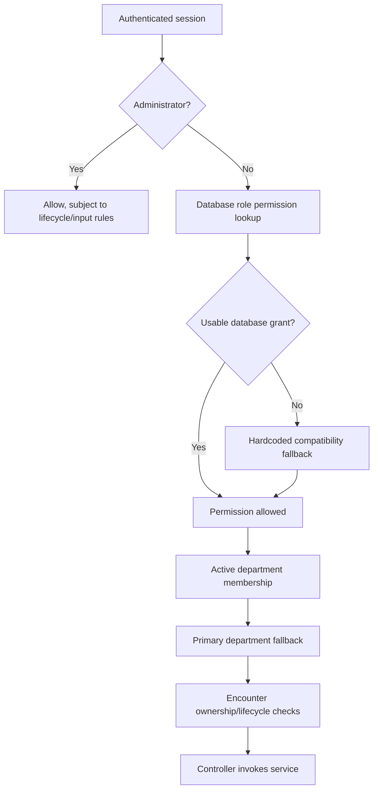
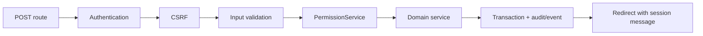

# API Contracts

> Current implementation coverage: **Phase 3.3**. Clinical Note contracts are
> included below; the older generated overview text is retained for history.

> Official reference for public PHP service contracts through Phase 3.2. “API” primarily means callable service methods and stable route-to-service behavior. Authorization keys are catalogued in [PERMISSION_MATRIX.md](PERMISSION_MATRIX.md); database details are in [DATABASE_RELATIONSHIPS.md](DATABASE_RELATIONSHIPS.md).

## Contract Philosophy

- Existing public methods are compatibility contracts. In particular, `VisitService::createVisit()`, `transferVisit()`, `receiveVisit()`, `assignDoctor()`, `updateStatus()`, `getVisitById()`, and `getVisitTimeline()` must remain callable with their current signatures and legacy response keys.
- Controllers authenticate, validate CSRF/input, authorize through `PermissionService`, call a service, and redirect/render. Services repeat authoritative business/lifecycle checks where implemented.
- Write methods normally return a structured array with `success` and `errors`; many retain top-level identifiers instead of a uniform `data` key.
- Read methods intentionally return domain values such as `?array`, `array`, `bool`, `int`, or `string`.
- The outer workflow service owns the transaction. `AuditService::log()` and `EncounterEventService::record()` participate in an already-active caller transaction and do not commit it.
- Expected validation/business failures should be represented in service results. Unexpected PDO/runtime exceptions are caught by most write services and converted to failures, while several read and legacy methods can propagate exceptions.
- Authorization is not uniform at the service boundary. Workflow services contain permission checks; administration controllers are also expected to authorize before invoking administration services.

## Structured Response Conventions

### Standard write result

```php
[
    'success' => true,
    'errors' => []
]
```

Failure:

```php
[
    'success' => false,
    'errors' => ['Human-readable validation or workflow error.']
]
```

Current extended results may additionally retain `user_id`, `role_id`, `permission_id`, `department_id`, `department_name`, `visit_id`, `visit_number`, `transfer_id`, `doctor_id`, `doctor_name`, `queue_id`, `queue_status`, `position`, `received_by`, `received_at`, pagination keys, or a `data` key. Callers must test `success` and tolerate compatible additional keys. A future standardization may add `data`, but must not remove existing top-level keys.

`AuthService::login()` is a specialized envelope with `status`, HTTP-like `code`, `message`, `user`, `user_id`, and field-keyed `errors`. Read methods do not fabricate structured write envelopes.

## Service Catalogue

| Service | Purpose/dependencies | Transaction and security responsibility |
|---|---|---|
| `AuthService` | Credential verification via `UserService`; lockout threshold via `SettingsService`. | Does not own a complete login transaction; updates login counters through legacy user methods. Controller creates session/audit. |
| `SessionService` | PHP session state and persistent `active_sessions`; uses settings and audit internally. | Owns persistent session mutation transactions. Authentication guards are exposed here. |
| `UserService` | User lifecycle, credentials and password history; collaborates with `AuditService`. | Modern admin writes own transactions/audits. Some legacy void writes swallow failures for compatibility. |
| `RoleService` | Role master lifecycle and duplicate prevention; uses `AuditService`. | Own transactions, row locks for status/update. Controller authorization expected. |
| `PermissionService` | Database role permissions with hardcoded compatibility fallback; department/encounter authorization; audits denials. | Permission-matrix writes own transactions. Most checks are read-only. Administrator override is authoritative. |
| `DepartmentService` | Department master lifecycle and summaries; uses `AuditService`. | Own transactions/audits; deactivation preserves historical IDs. |
| `UserDepartmentService` | Multi-department assignments and active-department switching; uses `SessionService` and audit. | Assignment writes own transactions. Switch changes PHP session after validation. |
| `PatientService` | Patient registration/search/update; uses `AuditService`. | Registration/update own transactions and service-level audit. |
| `VisitService` | Backward-compatible encounter facade and workflow coordinator; collaborates with state, event, audit, queue and permission services. | Owns encounter/transfer/receive/assignment/status transactions and row locks. Queue wrapper calls delegate to `QueueService`. |
| `EncounterStateService` | Pure encounter lifecycle and prerequisite validation. | No database/transaction; returns structured validation results. |
| `EncounterEventService` | Authoritative encounter-event writer and timeline reader. | Participates in caller transaction; starts/commits only when called standalone. |
| `QueueService` | Queue ownership, ordering and transitions; collaborates with state, event, audit and permission services. | Owns queue mutations with row locking and atomic audit/event writes. |
| `AuditService` | Append-only audit and audit/timeline/security queries. | `log()` joins caller transaction or owns a standalone statement; convenience methods are void wrappers. |
| `DashboardService` | Aggregated administrator dashboard data from existing operational tables. | Read-only except explicit dashboard-view audit method. Administrator controller authorization expected. |
| `SettingsService` | Typed definitions, validation, history, export and request-local cache. | Owns settings write transactions; history/audit atomic; authorization remains controller-owned. |

`BillingService.php`, `ConsultationService.php`, `LaboratoryService.php`, `RadiologyService.php`, and `PharmacyService.php` are service contracts with differing implementation maturity. `LaboratoryService.php` and `RadiologyService.php` are implemented for request/report CRUD and worklist operations; the others remain planned or partial depending on module status. There is no implemented `TimelineService`; timeline reads are exposed by `VisitService`, `EncounterEventService`, and `AuditService`.

## Public Method Contracts

The method tables are normative summaries. Unless a row says otherwise, write failures use `['success' => false, 'errors' => [...]]`; administration authorization and CSRF are expected at the controller boundary; PDO read failures may propagate.

### `AuthService`

Constructor: `__construct(PDO $db)`. Dependencies are created internally. Reads/writes `users`; reads `system_settings` for lockout policy.

| Signature | Purpose/return | Validation, authorization and side effects |
|---|---|---|
| `login(string $login, string $password): array` | Authenticates username or employee ID. Success includes `success`, `status='SUCCESS'`, `code=200`, message, password-free `user`, `user_id`, `errors=[]`. Failure retains same envelope with codes 401/403/423. | Requires non-matching credentials to fail uniformly. Rejects inactive/locked users. Failed password increments/possibly locks user; success resets counters/updates last login. Controller records LOGIN events and starts session. Not idempotent because counters/timestamps change. |
| `mustChangePassword(array $user): bool` | Reads `must_change_password`. | Pure helper; caller redirects to password-change route. |
| `hashPassword(string $password): string` | Returns `password_hash(..., PASSWORD_DEFAULT)`. | Does not enforce password policy itself. |
| `verifyPassword(string $plainPassword, string $hashedPassword): bool` | Wraps `password_verify`. | Pure; no audit. |

Example: `$result = (new AuthService($pdo))->login($login, $password);`.

Authentication guards resolve environment only from process/server variables:

1. `HMS_APP_ENV` is accepted only as `development`, `testing`, or `production`.
2. Missing/invalid environment resolves to `production`.
3. Synthetic development identity is available only when the resolved value is `development` **and** `HMS_ENABLE_DEV_AUTH_BYPASS` is explicitly truthy.
4. Testing and production never enable the bypass. Query parameters, form fields and cookies are not consulted.

### `SessionService`

Constructor: `__construct(?PDO $pdo = null)` starts/uses PHP session and resolves global PDO when omitted. Persistent operations use `active_sessions`, users, departments, settings and audit.

| Signature | Purpose/return | Contract and side effects |
|---|---|---|
| `login(array $user): void` | Regenerates ID, stores normalized user/active-department session data, registers persistent session. | Expects joined user keys (`employee_id`, department/role names/IDs). Creates `SESSION_CREATED`. Persistent registration errors are swallowed so PHP login can continue: compatibility/high-availability behavior with monitoring debt. |
| `isAuthenticated(): bool` | Tests logged-in flag and user. | PHP session only. |
| `user(): ?array` / `userId(): ?int` / `role(): ?string` / `department(): ?string` / `activeDepartmentId(): ?int` | Read current session identity/context. | No DB access. `department()` prefers active over primary. |
| `setActiveDepartment(int $departmentId, string $departmentName): void` | Changes active department keys in current PHP session. | Membership authorization must happen in `UserDepartmentService`. Does not itself update persistent session row. |
| `hasRole(string $role): bool` / `hasDepartment(string $department): bool` | Exact-name session predicates. | Compatibility helpers, not full permission checks. |
| `flash(string $type, string $message): void` / `getFlash(): ?array` | Write/read-once flash message. | PHP session only; `getFlash()` removes it. |
| `logout(): void` | Terminates current persistent session, clears/destroys PHP session and cookie. | Audit `SESSION_TERMINATED`; route currently uses state-changing GET without CSRF. |
| `listActiveSessions(?int $userId = null): array` | Active sessions for explicit or current user. | Controller must restrict users to self; direct service call accepts arbitrary ID. |
| `getAllActiveSessions(): array` | All active sessions joined to user/department. | Administrator-only controller expectation. |
| `terminateSession(int $sessionId, int $actorUserId, ?string $reason = null): array` | Terminates one row. | Own transaction/row lock; self vs admin audit distinction; prevents inappropriate repeat transition. Returns session ID on success. |
| `terminateAllSessionsForUser(int $userId, int $actorUserId): array` | Terminates active sessions for user. | Transactional bulk change/audit; caller must be admin or authorized self flow. |
| `terminateExpiredSessions(): array` | Marks elapsed active rows expired. | Transactional maintenance; returns affected count in extended result. |
| `getSessionHistory(?int $userId = null): array` | Session history for user/current user. | Controller authorization required for another user. |
| `requireAuthentication(): void` / `requireLogin(): void` | Enforces authenticated/non-expired session and redirects/exits as implemented. | Refreshes activity/persistent expiry; may emit timeout audit. Unauthenticated requests use the absolute application login URL so nested modules cannot misresolve the redirect. |

### `UserService`

Constructor: `__construct(PDO $db)`. Tables: users, roles, departments, user departments, password history, audit.

| Signature | Purpose/return | Validation, transaction and effects |
|---|---|---|
| `findByLogin(string $login): ?array` | Joined user by username/employee number. | Read; includes password hash for `AuthService`. |
| `findById(int $id): ?array` | Basic user lookup. | Read. |
| `updateLastLogin(int $userId): void` | Sets last login and resets failed-login fields. | Legacy write, internally catches errors; no structured result. |
| `recordFailedLogin(int $userId, int $maxAttempts = 5): void` | Increments failures and locks at threshold. | Transaction/row lock; `ACCOUNT_LOCKED` when threshold reached. Errors are swallowed for compatibility. |
| `updatePassword(int $userId, string $hashedPassword): void` | Writes hash, clears force-change and appends password history. | Expects caller-hashed password; transaction and `PASSWORD_CHANGED`; void compatibility API. |
| `getActiveUsers(): array` | Active joined users. | Read. |
| `usernameExists(string $username): bool` / `employeeIdExists(string $employeeId): bool` | Duplicate predicates. | Read; creation still relies on unique constraints. |
| `getUsers(array $filters = []): array` | Filtered administration list. | Read; supports implemented status/role/department/search filters. |
| `getRoles(): array` / `getDepartments(): array` | Active selector data. | Read. |
| `getUserById(int $userId): ?array` | Detailed joined administration record. | Read. |
| `getPasswordHistory(int $userId): array` | Metadata/history rows. | Password hash must not be presented. Authorization is controller-owned. |
| `createUser(array $data, int $actorUserId): array` | Creates user and primary membership. Success retains `user_id`. | Validates required identity/login/role/department/password, uniqueness and active references; own transaction; audit `USER_CREATED`; password history as applicable. |
| `updateUser(int $userId, array $data, int $actorUserId): array` | Updates identity, role and compatibility primary department. | Own transaction/row lock; uniqueness and active references; synchronizes membership; `USER_UPDATED`. |
| `activateUser(int $userId, int $actorUserId): array` / `deactivateUser(...)` | Changes account status. | Transaction/lock; retains `user_id`; audits `USER_ACTIVATED`/`USER_DEACTIVATED`. |
| `lockUser(int $userId, int $actorUserId, ?string $reason = null): array` / `unlockUser(...)` | Administrative lock state. | Transaction/lock; `ACCOUNT_LOCKED`/`ACCOUNT_UNLOCKED`; unlock resets failure fields. |
| `resetPassword(int $userId, string $newPassword, int $actorUserId): array` | Hashes and resets password, forces change, appends history. | Minimum length validation; transaction; `PASSWORD_RESET`; returns `user_id`. |
| `forcePasswordChange(int $userId, int $actorUserId): array` | Sets force-change flag. | Transaction; `PASSWORD_FORCE_CHANGE`. |

Example success: `['success' => true, 'user_id' => 12, 'errors' => []]`.

### `RoleService`

Constructor: `__construct(PDO $db)`. Uses roles and audit.

| Signature | Purpose/return | Contract |
|---|---|---|
| `createRole(string $name, ?string $description, int $actorUserId): array` | Create unique role; returns `role_id`. | Transaction; validates name/duplicate; `ROLE_CREATED`. |
| `updateRole(int $roleId, string $name, ?string $description, int $actorUserId): array` | Update role metadata. | Row lock/transaction; duplicate prevention; `ROLE_UPDATED`. |
| `activateRole(int $roleId, int $actorUserId): array` / `deactivateRole(...)` | Toggle active state. | Row lock/transaction; `ROLE_ACTIVATED`/`ROLE_DEACTIVATED`; does not delete assignments. |
| `getRole(int $roleId): ?array` | Role with implemented summary data. | Read. |
| `searchRoles(string $query = ''): array` | Name/description search. | Read. |
| `listRoles(bool $activeOnly = true): array` | Ordered role list. | Read. |

### `PermissionService`

Constructor: `__construct(PDO $db)`. Uses permissions, role permissions, users/departments/memberships, visits and audit.

| Signature | Purpose/return | Authorization/compatibility contract |
|---|---|---|
| `hasPermission(string $permission, ?array $user = null): bool` | Checks effective permission. | Administrator override; database role mapping first; if unavailable/unmapped, hardcoded role/department compatibility fallback. User defaults to current session compatibility identity. |
| `listPermissions(bool $activeOnly = true): array` | Permission catalogue. | Read; admin page expectation. |
| `createPermission(string $key, string $name, string $module, ?string $description, int $actorUserId): array` | Creates unique permission; returns `permission_id`. | Transaction, format/duplicate checks, `PERMISSION_CREATED`. |
| `updatePermission(int $permissionId, string $key, string $name, string $module, ?string $description, int $actorUserId): array` | Updates permission metadata. | Transaction/row lock, duplicate checks, `PERMISSION_UPDATED`. |
| `getRolePermissions(int $roleId): array` | Assigned permission IDs/details. | Read. |
| `assignPermissions(int $roleId, array $permissionIds, int $actorUserId): array` | Bulk-replaces/synchronizes role matrix; returns role and IDs. | Transaction/role lock; deduplicates IDs; prevents duplicate rows; `PERMISSION_ASSIGNED`/`PERMISSION_REMOVED` and `ROLE_PERMISSION_UPDATED` as applicable. |
| `removePermission(int $roleId, int $permissionId, int $actorUserId): array` | Removes one mapping. | Transaction; `PERMISSION_REMOVED`/matrix audit. |
| `canAccessDepartment(int $departmentId, ?array $user = null): bool` | Validates admin override, active membership, primary and compatibility fallback. | Read. |
| `canAccessEncounter(array $encounter, ?array $user = null): bool` | Encounter department access. | Delegates department logic; administrator override. |
| `canTransferEncounter(...)`, `canReceiveEncounter(...)`, `canAssignDoctor(...)`, `canChangeEncounterStatus(...)`, `canEditEncounter(...)`, `canViewEncounter(...)` | Workflow-specific boolean checks. Full signatures are `canTransferEncounter(array $encounter, ?array $user = null): bool`, `canReceiveEncounter(array $encounter, ?array $user = null, ?array $pendingTransfer = null): bool`, and the remaining methods `(array $encounter, ?array $user = null): bool`. | Combine permission key, department ownership and lifecycle context. Controllers/services must still validate workflow prerequisites. |
| `canManageUsers(?array $user = null): bool` / `canManageSettings(?array $user = null): bool` | Administration capability checks. | Database-first plus admin/compatibility behavior. |
| `isAdministrator(?array $user = null): bool` | Administrator role predicate. | Administrator override anchor. |
| `logDenied(?int $userId, ?int $visitId, string $action, string $description): void` | Writes security denial audit. | No token/payload logging; participates in caller DB state as `AuditService` permits. |

See [PERMISSION_MATRIX.md](PERMISSION_MATRIX.md) for the implemented permission catalogue and module requirements.

### `DepartmentService`

Constructor: `__construct(PDO $db)`. Uses departments, users/visits/queue summaries and audit.

| Signature | Purpose/return | Contract |
|---|---|---|
| `createDepartment(array $data, int $actorUserId): array` | Creates unique active/inactive department; returns `department_id`. | Validates name/code/type/metadata; transaction; `DEPARTMENT_CREATED`. |
| `updateDepartment(int $departmentId, array $data, int $actorUserId): array` | Updates metadata without changing ID/history. | Row lock/transaction; unique name/code; `DEPARTMENT_UPDATED`. |
| `activateDepartment(int $departmentId, int $actorUserId): array` / `deactivateDepartment(...)` | Toggle active state. | Transaction; no deletion; `DEPARTMENT_ACTIVATED`/`DEPARTMENT_DEACTIVATED`. |
| `getDepartment(int $departmentId): ?array` | Detailed department and summary counts. | Read using aggregates. |
| `listDepartments(bool $activeOnly = true): array` | Ordered list. | Read. |
| `searchDepartments(string $query = ''): array` | Search metadata. | Read. |

### `UserDepartmentService`

Constructor: `__construct(PDO $db)`. Uses users, departments, memberships, session and audit.

| Signature | Purpose/return | Contract |
|---|---|---|
| `assignDepartment(int $userId, int $departmentId, int $actorUserId, bool $isPrimary = false): array` | Adds/reactivates membership; returns user/department IDs. | Rejects inactive department and duplicate active assignment; transaction; primary synchronization when requested; `USER_DEPARTMENT_ASSIGNED`. |
| `removeDepartment(int $userId, int $departmentId, int $actorUserId): array` | Deactivates/removes eligible membership. | Cannot leave invalid primary state; transaction; `USER_DEPARTMENT_REMOVED`. |
| `setPrimaryDepartment(int $userId, int $departmentId, int $actorUserId): array` | Makes one active membership primary and synchronizes `users.department_id`. | Locks relevant rows/transaction; `PRIMARY_DEPARTMENT_CHANGED`. |
| `listUserDepartments(int $userId): array` | Active/inactive membership list with metadata. | Read. |
| `switchDepartment(int $userId, int $departmentId, int $actorUserId): array` | Validates active membership and changes current PHP session; returns user, department and name. | Admin/self checks; `ACTIVE_DEPARTMENT_SWITCHED`. Technical debt: allowing an admin actor to pass another user's ID still changes the actor's current session, so route usage must remain self-targeted. |
| `getCurrentDepartment(?int $userId = null): ?array` | Resolves active session department, then primary compatibility department. | Read/session-aware. |

### `PatientService`

Constructor: `__construct(PDO $db, ?AuditService $auditService = null)`. Existing one-argument construction remains fully compatible; the optional dependency supports isolated transaction-failure testing. Uses patients and audit.

| Signature | Purpose/return | Contract |
|---|---|---|
| `supportedGenders(): array` | Static canonical patient gender list. | Returns `['Male', 'Female', 'Other', 'Unknown']`; forms, review validation, search and writes share this domain. |
| `createPatient(array $data, int $userId): array` | Registers patient, generates hospital number, returns `patient_id`/`hospital_number` with structured result. | Transaction; rejects missing or unsupported gender before SQL; `PATIENT_REGISTERED` is written exactly once by the service in the same transaction. |
| `getPatientById(int $patientId): ?array` | Patient details with registration context. | Read. |
| `searchPatients(array $filters): array` | Patient search by implemented identifiers/names/phone. | Read; leading-wildcard searches may limit index use. |
| `updatePatient(int $patientId, array $data): array` | Updates demographics; returns structured result. | Transaction; actor is inferred from session/global context rather than explicit parameter; `PATIENT_UPDATED` is service-owned and atomic. Controllers do not duplicate it. |

### `EncounterStateService`

No constructor/dependencies; pure validation.

| Signature | Purpose/return | Rules |
|---|---|---|
| `validateStatusTransition(?string $currentStatus, string $newStatus): array` | Validates known states and transition map. | Blocks terminal Completed/Cancelled mutation and invalid/no-op transitions as implemented. |
| `validateEditableEncounter(?array $visit): array` | Confirms encounter exists and is not terminal. | Used before workflow writes. |
| `validateTransfer(?array $visit, int $departmentId, string $targetStatus): array` | Transfer prerequisites. | Editable encounter, valid destination/status, no same-department/invalid transition. |
| `validateReceive(?array $visit, ?array $pendingTransfer): array` | Receipt prerequisites. | Requires editable encounter, pending destination transfer and pending receipt state. |
| `validateDoctorAssignment(?array $visit): array` | Assignment prerequisites. | Requires editable, received encounter in appropriate doctor workflow context. |

All return `success/errors` and may include normalized state data. No SQL, audit or events.

### `EncounterEventService`

Constructor: `__construct(PDO $db)`. Uses encounter events.

| Signature | Purpose/return | Contract |
|---|---|---|
| `record(int $visitId, string $eventType, string $eventTitle, ?string $description, ?int $departmentId, ?int $userId): array` | Appends one timeline event and returns structured result/event ID. | Validates required identifiers/text; joins active transaction or starts/owns one standalone. Caller must treat failure as workflow failure. Not idempotent unless caller prevents duplicate action. |
| `getTimelineEvents(int $visitId): array` | Ordered encounter event rows. | Read-only, indexed by visit/time. |

### `QueueService`

Constructor: `__construct(PDO $db)`. Collaborates with `EncounterStateService`, `EncounterEventService`, `AuditService`, and `PermissionService`; uses visits, queue, departments and users.

| Signature | Purpose/return | Lifecycle, transaction and effects |
|---|---|---|
| `enqueueEncounter(int $visitId, int $departmentId, ?int $actorUserId = null, ?int $assignedUserId = null, ?string $remarks = null): array` | Creates Waiting queue episode. Returns queue/visit/department/status/position. | Permission/department/queue-enabled/editable checks; locks visit, department and active queue scope; prevents duplicate active entry; transaction; `QUEUED` encounter event and `ENQUEUE` audit. |
| `closeActiveForTransfer(int $visitId, ?int $actorUserId = null, string $action = 'TRANSFER_QUEUE_CLOSE'): array` | Cancels active queue before transfer. | Compatibility workflow helper; returns success with nullable `queue_id` if no active entry; atomic when caller transaction is active; `QUEUE_CANCELLED` and supplied audit action. |
| `closeActiveForLifecycle(int $visitId, string $visitStatus, ?int $actorUserId = null): array` | Closes active queue when encounter enters terminal/closing state. | Validates lifecycle intent; participates in visit transaction; status-close audit/event. |
| `dequeueEncounter(int $queueId, ?int $actorUserId = null, ?string $remarks = null): array` | Compatibility alias for cancellation. | Delegates queue transition; structured queue result. |
| `callNextPatient(int $departmentId, ?int $actorUserId = null): array` | Atomically selects earliest Waiting entry and marks Called. | Department permission; ordered row lock/skip-race strategy; transaction; `CALLED` event and `CALL` audit. Returns `queue_id`, `visit_id`, `queue_status`. |
| `startService(int $queueId, ?int $actorUserId = null): array` | Called/Waiting to In Progress as implemented. | Requires received/editable encounter and no blocking pending transfer; row locks; `SERVICE_STARTED`/`START_SERVICE`. |
| `completeQueueEntry(int $queueId, ?int $actorUserId = null, ?string $remarks = null): array` | In Progress/valid active state to Completed. | Row lock/transaction; timestamp; `SERVICE_COMPLETED`/`COMPLETE_SERVICE`. Does not itself complete encounter. |
| `cancelQueueEntry(int $queueId, ?int $actorUserId = null, ?string $remarks = null): array` | Active queue to Cancelled. | Row lock/transaction; `QUEUE_CANCELLED`/`CANCEL_QUEUE`. Repeat terminal mutation fails or is handled by compatibility path. |
| `getQueueEntry(int $queueId): ?array` | Joined queue entry. | Read. |
| `getQueueEntryForVisit(int $visitId): ?array` | Most relevant/current queue episode for encounter. | Read. |
| `getDepartmentQueue(int $departmentId, ?array $filters = null): array` | Ordered filtered department queue. | Read; department authorization expected before presentation. |

Queue mutations are not globally idempotent; row locks and active-entry checks prevent normal duplicate submissions. No database conditional unique constraint enforces one active entry.

### `VisitService`

Constructor: `__construct(PDO $db)`. This is the stable encounter facade. It internally creates/delegates to queue, state, event, audit and permission services. Tables include patients, visits, transfers, queues, events, users/departments and audit.

#### Queue compatibility/delegation methods

| Signature | Return/effect |
|---|---|
| `enqueueEncounter(int $visitId, int $departmentId, ?int $actorUserId = null, ?int $assignedUserId = null, ?string $remarks = null): array` | Delegates to `QueueService::enqueueEncounter()`. |
| `dequeueEncounter(int $queueId, ?int $actorUserId = null, ?string $remarks = null): array` | Delegates to queue cancellation/dequeue. |
| `callNextPatient(int $departmentId, ?int $actorUserId = null): array` | Delegates call-next. |
| `startService(int $queueId, ?int $actorUserId = null): array` | Delegates service start. |
| `completeQueueEntry(int $queueId, ?int $actorUserId = null, ?string $remarks = null): array` | Delegates completion. |
| `cancelQueueEntry(int $queueId, ?int $actorUserId = null, ?string $remarks = null): array` | Delegates cancellation. |
| `getQueueEntryForVisit(int $visitId): ?array` | Delegated read. |
| `getDepartmentQueue(int $departmentId, ?array $filters = null): array` | Delegated read. |

#### Encounter methods

| Signature | Purpose/return | Contract, restrictions and effects |
|---|---|---|
| `createVisit(array $data, int $userId): array` | Creates encounter and initial queue; success retains `visit_id`, `visit_number`, `errors`. Failure retains nullable visit keys. | Validates patient, type/department, permission and no prohibited duplicate open encounter; transaction; `ENCOUNTER_CREATED`/`CREATE`, then queue event/audit. Number generation is count-based and has concurrency debt. |
| `getVisitById(int $visitId): ?array` | Complete workspace encounter join. | Stable read API; no authorization inside return itself, so route must call permission check. |
| `getVisitNumber(int $visitId): ?string` | Visit-number lookup. | Read. |
| `canAccessDepartmentWorkspace(int $departmentId): bool` | Compatibility access predicate for current user. | Delegates/uses permission context. |
| `getPatientVisits(int $patientId): array` | Patient encounter history. | Read. |
| `getActiveVisit(int $patientId): ?array` | Current nonterminal encounter. | Read. |
| `patientHasOpenVisit(int $patientId): bool` / `hasActiveVisit(int $patientId): bool` | Open-encounter predicates. | Compatibility overlap; read. |
| `countPatientVisits(int $patientId): int` | Patient encounter count. | Read. |
| `getRecentVisits(int $limit = 20): array` | Recent encounters. | Read; caller controls bounded integer expected. |
| `updateVisit(int $visitId, array $data, int $userId): array` | Updates editable encounter metadata. | Permission and state validation; transaction/row lock; `ENCOUNTER_UPDATED`/`UPDATE`. |
| `updateStatus(int $visitId, string $status): array` | Stable lifecycle transition API. | Permission + `EncounterStateService`; transaction/row lock; closes queue for terminal state; `STATUS_CHANGED` audit/event. Terminal encounters reject modification. |
| `transferDepartment(int $visitId, int $departmentId): bool` | Legacy direct-department compatibility method. | Boolean API retained; less expressive than `transferVisit()`. Avoid for new workflow code. |
| `getAvailableDoctors(int $departmentId): array` | Active doctor users eligible in department. | Reads role/primary or membership context as implemented. |
| `assignDoctor(int $visitId, int $doctorId, int $assignedBy): array` | Stable doctor-assignment API; returns doctor ID/name. | Requires editable, received encounter and permission/department eligibility; transaction/row locks; `DOCTOR_ASSIGNED`/`ASSIGN_DOCTOR`. |
| `closeVisit(int $visitId): array` | Compatibility completion wrapper. | Delegates status/lifecycle completion; stable route behavior. |
| `cancelVisit(int $visitId): array` | Compatibility cancellation wrapper. | Delegates status/lifecycle cancellation. |
| `getDepartments(): array` / `getDoctors(): array` | Selector lists. | Read compatibility APIs. |
| `countVisits(): int` / `countTodayVisits(): int` / `countWaitingVisits(): int` | Dashboard-compatible counts. | Read. |
| `transferVisit(int $visitId, int $departmentId, int $transferredBy, string $transferType = 'Forward', ?string $remarks = null): array` | Stable enterprise transfer API. Success retains destination name/status and identifiers. | Permission/state/destination validation; locks encounter/pending transfer/queue context; cancels active queue, inserts transfer compatibility fields, changes encounter to pending receipt, enqueues destination; `TRANSFERRED`/`TRANSFER` plus queue events/audits, all atomic. |
| `hasPendingTransfer(int $visitId): bool` | Pending receipt predicate. | Read. |
| `getTransferHistory(int $visitId): array` | Ordered transfer history. | Read. |
| `getVisitTimeline(int $visitId): array` | Stable merged encounter timeline. | Reads encounter events/current timeline implementation; no separate `TimelineService`. |
| `receiveVisit(int $visitId, int $receivedBy, ?string $remarks = null): array` | Stable receipt API; success retains visit/transfer/department, receiver/time/remarks. | Requires matching pending transfer, destination authorization and editable state; locks encounter/latest pending transfer; marks transfer and encounter received; `PATIENT_RECEIVED`/`RECEIVE`, atomic. |

Example:

```php
$result = $visitService->transferVisit($visitId, $departmentId, $actorId, 'Forward', $remarks);
if (!$result['success']) {
    // Preserve and display $result['errors'].
}
```

### `AuditService`

Constructor: `__construct(PDO $db)`. Writes/reads `audit_logs`; timeline query also reads encounter events and workflow context.

| Signature | Purpose/return | Contract |
|---|---|---|
| `log(?int $userId, ?int $visitId, string $module, string $action, string $description, ?int $departmentId = null, string $severity = 'INFO', ?string $eventType = null): bool` | Appends an audit row. | Prepared insert; uses request IP/user agent; joins caller transaction; returns insert success. Must not receive secrets/tokens. |
| `loginSuccess(int $userId): void` / `loginFailed(string $login, ?int $userId = null): void` / `logout(int $userId): void` | Authentication convenience audits. | Compatibility wrappers; authentication controller/session invoke as applicable. |
| `patientRegistered(int $userId, string $hospitalNumber): void` | Patient registration convenience audit. | Compatibility-only. Patient mutation controllers must not call it because `PatientService` owns the authoritative audit. |
| `encounterCreated(int $userId, int $visitId): void` | Encounter convenience audit. | Compatibility-only; workflow service is authoritative. |
| `consultationCompleted(...)`, `laboratoryRequested(...)`, `laboratoryResultUploaded(...)`, `radiologyCompleted(...)`, `medicationDispensed(...)`, `paymentReceived(...)` | Reserved clinical convenience audit wrappers. | Implemented methods; consuming modules may use direct service auditing or convenience wrappers as appropriate. They do not create encounter events. |
| `updated(int $userId, ?int $visitId, string $module, string $description): void` / `deleted(...)` | Generic compatibility convenience logs. | Avoid when domain service already audits. |
| `recent(int $limit = 50): array` | Recent audit rows. | Read; limit should remain bounded. |
| `getEncounterTimeline(int $visitId): array` | Encounter-related audit/timeline view. | Read; distinct from authoritative encounter event insertion. |
| `search(array $filters = [], int $page = 1, int $perPage = 50): array` | Paginated audit viewer with module/user/encounter/date/event/department/severity filters. | Returns rows plus totals/page metadata. Administrator authorization belongs in controller. |
| `securitySummary(): array` | Aggregate security counters. | Read, indexed date/action queries. |
| `recentByModules(array $modules, int $limit = 8): array` | Recent module-filtered events. | Read; dashboard use. |
| `activityByDay(array $modules = [], int $days = 7): array` | Daily activity aggregates. | Read; chart use. |
| `userHistory(int $userId, string $module = 'Authentication'): array` | User-scoped audit history. | Controller must enforce self/admin scope. |

The service currently trusts request-derived IP metadata without a configured trusted-proxy boundary; `X-Forwarded-For` handling should be hardened before internet-facing deployment.

### `DashboardService`

Constructor: `__construct(PDO $db)`. Reads users, roles, departments/memberships, visits, queue, sessions, audit and encounter events; uses aggregated SQL rather than controller queries.

| Signature | Purpose/return | Contract |
|---|---|---|
| `getAdministratorDashboard(): array` | Returns the full widget/chart data set for users, departments, encounters, queues, security, audit and seven-day activity. | Read only; empty-state-safe arrays/counts; administrator authorization required by page/controller. No per-widget audit. |
| `recordDashboardView(?int $userId): bool` | Records administrator dashboard view. | Audit-only `ADMIN_DASHBOARD_VIEWED`-style event as implemented; no statistics mutation. |

### `SettingsService`

Constructor: `__construct(PDO $db)`. Full design and validation behavior are normative in [SETTINGS_ARCHITECTURE.md](SETTINGS_ARCHITECTURE.md).

| Signature | Purpose/return | Key contract |
|---|---|---|
| `get(string $key, mixed $default = null): mixed` | Effective value. | Stored value → stored default → explicit fallback; individual cache. |
| `set(string $key, mixed $value, array $metadata = [], ?int $actorUserId = null): array` | Create definition or update existing value. | Structured `data`; transaction/history/audit; existing-key delegation does not change metadata. |
| `update(string $key, mixed $value, ?int $actorUserId = null): array` | Update editable value. | Row lock, validation, `SETTING_UPDATED`, cache clear. |
| `updateMany(array $settings, ?int $actorUserId = null): array` | Atomic bulk update. | All-or-nothing validation/history/audit. |
| `delete(string $key, ?int $actorUserId = null): array` | Delete editable non-system definition. | Redacted history/audit; cache clear. |
| `reset(string $key, ?int $actorUserId = null): array` | Restore database default. | Validates default; history/audit. |
| `exists(string $key): bool` | Definition predicate. | Cached read. |
| `getGroup(string $group): array` / `listGroups(): array` | Category definitions/group summaries. | Lazy request-local group caches. |
| `getPublicSettings(): array` / `getSystemSettings(): array` | Public/system classified definitions. | Metadata filtering; controller/output policy remains required. |
| `getSettingDefinition(string $key): ?array` | Full normalized definition. | Cached read. |
| `search(string $query = '', ?string $group = null): array` | Definition search. | Read. |
| `getHistory(?string $key = null, ?string $group = null, int $page = 1, int $perPage = 50): array` | Paginated append-only history. | Returns `success`, `data`, `total`, `page`, `per_page`, `pages`, `errors`. |
| `exportSettings(?string $group = null): array` | Redacted export payload. | Does not audit by itself. |
| `getString(string $key, string $default = ''): string`, `getInteger(string $key, int $default = 0): int`, `getBoolean(string $key, bool $default = false): bool`, `getFloat(string $key, float $default = 0.0): float`, `getArray(string $key, array $default = []): array` | Typed getters. | Read/cached; malformed values return/coerce to fallback according to implementation. |
| `registerValidator(string $name, callable $validator): void` | Instance-local custom validator registration. | No database/audit. |
| `clearCache(?string $key = null): void` | Local cache invalidation. | No persistent cross-request cache. |
| `recordExport(?int $actorUserId, ?string $group = null): bool` | Audit export completion. | Writes `SETTING_EXPORTED`; controller calls after generation. |

Example:

```php
$timeoutMinutes = $settings->getInteger('security.session_timeout_minutes', 30);
$result = $settings->update('hospital.name', 'Example Hospital', $actorUserId);
```

## Transaction Contracts

```mermaid
sequenceDiagram
    participant C as Controller
    participant W as Workflow/Admin service
    participant DB as PDO/MySQL
    participant E as EncounterEventService
    participant A as AuditService
    C->>W: validated authorized command
    W->>DB: BEGIN
    W->>DB: SELECT ... FOR UPDATE
    W->>DB: business writes
    W->>E: record event (if encounter workflow)
    E->>DB: INSERT; do not commit caller transaction
    W->>A: log audit
    A->>DB: INSERT; do not commit caller transaction
    alt every operation succeeds
        W->>DB: COMMIT
        W-->>C: success envelope
    else validation/SQL/event/audit fails
        W->>DB: ROLLBACK
        W-->>C: failure envelope
    end
```

| Owner | Transaction behavior |
|---|---|
| Visit/Queue/User/Role/Permission/Department/UserDepartment/Settings modern writes | Begin, commit and roll back their own top-level transaction; check `inTransaction()` before rollback. |
| EncounterEvent/Audit | Participate when a caller transaction exists; standalone event logging can own its statement/transaction as implemented. Never commit an outer transaction. |
| State/Permission checks | Read-only, no transaction ownership. |
| Nested workflow | Public Visit methods call queue helpers that detect/use the caller transaction; no independent commit may expose partial workflow. |

Row locks are used on mutable workflow entities, queue candidates/entries, pending transfers, user/security records, role/department/settings definitions and other race-sensitive rows. Reads and legacy compatibility methods are not uniformly locked. Repeating a successful state-changing request is generally not guaranteed to succeed; lifecycle/status checks provide practical duplicate prevention.

## Authorization Contracts



- Controller checks remain expected even where services re-check permission.
- Active department is preferred, then primary `users.department_id`, then compatibility fallback.
- Administrator override does not bypass encounter existence, terminal-state, CSRF, or input validation.
- Workspace viewing requires `canViewEncounter()`/department access and returns HTTP 403 on failure.
- Exact keys and role mappings are maintained in [PERMISSION_MATRIX.md](PERMISSION_MATRIX.md).

## Audit and Event Contracts

Audit records answer **who did what, where, and when** across the system. Encounter events answer **what happened in this encounter's clinical/operational timeline**. Workflow actions normally write both in the same transaction.

| Method/action | Audit action(s) | Encounter event(s) |
|---|---|---|
| Create encounter | `CREATE` | `ENCOUNTER_CREATED`, plus `QUEUED` |
| Update/status | `UPDATE`, `STATUS_CHANGED` | `ENCOUNTER_UPDATED`, `STATUS_CHANGED` |
| Transfer | queue-close, `TRANSFER`, enqueue audit | `QUEUE_CANCELLED`, `TRANSFERRED`, `QUEUED` |
| Receive | `RECEIVE` | `PATIENT_RECEIVED` |
| Assign doctor | `ASSIGN_DOCTOR` | `DOCTOR_ASSIGNED` |
| Queue call/start/complete/cancel | `CALL`, `START_SERVICE`, `COMPLETE_SERVICE`, `CANCEL_QUEUE` | `CALLED`, `SERVICE_STARTED`, `SERVICE_COMPLETED`, `QUEUE_CANCELLED` |
| User lifecycle | `USER_*`, `ACCOUNT_*`, `PASSWORD_*` | None |
| Role/permission/department/membership | Named administration events | None |
| Settings mutation/export | `SETTING_*` | None; setting history is separate. |
| Authentication/session | `LOGIN_SUCCESS`, `LOGIN_FAILED`, `SESSION_*` | None |

Denied workflow/security attempts are audit-only because no valid encounter transition occurred.

## Route-to-Service Contract Map

Routes are traditional PHP page/controller files, not a centralized router. All paths are relative to the application base URL. “Permission” names the authoritative check or scope; exact database keys/fallbacks are in the permission matrix.

### Authentication and patients

| Route | Method / CSRF | Controller responsibility | Service contract | Result |
|---|---|---|---|---|
| `authentication/authenticate.php` | POST / required | Validate credentials input and CSRF | `AuthService::login()`, then `SessionService::login()` and authentication audit | Redirect to dashboard or forced password change; failure returns to login with message. |
| `authentication/process_password_change.php` | POST / required | Authenticated user, current/new password validation | `UserService::findById()`, Auth verify/hash, `UserService::updatePassword()` | Redirect to dashboard/login flow with flash result. |
| `authentication/logout.php` | GET / none | End current login | `SessionService::logout()` | Redirect to login. This state-changing GET is legacy technical debt. |
| `modules/patients/save.php` | POST / required | Authentication, patient input | `PatientService::createPatient()` | Redirect to patient view/form. Audit remains inside the transaction-owning service. |
| `modules/patients/update.php` | POST / required | Authentication, ID/input | `PatientService::updatePatient()` | Redirect to patient view/edit. Audit remains inside the transaction-owning service. |
| `modules/patients/edit.php` | GET and legacy POST path / POST CSRF | Render or compatibility update | Patient read/update methods | Existing URL retained; new code should prefer explicit update controller. |

### Encounters and workflow

| Route | Method / CSRF | Permission/lifecycle | Service method | Result |
|---|---|---|---|---|
| `modules/visits/save.php` | POST / required | Create-encounter permission; patient/input rules | `VisitService::createVisit()` | Redirect to `workspace.php?id=<visit_id>` on success or review/create with errors. |
| `modules/visits/update.php` | POST / required | Edit encounter and nonterminal state | `VisitService::updateVisit()` | Redirect to workspace/edit. |
| `modules/visits/transfer_save.php` | POST / required | `canTransferEncounter`, department ownership, valid state | `VisitService::transferVisit()` | Redirect to encounter workspace/transfer page with message. |
| `modules/visits/receive_save.php` | POST / required | `canReceiveEncounter`, destination ownership, pending transfer | `VisitService::receiveVisit()` | Redirect to workspace/receive page. |
| `modules/visits/receive_status.php` | POST / required | Same as receive | `VisitService::receiveVisit()` | Compatibility endpoint; same redirect contract. |
| `modules/visits/assign_doctor_save.php` | POST / required | `canAssignDoctor`, received and editable encounter | `VisitService::assignDoctor()` | Redirect to workspace/assignment page. |
| `modules/visits/change_status.php` | POST / required | `canChangeEncounterStatus` and state transition | `VisitService::updateStatus()` | Redirect to workspace. |
| `modules/visits/workspace.php?id=<id>` | GET / none | Authenticated, `canViewEncounter`, department access; terminal is read-only | `VisitService::getVisitById()`, timeline/queue/transfer reads | Render workspace, 403 friendly denial, or invalid encounter handling. |

There is no standalone public queue-mutation controller at this checkpoint. Queue mutations occur through encounter creation, transfer and status workflows, while `QueueService`/Visit facade methods are reusable contracts for future department queue controllers.

### Administration users, roles, permissions and departments

| Route | Method / CSRF | Permission | Service method | Result |
|---|---|---|---|---|
| `modules/administration/users/save.php` | POST / required | `canManageUsers()` | `UserService::createUser()` | Redirect to user view/list. |
| `modules/administration/users/update.php` | POST / required | Manage users | `UserService::updateUser()` | Redirect to user view/edit. |
| `modules/administration/users/action.php` | POST / required | Manage users | activate/deactivate/lock/unlock/force-change methods | Redirect to user view/list. |
| `modules/administration/users/reset_password.php` | GET / none | Manage users | User read methods | Renders reset form; never displays stored hash. |
| `modules/administration/users/reset_password_save.php` | POST / required | Manage users | `UserService::resetPassword()` | Redirect with result. |
| `modules/administration/users/department_action.php` | POST / required | Manage users/departments | `UserDepartmentService::assignDepartment()`, `removeDepartment()`, or `setPrimaryDepartment()` | Redirect to user department page. |
| `modules/administration/users/switch_department.php` | POST / required | Active membership/self or authorized admin behavior | `UserDepartmentService::switchDepartment()` | Redirect to prior/administration page; changes active session context. |
| `modules/administration/roles/save.php` | POST / required | Administration role management | `RoleService::createRole()` | Redirect to role view/list. |
| `modules/administration/roles/update.php` | POST / required | Role management | `RoleService::updateRole()` | Redirect to role view/edit. |
| `modules/administration/roles/action.php` | POST / required | Role management | activate/deactivate role | Redirect to role view/list. |
| `modules/administration/permissions/save.php` | POST / required | Permission management | `PermissionService::createPermission()` | Redirect to permission list/edit. |
| `modules/administration/permissions/update.php` | POST / required | Permission management | `PermissionService::updatePermission()` | Redirect to permission list/edit. |
| `modules/administration/permissions/matrix_save.php` | POST / required | Permission management | `PermissionService::assignPermissions()` | Redirect to role matrix. |
| `modules/administration/departments/save.php` | POST / required | Department administration | `DepartmentService::createDepartment()` | Redirect to department view/list. |
| `modules/administration/departments/update.php` | POST / required | Department administration | `DepartmentService::updateDepartment()` | Redirect to department view/edit. |
| `modules/administration/departments/action.php` | POST / required | Department administration | activate/deactivate department | Redirect to department view/list. |

### Security and settings

| Route | Method / CSRF | Permission/scope | Service method | Result |
|---|---|---|---|---|
| `modules/administration/security/terminate_session.php` | POST / required | Administrator for other users; self-scope where exposed | `SessionService::terminateSession()` / terminate-all path | Redirect to active sessions. |
| `modules/administration/security/unlock_account.php` | POST / required | Administrator | `UserService::unlockUser()` | Redirect to lockout view. |
| Security history/audit pages | GET / none | Administrator for all records; self-only user pages | Session/Audit/User read methods | Render filtered/paginated data; no mutation. |
| `modules/administration/settings/save.php` | POST / required | `canManageSettings()` | `SettingsService::set()` | Redirect to setting/category. |
| `modules/administration/settings/update.php` | POST / required | Manage settings | `SettingsService::update()` | Redirect to editor/category. |
| `modules/administration/settings/bulk_update.php` | POST / required | Manage settings | `SettingsService::updateMany()` | Redirect to category with atomic result. |
| `modules/administration/settings/reset.php` | POST / required | Manage settings | `SettingsService::reset()` | Redirect to editor/category. |
| `modules/administration/settings/delete.php` | POST / required | Manage settings | `SettingsService::delete()` | Redirect to settings index/category. |
| `modules/administration/settings/export.php` | GET / none | Manage settings | `exportSettings()`, then `recordExport()` | Download/response; audit mutation occurs on GET, a minor HTTP-semantics/CSRF consideration. |
| `modules/administration/settings/import.php` | GET | Manage settings | None | Planned placeholder; accepts no upload and performs no import. |



## Compatibility and Deprecation Policy

### Stable contracts

- Preserve all existing file URLs and POST field conventions unless an approved compatibility migration exists.
- Preserve the named VisitService methods and their signatures/legacy top-level response keys.
- Preserve `users.department_id` as the primary-department compatibility field while multi-department code uses `user_departments`.
- Preserve transfer `previous_status`/`new_status` alongside canonical status fields until every consumer and dataset is migrated.
- Preserve database-first permission lookup with hardcoded fallback until the permission catalogue is demonstrably complete.

### Compatibility-only or deprecated behavior

| Contract | Classification | Safe direction |
|---|---|---|
| `VisitService::transferDepartment()` | Compatibility-only | New workflow code uses `transferVisit()`. Do not remove without usage audit. |
| Duplicate `hasActiveVisit()` / `patientHasOpenVisit()` concepts | Compatibility-only | Internally converge implementation while retaining both names. |
| `receive_status.php` beside `receive_save.php` | Compatibility-only route | Keep both delegating to one service. |
| Patient audit convenience wrappers | Compatibility-only | Controllers no longer call them after service-owned mutations; retain APIs for existing non-duplicating consumers. |
| Hardcoded permission fallback | Compatibility-only | Expand database grants/tests, then deprecate by release—not abruptly. |
| Void legacy user writes | Compatibility-only | Add structured sibling methods or wrappers; do not change return type in place. |
| State-changing logout GET | Deprecated HTTP behavior | Add POST+CSRF route while retaining GET compatibility during a migration window. |

New public methods must use typed parameters/returns, prepared SQL, structured write results, explicit transaction ownership, centralized authorization assumptions, and atomic audit/event behavior. Response evolution is additive. Removing/renaming a method, route, key, enum value or compatibility column requires explicit approval, deprecation documentation, consumer inventory and migration plan.

## Examples and Failure Expectations

Generic administration command:

```php
$result = $departmentService->activateDepartment($departmentId, $actorUserId);

// Success
[
    'success' => true,
    'department_id' => 4,
    'errors' => []
]

// Failure
[
    'success' => false,
    'errors' => ['Unable to update department status.']
]
```

Queue command:

```php
$result = $queueService->callNextPatient($departmentId, $actorUserId);

// Success includes queue_id, visit_id and queue_status='Called'.
// Failure includes success=false and one or more errors.
```

Callers must not infer success from an identifier alone. They must not expose exception messages, password hashes, CSRF tokens, raw setting secrets or sensitive request payloads.

## Known Contract Technical Debt

1. Public method responses are not uniformly `success/data/errors`; compatibility keys are top-level and read methods use native return types.
2. Some service methods authorize internally while administration services rely on controllers. This boundary must remain documented and tested.
3. `UserDepartmentService::switchDepartment()` has ambiguous admin-on-behalf-of semantics because it mutates the current PHP session.
4. Persistent session registration can fail silently while login succeeds, leaving security administration incomplete for that session.
5. Visit number generation is not concurrency-safe enough for enterprise load.
6. Fixed visit-status values couple department naming to lifecycle state.
7. Several read methods accept unbounded/search-like inputs and may need formal pagination contracts before external APIs.
8. Zero-byte clinical service placeholders should either be removed in an approved cleanup or implemented only when their phase begins; they are not APIs today.

Phase 1.8 resolved the former patient gender mismatch, duplicate patient controller audits, and fail-open development-environment default. Environment resolution now defaults to production; bypass requires both explicit development environment and explicit protected bypass flag.

## Future HTTP/API Layer — Planned

The current services can support a versioned REST/mobile layer after, not before, the following are designed:

- Token-based authentication with revocation, device/session records and least-privilege scopes.
- A versioned JSON envelope (`success`, `data`, `errors`, `meta`, correlation ID) that adapts rather than mutates PHP compatibility responses.
- Request DTO/schema validation and consistent HTTP status mapping.
- PermissionService and active-department enforcement at middleware and service boundaries.
- Idempotency keys for encounter/queue/payment/clinical write commands.
- Cursor or stable page pagination, limits and query budgets.
- Atomic audit and encounter-event integration with the same database transaction.
- Optimistic/concurrency policy appropriate to external clients.
- FHIR/HL7 mapping, patient identity rules, consent, provenance and terminology services in later approved phases.

No REST, mobile, FHIR or HL7 endpoints are implemented at this checkpoint.

## Phase 2 Milestone 2.1 Contracts

`MedicalRecordService` is the read-oriented longitudinal chart assembler and
does not replace PatientService or VisitService.

| Public method | Contract |
|---|---|
| `MedicalRecordService::getPatientChart(int $patientId, array $user, bool $logAccess = true): array` | Returns chart data and atomically records PHI/chart audit access. |
| `getChartSummary(int $patientId): array` | Returns encounter, active encounter, amendment, and access summary. |
| `getEncounterHistory(int $patientId): array` | Delegates to stable VisitService patient-visit retrieval. |
| `getPatientAuditHistory(int $patientId, int $page = 1, int $perPage = 25): array` | Returns paginated patient-aware audit data. |
| `getDemographicHistory(int $patientId): array` | Returns decoded append-only versions. |
| `PatientService::updatePatientWithContext(int $id, array $patient, string $reason, ?int $expectedVersion, int $changedBy, ?int $visitId = null): array` | Locks, checks version, creates amendment/history, updates demographics, and audits atomically. |
| `AuditService::logPatient(...)` | Patient-aware additive audit API. |
| `AuditService::logPatientAccess(...)` | Atomic PHI access and `MEDICAL_RECORD_VIEWED` audit. |
| `AuditService::getPatientHistory(...)` | Patient audit pagination. |
| `PermissionService::canViewMedicalRecord(...)` | Permission plus department/treatment scope. |
| `PermissionService::canEditPatientDemographics(...)` | Authorized demographic mutation scope. |
| `PermissionService::canViewPatientAuditHistory(...)` | Restricted patient audit scope. |

The stable `PatientService::updatePatient()` remains callable and delegates to
the contextual method. Legacy callers without an expected version retain
compatibility but cannot express browser-read stale-write protection.

## Phase 2 Milestone 2.2 Contracts

`PatientIdentifierService` owns identifier writes and their transaction,
history, locks, masking, and audit. Controllers own authentication, CSRF/input
handling and authorization before calling it.

| Public method | Contract |
|---|---|
| `addIdentifier(array $data, int $actorId): array` | Adds a validated scoped identifier; writes version 1 history and `IDENTIFIER_CREATED` atomically. |
| `updateIdentifier(int $identifierId, array $data, int $expectedVersion, int $actorId): array` | Row-locks and rejects stale versions; writes history and `IDENTIFIER_UPDATED`. |
| `deactivateIdentifier(int $identifierId, string $reason, int $actorId): array` | Deactivates without deletion; writes `IDENTIFIER_DEACTIVATED`. |
| `verifyIdentifier(int $identifierId, string $reason, int $actorId): array` | Records verifier/time, history and `IDENTIFIER_VERIFIED`. |
| `setPrimaryIdentifier(int $identifierId, string $reason, int $actorId): array` | Serializes same-patient/type identifiers and histories the replaced primary. |
| `getIdentifierById(int $identifierId): ?array` | Returns one current identifier row. |
| `getPatientIdentifiers(int $patientId, bool $includeInactive = false): array` | Returns identifiers with `masked_value`. |
| `listIdentifiers(int $patientId, bool $includeInactive = false): array` | Additive alias of `getPatientIdentifiers()`. |
| `getIdentifierHistory(int $identifierId): array` | Returns append-only history newest first. |
| `findPatientByIdentifier(string $type, string $value): ?array` | Exact normalized active-identifier lookup. |
| `searchIdentifiers(string $query, int $limit = 25): array` | Exact then prefix lookup with bounded limit. |
| `searchIdentifier(string $query, int $limit = 25): array` | Additive alias of `searchIdentifiers()`. |
| `normalizeIdentifier(string $type, string $value): string` | Produces uppercase alphanumeric matching value. |
| `maskIdentifier(string $type, string $value): string` | Applies configured display masking. |

Additive `PatientService` APIs include `searchPatientsPaginated()`,
`findPatientByHospitalNumberExact()`, `findPossibleDuplicates()`, and
duplicate-case query/review methods. Existing PatientService and VisitService
APIs are unchanged. Duplicate review writes `DUPLICATE_REVIEWED` or
`DUPLICATE_DISMISSED`; case creation writes `DUPLICATE_CANDIDATE_CREATED`.
These are patient audit events, not encounter events. `Merge Requested` is a
future handoff status only.

## Phase 2 Milestone 2.3 Contracts

### `ClinicalSafetyService`

Constructor: `__construct(PDO $pdo, ?AuditService $auditService = null,
?EncounterEventService $eventService = null, ?SettingsService $settingsService = null)`.
Injected collaborators participate in service-owned transactions.

| Public method | Return | Contract summary |
|---|---|---|
| `recordAllergy(array $data, int $actorId)` | structured array | Create active/unverified allergy, history, audit, optional event |
| `updateAllergy(int $id, array $data, int $expectedVersion, int $actorId)` | structured array | Row-locked active-state update |
| `verifyAllergy(...)` | structured array | Confirm active allergy |
| `resolveAllergy(...)` | structured array | Resolve without deletion |
| `markAllergyEnteredInError(...)` | structured array | Refute and close erroneous record |
| `getAllergyById(int $id)` | `?array` | Current record |
| `getPatientAllergies(int $patientId, bool $includeInactive = true)` | `array` | Severity-ordered list |
| `getAllergyHistory(int $id)` | `array` | Append-only versions |
| `createAlert(array $data, int $actorId)` | structured array | Create alert/history/audit/optional event |
| `updateAlert(int $id, array $data, int $expectedVersion, int $actorId)` | structured array | Version-protected active update |
| `closeAlert(...)` / `reactivateAlert(...)` | structured array | Explicit status transitions |
| `getAlertById(int $id, bool $canViewConfidential = true)` | `?array` | Permission-aware masking |
| `getPatientAlerts(int $patientId, bool $includeInactive = true, bool $canViewConfidential = false)` | `array` | Priority-ordered alerts |
| `getAlertHistory(int $id)` | `array` | Append-only versions; route enforces confidentiality |
| `getSafetyBanner(int $patientId, bool $canViewConfidential = false)` | structured array | Shared Chart/Workspace aggregate |
| `getActiveSafetySummary(...)` | structured array | Compatibility alias |
| `recordSafetyView(int $patientId, int $actorId, ?int $visitId = null)` | structured array | Audits access and validates optional visit |

Success responses include `success`, `data`, `errors`, and additive top-level
IDs/version keys. Conflict responses add `conflict` and `current_version`.
Controllers own authentication, CSRF, and authorization; the service owns
clinical validation and transactional persistence.

Encounter events are created only for a validated same-patient visit:
`ALLERGY_RECORDED`, `ALLERGY_VERIFIED`, `ALLERGY_RESOLVED`,
`CLINICAL_ALERT_CREATED`, `CLINICAL_ALERT_CLOSED`, and
`CLINICAL_ALERT_REACTIVATED`. Patient-only actions create history/audit only.
No `VisitService` public contract changed.

### Clinical Safety hardening contracts

| Contract | Status | Summary |
|---|---|---|
| `getAlertById(int, bool=false): ?array` | Compatibility-only | Boolean retained, but restricted content is always masked. |
| `getAlertByIdForUser(int, array, bool=true): array` | Implemented | Authorizes, masks or reveals, audits protected access, and fails closed. |
| `getPatientAlertsForUser(int, array, bool=true): array` | Implemented | User-aware lists with effective `Active`, `Scheduled`, `Expired`, or `Closed` status. |
| `getAlertHistoryForUser(int, array): array` | Implemented | Per-snapshot confidentiality filtering and audited access. |
| `deactivateAllergy(...)` / `reactivateAllergy(...)` | Implemented | Reasoned, versioned, transactional lifecycle commands. |
| `getSafetyBannerForUser(int, array, ?int=null): array` | Implemented | Shared authorized/audited banner contract used by Chart and Workspace. |
| Clinical value-list getters | Implemented | Return the schema-supported configured subset with safe fallback. |

All new write results retain `success`, `data`, and `errors`; existing service
and route signatures remain available. Material updates may additionally reset
allergy verification and emit `ALLERGY_VERIFICATION_RESET` only with a valid
encounter context.

Hardening audit actions include `ALLERGY_DEACTIVATED`,
`ALLERGY_REACTIVATED`, `CONFIDENTIAL_ALERT_VIEWED`, and
`CONFIDENTIAL_ALERT_HISTORY_VIEWED`. Deactivate/reactivate and verification
reset encounter events are conditional on a validated same-patient visit.

## ProblemListService (Phase 2.4)

**Implemented.** Constructor dependencies are `PDO`, optional `AuditService`,
`EncounterEventService`, `SettingsService`, and `PermissionService`. Write
methods own transactions and row locks. Controllers remain responsible for
authentication, CSRF, request validation and invoking centralized permission
methods before commands.

| Public method | Contract summary |
|---|---|
| `addProblem(array $data, int $actorId, ?int $departmentId = null): array` | Creates an Active/Unverified problem, version 1 history, audit, and optional validated encounter event. |
| `updateProblem(int $problemId, array $data, int $expectedVersion, int $actorId, ?int $departmentId = null): array` | Locked versioned update; material confirmed-data edits reset verification. |
| `verifyProblem(...)`, `refuteProblem(...)` | Applies verification transition; self-verification is disabled by default. |
| `deactivateProblem(...)`, `reactivateProblem(...)`, `resolveProblem(...)` | Explicit non-destructive lifecycle transitions with required reason. |
| `markProblemEnteredInError(...)` | Terminal correction transition; never deletes the record. |
| `getProblemById(int $id): ?array` | Compatibility-safe read with confidential fields masked. |
| `getProblemByIdForUser(int $id, array $user, bool $auditAccess = true): array` | Authorized, fail-closed confidential read. |
| `getPatientProblems(...)`, `getPatientProblemsForUser(...)` | Longitudinal list contracts; user-aware variant enforces minimum necessary disclosure. |
| `getProblemHistory(...)`, `getProblemHistoryForUser(...)` | Append-only versions; user-aware variant filters per-version confidentiality. |
| `addHistoryEntry(array $data, int $actorId, ?int $departmentId = null): array` | Creates structured current history plus version/audit/optional event atomically. |
| `updateHistoryEntry(...)`, `correctHistoryEntry(...)` | Locked current-record update or explicit correction action; material changes reset verification. |
| `verifyHistoryEntry(...)` | Independent verification with stale-version and self-author checks. |
| `markHistoryEnteredInError(...)` | Terminal non-destructive correction. |
| `getHistoryEntryById*`, `getPatientMedicalHistory*`, `getMedicalHistoryVersions*` | Safe compatibility and authorized read contracts. |
| `getProblemSummary(int $patientId, array $user): array` | Active/confirmed/severe read model for Chart and Workspace. |
| `getMedicalHistorySummary(int $patientId, array $user, int $limit = 8): array` | Bounded minimum-necessary Workspace/chart summary. |
| `getAllowedProblemCategories()`, `getAllowedProblemSeverities()`, `getAllowedHistoryTypes()`, `getAllowedConfidentialityLevels()` | Schema-supported setting subsets for forms and service validation. |

Writes return the standard `success`, `data`, and `errors` envelope and retain
top-level IDs/versions for existing controller conventions. Conflict responses
also include `conflict=true` and `current_version`. No public `PatientService`
or `VisitService` signature changed.

### Additive collaborating contracts

- `MedicalRecordService::getProblemListSummary(int, array): array`
- `MedicalRecordService::getStructuredMedicalHistory(int, array): array`
- `PermissionService::canViewProblemList()`, `canManageProblemList()`,
  `canVerifyProblemList()`, `canResolveProblemList()`
- `PermissionService::canViewStructuredMedicalHistory()`,
  `canManageStructuredMedicalHistory()`,
  `canVerifyStructuredMedicalHistory()`,
  `canViewConfidentialMedicalHistory()`, and `canViewProblemHistory()`

Optional encounter events require a locked visit whose patient matches the
record patient. Purely longitudinal operations create history and audit only.

## `MedicalDocumentService` (Phase 2.5)

Purpose: transactional owner of secure document metadata, immutable file
versions, storage coordination, authorization-aware reads, access logging, and
optional encounter events. Constructor dependencies are `PDO`, optional
`DocumentStorageInterface`, `AuditService`, `EncounterEventService`,
`SettingsService`, and `PermissionService`. Filesystem work is compensated
around, but cannot participate in, the MySQL transaction.

| Public method | Contract |
|---|---|
| `uploadDocument(array $data, array $file, array $user): array` | Validates permission, patient/optional visit, metadata and server-inspected upload; stores opaque file; writes logical row, version 1, audit and optional event atomically. |
| `replaceDocument(int $documentId, array $data, array $file, array $user, int $expectedVersion): array` | Locks active document, rejects stale versions, appends a file version, advances current/optimistic versions, audits and optionally emits encounter event. |
| `archiveDocument(int $id, string $reason, array $user, int $expectedVersion): array` | Active → Archived with reason and actor. |
| `restoreDocument(int $id, string $reason, array $user, int $expectedVersion): array` | Archived → Active; physical version is unchanged. |
| `markDocumentEnteredInError(int $id, string $reason, array $user, int $expectedVersion): array` | Terminal non-destructive correction. |
| `getDocumentById(int $id): ?array` | Compatibility/minimum-metadata lookup; strips storage references, filenames, checksum and description and masks confidential title. |
| `getDocumentByIdForUser(int $id, array $user, bool $auditAccess = true): array` | Full user-aware read. Confidential details require permission and fail-closed protected-access logging. |
| `listPatientDocuments(int $patientId, array $user, bool $includeInactive = false): array` | Minimum-necessary patient list; no paths, storage keys, filename, description or checksum. |
| `listEncounterDocuments(int $visitId, array $user): array` | Minimum-necessary list after encounter and patient authorization. |
| `getDocumentVersions(int $id, array $user): array` | Immutable history; requires history permission and masks confidential version fields without confidential permission. |
| `getDocumentHistory(int $id, array $user): array` | Compatibility alias for `getDocumentVersions`. |
| `prepareDownload(int $id, array $user, ?int $versionId = null): array` | Rechecks scope/confidentiality/status/version/malware state, verifies stored size/SHA-256, atomically logs audit and PHI access, then returns a stream and safe response metadata—never a path/key. |
| `recordDownload(int $id, int $versionId, array $user): array` | Explicit authorized audit/access contract; does not stream a file. |
| `getDocumentSummary(int $patientId, array $user): array` | Count and minimum-necessary bounded read model. |
| `getAllowedDocumentTypes(): array` | Effective supported/settings intersection. |
| `getAllowedConfidentialityLevels(): array` | Effective schema/settings intersection. |
| `getMaximumUploadBytes(): int` | Effective configured size capped at 40 MiB. |
| `canAcceptEncounterUpload(array $visit): bool` | Effective closed-encounter attachment policy for UI consumers; service writes enforce it again under lock. |

Writes use the standard `success`, `data`, `errors` envelope and retain useful
top-level IDs/versions. Stale writes add `conflict` and `current_version`.
Forbidden results add `forbidden=true`. The stream returned by
`prepareDownload` is the caller's responsibility to close.

### Storage contracts

`DocumentStorageInterface` defines `store`, `openStream`, `exists`,
`deleteTemporaryFile`, `quarantine`, `moveFromQuarantine`, `remove`, and
`getMetadata`. `SecureLocalDocumentStorage` implements these against an
absolute protected root using validated opaque keys. Controllers never call
storage methods.

### Medical Document route-to-service map

| Route | HTTP | CSRF | Service contract | Result |
|---|---|---:|---|---|
| `medical_records/documents/upload.php` | GET | No | permission/policy reads | Upload form |
| `documents/save.php` | POST | Yes | `uploadDocument` | Flash + redirect |
| `documents/view.php` | GET | No | `getDocumentByIdForUser` | Metadata or 403/404/503 |
| `documents/replace.php` | GET | No | authorized detail | Replacement form |
| `documents/replace_save.php` | POST | Yes | `replaceDocument` | Flash + redirect |
| `documents/archive.php`, `restore.php`, `entered_in_error.php` | POST | Yes | lifecycle method | Flash + redirect |
| `documents/versions.php` | GET | No | `getDocumentVersions` | Immutable history |
| `documents/download.php` | GET | No | `prepareDownload` | Authorized attachment stream |

Patient Chart and Workspace reads call list contracts. No `PatientService`,
`VisitService`, or prior public signature changed.

## ClinicalNoteService — implemented in Phase 2.6

Full note content requires an authenticated user-aware contract.
`getNoteById()` is compatibility-safe metadata only and masks confidential
metadata. Writes return `success`, `data`, and `errors`, retaining useful IDs at
the top level for compatibility.

| Public method | Contract |
|---|---|
| `createDraft(array $data, array $user): array` | Atomically creates logical note and immutable draft version. |
| `updateDraft(int $noteId, array $data, int $expectedVersion, array $user): array` | Appends a Draft version; stale, locked, and unauthorized writes fail. |
| `signNote(int $noteId, int $expectedVersion, array $user, ?int $visitId = null): array` | Doctor-only attestation; appends Signed version and locks. |
| `amendNote(...)`, `requestAmendment(...)` | Direct amendment only when configured; default creates immutable proposal and request. |
| `approveAmendment(int $id, array $user): array` | Independent approval and Amended version application in one transaction. |
| `rejectAmendment(int $id, string $reason, array $user): array` | Rejects while preserving proposal and reason metadata. |
| `markNoteEnteredInError(...)` | Appends terminal correction version; no deletion. |
| `getNoteById(int $id): ?array` | Safe metadata only. |
| `getNoteByIdForUser(...)` | Authorized full detail with mandatory PHI access log. |
| `listPatientNotes(...)`, `listEncounterNotes(...)` | Paginated, filterable minimum metadata. |
| `getNoteVersions(...)`, `getNoteHistory(...)` | Per-version confidentiality and audited history. |
| `listPendingAmendments(...)` | Authorized paginated review queue. |
| `getNoteSummary(...)` | Signed/amended chart summary. |
| `getNoteFilterOptions(...)` | Authorized patient-scoped author and department filter options. |
| `getAllowedNoteTypes()`, `getAllowedConfidentialityLevels()` | Effective validated catalogues. |

`RecordAmendmentService` adds generic request creation, retrieval, record-
scoped listing, caller-transaction row locking, approval, rejection, and
Applied transitions. `ClinicalNoteService` remains the domain owner of content,
audit, and encounter events. `MedicalRecordService` adds
`getClinicalNoteSummary()` without changing prior method signatures. See
[CLINICAL_NOTES_ARCHITECTURE.md](CLINICAL_NOTES_ARCHITECTURE.md).

## ConsultationService — implemented in Phase 3.1

| Public method | Contract |
|---|---|
| `create(array $data, array $user): array` | Creates the single Draft consultation for an active accessible encounter. Preserves assigned encounter doctor as `doctor_id`; actor is `created_by`. Audits `CONSULTATION_CREATED` and records `CONSULTATION_STARTED`. |
| `getById(int $consultationId): ?array` | Read model with patient, visit, department, clinical doctor and actor names. Controllers enforce view permission. |
| `getByVisit(int $visitId): ?array` | Returns the consultation for a visit or null. Used by Workspace and route dispatch. |
| `update(int $consultationId, array $data, array $user): array` | Updates Draft narrative fields only for active encounters. Audits `CONSULTATION_UPDATED`; no timeline event for ordinary edits. |
| `complete(int $consultationId, array $user): array` | Draft -> Completed. Actor is `completed_by`. Audits `CONSULTATION_COMPLETED` and records `CONSULTATION_COMPLETED`. |
| `listByPatient(int $patientId): array` | Chronological consultation read list for future patient-level consumers. |

All writes use transactions, prepared statements, structured `success/errors`
responses, encounter-status checks and permission checks. Completed or
cancelled encounters are read-only.

### Consultation route flow

| Route | HTTP | Purpose |
|---|---|---|
| `modules/consultation/create.php` | GET | Start a new consultation draft for a visit. |
| `modules/consultation/review.php` | POST | Review submitted consultation text before saving. |
| `modules/consultation/save.php` | POST | Persist the draft after review confirmation. |
| `modules/consultation/view.php` | GET | Read-only consultation view and completion action. |
| `modules/consultation/edit.php` | GET | Edit a draft consultation. |
| `modules/consultation/update.php` | POST | Save draft edits. |
| `modules/consultation/complete.php` | POST | Mark a draft consultation as completed. |

## DepartmentNotificationService — implemented in Phase 3.1

| Public method | Contract |
|---|---|
| `send(array $data, array $user): array` | Validates accessible active encounter, destination department and required reason; creates Unread notification; audits and records `DEPARTMENT_NOTIFICATION_SENT` timeline event. |
| `getById(int $notificationId): ?array` | Read model with patient, visit, department and actor names. |
| `listForDepartment(int $departmentId, string $status = ''): array` | Destination department inbox with optional status filter. |
| `listForVisit(int $visitId): array` | Encounter-scoped notification list for Workspace context. |
| `markRead(int $notificationId, array $user): array` | Destination department transition to Read; audits only. |
| `resolve(int $notificationId, array $user): array` | Destination department transition to Resolved; audits only. |
| `getUnreadCount(int $departmentId): int` | Sidebar-safe count. Returns zero if the table is not yet present. |

Notifications do not mutate `visits.current_department_id`, transfers, receive
state, queue ownership, or doctor assignment.

### VitalSignsService — implemented in Phase 3.2

Constructor: `__construct(PDO $pdo, ?AuditService $auditService = null, ?PermissionService $permissionService = null)`. Uses `vital_signs`, `visits`, `patients`, `departments`, `users`, audit and permission checks.

| Signature | Purpose/return | Contract |
|---|---|---|
| `create(array $data, array $user): array` | Inserts a new vital-signs row for an active encounter. Returns `success`, `vital_signs_id`, `visit_id`, `patient_id`, `errors`. | Validates patient/visit consistency, encounter status, permission, range checks and BMI calculation. Writes `VITAL_SIGNS_CREATED` audit in the same transaction. No encounter event is created for routine measurements. |
| `getById(int $vitalSignsId, ?array $user = null): ?array` | Read one record. | Returns `null` when a user is supplied and they lack view permission. |
| `getLatestByVisit(int $visitId, ?array $user = null): ?array` | Read most recent record for a visit. | Convenience read used by Workspace, Consultation and Patient Chart. |
| `listByVisit(int $visitId, ?array $user = null, int $limit = 0): array` | Chronological visit history. | Returns ordered rows; optional limit is used by consumers. |
| `listByPatient(int $patientId, ?array $user = null): array` | Patient history across visits. | Read-only summary source. |
| `update(int $vitalSignsId, array $data, array $user): array` | Updates an existing record. Returns the same structured write envelope. | Revalidates encounter status and permissions, recalculates BMI when applicable, and writes `VITAL_SIGNS_UPDATED` in the same transaction. |
| `canViewVitalSigns(array $encounter, ?array $user = null): bool` | Permission helper for chart/workspace consumers. | Uses `PermissionService` and the active encounter/patient context. |
| `canCreateVitalSigns(array $encounter, ?array $user = null): bool` / `canEditVitalSigns(...)` | Mutation guards for forms and controllers. | Refuse completed/cancelled encounters and require doctor/nurse/admin-scoped access. |

### Vital Signs route map

| Route | HTTP | Purpose |
|---|---|---|
| `modules/vital_signs/index.php` | GET | Module landing / visit or patient redirect. |
| `modules/vital_signs/create.php` | GET | Render vital-signs form for a visit. |
| `modules/vital_signs/save.php` | POST | Persist a new record. |
| `modules/vital_signs/view.php` | GET | Read a single record. |
| `modules/vital_signs/edit.php` | GET | Render edit form. |
| `modules/vital_signs/update.php` | POST | Persist edits. |
| `modules/vital_signs/history.php` | GET | Visit or patient history list. |

Patient Chart, Encounter Workspace and Consultation pages call the read
contracts directly to show the latest vitals as read-only context. No existing
PatientService, VisitService or ConsultationService signatures changed.

### NursingService — implemented in Phase 3.3

Constructor: `__construct(PDO $pdo, ?AuditService $auditService = null, ?EncounterEventService $eventService = null, ?PermissionService $permissionService = null)`. Uses `nursing_assessments`, `visits`, `patients`, `departments`, `users`, audit and encounter-event logging, and the shared permission model.

| Signature | Purpose/return | Contract |
|---|---|---|
| `create(array $data, array $user): array` | Inserts a new draft nursing assessment for an active encounter. Returns `success`, `nursing_assessment_id`, `visit_id`, `patient_id`, `errors`. | Validates patient/visit consistency, encounter status, permission, and text lengths. Writes `NURSING_ASSESSMENT_CREATED` audit and `NURSING_ASSESSMENT_STARTED` encounter event in the same transaction. |
| `getById(int $assessmentId, ?array $user = null): ?array` | Read one nursing assessment. | Returns `null` when a user is supplied and they lack view permission. |
| `getByVisit(int $visitId, ?array $user = null): ?array` | Read the encounter's assessment. | Convenience read used by Workspace and Patient Chart. |
| `update(int $assessmentId, array $data, array $user): array` | Updates a draft nursing assessment. Returns the same structured write envelope. | Revalidates encounter status and permissions, and writes `NURSING_ASSESSMENT_UPDATED` in the same transaction. |
| `complete(int $assessmentId, array $user): array` | Marks a draft assessment completed. | Requires meaningful content, writes `NURSING_ASSESSMENT_COMPLETED`, and records the completion encounter event. |
| `listByPatient(int $patientId, ?array $user = null): array` | Patient history across visits. | Read-only summary source for the Patient Chart and history page. |
| `listByVisit(int $visitId, ?array $user = null): array` | Visit history list. | Ordered by chronology. |
| `getLatestByVisit(int $visitId, ?array $user = null): ?array` | Convenience alias for the current encounter assessment. | Used by Workspace tabs and the Patient Chart. |

### Nursing route map

| Route | HTTP | Purpose |
|---|---|---|
| `modules/nursing/index.php` | GET | Module landing / visit or patient redirect. |
| `modules/nursing/assessment.php` | GET | Workspace entry point; opens the current assessment or a new draft form. |
| `modules/nursing/create.php` | GET | Render nursing form for a visit. |
| `modules/nursing/save.php` | POST | Persist a new assessment. |
| `modules/nursing/view.php` | GET | Read a single assessment. |
| `modules/nursing/edit.php` | GET | Render edit form for a draft. |
| `modules/nursing/update.php` | POST | Persist edits. |
| `modules/nursing/complete.php` | POST | Complete a draft assessment. |
| `modules/nursing/history.php` | GET | Visit or patient history list. |
