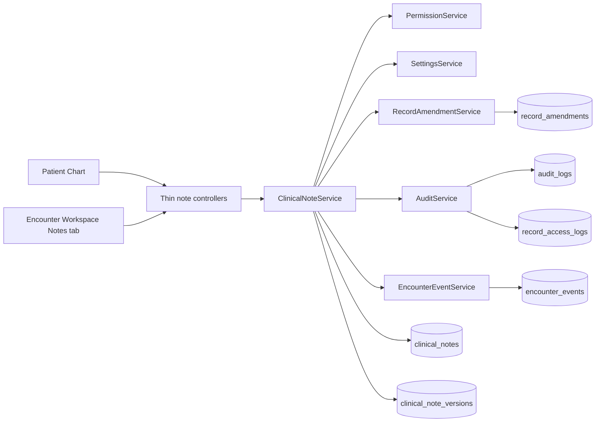
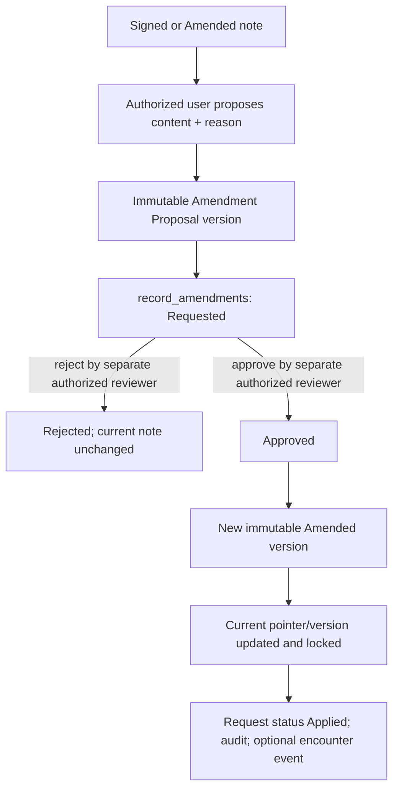
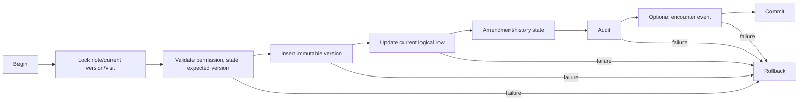
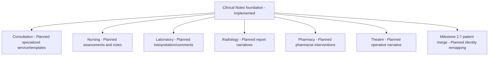

# Clinical Notes Architecture

Status: **Implemented — Phase 2 Milestone 2.6**  
Authoritative scope: the reusable Clinical Notes foundation currently present in the repository.

This document complements [SYSTEM_ARCHITECTURE.md](SYSTEM_ARCHITECTURE.md), [API_CONTRACTS.md](API_CONTRACTS.md), [DATABASE_RELATIONSHIPS.md](DATABASE_RELATIONSHIPS.md), and [PERMISSION_MATRIX.md](PERMISSION_MATRIX.md). It does not describe Consultation, Nursing documentation, or patient merge as implemented.

## 1. Purpose and boundary

Clinical Notes provide immutable, longitudinal patient-level and encounter-linked narrative records. They are part of the Patient Chart and can be viewed in an Encounter Workspace when a note is explicitly linked to that visit.

| Concern | Current owner | Status |
|---|---|---|
| Patient demographics | `PatientService` | Implemented |
| Longitudinal problems/history | `ProblemListService` | Implemented |
| Allergies and alerts | `ClinicalSafetyService` | Implemented |
| Files and attachments | `MedicalDocumentService` | Implemented |
| Generic narrative Clinical Notes | `ClinicalNoteService` | Implemented |
| Encounter workspace orchestration | `VisitService` and workspace controllers | Implemented; no note business logic |
| Consultation diagnoses or specialty templates | Future module services | Planned |
| Nursing assessment forms | Future Nursing service | Planned |

`VisitService` remains outside the Clinical Note business boundary. A note may reference `visit_id`, but the note service validates that relationship and emits an encounter event only for a qualifying signed/amended/entered-in-error transition.

## 2. Component architecture



Both Patient Chart and Workspace use `ClinicalNoteService` list/detail paths. Controllers and views contain no Clinical Note SQL.

## 3. Note data model

### `clinical_notes` — current logical record

Mutable only through `ClinicalNoteService`; no ordinary physical deletion.

| Column | Type / nullability | Purpose |
|---|---|---|
| `id` | `BIGINT`, PK | Stable logical note identifier. |
| `patient_id` | `INT`, required, FK | Longitudinal patient owner. |
| `visit_id` | `INT`, nullable, FK | Optional encounter context; immutable after creation. |
| `note_type` | `VARCHAR(80)`, required | Generic enabled note-type key. |
| `title` | `VARCHAR(200)`, required | Human-readable title; masked in unauthorized confidential lists. |
| `department_id` | `INT`, nullable, FK | Authoring department at creation. |
| `author_id` | `INT`, required, FK | Original author; immutable. |
| `confidentiality_level` | ENUM, required | Current classification: Standard, Restricted, Confidential, Highly Confidential. |
| `note_status` | ENUM, required | Draft, Signed, Amended, Entered-in-error. |
| `current_version` | `INT`, required | Version number selected as the current logical record. |
| `signed_by`, `signed_at` | nullable | Latest attestation actor and time. |
| `locked_at` | nullable | Set on signing/amendment/entered-in-error transition. |
| `amended_at` | nullable | Latest successful amendment time. |
| `version` | `INT`, required | Optimistic concurrency token for logical-record mutations. |
| `created_at`, `updated_at` | timestamps | Lifecycle timestamps. |

Foreign keys use `ON UPDATE CASCADE`. Patient, visit, author, and signer deletion is `RESTRICT`; department deletion is `SET NULL`. Indexes support patient/status/date, visit/status/date, author/status/update, department/date, type/status/date, and confidentiality/status queries.

### `clinical_note_versions` — immutable content

| Column | Type / nullability | Purpose |
|---|---|---|
| `id` | `BIGINT`, PK | Immutable version identity. |
| `note_id` | `BIGINT`, required, FK | Owning logical note. |
| `version_number` | `INT`, required | Monotonic per-note sequence; unique with `note_id`. |
| `content` | `LONGTEXT`, required | Normalized UTF-8 plain text. |
| `content_format` | ENUM | Implemented value: Plain Text. |
| `version_status` | ENUM | Draft, Signed, Amendment Proposal, Amended, Entered-in-error. |
| `author_id`, `department_id` | FKs | Actor and department for that version. |
| `confidentiality_level` | ENUM | Classification preserved at that version. |
| `content_checksum` | `CHAR(64)` | SHA-256 content integrity/deduplication signal. |
| `signed_by`, `signed_at` | nullable FKs/time | Attestation for signed/amended versions. |
| `amendment_reason` | nullable text | Reason for proposal/amendment/error version. |
| `supersedes_version_id` | nullable self-FK | Explicit predecessor chain. |
| `created_at` | timestamp | Immutable creation time. |

Version rows are never updated by application workflows. Signing copies the current draft content into a new Signed version. Approval copies an immutable Amendment Proposal into a new Amended version. `supersedes_version_id` uses restrictive deletion.

### Existing `record_amendments`

The generic Phase 2.1 table is reused with `record_type = 'ClinicalNote'`. `proposed_changes` contains only proposal metadata (`proposal_version_id`, expected note version, expected current content version, and—after rejection—the review reason), not note content. Approval status follows Requested → Approved → Applied or Requested → Rejected.

## 4. Note types

The schema intentionally uses a string key rather than an ENUM because generic note types are expected to expand. The effective set is the intersection of the hardcoded safety catalogue and `clinical_notes.enabled_types`:

| Key | Current use |
|---|---|
| `general_clinical_note` | Generic clinical narrative. |
| `medical_records_note` | Records-oriented chart narrative. |
| `progress_note` | Generic progress narrative; not a Consultation template. |
| `care_coordination_note` | Cross-service coordination narrative. |
| `patient_communication_note` | Patient communication record. |
| `administrative_clinical_note` | Administrative record with clinical relevance. |
| `external_record_summary` | Narrative summary of an external record. |
| `other` | Controlled fallback. |

No Consultation note, Nursing note, laboratory report, radiology report, pharmacy note, or billing note type is implemented as a module-specific workflow.

## 5. Lifecycle and state machine

```mermaid
stateDiagram-v2
    [*] --> Draft: createDraft
    Draft --> Draft: updateDraft creates version
    Draft --> Signed: signNote creates signed version + lock
    Signed --> Signed: amendment requested; current unchanged
    Signed --> Amended: approved/direct amendment
    Amended --> Amended: later approved amendment
    Draft --> EnteredInError: authorized correction
    Signed --> EnteredInError: authorized correction
    Amended --> EnteredInError: authorized correction
    EnteredInError --> [*]
```



| Rule | Implemented behavior |
|---|---|
| Draft edits | Append a new Draft version; never update content in place. |
| Sign | Doctor role plus permission; creates Signed version and locks logical note. |
| Admin signing | Explicitly denied solely on administrator override; administrator is not a clinical signer. |
| Post-sign edit | Rejected by `updateDraft()`. |
| Amendment | Approval required by default; immutable proposal first. |
| Entered in error | Terminal in current service policy; reason required; history preserved. |
| Physical delete | No public method or route. |

When a note is marked entered in error, any still-pending amendment request is
rejected in the same transaction with a safe system review reason. This avoids
an unreviewable request remaining against a terminal note.

## 6. Draft ownership and visibility

- Original `author_id`, `patient_id`, and `visit_id` cannot be changed.
- The author may edit a draft only with `edit_own_note_drafts`.
- Another user may edit a draft only with `edit_any_note_draft` and longitudinal chart access.
- `clinical_notes.draft_visibility` defaults to `author_and_authorized_editors`; `author_only` is supported.
- Drafts are excluded from lists for users who cannot view that draft. This avoids title and existence leakage.
- Draft creation and updates are audited but do not create encounter timeline events.

## 7. Signing and locking

```mermaid
sequenceDiagram
    participant B as Browser
    participant C as Controller
    participant S as ClinicalNoteService
    participant P as PermissionService
    participant DB as MySQL
    participant A as AuditService
    participant E as EncounterEventService
    B->>C: POST sign + CSRF + expected version
    C->>S: signNote(note, version, user, visit?)
    S->>DB: BEGIN; SELECT note/current version FOR UPDATE
    S->>P: canSignClinicalNotes(patient, user)
    S->>DB: validate state, version, patient/visit
    S->>DB: INSERT immutable Signed version
    S->>DB: UPDATE logical note + lock + optimistic version
    S->>A: CLINICAL_NOTE_SIGNED
    opt valid linked encounter
        S->>E: CLINICAL_NOTE_SIGNED
    end
    S->>DB: COMMIT
    C-->>B: redirect + flash
```

The signer attests to the content copied into the newly inserted Signed version. The latest signer/time is mirrored on `clinical_notes` for efficient lists. `clinical_notes.auto_lock_on_signing` is a system-controlled true setting.

Co-signature workflows, specialty attestations, and cryptographic/digital signatures are **planned**, not implemented.

## 8. Amendment workflow



Default settings require approval and prevent requester self-approval. Approval rechecks both the logical optimistic version and the current content-version pointer. If either changed, the request cannot be applied. A pending-request check is serialized by locking the note row. Rejected proposal versions remain immutable evidence.

When `clinical_notes.amendment_approval_required` is explicitly false, `amendNote()` performs a direct authorized amendment. The original signed content remains unchanged in history.

## 9. Content integrity and safety

| Control | Implementation |
|---|---|
| Encoding | Valid UTF-8 required. |
| Format | Plain text only. |
| Line endings | CRLF/CR normalized to LF. |
| Length | Controlled by `clinical_notes.maximum_content_length`; default 50,000 characters. |
| Executable markup | Script, iframe, object, embed, style, link, and meta tags rejected; null bytes rejected. |
| Display | All content rendered through `e()`; line breaks use CSS `white-space: pre-wrap`. |
| Integrity | SHA-256 checksum per immutable version. |
| SQL safety | Prepared statements; no SQL in controllers/views. |
| Stale writes | Logical `version` checked under `FOR UPDATE`; affected-row validation. |

Rich text, embedded executable content, and binary attachments are not supported. Attachments remain in the Medical Documents subsystem.

## 10. Authorization model

The complete system catalogue remains in [PERMISSION_MATRIX.md](PERMISSION_MATRIX.md).

| Permission | Administrator | Records Officer | Doctor | Nurse | Other roles |
|---|---:|---:|---:|---:|---:|
| `view_clinical_notes` | Yes | Yes | Yes with relationship | Yes with relationship | No by default |
| `create_patient_notes` | Yes | Restricted type set | Yes | Yes | No |
| `create_encounter_notes` | Yes | Restricted type set | Yes | Yes | No |
| `edit_own_note_drafts` | Yes | Yes | Yes | Yes | No |
| `edit_any_note_draft` | Yes | Yes | No | No | No |
| `sign_clinical_notes` | **No automatic signer override** | No | Yes | No | No |
| `amend_signed_notes` | Yes | Yes | Yes | No | No |
| `approve_note_amendments` | Yes | Yes | No | No | No |
| `mark_note_entered_in_error` | Yes | Yes | Yes | No | No |
| `view_confidential_notes` | Yes, strongly audited | Yes | Yes | No | No |
| `view_note_history` | Yes | Yes | Yes | Yes | No |

Database permissions are checked first with existing compatibility fallback. Longitudinal access still requires Patient Chart authorization/treatment relationship except Records/administrator policy. Encounter-linked mutations validate visit/patient identity and encounter access; authorized Records reviewers may process a longitudinal amendment without belonging to the encounter’s current department.

## 11. Confidentiality

- Context-free `getNoteById()` never returns content and masks confidential titles/type/author.
- Full content requires `getNoteByIdForUser()` with an authenticated user.
- Restricted, Confidential, and Highly Confidential content requires `view_confidential_notes`.
- Lists provide minimum metadata and a generic masked row to unauthorized clinical viewers.
- Version authorization uses the confidentiality stored on each version.
- Unauthorized direct URL access returns 403.
- Full content and history access must be written to `record_access_logs`; failure is closed with a safe 503-style result.
- Confidential access and denial events avoid note content and sensitive titles.

Break-glass access, emergency justification, granular sensitive-note segmentation, and purpose-of-use policy are **planned**.

## 12. Service contract

`ClinicalNoteService` constructor dependencies are PDO plus optional `PermissionService`, `SettingsService`, `AuditService`, `EncounterEventService`, and `RecordAmendmentService`. Injectability supports atomic-failure tests.

| Public method | Purpose | Return |
|---|---|---|
| `createDraft(array $data, array $user)` | Create logical note and immutable version 1. | Structured result with `note_id`, `version_id`, `version`. |
| `updateDraft(int $noteId, array $data, int $expectedVersion, array $user)` | Append draft version and advance optimistic token. | Structured result/conflict/forbidden. |
| `signNote(int $noteId, int $expectedVersion, array $user, ?int $visitId)` | Attest and lock a draft. | Structured result. |
| `amendNote(...)` | Route to approval request or direct amendment according to policy. | Structured result. |
| `requestAmendment(...)` | Create proposal version and Requested ledger row. | Structured result with amendment/proposal IDs. |
| `approveAmendment(int $amendmentId, array $user)` | Validate independent approval and apply amended version atomically. | Structured result. |
| `rejectAmendment(int $amendmentId, string $reason, array $user)` | Reject request while retaining proposal history. | Structured result. |
| `markNoteEnteredInError(...)` | Create terminal correction version; no delete. | Structured result. |
| `getNoteById(int $noteId)` | Compatibility-safe metadata lookup; no content. | `?array`. |
| `getNoteByIdForUser(...)` | Authorized full-detail retrieval with access logging. | Structured result. |
| `listPatientNotes(...)` | Paginated patient note metadata/filtering. | Structured records and pagination metadata. |
| `listEncounterNotes(...)` | Paginated metadata for one visit. | Structured records and pagination metadata. |
| `getNoteVersions(...)` / `getNoteHistory(...)` | Authorized per-version history and amendment decisions. | Structured versions/amendments. |
| `listPendingAmendments(...)` | Paginated authorized review queue. | Structured records and pagination metadata. |
| `getNoteSummary(...)` | Signed/amended chart summary. | Structured summary. |
| `getNoteFilterOptions(...)` | Authorized patient-scoped author/department filter options. | Structured arrays. |
| `getAllowedNoteTypes()` | Effective settings/schema-safe type subset. | `array`. |
| `getAllowedConfidentialityLevels()` | Effective confidentiality subset. | `array`. |

Writes return `success`, `data`, and `errors`, while useful keys are also retained at the top level to match existing service compatibility conventions.

`RecordAmendmentService` supplies generic request creation, row locking, status transitions, and record-scoped listing. It does not apply domain content or own Clinical Note audit events.

## 13. Transactions and concurrency



The outer service owns a transaction unless called inside an existing transaction. Collaborators participate in that transaction. Note row locking serializes version allocation, signing, error transitions, and amendment creation/application. Unique `(note_id, version_number)` is the final race guard.

## 14. Audit, PHI access, and encounter events

### Audit events implemented

`CLINICAL_NOTE_CREATED`, `CLINICAL_NOTE_DRAFT_UPDATED`, `CLINICAL_NOTE_SIGNED`, `CLINICAL_NOTE_AMENDMENT_REQUESTED`, `CLINICAL_NOTE_AMENDMENT_APPROVED`, `CLINICAL_NOTE_AMENDMENT_REJECTED`, `CLINICAL_NOTE_AMENDED`, `CLINICAL_NOTE_ENTERED_IN_ERROR`, `CLINICAL_NOTE_VIEWED`, `CONFIDENTIAL_NOTE_VIEWED`, `CLINICAL_NOTE_HISTORY_VIEWED`, `CLINICAL_NOTE_ACCESS_DENIED`, and `CONFIDENTIAL_NOTE_ACCESS_DENIED`.

Audit descriptions contain IDs and lifecycle actions, never note content. Mutation audit writes are atomic with note/version/amendment changes. PHI content/history reads create `record_access_logs` entries.

### Encounter events implemented

| Event | Condition |
|---|---|
| `CLINICAL_NOTE_SIGNED` | Note has valid linked visit and is successfully signed. |
| `CLINICAL_NOTE_AMENDED` | Linked note amendment is successfully applied. |
| `CLINICAL_NOTE_ENTERED_IN_ERROR` | Linked note is marked entered in error. |

Draft creation/update, amendment request/rejection, reads, and patient-only notes do not create encounter events.

## 15. Settings

| Key | Type | Default | Enforced |
|---|---|---|---|
| `clinical_notes.enabled_types` | array | Eight generic keys | Yes, intersected with service catalogue. |
| `clinical_notes.default_type` | string | `general_clinical_note` | Yes. |
| `clinical_notes.maximum_content_length` | integer | 50,000 | Yes. |
| `clinical_notes.confidentiality_levels` | array | Four schema values | Yes, intersected. |
| `clinical_notes.default_confidentiality` | string | Standard | Yes. |
| `clinical_notes.allow_self_signing` | boolean | true | Yes, after signer permission. |
| `clinical_notes.amendment_approval_required` | boolean | true | Yes. |
| `clinical_notes.allow_self_amendment_approval` | boolean | false | Yes. |
| `clinical_notes.closed_encounter_new_notes` | boolean | false | Yes for new/edit draft mutations. |
| `clinical_notes.draft_visibility` | string | `author_and_authorized_editors` | Yes. |
| `clinical_notes.auto_lock_on_signing` | boolean/system | true | Implemented as mandatory service behavior. |

Editable arrays cannot introduce values outside the hardcoded/schema-supported catalogue because `validation_rules.schema_values` and service intersection both constrain them.

## 16. Patient Chart and Workspace integration

- Patient Chart navigation includes Clinical Notes.
- The Chart lists patient-level and encounter-linked notes together with status, scope, author, and update time.
- Filters support title prefix, note type, status, author, department, and date at service level; Chart exposes type/status/title-prefix controls.
- Notes are created with optional validated `visit_id`; context is preserved in action links.
- Workspace Notes tab lists only notes linked to that visit and links to the same detail/version workflow.
- Closed encounters remain readable. New/edited drafts are denied by default; amendments remain the correction path for signed records.
- The Patient Chart remains longitudinal and the Encounter Workspace remains visit-specific.

## 17. Testing and verification architecture

`test/phase2_clinical_notes_test.php` runs only through `config/test_database.php`. It verifies database identity before creating fixtures and covers unsafe markup, creation, immutable draft versions, stale edits, draft isolation, administrator non-signing, Doctor signing, lock enforcement, amendment separation/approval, confidentiality masking, context-free retrieval, patient/visit mismatch, event boundaries, audit rollback, terminal entered-in-error, and absence of patient-merge schema.

`test/phase2_migration021_cycle_test.php` requires:

- explicit `HMS_APP_ENV=testing`;
- an approved distinct `HMS_TEST_DB_NAME`;
- explicit destructive-test confirmation;
- verified current-session backup path or approved test-only acknowledgement;
- empty Clinical Note tables;
- safe-SQL preflight and operation logging.

The database safety controls documented in [TESTING.md](TESTING.md) remain unchanged.

## 18. Performance

- Lists paginate with bounded page sizes (maximum 100).
- Metadata lists avoid loading `content`.
- Current detail uses one indexed join through `(note_id, version_number)`.
- Title search is prefix-based (`title LIKE 'term%'`), avoiding leading wildcards.
- Patient/visit/status/date composite indexes support Chart and Workspace.
- History uses `note_id` plus descending version order.

The current all-status Patient Chart query uses the patient composite index for
row selection but MySQL reports a bounded filesort because it orders by
`COALESCE(updated_at, created_at)`. This is acceptable at the current volume and
page-size cap; a dedicated generated sort timestamp/index is a future
optimization if production measurements justify another migration.

Full-text content search is **not implemented**. If future volume requires it, MySQL FULLTEXT can be evaluated only with confidentiality-aware query and result filtering. External search infrastructure is not justified yet.

## 19. Future module integration



Future services may compose or reference this foundation, but must not overload it with module-specific state machines. Future patient merge must remap both logical notes and immutable versions while preserving original patient identity in merge history. No merge behavior exists in this milestone.

## 20. Technical debt and planned enhancements

| Priority | Item | Status |
|---|---|---|
| High | Break-glass access with reason, expiry, and review. | Planned |
| High | Co-signature/supervisory attestation workflow. | Planned |
| Medium | Specialty note-type permission mapping without role-name checks. | Planned |
| Medium | Automated parallel concurrency/browser tests. | Partially implemented; DB stale/race guards tested serially. |
| Medium | Retention/abandoned-draft policy and maintenance job. | Planned |
| Medium | Confidentiality-aware full-text search. | Planned |
| Low | Standard terminology for generic note types. | Planned |
| Low | Cryptographic signature certificates. | Not justified by current dependencies; planned only if required. |

## 21. Architectural decisions

1. **Logical records and content versions are separate.** Lists stay efficient while content remains immutable.
2. **Every content change creates a version.** Draft edits are included; silent overwrite is impossible through the service.
3. **Signing creates a new version.** No previously written version row is mutated into a signed record.
4. **Administrator override does not create clinical signing authority.** Clinical attestation remains a Doctor permission/role responsibility.
5. **The generic amendment ledger is reused.** Clinical content stays in note versions; approval metadata stays in `record_amendments`.
6. **Encounter events are sparse.** Only clinically meaningful linked transitions enter the encounter timeline.
7. **Plain text is the initial format.** It has a smaller XSS and sanitization surface and does not require a rich-text dependency.
8. **No ordinary delete exists.** Entered-in-error preserves medico-legal history.
9. **Patient Chart and Workspace share one service.** This prevents divergent security and lifecycle logic.

## 22. Implementation status

| Classification | Capabilities |
|---|---|
| Implemented | Patient/encounter notes, immutable draft/version history, Doctor signing, locking, amendment proposal/approval/rejection, direct amendment policy switch, entered-in-error, confidentiality, PHI access logs, audit/events, Chart/Workspace UI, pagination/filtering, settings, test isolation. |
| Partially implemented | Broad generic note taxonomy; generic draft collaboration; concurrency verified through stale tokens and constraints but not true parallel browser workers. |
| Planned | Consultation/Nursing/specialty documentation, co-signatures, break-glass, rich text, full-text content search, retention automation, patient merge remapping. |
| Compatibility-only | Context-free `getNoteById()` metadata method; it intentionally returns no content and masks confidential metadata. |
| Deprecated | The previous static Workspace Notes placeholder and broken `../../notes/create.php` link were replaced. |
