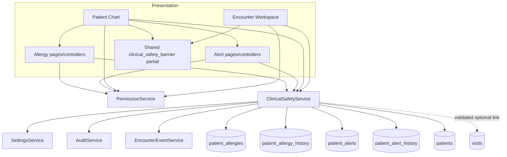
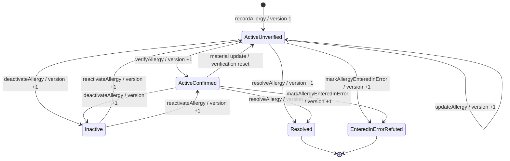
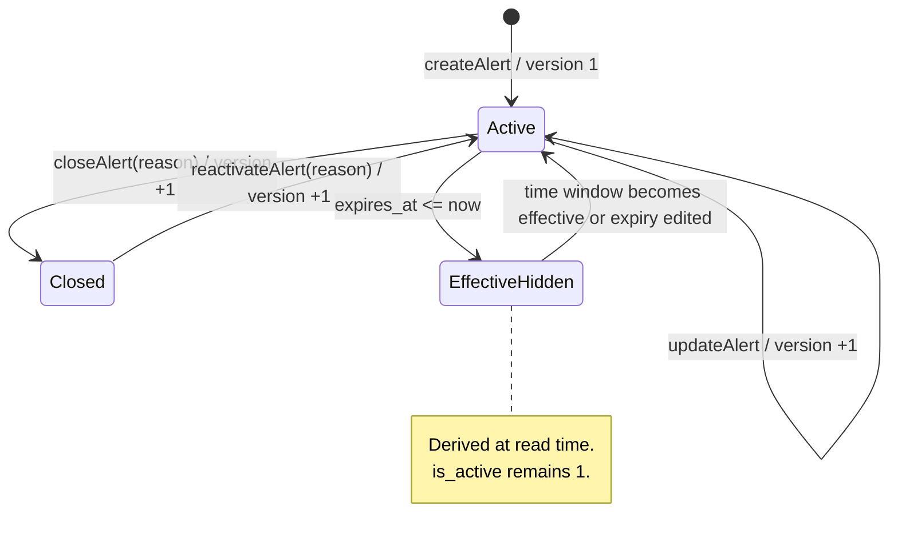
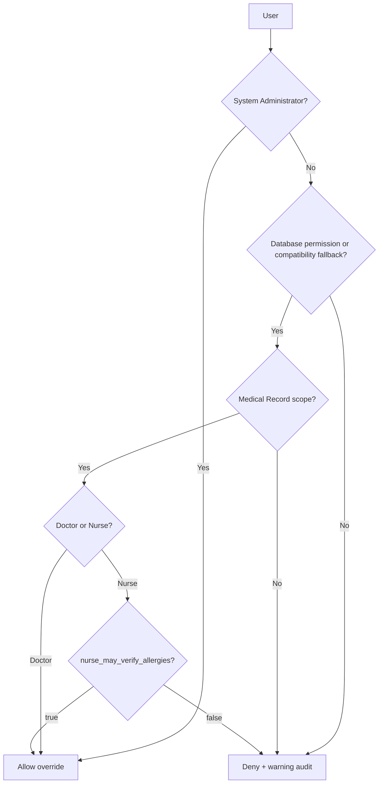
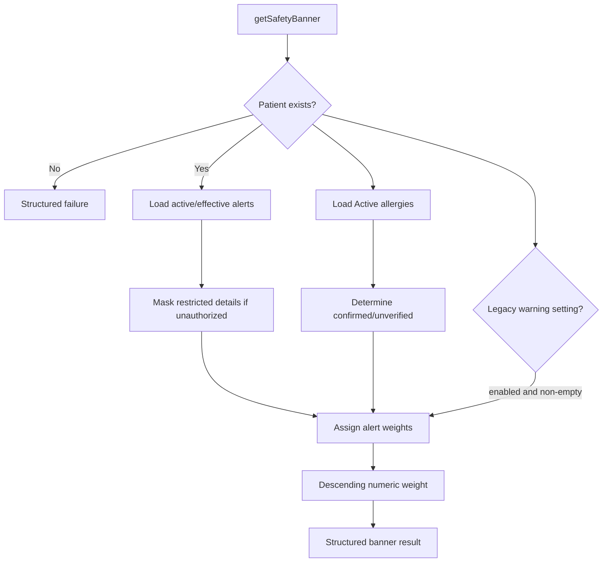
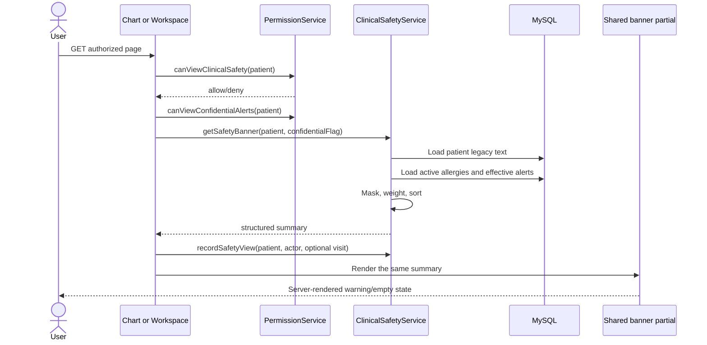
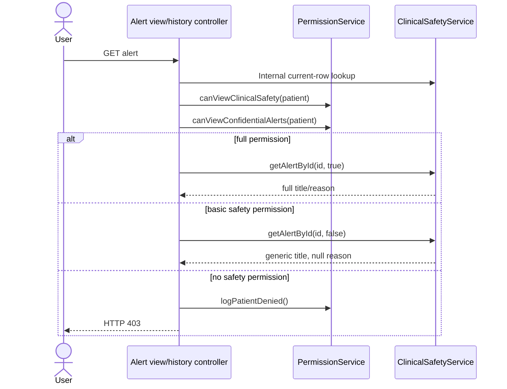
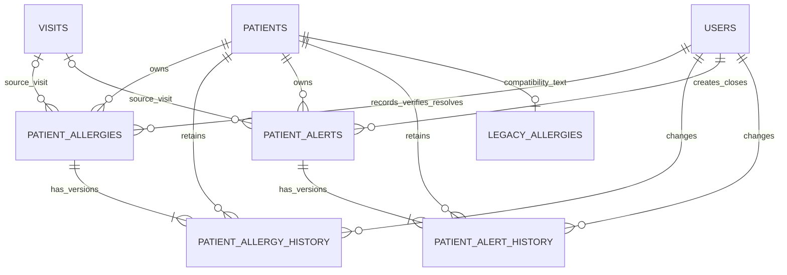
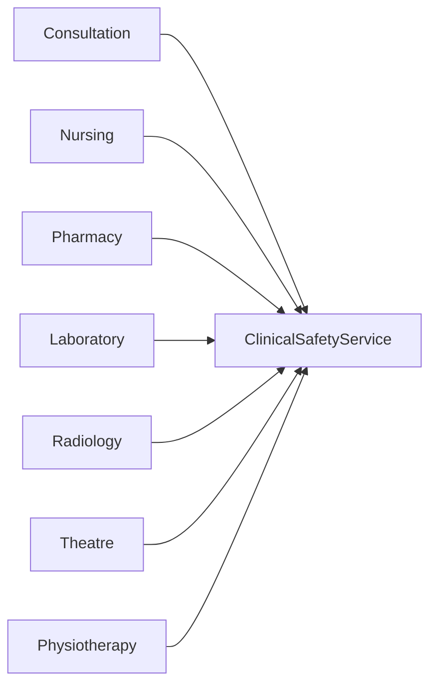

# Clinical Safety Architecture

## Document status

| Item | Value |
|---|---|
| Authority | Clinical Safety subsystem reference |
| Implementation baseline | Phase 2 Milestone 2.3 |
| Migration boundary | `017_phase2_clinical_safety_up.sql` |
| Status | Implemented, with limitations identified in this document |
| Scope | Structured allergies, clinical alerts, histories, banner, authorization, audit, and optional encounter events |
| Excluded | Problem lists, structured medical history, documents, clinical notes, patient merge, consultation, nursing, laboratory, radiology, pharmacy, billing, theatre, physiotherapy, and reporting workflows |

Status terms used throughout:

- **Implemented** — present in the current schema and executable code.
- **Partially implemented** — infrastructure exists, but the complete operational policy or UI is absent.
- **Planned** — described only as a future integration; no current implementation.
- **Compatibility-only** — retained to avoid breaking historical behavior.
- **Deprecated** — retained temporarily but should not be used for new structured data.

This document complements [SYSTEM_ARCHITECTURE.md](SYSTEM_ARCHITECTURE.md),
[DATABASE_RELATIONSHIPS.md](DATABASE_RELATIONSHIPS.md),
[API_CONTRACTS.md](API_CONTRACTS.md), and
[PERMISSION_MATRIX.md](PERMISSION_MATRIX.md). It remains independently useful
for maintaining Clinical Safety.

## 1. Purpose and scope

### 1.1 Patient-safety objective

The Clinical Safety subsystem provides one longitudinal source for structured
allergies and patient safety alerts. Its purpose is to make clinically
significant warnings visible wherever an authorized user works with the
patient, while preserving the provenance, status, verification, and amendment
history of each warning.

The subsystem addresses four risks:

1. Safety information being trapped in one encounter.
2. Free-text allergy information being treated as verified fact.
3. Clinically important corrections silently overwriting prior values.
4. Confidential alerts being disclosed beyond minimum necessary access.

### 1.2 Architectural boundaries

| Concern | Owner | Current status |
|---|---|---|
| Patient demographics and legacy allergy text | `PatientService` / `patients` | Implemented; legacy allergy field is compatibility-only |
| Longitudinal structured allergies and alerts | `ClinicalSafetyService` | Implemented |
| Patient Chart composition | Medical Records module | Implemented |
| Encounter work | Encounter Workspace / `VisitService` | Implemented independently |
| Encounter event timeline | `EncounterEventService` | Implemented for explicitly linked safety actions |
| General patient audit | `AuditService` / `audit_logs` | Implemented |
| Clinical notes, diagnoses, treatment records | Future clinical modules | Planned |
| Medication-allergy decision support | Future Pharmacy/Consultation integration | Planned |

Clinical Safety is narrower than general Medical Records: it owns safety
signals, not the full chart. It is broader than encounter documentation:
allergies and alerts persist across visits.

### 1.3 Patient-level and encounter-associated information

- **Longitudinal patient-level safety information — Implemented.** Every allergy
  and alert belongs to one patient and can appear across all encounters.
- **Encounter-associated safety change — Implemented in the service contract.**
  An allergy may retain `source_visit_id`; an alert may retain `visit_id`.
  Mutations may also accept a visit for timeline-event context.
- **Temporary encounter-specific alert — Partially implemented.** An alert can
  reference an encounter and can expire, but it is still patient-level and will
  appear in the patient's banner wherever viewed while active/effective. There
  is no encounter-only visibility scope.
- **Module-generated alert — Planned.** No clinical module currently creates
  alerts automatically.

The Patient Chart displays longitudinal lists and management links. The
Encounter Workspace displays the same aggregated banner but does not become
the owner of the safety records.

## 2. High-level architecture



Both consuming pages call `ClinicalSafetyService::getSafetyBanner()` and render
`modules/medical_records/partials/clinical_safety_banner.php`. No safety SQL is
duplicated in either view.

The Medical Records safety route bootstrap constructs `ClinicalSafetyService`,
`PatientService`, `PermissionService`, and `SettingsService`. Mutation
controllers then enforce CSRF and permission checks before delegating.

## 3. Allergy model

### 3.1 Current-state fields

| Column | Type | Null | Default | Purpose |
|---|---|---:|---|---|
| `id` | `BIGINT` | No | auto increment | Allergy primary key |
| `patient_id` | `INT` | No | none | Longitudinal patient owner |
| `source_visit_id` | `INT` | Yes | `NULL` | Optional encounter where originally recorded |
| `allergy_type` | `ENUM` | No | none | Structured category |
| `substance` | `VARCHAR(150)` | No | none | Display value entered by user |
| `normalized_substance` | `VARCHAR(150)` | No | none | Lowercase, trimmed, whitespace-collapsed comparison value |
| `active_allergy_key` | `VARCHAR(512)` | Yes | `NULL` | Unique key for one active patient/type/substance combination |
| `reaction` | `VARCHAR(500)` | Yes | `NULL` | Reported reaction |
| `severity` | `ENUM` | No | `Unknown` | Clinical severity |
| `clinical_status` | `ENUM` | No | `Active` | Current clinical lifecycle state |
| `verification_status` | `ENUM` | No | `Unverified` | Verification state |
| `onset_date` | `DATE` | Yes | `NULL` | Known onset date |
| `recorded_by` | `INT` | No | none | Creating user |
| `recorded_at` | `DATETIME` | No | current timestamp | Clinical recording timestamp |
| `verified_by` | `INT` | Yes | `NULL` | Confirming user |
| `verified_at` | `DATETIME` | Yes | `NULL` | Confirmation timestamp |
| `resolved_by` | `INT` | Yes | `NULL` | Resolving or entered-in-error user |
| `resolved_at` | `DATETIME` | Yes | `NULL` | Resolution/error timestamp |
| `notes` | `TEXT` | Yes | `NULL` | Additional structured-record narrative |
| `version` | `INT` | No | `1` | Optimistic concurrency token |
| `created_at` | `DATETIME` | No | current timestamp | Database creation timestamp |
| `updated_at` | `DATETIME` | Yes | `NULL`, auto-updated | Last database update timestamp |

### 3.2 Implemented enumerations

| Domain | Implemented values |
|---|---|
| Allergy type | `Drug`, `Food`, `Environmental`, `Biological`, `Other` |
| Severity | `Mild`, `Moderate`, `Severe`, `Life-threatening`, `Unknown` |
| Clinical status | `Active`, `Inactive`, `Resolved`, `Entered-in-error` |
| Verification status | `Unverified`, `Confirmed`, `Refuted` |

The database ENUMs are authoritative. Migration 018 constrains editable value
list settings to supported schema values; forms and service validation consume
the same safe subset. `Inactive` has governed deactivate/reactivate commands
and routes.

### 3.3 Validation

`recordAllergy()` and `updateAllergy()` enforce:

- Positive patient and actor IDs.
- Allergy type in `clinical_safety.allergy_types`.
- Required substance, maximum 150 characters.
- Severity in `clinical_safety.severity_values`.
- Optional reaction no longer than 500 characters.
- Optional onset date exactly formatted `Y-m-d`.
- Required reason.
- Patient existence under `FOR UPDATE` during creation.
- Same-patient ownership for any supplied source/event encounter.
- No duplicate active patient/type/normalized-substance record.

The `notes` field has no service-level length limit because it is stored as
`TEXT`. No coded terminology, drug dictionary, or synonym normalization is
implemented.

### 3.4 Constraints and indexes

| Name | Columns | Purpose |
|---|---|---|
| `PRIMARY` | `id` | Stable record identity |
| `uq_patient_allergy_active` | `active_allergy_key` | Race-safe active duplicate prevention |
| `idx_patient_allergies_patient_status` | patient, clinical status, severity | Patient lists/banner retrieval |
| `idx_patient_allergies_substance` | normalized substance, clinical status | Duplicate/substance lookup |
| `idx_patient_allergies_visit` | source visit | Encounter provenance lookup |
| `idx_patient_allergies_verification` | verification status, verified timestamp | Verification reporting |

Foreign keys reference `patients`, `visits`, and actor `users`, all with
`ON UPDATE CASCADE` and `ON DELETE RESTRICT`.

## 4. Allergy lifecycle



### 4.1 Implemented transition rules

| Operation | Required current state | Result |
|---|---|---|
| Record | None | `Active` + `Unverified`, version 1 |
| Update | `Active` | Editable fields changed, version +1 |
| Verify | `Active`, not already `Confirmed` | `Confirmed`; verifier/time set; version +1 |
| Resolve | `Active` | `Resolved`; active key cleared; resolver/time set; version +1 |
| Entered in error | `Active` | `Entered-in-error` + `Refuted`; active key cleared; resolver/time set; version +1 |
| Deactivate | `Active` | `Inactive`; active key cleared; version +1 |
| Reactivate | `Inactive` | `Active`; active key restored after duplicate check; version +1 |

- Recording and updating are available to Doctor and Nurse roles with effective
  permissions and patient scope.
- Verification is available to Doctors. Nurses require both the permission and
  the explicit settings switch, which defaults to false.
- Resolution and entered-in-error actions are Doctor-only outside administrator
  override.
- Self-verification is rejected by default using the most recent allergy
  history actor. The setting `clinical_safety.allow_self_allergy_verification`
  is the explicit compatibility exception and defaults to `false`; the rule
  also applies to administrators.
- Clinically significant edits to type, normalized substance, reaction,
  severity, onset date, or notes reset a confirmed allergy to `Unverified` and
  clear verifier metadata. Substance-only formatting that preserves the
  normalized value does not itself trigger a reset.
- `Refuted` is reached only through entered-in-error; there is no independent
  refutation command.

Every update/transition checks `expectedVersion` after locking the row. A stale
version returns `success=false`, `conflict=true`, `current_version`, and an error
message without overwriting the newer state.

Duplicate active records are prevented twice: a locked normalized lookup
provides a clear application error, and the unique active key closes the
concurrent-insert race.

## 5. Allergy history

`patient_allergy_history` is an append-only clinical history, not merely an
operational log.

| Column | Purpose |
|---|---|
| `allergy_id` | Parent current-state record |
| `patient_id` | Direct patient history lookup |
| `version_no` | Version represented by `new_snapshot` |
| `action` | `Recorded`, `Updated`, `Verified`, `Resolved`, or `EnteredInError` |
| `previous_snapshot` | JSON snapshot before change; null for creation |
| `new_snapshot` | JSON snapshot after change |
| `reason` | Required clinical/change reason |
| `changed_by` | Acting user |
| `created_at` | Immutable history timestamp |

`UNIQUE(allergy_id, version_no)` prevents duplicate history versions. History
also has patient/time and actor/time indexes. Foreign keys are restrictive, so
normal deletion of either history or its current record is unavailable.

The service inserts history inside the same transaction as current-state data,
audit, and any encounter event. A history failure rolls back the current
record. Audit logs answer who performed a system action; history snapshots
answer what the clinical record was before and after. Neither substitutes for
the other.

Retention is indefinite under the current medical-history policy. Migration
017 down can destroy the tables, but is explicitly restricted to empty isolated
verification databases unless an archival/recovery plan is approved.

## 6. Legacy allergy compatibility

`patients.allergies` predates structured Clinical Safety and remains present to
preserve existing data and public PatientService behavior.

| Behavior | Current status |
|---|---|
| Display on Patient Chart/banner | Implemented |
| Label | `Legacy unstructured allergy information` |
| Automatically parse | Not implemented |
| Automatically verify | Not implemented and prohibited by policy |
| Automatically delete/clear | Not implemented |
| Reviewed/reconciled flag | Not implemented |
| Manual structured record creation | Implemented for authorized users |

The banner reads the field only when
`clinical_safety.legacy_allergy_warning=true`. The text is displayed after
structured warnings with the lowest banner weight. It remains unverified even
if a clinician manually creates a corresponding structured record. There is no
automatic deduplication between legacy text and structured substances.

Manual reconciliation currently means creating a structured record and
leaving the original text intact. No explicit reviewed indicator exists.

## 7. Clinical alert model

### 7.1 Current-state fields

| Column | Type | Null | Default | Purpose |
|---|---|---:|---|---|
| `id` | `BIGINT` | No | auto increment | Alert primary key |
| `patient_id` | `INT` | No | none | Longitudinal patient owner |
| `visit_id` | `INT` | Yes | `NULL` | Optional source encounter; immutable after create |
| `alert_type` | `ENUM` | No | none | Structured category |
| `title` | `VARCHAR(150)` | No | none | Human-readable warning title |
| `normalized_title` | `VARCHAR(150)` | No | none | Lowercase/trimmed/collapsed duplicate key input |
| `active_alert_key` | `VARCHAR(512)` | Yes | `NULL` | Unique active patient/type/title key |
| `reason` | `TEXT` | No | none | Clinical rationale/details |
| `priority` | `ENUM` | No | `Medium` | Warning priority |
| `confidentiality_level` | `ENUM` | No | `Standard` | Disclosure classification |
| `is_active` | `TINYINT(1)` | No | `1` | Explicit open/closed state |
| `starts_at` | `DATETIME` | Yes | `NULL` | Effective start |
| `expires_at` | `DATETIME` | Yes | `NULL` | Effective end |
| `created_by` | `INT` | No | none | Creating user |
| `closed_by` | `INT` | Yes | `NULL` | Closing user |
| `closed_at` | `DATETIME` | Yes | `NULL` | Closure timestamp |
| `closure_reason` | `TEXT` | Yes | `NULL` | Required reason when closed |
| `version` | `INT` | No | `1` | Optimistic concurrency token |
| `created_at` | `DATETIME` | No | current timestamp | Creation timestamp |
| `updated_at` | `DATETIME` | Yes | auto-updated | Last database update |

### 7.2 Implemented enumerations

| Domain | Values |
|---|---|
| Alert type | `Clinical Risk`, `Infection Control`, `Fall Risk`, `Communication Need`, `Safeguarding`, `Special Handling`, `Other` |
| Priority | `Low`, `Medium`, `High`, `Critical` |
| Confidentiality | `Standard`, `Restricted`, `Confidential` |
| Persisted state | active (`1`) or closed (`0`) |

Expiry is not a persisted status. It is a derived read-time condition.

### 7.3 Validation

- Positive patient and actor IDs.
- Alert type, priority, and confidentiality values must be in SettingsService
  arrays (with matching code fallbacks).
- Required title, maximum 150 characters.
- Required clinical reason and change reason.
- Optional start/expiry timestamps must parse as `Y-m-d H:i[:s]`.
- Expiry must be later than start when both exist.
- A configured default expiry is applied only when no expiry was supplied and
  `default_alert_expiry_days` is greater than zero.
- Any encounter link must belong to the same patient.
- Active patient/type/normalized-title duplicates are rejected.

Reason and change-reason lengths are not bounded at the service layer because
their database columns are text types.

### 7.4 Constraints and indexes

| Name | Columns | Purpose |
|---|---|---|
| `uq_patient_alert_active` | active alert key | Concurrent active duplicate prevention |
| `idx_patient_alerts_patient_active` | patient, active, priority | Patient lists |
| `idx_patient_alerts_effective` | patient, active, start, expiry | Banner effective-date filtering |
| `idx_patient_alerts_type_title` | type, normalized title, active | Duplicate lookup |
| `idx_patient_alerts_visit` | visit | Encounter provenance |
| `idx_patient_alerts_confidentiality` | confidentiality, active | Confidentiality/status filtering |

Patient, visit, creator, and closer foreign keys use `ON UPDATE CASCADE` and
`ON DELETE RESTRICT`.

## 8. Alert lifecycle



### 8.1 Transition rules

- Create produces `is_active=1`, version 1.
- Update is permitted only while active.
- Close requires a non-empty reason, sets closer/time/reason, clears the active
  uniqueness key, and increments version.
- Closing an already closed alert is rejected.
- Reactivation requires a non-empty reason, rechecks active duplicate safety,
  restores the active key, clears closure fields, and increments version.
- Reactivating an active alert is rejected.
- Expiry is dynamic: banner queries exclude alerts before `starts_at` and at or
  after `expires_at`; the row remains active and can still be listed/edited.
- `getPatientAlerts(..., false, ...)` filters `is_active` but does not exclude
  expired/future alerts. Only `getSafetyBanner()` applies effective dates.
- `visit_id` records source provenance and is not updated by `updateAlert()`.
- Stale update/close/reactivation requests are rejected using row lock, version,
  and affected-row checks.

## 9. Alert history

`patient_alert_history` mirrors allergy history with parent alert, patient,
version, action, previous/new JSON snapshots, reason, actor, and timestamp.
Actions currently written are `Created`, `Updated`, `Closed`, and `Reactivated`.

| Record type | Question answered | Mutation behavior |
|---|---|---|
| Current alert | What is effective/current now? | Versioned mutable state |
| Alert history | What did the alert contain at each version? | Append-only, transactional |
| Audit log | Who performed or attempted the action? | Append-only system record |
| PHI access log | Which protected resource was viewed? | General chart infrastructure exists; safety-specific view does not write it directly |
| Encounter event | What safety action occurred during this encounter? | Optional, only with validated visit |

Alert history retains full snapshots, including the classification at each
version. `getAlertHistoryForUser()` evaluates both before and after snapshots
per entry. Mixed history remains visible as metadata, but restricted snapshots
are removed unless `view_confidential_alerts` is effective. Authorized access
to confidential history is audited and fails closed if auditing fails.

## 10. Verification policy

### 10.1 Implemented states

- `Unverified` — default at record creation.
- `Confirmed` — set by `verifyAllergy()` with verifier and timestamp.
- `Refuted` — set only by `markAllergyEnteredInError()`, which also closes the
  clinical record as `Entered-in-error`.

### 10.2 Effective authorization



- Administrator: override.
- Doctor: verify when permissions and patient scope are effective.
- Nurse: database permission is seeded, but service-layer authorization denies
  verification unless the setting is explicitly true.
- Records Officer and Reception: no clinical verification.
- Department access is inherited through `canViewMedicalRecord()`: Records and
  Reception have broad chart scope; clinical roles need an active encounter in
  their active department or assignment as attending doctor.
- The recorder or most recent allergy author may not verify the record unless
  the explicit self-verification setting is enabled. Administrator status does
  not bypass this clinical separation rule.
- Verification writes history, an INFO audit, and optionally an encounter event.

Planned enhancements include two-person verification for selected severities,
verification-expiry policy, and stronger verifier credential/scope rules.

## 11. Shared Clinical Safety Banner

### 11.1 Aggregation contract

`ClinicalSafetyService::getSafetyBannerForUser(int $patientId, array $user,
?int $visitId = null)` is the authorized, audited aggregation path used by the
Patient Chart and Encounter Workspace. The compatibility method
`getSafetyBanner()` always masks restricted content. Aggregation reads:

1. `patients.allergies` for compatibility text.
2. Active structured allergies.
3. Active alerts effective at the current database time.



### 11.2 Exact implemented priority weights

The order is hardcoded, not setting-driven:

| Weight | Banner item |
|---:|---|
| 500 | Critical active/effective alert |
| 450 | Confirmed life-threatening active allergy |
| 400 | Confirmed severe active allergy |
| 330 | High active/effective alert |
| 300 | Other confirmed active allergy, including Moderate/Mild/Unknown |
| 250 | Medium active/effective alert |
| 200 | Any unverified active allergy, including severe/life-threatening |
| 150 | Low active/effective alert |
| 100 | Legacy unstructured allergy text |

This means the informal five-tier description is only approximate. For
example, High alerts rank below confirmed severe allergies, while Medium alerts
rank below all confirmed allergies.

### 11.3 Consumers and rendering

- Patient Chart: loads the banner whenever the user can view Clinical Safety;
  the safety tab also loads full lists.
- Encounter Workspace: loads the same banner for the encounter's patient.
- Both include `clinical_safety_banner.php`.
- The banner is server-rendered HTML and requires no JavaScript.
- It links authorized users to the Patient Chart Clinical Safety tab.
- Empty state: `No active structured safety warnings are recorded.`
- A legacy-only record is not an empty state because legacy text is a banner
  item.

## 12. Confidentiality model

### 12.1 Classification and masking

`Standard`, `Restricted`, and `Confidential` are implemented. Restricted and
Confidential currently receive the same masking behavior.

Without `view_confidential_alerts`:

- `title` becomes `Confidential clinical safety alert`.
- `reason` becomes `NULL`.
- `confidential_hidden=true` is attached to the returned array.
- Priority and confidentiality classification remain available in list data.
- The banner shows a generic title with no detail.

### 12.2 Role behavior

| Actor | Full confidential details |
|---|---|
| System Administrator | Yes, override |
| Doctor | Yes when permission and patient treatment scope are effective |
| Nurse | No by default |
| Records Officer | No by default |
| Reception | No |
| Diagnostic/Pharmacy/Physiotherapy/Theatre | No by default |
| Accounts/Store | No Clinical Safety access by default |

Confidential create/update options are removed from forms for users without
permission. Server controllers also reject attempts to create, change, close,
reactivate, or view history for restricted alerts without the confidential
permission.

### 12.3 Access failure and audit

Clinical Safety route denials use HTTP 403 and
`CLINICAL_SAFETY_ACCESS_DENIED`, severity WARNING. Descriptions are generic and
do not disclose alert content. Record-not-found paths return HTTP 404.

Clinical Safety views use `CLINICAL_SAFETY_VIEWED`, INFO. Patient Chart access
also uses the broader Medical Records access infrastructure, but
`recordSafetyView()` itself writes `audit_logs`, not a dedicated
`record_access_logs` row.

Minimum necessary access is implemented through masking and role/patient scope.
Break-glass access, reason-for-access prompts, per-alert access records, and
field-level encryption are planned.

## 13. Authorization and permission matrix

### 13.1 Permission catalogue

| Permission | Purpose | PermissionService method | Enforced routes |
|---|---|---|---|
| `view_clinical_safety` | View banner/lists/details | `canViewClinicalSafety()` | Chart, Workspace display, safety index, allergy/alert view |
| `record_allergies` | Create structured allergy | `canRecordAllergies()` | `allergy_create.php`, `allergy_save.php` |
| `update_allergies` | Edit active allergy | `canUpdateAllergies()` | allergy edit/update |
| `verify_allergies` | Confirm allergy | `canVerifyAllergies()` | allergy verify |
| `resolve_allergies` | Resolve or mark entered in error | `canResolveAllergies()` | allergy resolve/entered-error |
| `manage_clinical_alerts` | Create/update/close/reactivate alerts | `canManageClinicalAlerts()` | alert mutation routes |
| `view_confidential_alerts` | Reveal restricted details | `canViewConfidentialAlerts()` | alert display, forms, mutation/history guards, banner masking |
| `view_clinical_safety_history` | View version history | `canViewClinicalSafetyHistory()` | allergy and alert history |

### 13.2 Effective role matrix

| Role | View | Record/update allergy | Verify | Resolve/error | Manage alerts | Confidential | History |
|---|---:|---:|---:|---:|---:|---:|---:|
| Administrator | Override | Override | Override | Override | Override | Override | Override |
| Doctor | Scoped | Yes | Yes | Yes | Yes | Yes | Yes |
| Nurse | Scoped | Yes | Setting-controlled; default No | No | Yes | No | Yes |
| Records Officer | Broad chart scope | No | No | No | No | No | Yes |
| Receptionist | Broad chart scope | No | No | No | No | No | No |
| Laboratory Scientist | Treatment-scoped | No | No | No | No | No | No |
| Pharmacist | Treatment-scoped | No | No | No | No | No | No |
| Radiographer | Treatment-scoped | No | No | No | No | No | No |
| Physiotherapist | Treatment-scoped | No | No | No | No | No | No |
| Theatre Staff | Treatment-scoped | No | No | No | No | No | No |
| Accountant / Store | No default grant | No | No | No | No | No | No |

Migration 017 seeds role-permission mappings. Database permission lookup is
primary; PermissionService preserves matching hardcoded compatibility fallbacks
if the database permission is unavailable. Administrator override is based on
role name `System Administrator`.

The service methods do not perform authorization themselves. Controllers and
future service callers are contractually required to call PermissionService.

## 14. Service architecture

### 14.1 Dependencies and response contracts

```php
new ClinicalSafetyService(
    PDO $pdo,
    ?AuditService $auditService = null,
    ?EncounterEventService $eventService = null,
    ?SettingsService $settingsService = null
)
```

Injected audit/event services allow atomic failure testing. Writes return:

```php
[
    'success' => true,
    'data' => [...],
    'errors' => [],
    // additive top-level IDs/version keys
]
```

Failures return `success=false`, `data=null`, and `errors`. Stale writes add
`conflict=true` and `current_version`.

### 14.2 Allergy public methods

| Method | Behavior and inputs | Transaction/locks | Writes and side effects |
|---|---|---|---|
| `recordAllergy(array $data, int $actorId): array` | Requires patient, type, substance, severity, reason; optional reaction/onset/notes/source visit | Own transaction; locks patient, optional visit, matching active allergies | allergy v1, `Recorded` history, `ALLERGY_RECORDED` audit; optional same event |
| `updateAllergy(int $allergyId, array $data, int $expectedVersion, int $actorId): array` | Active record only; requires reason; merges supplied editable values with current row | Own transaction; locks allergy, optional `visit_id`, matching active allergies; affected-row check | current row/version, `Updated` history, `ALLERGY_UPDATED` audit; no encounter event |
| `verifyAllergy(int $allergyId, string $reason, int $actorId, int $expectedVersion, ?int $visitId = null): array` | Active and not already Confirmed | Own transaction; locks allergy and optional visit | verifier/time/status/version, `Verified` history/audit; optional `ALLERGY_VERIFIED` event |
| `resolveAllergy(...)` | Active record, non-empty reason | Own transaction; locks allergy and optional visit | resolved fields, clears active key, history/audit; optional `ALLERGY_RESOLVED` event |
| `markAllergyEnteredInError(...)` | Active record, non-empty reason | Own transaction; locks allergy and optional visit | entered-error/refuted fields, clears active key, history/audit; no encounter event |
| `getAllergyById(int $allergyId): ?array` | Current record or null | Read only | Reads `patient_allergies` |
| `getPatientAllergies(int $patientId, bool $includeInactive = true): array` | Longitudinal list ordered by severity and creation | Read only | Reads `patient_allergies` |
| `getAllergyHistory(int $allergyId): array` | Newest history first with actor name | Read only | Reads history and users |

`source_visit_id` is creation provenance. Updates do not change it. The optional
`visit_id` accepted by update/transition operations is event/audit context.

### 14.3 Alert public methods

| Method | Behavior and inputs | Transaction/locks | Writes and side effects |
|---|---|---|---|
| `createAlert(array $data, int $actorId): array` | Requires patient/type/title/reason/priority/confidentiality/change reason; optional visit/effective dates | Own transaction; locks patient, optional visit, matching active alerts | alert v1, `Created` history, `CLINICAL_ALERT_CREATED` audit; optional same event |
| `updateAlert(int $alertId, array $data, int $expectedVersion, int $actorId): array` | Active only; editable type/title/reason/priority/confidentiality/dates | Own transaction; locks alert, optional `event_visit_id`, matching alerts; affected-row check | current row/version, `Updated` history, `CLINICAL_ALERT_UPDATED` audit; no encounter event |
| `closeAlert(int $alertId, string $reason, int $actorId, int $expectedVersion, ?int $visitId = null): array` | Active only; reason required | Own transaction; locks alert/optional visit | closed state/history/audit; optional `CLINICAL_ALERT_CLOSED` event |
| `reactivateAlert(...)` | Closed only; reason required; rejects active duplicate | Own transaction; locks alert/visit/matching alerts | active state/history/audit; optional `CLINICAL_ALERT_REACTIVATED` event |
| `getAlertById(int $alertId, bool $canViewConfidential = false): ?array` | Compatibility-only lookup; confidential content is always masked regardless of the legacy flag | Read only | Reads alerts |
| `getAlertByIdForUser(int $alertId, array $user, bool $auditAccess = true): array` | Authorizes patient and confidential access, returns full or masked alert, and fails closed when required audit fails | Audited read transaction | Reads alert/permissions; writes access audit |
| `getPatientAlerts(int $patientId, bool $includeInactive = true, bool $canViewConfidential = false): array` | Compatibility list; restricted content is always masked | Read only | Reads alerts |
| `getPatientAlertsForUser(int $patientId, array $user, bool $includeInactive = true): array` | Authorized list with per-user masking and derived effective status | Read only | Reads alerts/permissions |
| `getAlertHistory(int $alertId): array` | Compatibility history with restricted snapshots removed | Read only | Reads history/users |
| `getAlertHistoryForUser(int $alertId, array $user): array` | History authorization and per-version confidentiality filtering; audited, fail closed | Audited read transaction | Reads history/users/permissions; writes access audit |

The legacy Boolean confidentiality argument remains in place for source
compatibility but no longer grants access. Full content requires the user-aware
method.

### 14.4 Summary and access methods

| Method | Contract |
|---|---|
| `getSafetyBanner(int $patientId, bool $canViewConfidential = false): array` | Structured aggregate with items, active allergies/alerts, legacy text, and `has_safety_information` |
| `getActiveSafetySummary(...)` | Additive alias delegating to `getSafetyBanner()` |
| `recordSafetyView(int $patientId, int $actorId, ?int $visitId = null): array` | Locks patient/optional visit and writes `CLINICAL_SAFETY_VIEWED` audit transactionally |
| `getAllowedAllergyTypes()` / `getAllowedSeverityValues()` | Schema-supported intersection of configured values with safe fallback |
| `getAllowedAlertTypes()` / `getAllowedAlertPriorities()` / `getAllowedConfidentialityLevels()` | Schema-supported intersection consumed by forms and validation |

### 14.5 Collaborating services

- `PermissionService` was extended with eight Clinical Safety authorization
  methods and uses SettingsService for nurse verification.
- `AuditService` was not given a Clinical-Safety-specific method;
  `logPatient()` is reused.
- `EncounterEventService` was not changed; `record()` is reused transactionally.
- `SettingsService` was not changed; typed getters are reused.
- `MedicalRecordService` was not extended for Clinical Safety.
- `VisitService` was not changed. It remains outside this domain.

## 15. Request and transaction flows

### 15.1 Allergy mutations

```mermaid
sequenceDiagram
    actor B as Browser
    participant C as Allergy controller
    participant P as PermissionService
    participant S as ClinicalSafetyService
    participant DB as MySQL
    participant A as AuditService
    participant E as EncounterEventService

    B->>C: POST record/update/verify/resolve + CSRF
    C->>C: Authenticate and verify CSRF
    C->>P: Relevant allergy permission(patient)
    alt denied
        P-->>C: false
        C->>A: CLINICAL_SAFETY_ACCESS_DENIED
        C-->>B: HTTP 403
    else allowed
        P-->>C: true
        C->>S: Command(data, actor, expectedVersion, optional visit)
        S->>DB: BEGIN; SELECT ... FOR UPDATE
        S->>S: Validate state, values, version, patient/visit
        S->>DB: INSERT/UPDATE current allergy
        S->>DB: INSERT allergy history
        S->>A: Write patient audit
        opt supported action with valid visit
            S->>E: Record encounter event
        end
        alt any write fails
            S->>DB: ROLLBACK
            S-->>C: structured failure
        else all succeed
            S->>DB: COMMIT
            S-->>C: structured success
        end
        C-->>B: Flash message + redirect
    end
```

Record, verify, and resolve may emit encounter events. Update and entered-in-
error do not emit events in the current implementation.

### 15.2 Alert mutations

```mermaid
sequenceDiagram
    actor B as Browser
    participant C as Alert controller
    participant P as PermissionService
    participant S as ClinicalSafetyService
    participant DB as MySQL
    participant A as AuditService
    participant E as EncounterEventService

    B->>C: POST create/update/close/reactivate + CSRF
    C->>C: Authenticate and verify CSRF
    C->>P: Manage alerts + confidential permission if needed
    P-->>C: allow/deny
    C->>S: Alert command
    S->>DB: BEGIN; row locks
    S->>S: Validate active state, dates, version, optional visit
    S->>DB: Current alert write
    S->>DB: Append alert history
    S->>A: Write patient audit
    opt create/close/reactivate with valid visit
        S->>E: Record encounter event
    end
    alt failure
        S->>DB: ROLLBACK
        S-->>C: failure
    else success
        S->>DB: COMMIT
        S-->>C: success
    end
    C-->>B: Redirect
```

Update validates optional `event_visit_id` for audit context but does not emit
an encounter event.

### 15.3 Banner load



### 15.4 Confidential alert details



History is stricter: a currently restricted alert requires both history and
confidential permissions.

## 16. Audit boundaries

### 16.1 Implemented events

| Event | Trigger | Severity | Patient | Visit | Description/content policy | Transaction owner |
|---|---|---|---|---|---|---|
| `ALLERGY_RECORDED` | Successful record | INFO | Yes | Optional | Generic; no substance/reaction | ClinicalSafetyService |
| `ALLERGY_UPDATED` | Successful update | INFO | Yes | Optional audit context | Generic | ClinicalSafetyService |
| `ALLERGY_VERIFIED` | Confirmation | INFO | Yes | Optional | Generic | ClinicalSafetyService |
| `ALLERGY_RESOLVED` | Resolution | INFO | Yes | Optional | Generic | ClinicalSafetyService |
| `ALLERGY_ENTERED_IN_ERROR` | Error correction | INFO | Yes | Optional | Generic | ClinicalSafetyService |
| `CLINICAL_ALERT_CREATED` | Alert creation | INFO | Yes | Optional | Generic; no title/reason | ClinicalSafetyService |
| `CLINICAL_ALERT_UPDATED` | Alert update | INFO | Yes | Optional audit context | Generic | ClinicalSafetyService |
| `CLINICAL_ALERT_CLOSED` | Closure | INFO | Yes | Optional | Generic | ClinicalSafetyService |
| `CLINICAL_ALERT_REACTIVATED` | Reactivation | INFO | Yes | Optional | Generic | ClinicalSafetyService |
| `CLINICAL_SAFETY_VIEWED` | Chart, Workspace, or safety page load | INFO | Yes | Workspace may supply visit | Generic | ClinicalSafetyService |
| `CLINICAL_SAFETY_ACCESS_DENIED` | Authorization failure | WARNING | Yes when known | No | Generic security description | PermissionService/controller path |

ClinicalSafetyService currently passes `department_id=null` to AuditService,
even when a visit is linked. AuditService still records actor, patient, optional
visit, module, action/event type, IP address, user agent, and timestamp.

Mutation audits are atomic with current state and history. Access-denied audits
occur outside a business mutation because no mutation transaction exists.

History stores clinical snapshots and reasons. Audit stores accountability and
security activity. Encounter events store encounter timeline facts. These are
separate records by design.

## 17. Encounter-event boundaries

`lockVisitForPatient()` locks the visit and verifies `visits.patient_id` matches
the safety record's patient. A mismatch fails the command.

| Encounter event | Implemented trigger |
|---|---|
| `ALLERGY_RECORDED` | `recordAllergy()` with valid `source_visit_id` |
| `ALLERGY_VERIFIED` | `verifyAllergy()` with valid `visitId` |
| `ALLERGY_RESOLVED` | `resolveAllergy()` with valid `visitId` |
| `CLINICAL_ALERT_CREATED` | `createAlert()` with valid `visit_id` |
| `CLINICAL_ALERT_CLOSED` | `closeAlert()` with valid `visitId` |
| `CLINICAL_ALERT_REACTIVATED` | `reactivateAlert()` with valid `visitId` |

No event is emitted for allergy update, allergy entered-in-error, or alert
update. Without a visit, all actions still write history and audit.

Encounter events use the visit's `current_department_id` (selected as
`department_id`), actor, generic title/description, and current time. A failed
EncounterEventService response throws inside the caller transaction and rolls
back current data, history, and audit.

Patient Chart and safety routes preserve an optional encounter context. The
controller verifies existence, patient ownership, and encounter access before
the service repeats patient/visit validation under lock. Actions without a
visit remain valid longitudinal patient-level changes.

## 18. Settings integration

| Key | Group | Type | Default | Validation metadata | Consumer/enforcement |
|---|---|---|---|---|---|
| `clinical_safety.allergy_types` | Medical Records | array | five schema types | required + schema values | Allergy forms and service validation |
| `clinical_safety.severity_values` | Medical Records | array | five schema severities | required + schema values | Forms, service validation; banner still hardcodes weights |
| `clinical_safety.nurse_may_verify_allergies` | Medical Records | boolean | false | none | PermissionService; enforced |
| `clinical_safety.allow_self_allergy_verification` | Medical Records | boolean | false | none | ClinicalSafetyService; enforced for every actor |
| `clinical_safety.alert_types` | Medical Records | array | seven schema types | required + schema values | Forms and service validation |
| `clinical_safety.alert_priorities` | Medical Records | array | four priorities | required + schema values | Forms/validation; banner weights hardcoded |
| `clinical_safety.confidentiality_levels` | Medical Records | array | three levels | required + schema values | Forms and validation |
| `clinical_safety.default_alert_expiry_days` | Medical Records | integer | 0 | min 0, max 3650 | Applied on create/update preparation when expiry absent |
| `clinical_safety.legacy_allergy_warning` | Medical Records | boolean | true | none | Controls legacy banner inclusion |

All are private (`is_public=0`), editable, and system settings. SettingsService
provides request-local caching and typed fallback values.

The allowed-value arrays are editable while their corresponding database
columns are fixed ENUMs. Migration 018 records the schema vocabulary in
`validation_rules.schema_values`; SettingsService rejects unsupported or
duplicate entries. Forms and service validation consume the safe configured
subset, so an administrator cannot configure a value that appears in a form and
passes service validation but fails at persistence. The settings and schema
must be migrated together until reference tables replace the ENUMs.

Not implemented as settings:

- Banner weight/order policy.
- Two-person verification policy.
- Alert masking fields/behavior.
- Duplicate-allergy policy variations.
- Module-specific alert automation.

## 19. Database model

### 19.1 Entity relationships



### 19.2 Table catalogue

| Table | Owner | Mutability | Expected volume | Retention |
|---|---|---|---|---|
| `patient_allergies` | ClinicalSafetyService | Versioned mutable current state | Low-to-moderate per patient | Indefinite; close/correct, do not delete |
| `patient_allergy_history` | ClinicalSafetyService | Append-only | One row per allergy version | Indefinite |
| `patient_alerts` | ClinicalSafetyService | Versioned mutable current state | Low-to-moderate per patient; potentially higher as modules integrate | Indefinite; close/reactivate, do not delete |
| `patient_alert_history` | ClinicalSafetyService | Append-only | One row per alert version | Indefinite |
| `patients.allergies` | PatientService compatibility | Existing mutable free text | One field per patient | Preserved until a separately approved reconciliation policy exists |

Every column, index, and FK for current-state tables is documented in Sections
3 and 7. History columns are documented in Sections 5 and 9. The authoritative
cross-system FK catalogue remains [DATABASE_RELATIONSHIPS.md](DATABASE_RELATIONSHIPS.md).

Migration 017 uses InnoDB and `utf8mb4_unicode_ci`. All 15 foreign keys and
their indexes were verified after application. Historical parents and actor
records cannot be normally deleted because every Clinical Safety FK uses
`ON DELETE RESTRICT`.

## 20. Concurrency and integrity

| Risk | Implemented protection |
|---|---|
| Duplicate active allergy | Normalized locked lookup plus unique `active_allergy_key` |
| Inconsistent substance comparison | Lowercase, trim, Unicode-aware whitespace collapse |
| Duplicate active alert | Normalized locked lookup plus unique `active_alert_key` |
| Stale allergy/alert write | Row `FOR UPDATE`, expected version, affected-row check |
| Simultaneous verification/closure | Locked current row and version increment |
| Duplicate history version | Unique parent/version constraint |
| Patient/visit mismatch | Locked visit and explicit patient comparison |
| Partial history/audit/event write | One service-owned transaction and rollback |
| Invalid state transition | Active/closed/confirmed checks in transition methods |
| Duplicate reactivation | Matching-alert lock and restored unique key |

Active keys are deterministic strings containing patient, type, and normalized
substance/title. Closed/resolved/error records set the key to null, allowing a
new active record while retaining history.

Remaining risks:

- Service methods unconditionally begin their own transaction and are not safe
  for nested invocation inside an already active PDO transaction.
- MySQL locks on a no-match lookup do not alone guarantee serialization in all
  isolation configurations; the unique constraint is the final race guard.
- Normalization does not handle medication synonyms, spelling variants, or
  coded terminology.
- Update of a confirmed allergy does not invalidate confirmation.

## 21. Testing architecture

Primary suite: `test/phase2_clinical_safety_test.php`.

### 21.1 Isolation and database safety

- Requires `config/test_database.php`.
- Resolves and prints live/test database names.
- Asserts the active database equals the explicit `hms_test_*` database and is
  different from live.
- Uses DatabaseSafety preflight before migration SQL.
- Migration down/up is executed only against the dedicated test database.
- Uses deterministic fixture roles and uniquely labelled temporary patients.
- Cleans current test fixtures and their dependent audit/event/history rows.

These controls derive from the post-incident database safety architecture in
[TESTING.md](TESTING.md) and [DATABASE_CONTEXT.md](DATABASE_CONTEXT.md).

### 21.2 Verified behavior

| Test area | Coverage |
|---|---|
| Schema | Four tables and eight permissions exist |
| Allergies | Create, invalid input, duplicate rejection, update, stale conflict, verify, resolve, entered-in-error, history |
| Alerts | Create, update, stale conflict, close, reactivate, expiry filtering, history |
| Encounter integrity | Cross-patient allergy/visit rejection |
| Confidentiality | Masked title/reason and banner behavior |
| Banner | Priority, legacy text, expired exclusion, shared partial consistency |
| Authorization | Administrator, Doctor, Nurse verification setting, Accounts denial |
| CSRF | Valid and invalid token helper behavior |
| Audit/events | Exact mutation audit counts and six expected encounter event types |
| Atomicity | Forced audit failure and forced encounter-event failure roll back writes |
| Migration | 017 down/up and schema safety preflight |
| Regression | Phase 0, Phase 1, Phase 1.8, Phase 2.1, MPI, settings, audit, and database-safety suites |

Not currently automated: real concurrent multi-connection races, full
authenticated browser navigation for every role, and accessibility/visual
regression of the banner.

## 22. Future module integration

All items in this section are **Planned**. Future modules must reuse
ClinicalSafetyService and PermissionService rather than query safety tables
directly.



### Consultation — Planned

- Record allergy history during assessment.
- Verify or correct allergies with appropriate reasons.
- Create alerts in treatment planning.
- Perform medication-allergy checks before prescribing.

### Nursing — Planned

- Add reaction observations and safety assessments.
- Manage fall-risk/safeguarding alerts.
- Apply nurse verification policy and escalate to Doctors.

### Pharmacy — Planned

- Medication-allergy interaction checks and dispensing warnings.
- Pharmacist acknowledgement/override reasons.
- Adverse drug reaction reporting.

### Laboratory — Planned

- Infection-control/specimen warnings and critical-result escalation.
- Reagent/contrast relevance only where clinically justified.

### Radiology — Planned

- Contrast-allergy checks and imaging precautions.
- Pregnancy/implant alerts when those domains are implemented.

### Theatre — Planned

- Anaesthetic/drug allergy checks, infection-control alerts, blood-product
  warnings, and perioperative checklists.

### Physiotherapy — Planned

- Fall risk, mobility precautions, and contraindication warnings.

Future automated alerts require provenance, deduplication, ownership,
acknowledgement, closure, and false-positive policies before implementation.

## 23. Technical debt and risks

| Priority | Finding | Evidence/impact | Recommended future action |
|---|---|---|---|
| High | No coded allergy terminology/synonym support | Duplicate prevention is exact normalized text only | Adopt a controlled terminology strategy before medication interaction logic |
| Medium | Legacy allergy reconciliation has no reviewed state | Legacy text remains indefinitely even after manual structured entry | Design explicit reconciliation/approval metadata without deleting source text |
| Medium | Safety-specific views do not write `record_access_logs` directly | They write `CLINICAL_SAFETY_VIEWED` audit only | Decide whether per-resource PHI access rows are required |
| Medium | Banner ordering is hardcoded | No setting controls weights despite configurable categories | Introduce validated ordering only if operational policy needs it |
| Medium | No break-glass access | Emergency access cannot be granted with reason/time-limited audit | Design before high-confidentiality clinical rollout |
| Medium | No real multi-connection race test | Unique constraints are tested functionally, not concurrently | Add isolated two-connection concurrency suite |
| Medium | Service transaction ownership is not nest-aware | Calling inside an existing transaction can fail | Document orchestration or introduce transaction ownership protocol later |
| Low | Alert reason/change reason and allergy notes lack service length limits | TEXT can accept very large input | Add safe configurable limits after UI/content review |
| Low | Audit department is null for safety mutations | Department context is not stored in safety audit rows | Pass authorized active/visit department where policy requires |
| Low | No automated browser/accessibility suite | Service and static route checks dominate | Add role-based browser tests later |

No Critical defect was verified during this documentation pass. High items
should be resolved before medication ordering/dispensing decision support relies
on verification or before confidential history is widely used.

## 24. Implementation status

### 24.1 Implemented

| Capability | Status |
|---|---|
| Structured allergy current state and append-only history | Implemented |
| Allergy create/update/verify/resolve/entered-in-error | Implemented |
| Structured alerts, close/reactivate, effective dates, history | Implemented |
| Optimistic version conflict handling | Implemented |
| Active duplicate database constraints | Implemented |
| Clinical Safety permission methods and role seeds | Implemented |
| Shared Patient Chart/Workspace banner | Implemented |
| Confidential alert masking and route enforcement | Implemented |
| Audit and optional encounter events | Implemented |
| Settings-backed value lists and nurse policy | Implemented |
| Dedicated test database verification | Implemented |

### 24.2 Partially implemented

| Capability | Limitation |
|---|---|
| Encounter-associated safety actions | Optional context is preserved and validated; actions may still intentionally be longitudinal without a visit |
| Temporary alerts | Effective dates exist; no encounter-only scope or scheduler |
| PHI access tracking | Audit event exists; no safety-specific `record_access_logs` write |
| Clinical verification governance | Independent author/verifier and material-reset rules exist; credentialing and expiry remain planned |
| Confidential history | Per-version masking exists; break-glass access remains planned |
| History presentation | Safe field differences are shown; raw developer views are intentionally absent |

### 24.3 Planned

| Capability |
|---|
| Clinical-module-generated alerts |
| Medication-allergy interaction checking |
| Standard terminology/coding |
| Break-glass emergency access |
| Alert acknowledgement/escalation workflows |
| Clinical Safety integration with Phase 2.4+ modules |
| Real-time notification and background expiry processing |

### 24.4 Compatibility-only

| Capability | Policy |
|---|---|
| `patients.allergies` | Retained and displayed as legacy unverified text; not used for new structured records |
| Permission hardcoded fallbacks | Used only when database permission lookup is unavailable |
| `getActiveSafetySummary()` | Alias retained for additive API convenience |

### 24.5 Deprecated

No route or public method is formally deprecated. New allergy data should not
be added solely to `patients.allergies`; that field is compatibility-only.

## 25. Architectural decisions

| Decision | Rationale |
|---|---|
| One `ClinicalSafetyService` owns allergies and alerts initially | Both share patient ownership, lifecycle/history, confidentiality, banner, audit, and optional encounter linkage; splitting now would add coordination without a demonstrated boundary |
| Chart and Workspace use one banner query and partial | Prevents inconsistent safety warnings and duplicate SQL |
| Current-state and history tables are separate | Supports efficient current reads while preserving every clinical version |
| History is separate from audit | Clinical snapshots and accountability records answer different questions and have different consumers |
| Longitudinal changes do not automatically create encounter events | Patient-level corrections may occur without an encounter; false encounter attribution would corrupt the timeline |
| Encounter events require a locked same-patient visit | Prevents cross-patient timeline contamination |
| Legacy allergy text is preserved | Automatic parsing or deletion could convert ambiguous text into unsafe verified data or lose history |
| No ordinary physical deletion | Medical safety records require correction, closure, and history rather than erasure |
| Confidential details require additive authorization | Basic safety visibility should not imply unrestricted access to safeguarding or other sensitive rationale |
| Settings define allowed values but not authority | Configuration cannot substitute for server-side permission checks |
| Future modules must call the service | Centralizes validation, concurrency, history, audit, and event boundaries |

These decisions remain subordinate to future approved clinical governance. Any
change to verification, confidentiality, retention, or event rules should be
treated as a safety-impacting architectural change, documented before code is
modified, and covered by dedicated regression tests.

## 26. Milestone 2.3.1 hardening alignment

This section is authoritative where earlier Milestone 2.3 observations describe
now-resolved gaps.

| Area | Final implemented policy |
|---|---|
| Confidential retrieval | Legacy ID lookup is always masked. Full details require `getAlertByIdForUser()` with authenticated user context and `view_confidential_alerts`. Direct routes use the user-aware contract. |
| Confidential history | Each stored before/after snapshot is evaluated independently. Unauthorized entries retain non-sensitive metadata only; snapshots and reasons are hidden. |
| Required read audit | Authorized banner, confidential detail, and alert-history reads audit before returning protected content. Audit failure returns a structured failure and page loaders respond with HTTP 503 without rendering data. |
| Self-verification | Denied for the recorder or latest allergy author by default, including administrators. The private setting `clinical_safety.allow_self_allergy_verification` is the only compatibility exception. |
| Material edits | Type, normalized substance, reaction, severity, onset, and notes reset `Confirmed` to `Unverified`, clear verifier metadata, create history/audit, and optionally emit `ALLERGY_VERIFICATION_RESET` with valid encounter context. |
| Inactive lifecycle | `deactivateAllergy()` and `reactivateAllergy()` are public transactional commands with reason, version check, duplicate protection, history, audit, and optional encounter event. Resolved and Entered-in-error remain terminal. |
| Settings/schema | Database ENUMs are authoritative. `schema_values` validation permits enabled subsets but rejects unknown and duplicate values. Forms consume service-provided safe intersections. |
| Encounter context | Chart/safety routes preserve optional `visit`; controllers validate visit existence, patient ownership, and encounter access before passing it to commands. Context remains optional for longitudinal actions. |
| History UI | Allergy and alert history use an escaped field-difference presenter. Confidential versions are masked and malformed/legacy snapshots degrade to a safe empty comparison. |
| Alert expiry | Expiry is dynamic: `is_active=1 AND expires_at<=NOW()` is `Expired`. Expired/scheduled rows are excluded from active lists and the banner. Reactivating an expired closed alert clears its stale expiry; no synthetic closure audit is created. |
| Naming | `Accountant` is canonical; `Accounts` remains a compatibility alias in identifier authorization. Clinical authorization continues to rely primarily on permission keys. |

Hardening audit events are `ALLERGY_DEACTIVATED`, `ALLERGY_REACTIVATED`,
`CONFIDENTIAL_ALERT_VIEWED`, and `CONFIDENTIAL_ALERT_HISTORY_VIEWED` in
addition to the Milestone 2.3 catalogue. A material edit remains one
`ALLERGY_UPDATED` audit whose description records the verification reset.
Optional same-encounter events added by the hardening are
`ALLERGY_DEACTIVATED`, `ALLERGY_REACTIVATED`, and
`ALLERGY_VERIFICATION_RESET`; none is emitted without validated visit context.

### 26.1 Migration 018

`018_phase2_clinical_safety_hardening_up.sql` adds only the self-verification
setting and schema-value validation metadata. No Clinical Safety current or
history table is rebuilt. The down migration removes the new setting and
restores generic required-array metadata without deleting clinical data.

### 26.2 Remaining risks after remediation

| Priority | Remaining issue |
|---|---|
| High | Standard terminology and medication-allergy interaction support remain planned. |
| Medium | Break-glass emergency access is not implemented. |
| Medium | No scheduler persists expiry transitions; expiry is intentionally derived at read time. |
| Medium | Dedicated `record_access_logs` entries are not created in addition to Clinical Safety audit events. |
| Medium | Multi-connection race tests and browser-level role tests remain limited. |
| Low | Long text fields do not yet have configurable content-size limits. |

## Phase 2.4 integration reference

Problem List and structured Medical History are now implemented by the separate
`ProblemListService`. Clinical Safety remains the sole owner of allergy and
alert data and the safety banner. Encounter Workspace renders the safety banner
and a separate longitudinal summary; neither query path writes into the other
domain. Future medication-interaction or diagnosis integrations must consume
both services without copying safety records into problem/history tables.
