# Database Relationships

> Current implementation coverage: migrations **002 through 024** and the live
> schema through **Phase 3.2**.

> Official relational reference generated from `database/hospital.sql`, migrations `002` through `024`, service SQL, and the live schema through Phase 3.3. Broader policies are described in [DATABASE_CONTEXT.md](DATABASE_CONTEXT.md) and [SYSTEM_ARCHITECTURE.md](SYSTEM_ARCHITECTURE.md).

## Database Overview

| Property | Current implementation |
|---|---|
| Engine | MySQL-compatible MariaDB; live verification identified MariaDB 10.4.32. |
| Storage engine | InnoDB for all operational tables. |
| Character set/collation | `utf8mb4` / `utf8mb4_unicode_ci`. |
| Baseline | `database/hospital.sql` is the destructive fresh-install baseline and contains the completed Phase 0 schema. |
| Evolution | Numbered paired `*_up.sql` / `*_down.sql` migrations. The historical missing `001` is intentionally not reused. |
| Tracking | No `schema_migrations` table or migration runner is implemented; deployment must externally record filenames and preflight the schema. |
| Preservation | Patient, encounter, transfer, event, audit and security history should be retained. Additive changes and restrictive/nullable foreign-key behavior protect historical links. |

The fresh-install baseline includes the remediated patient gender enum but is not a complete Phase 1 snapshot by itself. A new deployment must apply the applicable Phase 1 migrations `005`–`012` after the baseline (and follow the migration README's target-schema checks). Historical migrations are preserved and must not be edited to disguise later changes.

## Complete Table Catalogue

The live database contains 23 tables. “Historical” means the application treats rows as history; it does not imply MySQL blocks `UPDATE`/`DELETE`.

### Administration and authorization

#### `roles`

Owner: Administration / `RoleService`. Mutable master data with deactivation.

| Column | Type | Null/default | Notes |
|---|---|---|---|
| `id` | `INT` PK auto increment | No | Identifier. |
| `role_name` | `VARCHAR(100)` | No | Unique role name. |
| `description` | `TEXT` | Yes/`NULL` | Description. |
| `is_active` | `TINYINT(1)` | No/`1` | Soft activation state. |
| `created_at` | `TIMESTAMP` | No/current | Created time. |
| `updated_at` | `TIMESTAMP` | Yes/update timestamp | Last update. |

Indexes: primary key, unique role name, `is_active`. No foreign keys.

#### `permissions`

Owner: Administration authorization / `PermissionService`. Mutable catalogue; assignments are normalized separately.

| Column | Type | Null/default | Notes |
|---|---|---|---|
| `id` | `INT` PK auto increment | No | Identifier. |
| `permission_key` | `VARCHAR(100)` | No | Unique stable authorization key. |
| `permission_name` | `VARCHAR(150)` | No | Display name. |
| `module` | `VARCHAR(100)` | No | Owning module grouping. |
| `description` | `TEXT` | Yes/`NULL` | Meaning. |
| `is_active` | `TINYINT(1)` | No/`1` | Assignment/runtime availability. |
| `created_at` / `updated_at` | `TIMESTAMP` | Created/updated defaults | Lifecycle timestamps. |

Indexes: primary key, unique permission key, module, active state. No foreign keys.

#### `role_permissions`

Owner: Administration authorization / `PermissionService`. Mutable junction table.

| Column | Type | Null/default | Notes |
|---|---|---|---|
| `id` | `INT` PK auto increment | No | Identifier. |
| `role_id` | `INT` | No | Role. |
| `permission_id` | `INT` | No | Permission. |
| `assigned_by` | `INT` | Yes/`NULL` | Acting user. |
| `created_at` | `TIMESTAMP` | No/current | Assignment time. |

Unique `(role_id, permission_id)` prevents duplicate assignments. Role and permission deletion is `RESTRICT`; actor deletion is `SET NULL`.

#### `departments`

Owner: Administration / `DepartmentService`; shared by workflows. Mutable master data with historical IDs preserved.

| Column | Type | Null/default | Notes |
|---|---|---|---|
| `id` | `INT` PK auto increment | No | Identifier. |
| `department_name` | `VARCHAR(100)` | No | Unique name; some visit lifecycle mappings still depend on known names. |
| `department_code` | `VARCHAR(30)` | No | Unique stable code. |
| `description` | `TEXT` | Yes | Description. |
| `location` | `VARCHAR(150)` | Yes | Physical location. |
| `contact_extension` | `VARCHAR(30)` | Yes | Internal contact. |
| `department_type` | `ENUM('Clinical','Administrative','Diagnostic','Support')` | No/`Support` | Classification. |
| `queue_enabled` | `TINYINT(1)` | No/`1` | Queue capability. |
| `is_active` | `TINYINT(1)` | No/`1` | Soft activation state. |
| `display_order` | `INT` | No/`0` | UI order. |
| `created_at` / `updated_at` | `TIMESTAMP` | Created/updated defaults | Lifecycle timestamps. |

Indexes: primary key; unique code; unique name; type, queue-enabled, and active indexes. No foreign keys.

#### `users`

Owner: Authentication and Administration / `UserService`. Mutable identity/account table; deactivation/locking is preferred to deletion.

| Column | Type | Null/default | Notes |
|---|---|---|---|
| `id` | `INT` PK auto increment | No | User identifier. |
| `employee_id` | `VARCHAR(30)` | No | Unique employee ID. |
| `first_name`, `last_name` | `VARCHAR(100)` | No | Legal/display names. |
| `gender` | `ENUM('Male','Female')` | Yes | Optional staff gender. |
| `phone` | `VARCHAR(20)` | Yes | Contact. |
| `email` | `VARCHAR(150)` | Yes | Contact/login-adjacent metadata. |
| `username` | `VARCHAR(50)` | No | Unique login name. |
| `password` | `VARCHAR(255)` | No | Password hash. |
| `department_id` | `INT` | No | Backward-compatible primary department. |
| `role_id` | `INT` | No | Role. |
| `status` | `ENUM('Active','Inactive')` | No/`Active` | Soft account activation. |
| `failed_login_attempts` | `INT` | No/`0` | Current lockout counter. |
| `last_failed_login` | `DATETIME` | Yes | Last failed attempt. |
| `locked_at` | `DATETIME` | Yes | Lock timestamp. |
| `locked_by` | `INT` | Yes | Administrator or self/system actor reference. |
| `lock_reason` | `VARCHAR(255)` | Yes | Human-readable reason. |
| `last_login` | `DATETIME` | Yes | Last successful login. |
| `password_changed_at` | `DATETIME` | Yes | Last password change/reset. |
| `must_change_password` | `TINYINT(1)` | No/`0` | Force-change flag. |
| `created_at` / `updated_at` | `TIMESTAMP` | Created/updated defaults | Lifecycle timestamps. |

Unique constraints: employee number and username. Indexes cover role, department, status, names, `locked_at`, and `locked_by`. Role/department deletion is `RESTRICT`; `locked_by` self-reference deletes to `NULL`.

#### `user_departments`

Owner: Administration / `UserDepartmentService`. Mutable normalized membership table; `users.department_id` remains the compatibility primary.

| Column | Type | Null/default | Notes |
|---|---|---|---|
| `id` | `INT` PK auto increment | No | Identifier. |
| `user_id` | `INT` | No | User. |
| `department_id` | `INT` | No | Department. |
| `is_primary` | `TINYINT(1)` | No/`0` | Primary marker. Application enforces one primary. |
| `is_active` | `TINYINT(1)` | No/`1` | Membership state. |
| `assigned_at` | `DATETIME` | No/current | Assignment time. |
| `assigned_by` | `INT` | Yes | Actor. |

Unique `(user_id, department_id)` prevents duplicate membership. User and department deletes are `RESTRICT`; actor delete is `SET NULL`. Indexes support user/active, user/primary and department/active queries. There is no database-level conditional unique constraint guaranteeing only one primary membership.

### Patients and encounters

#### `patients`

Owner: Patients / `PatientService`. Mutable demographic/current-state record with retention expected.

| Column | Type | Null/default | Notes |
|---|---|---|---|
| `id` | `INT` PK auto increment | No | Patient identifier. |
| `hospital_number` | `VARCHAR(30)` | Yes | Unique generated medical record number. |
| `first_name`, `last_name` | `VARCHAR(100)` | No | Required names. |
| `middle_name` | `VARCHAR(100)` | Yes | Optional name. |
| `gender` | `ENUM('Male','Female','Other','Unknown')` | No | Canonical patient gender domain enforced by `PatientService` and forms. |
| `date_of_birth` | `DATE` | No | Birth date. |
| `marital_status` | `VARCHAR(30)` | Yes | Demographics. |
| `occupation` | `VARCHAR(100)` | Yes | Demographics. |
| `phone` | `VARCHAR(20)` | Yes | Contact/search field. |
| `email` | `VARCHAR(150)` | Yes | Contact. |
| `address` | `TEXT` | Yes | Address. |
| `state_of_origin`, `nationality` | `VARCHAR(100)` | Yes | Demographics. |
| `blood_group`, `genotype` | `VARCHAR(5)` | Yes | Clinical identifiers. |
| `allergies` | `TEXT` | Yes | Current allergy text; not normalized clinical history. |
| `next_of_kin`, `next_of_kin_relationship` | `VARCHAR(150)` | Yes | Contact identity. |
| `next_of_kin_phone` | `VARCHAR(20)` | Yes | Contact phone. |
| `registered_by` | `INT` | Yes | Creating user. |
| `created_at` / `updated_at` | `TIMESTAMP` | Created/updated defaults | Lifecycle timestamps. |

Indexes: unique hospital number, first name, last name, phone, and registering user. `registered_by` deletes to `NULL`.

#### `visits`

Owner: Encounters / `VisitService`; shared by queue and future clinical modules. Mutable current encounter state; must be retained after completion/cancellation.

| Column | Type | Null/default | Notes |
|---|---|---|---|
| `id` | `INT` PK auto increment | No | Encounter identifier. |
| `visit_number` | `VARCHAR(30)` | No | Unique encounter number. |
| `patient_id` | `INT` | No | Patient. |
| `visit_date` | `DATETIME` | No/no database default | Registration time supplied by application. |
| `visit_type` | `ENUM('Outpatient','Inpatient','Emergency','Referral')` | No/`Outpatient` | Encounter type. |
| `current_department_id` | `INT` | Yes | Current owner/destination. |
| `current_department_received_by` | `INT` | Yes | Receiving user. |
| `current_department_received_at` | `DATETIME` | Yes | Receipt timestamp. |
| `current_department_received_status` | `ENUM('Pending','Received')` | No/`Pending` | Department receipt state. |
| `attending_doctor_id` | `INT` | Yes | Assigned doctor user. |
| `queue_number` | `INT` | Yes | Compatibility/display queue number. |
| `visit_status` | `ENUM('Waiting','Reception','Records','Nursing','Doctor','Laboratory','X-Ray','Pharmacy','Physiotherapy','Theatre','Accounts','Store','Completed','Cancelled')` | No/`Waiting` | Encounter lifecycle/current department-compatible status. |
| `created_by` | `INT` | Yes | Creating user. |
| `created_at` / `updated_at` | `TIMESTAMP` | Created/updated defaults | Lifecycle timestamps. |

Unique visit number; indexes cover patient, date, status, department, department/receipt, doctor, creator and receiver. Patient deletion is `RESTRICT`; department/doctor/creator delete to `NULL`; receiver deletion is `RESTRICT`.

#### `visit_transfers`

Owner: Encounter transfer/receive / `VisitService`. Historical workflow table; transfer rows are updated only to record receipt.

| Column | Type | Null/default | Notes |
|---|---|---|---|
| `id` | `INT` PK auto increment | No | Transfer identifier. |
| `visit_id` | `INT` | No | Encounter. |
| `from_department_id` | `INT` | Yes | Prior department. |
| `to_department_id` | `INT` | No | Destination. |
| `from_status`, `to_status` | `VARCHAR(50)` | No | Canonical historical statuses. |
| `previous_status`, `new_status` | `VARCHAR(50)` | Yes | Compatibility aliases synchronized by application/migration. |
| `transfer_type` | `ENUM('Forward','Return','Referral','Discharge','Completion','Cancellation')` | No/`Forward` | Transfer classification. |
| `remarks` | `TEXT` | Yes | Reason/context. |
| `transferred_by` | `INT` | No | Actor. |
| `received_by` | `INT` | Yes | Receiving actor. |
| `transferred_at` | `DATETIME` | No/current | Transfer time. |
| `received_at` | `DATETIME` | Yes | Receipt time; `NULL` means pending. |

Indexes support encounter history, pending receipt, destination pending, departments, transfer actor and receiver. Encounter delete cascades; department and actor restrictions preserve history except `from_department_id` may become `NULL`.

#### `encounter_events`

Owner: Encounter timeline / `EncounterEventService`. Append-only workflow history by application convention.

| Column | Type | Null/default | Notes |
|---|---|---|---|
| `id` | `INT` PK auto increment | No | Event identifier. |
| `visit_id` | `INT` | No | Encounter. |
| `event_type` | `VARCHAR(100)` | No | Stable event key. |
| `event_title` | `VARCHAR(150)` | No | Display title. |
| `event_description` | `TEXT` | Yes | Event detail. |
| `department_id` | `INT` | Yes | Context department. |
| `performed_by` | `INT` | Yes | Acting user. |
| `event_time` | `DATETIME` | No/current | Business event time. |
| `created_at` | `TIMESTAMP` | No/current | Persistence time. |

The principal index is `(visit_id, event_time, id)`; department and actor are indexed. Encounter deletion is `RESTRICT`; department/user deletion sets context to `NULL`.

#### `visit_queue`

Owner: Queue / `QueueService`. Mutable queue state with one row per queue episode; completed/cancelled rows remain historical.

| Column | Type | Null/default | Notes |
|---|---|---|---|
| `id` | `INT` PK auto increment | No | Queue entry. |
| `visit_id` | `INT` | No | Encounter. |
| `department_id` | `INT` | No | Owning queue. |
| `assigned_user_id` | `INT` | Yes | Assigned/calling clinician/user. |
| `position` | `INT` | Yes | Ordering within department. |
| `remarks` | `TEXT` | Yes | Queue context. |
| `queue_status` | `ENUM('Waiting','Called','In Progress','Completed','Cancelled')` | No/`Waiting` | Queue lifecycle. |
| `queued_at` | `DATETIME` | No/current | Enqueue time. |
| `called_at`, `started_at`, `completed_at`, `cancelled_at` | `DATETIME` | Yes | Transition timestamps. |

Indexes support encounter/status, department/status/position, position, assigned user, status and timestamps. Encounter delete cascades; department delete is restricted; assigned user delete sets `NULL`. Duplicate active entries are prevented by transactional service checks, not a conditional unique database constraint.

### Security and audit

#### `active_sessions`

Owner: Authentication/Security / `SessionService`. Mutable current/history session ledger.

Columns: `id BIGINT` PK; unique `session_id VARCHAR(128)`; required `user_id`; `login_at`, `last_activity`, `expires_at`; optional `ip_address`, `user_agent`, `active_department_id`; `status ENUM('Active','Terminated','Expired')` default `Active`; optional termination timestamp/actor/reason; `created_at`. Indexes support user/status, status/activity, status/expiry, department and termination actor. User deletion is restricted; department and termination actor delete to `NULL`.

#### `password_history`

Owner: Security / `UserService`. Append-only credential-change metadata.

Columns: `id BIGINT` PK; required `user_id`; `password_hash VARCHAR(255)`; `change_type ENUM('Changed','Reset','Forced')`; optional `changed_by`; `created_at`. Index `(user_id, created_at)` and actor index. User deletion is restricted; actor delete sets `NULL`. Password hashes are sensitive and must never be displayed or audited.

#### `audit_logs`

Owner: Audit / `AuditService`; shared by all modules. Append-only application audit trail.

Columns: `id INT` PK; optional `user_id`, `visit_id`, `department_id`; required `module`, `action`; optional `description`, `ip_address`, `user_agent`; `severity` default `INFO`; `event_type` default `GENERAL`; `created_at`. Foreign-key deletions set contextual IDs to `NULL`. Composite indexes support module/action/user/visit/department/event/severity/IP plus time. The UI exposes immutable search only.

#### `phase1_visit_status_repair`

Owner: Database migration/operations. Append-only repair ledger introduced by migration `011`.

Columns: `visit_id INT` primary/foreign key; required `previous_status`, `repaired_status`; `repaired_at`. Encounter delete is restricted. The live table contains repair evidence and is not an application workflow table.

#### `phase1_patient_gender_repair`

Owner: Database migration/operations. Append-only repair ledger introduced by migration `012`.

Columns: `patient_id INT` primary/foreign key; required `previous_gender VARCHAR(30)` and `repaired_gender VARCHAR(30)`; `repaired_at DATETIME` default current timestamp. Patient update cascades and patient deletion is restricted. The live ledger records eight historical `<EMPTY_ENUM_SENTINEL>` values repaired explicitly to `Unknown`; it is not an application workflow table.

### Settings

`system_settings` and `system_setting_history` are documented column-by-column in [SETTINGS_ARCHITECTURE.md](SETTINGS_ARCHITECTURE.md). Their owner is Administration Settings / `SettingsService`; definitions are mutable and history is append-only by convention.

### Complete live column dictionary

This compact dictionary is included to make the catalogue independently complete. `NN` = not nullable; `NULL` = nullable; `AI` = auto increment; `CURRENT` = current timestamp default; `ON UPDATE` = automatic update timestamp. An omitted default means no database default.

| Table | Exact columns in ordinal order |
|---|---|
| `active_sessions` | `id BIGINT NN AI`; `session_id VARCHAR(128) NN`; `user_id INT NN`; `login_at DATETIME NN`; `last_activity DATETIME NN`; `expires_at DATETIME NN`; `ip_address VARCHAR(50) NULL`; `user_agent VARCHAR(255) NULL`; `active_department_id INT NULL`; `status ENUM('Active','Terminated','Expired') NN DEFAULT 'Active'`; `terminated_at DATETIME NULL`; `terminated_by INT NULL`; `termination_reason VARCHAR(255) NULL`; `created_at TIMESTAMP NN DEFAULT CURRENT`. |
| `audit_logs` | `id INT NN AI`; `user_id INT NULL`; `visit_id INT NULL`; `module VARCHAR(100) NN`; `action VARCHAR(100) NN`; `description TEXT NULL`; `ip_address VARCHAR(50) NULL`; `user_agent VARCHAR(255) NULL`; `department_id INT NULL`; `severity VARCHAR(20) NN DEFAULT 'INFO'`; `event_type VARCHAR(100) NN DEFAULT 'GENERAL'`; `created_at TIMESTAMP NN DEFAULT CURRENT`. |
| `departments` | `id INT NN AI`; `department_name VARCHAR(100) NN`; `department_code VARCHAR(30) NN`; `description TEXT NULL`; `location VARCHAR(150) NULL`; `contact_extension VARCHAR(30) NULL`; `department_type ENUM('Clinical','Administrative','Diagnostic','Support') NN DEFAULT 'Support'`; `queue_enabled TINYINT(1) NN DEFAULT 1`; `is_active TINYINT(1) NN DEFAULT 1`; `display_order INT NN DEFAULT 0`; `created_at TIMESTAMP NN DEFAULT CURRENT`; `updated_at TIMESTAMP NULL ON UPDATE`. |
| `encounter_events` | `id INT NN AI`; `visit_id INT NN`; `event_type VARCHAR(100) NN`; `event_title VARCHAR(150) NN`; `event_description TEXT NULL`; `department_id INT NULL`; `performed_by INT NULL`; `event_time DATETIME NN DEFAULT CURRENT`; `created_at TIMESTAMP NN DEFAULT CURRENT`. |
| `password_history` | `id BIGINT NN AI`; `user_id INT NN`; `password_hash VARCHAR(255) NN`; `change_type ENUM('Changed','Reset','Forced') NN`; `changed_by INT NULL`; `created_at DATETIME NN DEFAULT CURRENT`. |
| `patients` | `id INT NN AI`; `hospital_number VARCHAR(30) NULL`; `first_name VARCHAR(100) NN`; `middle_name VARCHAR(100) NULL`; `last_name VARCHAR(100) NN`; `gender ENUM('Male','Female','Other','Unknown') NN`; `date_of_birth DATE NN`; `marital_status VARCHAR(30) NULL`; `occupation VARCHAR(100) NULL`; `phone VARCHAR(20) NULL`; `email VARCHAR(150) NULL`; `address TEXT NULL`; `state_of_origin VARCHAR(100) NULL`; `nationality VARCHAR(100) NULL`; `blood_group VARCHAR(5) NULL`; `genotype VARCHAR(5) NULL`; `allergies TEXT NULL`; `next_of_kin VARCHAR(150) NULL`; `next_of_kin_relationship VARCHAR(100) NULL`; `next_of_kin_phone VARCHAR(20) NULL`; `registered_by INT NULL`; `created_at TIMESTAMP NN DEFAULT CURRENT`; `updated_at TIMESTAMP NULL ON UPDATE`. |
| `permissions` | `id INT NN AI`; `permission_key VARCHAR(100) NN`; `permission_name VARCHAR(150) NN`; `module VARCHAR(100) NN`; `description TEXT NULL`; `is_active TINYINT(1) NN DEFAULT 1`; `created_at TIMESTAMP NN DEFAULT CURRENT`; `updated_at TIMESTAMP NULL ON UPDATE`. |
| `phase1_visit_status_repair` | `visit_id INT NN`; `previous_status VARCHAR(50) NN`; `repaired_status VARCHAR(50) NN`; `repaired_at DATETIME NN DEFAULT CURRENT`. |
| `phase1_patient_gender_repair` | `patient_id INT NN`; `previous_gender VARCHAR(30) NN`; `repaired_gender VARCHAR(30) NN`; `repaired_at DATETIME NN DEFAULT CURRENT`. |
| `roles` | `id INT NN AI`; `role_name VARCHAR(100) NN`; `description TEXT NULL`; `is_active TINYINT(1) NN DEFAULT 1`; `created_at TIMESTAMP NN DEFAULT CURRENT`; `updated_at TIMESTAMP NULL ON UPDATE`. |
| `role_permissions` | `id INT NN AI`; `role_id INT NN`; `permission_id INT NN`; `assigned_by INT NULL`; `created_at TIMESTAMP NN DEFAULT CURRENT`. |
| `system_settings` | `id BIGINT NN AI`; `setting_key VARCHAR(191) NN`; `setting_value LONGTEXT NULL`; `setting_type VARCHAR(30) NN DEFAULT 'string'`; `setting_group VARCHAR(100) NN`; `description TEXT NULL`; `default_value LONGTEXT NULL`; `validation_rules TEXT NULL`; `is_public TINYINT(1) NN DEFAULT 0`; `is_editable TINYINT(1) NN DEFAULT 1`; `is_system TINYINT(1) NN DEFAULT 0`; `is_sensitive TINYINT(1) NN DEFAULT 0`; `is_encrypted TINYINT(1) NN DEFAULT 0`; `sort_order INT NN DEFAULT 0`; `created_by INT NULL`; `updated_by INT NULL`; `created_at TIMESTAMP NN DEFAULT CURRENT`; `updated_at TIMESTAMP NULL ON UPDATE`. |
| `system_setting_history` | `id BIGINT NN AI`; `setting_id BIGINT NULL`; `setting_key VARCHAR(191) NN`; `setting_group VARCHAR(100) NN`; `action VARCHAR(50) NN`; `old_value LONGTEXT NULL`; `new_value LONGTEXT NULL`; `is_sensitive TINYINT(1) NN DEFAULT 0`; `changed_by INT NULL`; `created_at TIMESTAMP NN DEFAULT CURRENT`. |
| `users` | `id INT NN AI`; `employee_id VARCHAR(30) NN`; `first_name VARCHAR(100) NN`; `last_name VARCHAR(100) NN`; `gender ENUM('Male','Female') NULL`; `phone VARCHAR(20) NULL`; `email VARCHAR(150) NULL`; `username VARCHAR(50) NN`; `password VARCHAR(255) NN`; `department_id INT NN`; `role_id INT NN`; `status ENUM('Active','Inactive') NN DEFAULT 'Active'`; `failed_login_attempts INT NN DEFAULT 0`; `last_failed_login DATETIME NULL`; `locked_at DATETIME NULL`; `locked_by INT NULL`; `lock_reason VARCHAR(255) NULL`; `last_login DATETIME NULL`; `password_changed_at DATETIME NULL`; `must_change_password TINYINT(1) NN DEFAULT 0`; `created_at TIMESTAMP NN DEFAULT CURRENT`; `updated_at TIMESTAMP NULL ON UPDATE`. |
| `user_departments` | `id INT NN AI`; `user_id INT NN`; `department_id INT NN`; `is_primary TINYINT(1) NN DEFAULT 0`; `is_active TINYINT(1) NN DEFAULT 1`; `assigned_at DATETIME NN DEFAULT CURRENT`; `assigned_by INT NULL`. |
| `visits` | `id INT NN AI`; `visit_number VARCHAR(30) NN`; `patient_id INT NN`; `visit_date DATETIME NN`; `visit_type ENUM('Outpatient','Inpatient','Emergency','Referral') NN DEFAULT 'Outpatient'`; `current_department_id INT NULL`; `current_department_received_by INT NULL`; `current_department_received_at DATETIME NULL`; `current_department_received_status ENUM('Pending','Received') NN DEFAULT 'Pending'`; `attending_doctor_id INT NULL`; `queue_number INT NULL`; `visit_status ENUM('Waiting','Reception','Records','Nursing','Doctor','Laboratory','X-Ray','Pharmacy','Physiotherapy','Theatre','Accounts','Store','Completed','Cancelled') NN DEFAULT 'Waiting'`; `created_by INT NULL`; `created_at TIMESTAMP NN DEFAULT CURRENT`; `updated_at TIMESTAMP NULL ON UPDATE`. |
| `visit_queue` | `id INT NN AI`; `visit_id INT NN`; `department_id INT NN`; `assigned_user_id INT NULL`; `position INT NULL`; `remarks TEXT NULL`; `queue_status ENUM('Waiting','Called','In Progress','Completed','Cancelled') NN DEFAULT 'Waiting'`; `queued_at TIMESTAMP NN DEFAULT CURRENT`; `called_at DATETIME NULL`; `started_at DATETIME NULL`; `completed_at DATETIME NULL`; `cancelled_at DATETIME NULL`. |
| `visit_transfers` | `id INT NN AI`; `visit_id INT NN`; `from_department_id INT NULL`; `to_department_id INT NN`; `from_status VARCHAR(50) NN`; `to_status VARCHAR(50) NN`; `previous_status VARCHAR(50) NULL`; `new_status VARCHAR(50) NULL`; `transfer_type ENUM('Forward','Return','Referral','Discharge','Completion','Cancellation') NN DEFAULT 'Forward'`; `remarks TEXT NULL`; `transferred_by INT NN`; `received_by INT NULL`; `transferred_at TIMESTAMP NN DEFAULT CURRENT`; `received_at DATETIME NULL`. |

## Foreign-Key Catalogue

`CASCADE/SET NULL` below means `ON UPDATE CASCADE ON DELETE SET NULL`.

| Constraint | Source | References | Update / delete | Architectural purpose |
|---|---|---|---|---|
| `fk_users_department` | `users.department_id` | `departments.id` | CASCADE / RESTRICT | Preserve primary department. |
| `fk_users_role` | `users.role_id` | `roles.id` | CASCADE / RESTRICT | Preserve assigned role. |
| `fk_users_locked_by` | `users.locked_by` | `users.id` | CASCADE / SET NULL | Retain lock when actor is removed. |
| `fk_user_departments_user` | `user_departments.user_id` | `users.id` | CASCADE / RESTRICT | Preserve memberships. |
| `fk_user_departments_department` | `user_departments.department_id` | `departments.id` | CASCADE / RESTRICT | Preserve department history. |
| `fk_user_departments_assigned_by` | `user_departments.assigned_by` | `users.id` | CASCADE / SET NULL | Optional assignment actor. |
| `fk_role_permissions_role` | `role_permissions.role_id` | `roles.id` | CASCADE / RESTRICT | Preserve role matrix integrity. |
| `fk_role_permissions_permission` | `role_permissions.permission_id` | `permissions.id` | CASCADE / RESTRICT | Preserve permission catalogue integrity. |
| `fk_role_permissions_assigned_by` | `role_permissions.assigned_by` | `users.id` | CASCADE / SET NULL | Optional assignment actor. |
| `fk_patients_registered_by` | `patients.registered_by` | `users.id` | CASCADE / SET NULL | Registration provenance. |
| `fk_visits_patient` | `visits.patient_id` | `patients.id` | CASCADE / RESTRICT | Prevent patient removal with encounters. |
| `fk_visits_department` | `visits.current_department_id` | `departments.id` | CASCADE / SET NULL | Current ownership while preserving encounter. |
| `fk_visits_doctor` | `visits.attending_doctor_id` | `users.id` | CASCADE / SET NULL | Optional assigned doctor. |
| `fk_visits_created_by` | `visits.created_by` | `users.id` | CASCADE / SET NULL | Creation provenance. |
| `fk_visits_received_by` | `visits.current_department_received_by` | `users.id` | RESTRICT / RESTRICT | Preserve receiver identity. |
| `fk_transfer_visit` | `visit_transfers.visit_id` | `visits.id` | RESTRICT / CASCADE | Transfer is encounter-owned history. |
| `fk_transfer_from_department` | `visit_transfers.from_department_id` | `departments.id` | RESTRICT / SET NULL | Optional prior department. |
| `fk_transfer_to_department` | `visit_transfers.to_department_id` | `departments.id` | RESTRICT / RESTRICT | Preserve destination. |
| `fk_transfer_user` | `visit_transfers.transferred_by` | `users.id` | RESTRICT / RESTRICT | Preserve transfer actor. |
| `fk_visit_transfers_received_by` | `visit_transfers.received_by` | `users.id` | RESTRICT / RESTRICT | Preserve receipt actor. |
| `fk_queue_visit` | `visit_queue.visit_id` | `visits.id` | CASCADE / CASCADE | Queue episodes are encounter-owned. |
| `fk_queue_department` | `visit_queue.department_id` | `departments.id` | CASCADE / RESTRICT | Preserve queue owner. |
| `fk_queue_assigned_user` | `visit_queue.assigned_user_id` | `users.id` | CASCADE / SET NULL | Optional worker. |
| `fk_encounter_events_visit` | `encounter_events.visit_id` | `visits.id` | CASCADE / RESTRICT | Preserve timeline for retained encounter. |
| `fk_encounter_events_department` | `encounter_events.department_id` | `departments.id` | CASCADE / SET NULL | Optional event context. |
| `fk_encounter_events_performed_by` | `encounter_events.performed_by` | `users.id` | CASCADE / SET NULL | Optional actor. |
| `fk_audit_user` | `audit_logs.user_id` | `users.id` | CASCADE / SET NULL | Preserve audit if user removed. |
| `fk_audit_visit` | `audit_logs.visit_id` | `visits.id` | CASCADE / SET NULL | Optional encounter context. |
| `fk_audit_department` | `audit_logs.department_id` | `departments.id` | CASCADE / SET NULL | Optional department context. |
| `fk_sessions_user` | `active_sessions.user_id` | `users.id` | CASCADE / RESTRICT | Preserve session ownership. |
| `fk_sessions_department` | `active_sessions.active_department_id` | `departments.id` | CASCADE / SET NULL | Active department context. |
| `fk_sessions_terminated_by` | `active_sessions.terminated_by` | `users.id` | CASCADE / SET NULL | Termination actor. |
| `fk_password_history_user` | `password_history.user_id` | `users.id` | CASCADE / RESTRICT | Preserve password history. |
| `fk_password_history_changed_by` | `password_history.changed_by` | `users.id` | CASCADE / SET NULL | Change actor. |
| `fk_system_settings_created_by` | `system_settings.created_by` | `users.id` | CASCADE / SET NULL | Definition creator. |
| `fk_system_settings_updated_by` | `system_settings.updated_by` | `users.id` | CASCADE / SET NULL | Last updater. |
| `fk_setting_history_setting` | `system_setting_history.setting_id` | `system_settings.id` | CASCADE / SET NULL | Retain history after deletion. |
| `fk_setting_history_changed_by` | `system_setting_history.changed_by` | `users.id` | CASCADE / SET NULL | Change actor. |
| `fk_phase1_status_repair_visit` | `phase1_visit_status_repair.visit_id` | `visits.id` | CASCADE / RESTRICT | Preserve status repair evidence. |
| `fk_phase1_patient_gender_repair_patient` | `phase1_patient_gender_repair.patient_id` | `patients.id` | CASCADE / RESTRICT | Preserve traceability for repaired historical patient gender values. |

## Index Catalogue

The catalogue groups related indexes while retaining actual names. `PRIMARY` is present on every table's stated primary key.

| Table | Index name(s) | Columns / uniqueness | Workflow purpose |
|---|---|---|---|
| `roles` | `uq_roles_name`; `idx_roles_active` | role name unique; active | Duplicate prevention and active lists. |
| `permissions` | `uq_permissions_key`; `idx_permissions_module`; `idx_permissions_active` | key unique; module; active | Permission lookup/catalogue. |
| `role_permissions` | `uq_role_permissions`; `idx_role_permissions_role`; `idx_role_permissions_permission`; `fk_role_permissions_assigned_by` | `(role_id,permission_id)` unique; role; permission; actor | Matrix lookup and integrity. Role-only index is a likely duplicate of the unique left prefix. |
| `departments` | unique name/code; `idx_departments_active`, `idx_departments_queue`, `idx_departments_type` | as named | Administration and queue eligibility. |
| `users` | unique employee/username; role, department, status, first/last name, locked time, lock actor indexes | as named | Login, administration search and lockout. |
| `user_departments` | unique user/department; user/active; user/primary; department/active; actor | composites | Membership, switcher and department summaries. |
| `patients` | unique hospital number; first name; last name; phone; registered actor | as named | Patient lookup/search. |
| `visits` | unique visit number; patient; date; status; department; department/receive; doctor; creator; receiver | as named | Encounter lists, workspace, receipt and dashboard. Department-only is a candidate overlap with department/receive. |
| `visit_transfers` | visit; pending `(visit_id,received_at,transferred_at)`; destination pending `(to_department_id,received_at,transferred_at)`; from/to department; actor/receiver | as named | Transfer history and reception queue. Single visit/to indexes overlap composite prefixes for some queries. |
| `visit_queue` | visit; visit/status; department; department/status/position; position; status; queued time; assigned user | as named | Queue lookup, ordering, dashboard and mutation locks. Several single-column indexes overlap composite left prefixes but may support broader queries. |
| `encounter_events` | `idx_encounter_events_visit_time`; department; actor | `(visit_id,event_time,id)` and FKs | Timeline rendering. |
| `audit_logs` | `idx_audit_created`, `idx_audit_module`, `idx_audit_user`, `idx_audit_visit`, `idx_audit_module_created`, `idx_audit_action_created`, `idx_audit_user_created`, `idx_audit_visit_created`, `idx_audit_department_created`, `idx_audit_event_created`, `idx_audit_severity_created`, `idx_audit_ip_created` | single/composite time indexes | Audit viewer, security/dashboard summaries. Module/user/visit singles are candidate duplicates of composite prefixes. |
| `active_sessions` | unique session ID; user/status; status/activity; status/expiry; department; terminator | as named | Active session and expiry administration. |
| `password_history` | user/created; changed actor | as named | User history. |
| `system_settings` | unique key; group/order/key; public/group; system/editable; creator/updater | as named | Lookup, category UI and ownership. |
| `system_setting_history` | setting/created; key/created; group/created; actor/created | as named | Filtered paginated history. |
| `phase1_visit_status_repair` | primary/foreign `visit_id` | unique | One repair ledger row per encounter. |
| `phase1_patient_gender_repair` | primary/foreign `patient_id` | unique | One repair ledger row per affected patient. |

### Exact live index inventory

The following is the exact `information_schema.STATISTICS` inventory at this checkpoint. `UQ` means `NON_UNIQUE = 0`; all others are non-unique unless marked `PK`.

| Table | Exact index definitions | Primary query purpose |
|---|---|---|
| `active_sessions` | `PRIMARY(id)` PK; `uq_active_sessions_session(session_id)` UQ; `idx_sessions_user_status(user_id,status)`; `idx_sessions_activity(status,last_activity)`; `idx_sessions_expiry(status,expires_at)`; `idx_sessions_department(active_department_id)`; `fk_sessions_terminated_by(terminated_by)` | Session identity, active/history lists, activity/expiry maintenance and FK support. |
| `audit_logs` | `PRIMARY(id)` PK; `idx_audit_created(created_at)`; `idx_audit_user(user_id)`; `idx_audit_visit(visit_id)`; `idx_audit_module(module)`; `idx_audit_action_created(action,created_at)`; `idx_audit_user_created(user_id,created_at)`; `idx_audit_ip_created(ip_address,created_at)`; `idx_audit_department_created(department_id,created_at)`; `idx_audit_module_created(module,created_at)`; `idx_audit_event_created(event_type,created_at)`; `idx_audit_severity_created(severity,created_at)`; `idx_audit_visit_created(visit_id,created_at)` | Audit filters, chronology, security summaries and dashboard aggregates. |
| `departments` | `PRIMARY(id)` PK; `uq_departments_code(department_code)` UQ; `uq_departments_name(department_name)` UQ; `idx_departments_active(is_active)`; `idx_departments_queue(queue_enabled)`; `idx_departments_type(department_type)` | Master lookup, duplicate prevention and category/queue filters. |
| `encounter_events` | `PRIMARY(id)` PK; `idx_encounter_events_visit_time(visit_id,event_time,id)`; `idx_encounter_events_department(department_id)`; `idx_encounter_events_performed_by(performed_by)` | Timeline ordering and context filters. |
| `password_history` | `PRIMARY(id)` PK; `idx_password_history_user_created(user_id,created_at)`; `fk_password_history_changed_by(changed_by)` | User chronology and actor FK. |
| `patients` | `PRIMARY(id)` PK; `uq_patients_hospital_number(hospital_number)` UQ; `idx_patients_first_name(first_name)`; `idx_patients_last_name(last_name)`; `idx_patients_phone(phone)`; `idx_patients_registered_by(registered_by)` | Patient identity/search and provenance. |
| `permissions` | `PRIMARY(id)` PK; `uq_permissions_key(permission_key)` UQ; `idx_permissions_module(module)`; `idx_permissions_active(is_active)` | Stable key lookup and catalogue filters. |
| `phase1_visit_status_repair` | `PRIMARY(visit_id)` PK/UQ | One repair record per encounter. |
| `phase1_patient_gender_repair` | `PRIMARY(patient_id)` PK/UQ | One repair record per affected patient; the primary key also supports its foreign key. |
| `roles` | `PRIMARY(id)` PK; `uq_roles_name(role_name)` UQ; `idx_roles_active(is_active)` | Role identity and active lists. |
| `role_permissions` | `PRIMARY(id)` PK; `uq_role_permissions(role_id,permission_id)` UQ; `idx_role_permissions_role(role_id)`; `idx_role_permissions_permission(permission_id)`; `fk_role_permissions_assigned_by(assigned_by)` | Matrix uniqueness/lookups and actor FK. |
| `system_settings` | `PRIMARY(id)` PK; `uq_system_settings_key(setting_key)` UQ; `idx_system_settings_group_order(setting_group,sort_order,setting_key)`; `idx_system_settings_public(is_public,setting_group)`; `idx_system_settings_system(is_system,is_editable)`; `fk_system_settings_created_by(created_by)`; `fk_system_settings_updated_by(updated_by)` | Key/category retrieval, public/system filters and actor FKs. |
| `system_setting_history` | `PRIMARY(id)` PK; `idx_setting_history_setting_created(setting_id,created_at)`; `idx_setting_history_key_created(setting_key,created_at)`; `idx_setting_history_group_created(setting_group,created_at)`; `idx_setting_history_actor_created(changed_by,created_at)` | Paginated history filters. |
| `users` | `PRIMARY(id)` PK; `uq_users_employee(employee_id)` UQ; `uq_users_username(username)` UQ; `idx_users_department(department_id)`; `idx_users_role(role_id)`; `idx_users_status(status)`; `idx_users_lastname(last_name)`; `idx_users_firstname(first_name)`; `idx_users_locked_at(locked_at)`; `fk_users_locked_by(locked_by)` | Authentication, administration search, role/department lists and lockout. |
| `user_departments` | `PRIMARY(id)` PK; `uq_user_department(user_id,department_id)` UQ; `idx_user_departments_department_active(department_id,is_active)`; `idx_user_departments_primary(user_id,is_primary)`; `idx_user_departments_user_active(user_id,is_active)`; `fk_user_departments_assigned_by(assigned_by)` | Membership uniqueness, active/primary resolution and actor FK. |
| `visits` | `PRIMARY(id)` PK; `uq_visits_number(visit_number)` UQ; `idx_visits_patient(patient_id)`; `idx_visits_department(current_department_id)`; `idx_visits_doctor(attending_doctor_id)`; `idx_visits_creator(created_by)`; `idx_visits_status(visit_status)`; `idx_visits_date(visit_date)`; `fk_visits_received_by(current_department_received_by)`; `idx_visits_department_receive(current_department_id,current_department_received_status)` | Encounter identity/history, ownership/receipt, clinician and operational lists. |
| `visit_queue` | `PRIMARY(id)` PK; `idx_queue_visit(visit_id)`; `idx_queue_department(department_id)`; `idx_queue_status(queue_status)`; `idx_queue_department_status_position(department_id,queue_status,position,queued_at)`; `idx_queue_visit_status(visit_id,queue_status)`; `idx_queue_queued_at(queued_at)`; `idx_queue_position(position)`; `fk_queue_assigned_user(assigned_user_id)` | Active-entry checks, queue order, department filtering and actor FK. |
| `visit_transfers` | `PRIMARY(id)` PK; `idx_transfer_visit(visit_id)`; `idx_transfer_from(from_department_id)`; `idx_transfer_to(to_department_id)`; `idx_transfer_user(transferred_by)`; `fk_visit_transfers_received_by(received_by)`; `idx_transfer_pending(visit_id,received_at,transferred_at)`; `idx_transfer_destination_pending(to_department_id,received_at,transferred_at)` | Encounter history, destination receipt and actor/dept FKs. |

Potential missing indexes, to validate with production query plans before changing schema: patient composite name search; users composite status/role and status/department; visits status/date for operational lists; audit `(event_type,module,created_at)` for combined filters. Leading-wildcard `LIKE` searches cannot fully use ordinary B-tree indexes and may eventually require full-text/search infrastructure.

## Entity Relationship Diagrams

### Administration and authorization

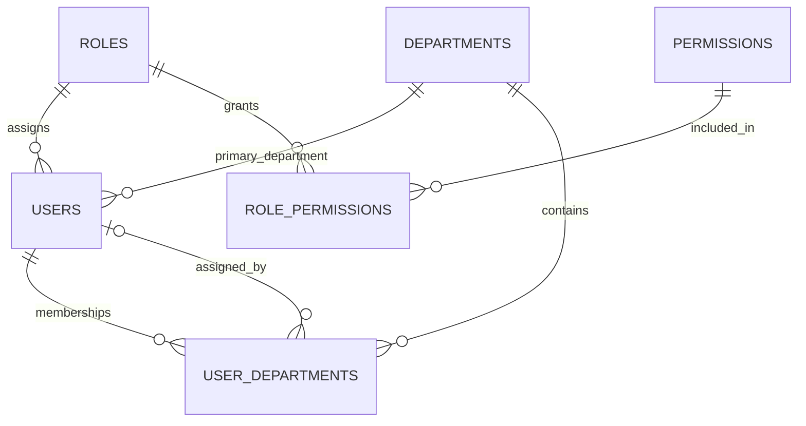

### Patients and encounters

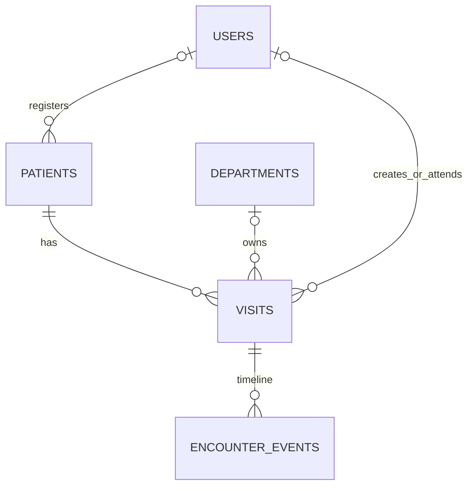

### Transfer, receipt and queue

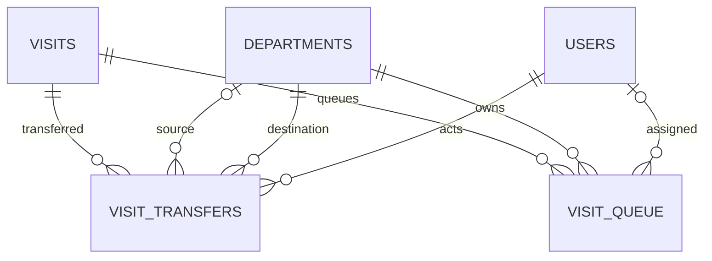

### Audit, events and security

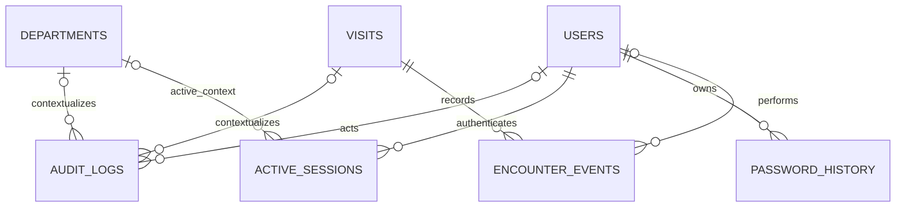

### Settings

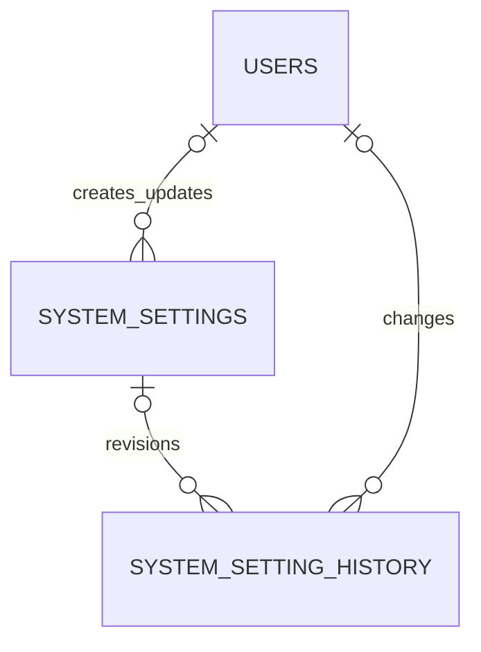

### High-level map

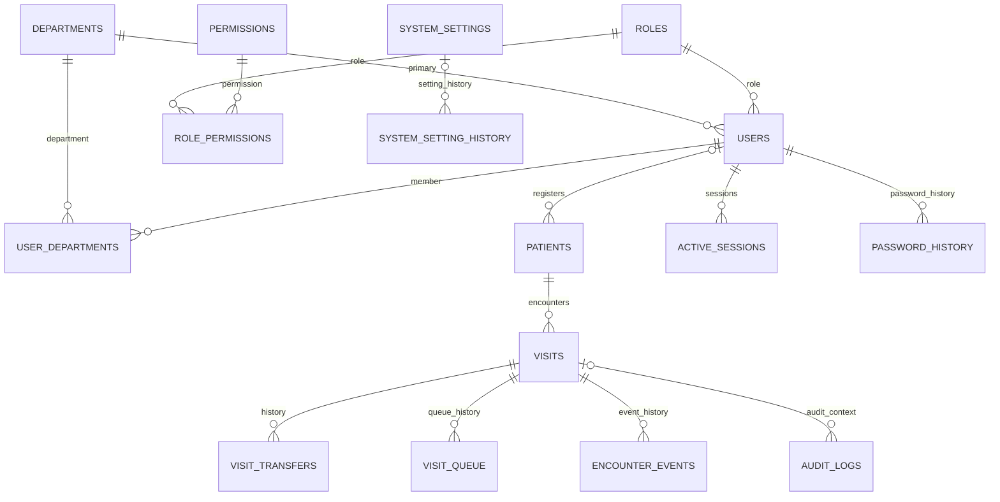

## Module Ownership

| Module/service | Owned tables | Shared dependencies |
|---|---|---|
| Authentication/Security | `active_sessions`, `password_history` | `users`, `audit_logs`, `departments` |
| Administration Users/Roles | `users`, `roles`, `permissions`, `role_permissions` | `audit_logs` |
| Departments | `departments`, `user_departments` | `users`, visits/queues/transfers |
| Patients | `patients` | `users`, `audit_logs` |
| Encounters | `visits`, `visit_transfers`, `encounter_events` | patients, users, departments, audit, queue |
| Queue | `visit_queue` | visits, departments, users, event/audit pipeline |
| Audit | `audit_logs` | optional references to users, visits, departments |
| Settings | `system_settings`, `system_setting_history` | users, audit |
| Database operations | `phase1_visit_status_repair`, `phase1_patient_gender_repair` | visits, patients |

## Data Lifecycle and Integrity

- Current-state master tables: users, roles, permissions, departments, patients, visits, system settings.
- Junction/current-state tables: role permissions and user departments.
- Historical tables: visit transfers, queue episodes, active-session history, password history, setting history and repair ledger.
- Append-only by application convention: audit logs, encounter events, password history and setting history.
- Soft-state policy: users, roles, permissions, departments and memberships use active/status flags where available. There is no universal `deleted_at` policy.
- Restrictive foreign keys protect patient/encounter/security history; nullable actor/context references preserve records if optional master records are removed.
- Workflow services own transactions, row-lock mutable encounter/queue/transfer/user/settings rows where required, and write audit/event records before commit.
- Medical history should not be physically deleted. The current schema still includes some cascades (notably visit → transfer/queue ownership) that rely on encounters themselves never being deleted through application workflows.

## Migration History

| Order/file | Milestone/purpose | Schema/data effects | Rollback/idempotency/live evidence |
|---|---|---|---|
| `002_phase0_live_schema_alignment_up.sql` | Phase 0 live alignment | Adds visit receipt fields and transfer compatibility status columns; synchronizes values; creates `encounter_events` and indexes/FKs. | One-time/non-idempotent. Down removes data-bearing structures. Live columns/table verify application. |
| `003_phase0_queue_workflow_up.sql` | Phase 0 queue | Extends/creates queue fields, statuses, timestamps and indexes/FKs required by `QueueService`. | One-time. Down can discard queue workflow history. Live schema verifies application. |
| `004_phase0_store_status_up.sql` | Phase 0 status compatibility | Adds `Store` to encounter status enum. | Down unsafe while Store rows exist. Live enum verifies application. |
| `005_phase1_user_management_up.sql` | 1.1 users | Adds account lock/failed login/password-force fields and supporting FK/index. | One-time; down loses security state. Live schema verifies application. |
| `006_phase1_roles_permissions_up.sql` | 1.2 authorization | Activates roles; creates permissions/role permissions; seeds permission catalogue and role mappings. | One-time; seed-sensitive. Live tables/data verify application. |
| `007_phase1_departments_assignments_up.sql` | 1.3 departments | Adds department metadata; creates user departments; synchronizes each user's primary membership. | One-time; down loses secondary memberships/metadata. Live schema verifies application. |
| `008_phase1_security_administration_up.sql` | 1.4 security | Extends audit metadata; creates active sessions and password history with indexes/FKs. | One-time; down discards security history. Live schema verifies application. |
| `009_phase1_system_settings_up.sql` | 1.6 settings | Creates settings/history, grants settings permission, and seeds 34 definitions. | One-time, seed-sensitive. Live tables and definitions verify application. |
| `010_phase1_production_indexes_up.sql` | 1.7 hardening | Adds composite production indexes for audit, encounters, queue and related queries. | One-time; down drops named indexes. Live indexes verify application. |
| `011_phase1_visit_status_repair_up.sql` | 1.7 data repair | Creates repair ledger, captures invalid encounter statuses and maps them to supported enum states. | Data-sensitive; down can only restore recorded values if still valid/desired. Live ledger (five rows at review) verifies application. |
| `012_phase1_patient_gender_remediation_up.sql` | 1.8 pre-clinical remediation | Creates the patient gender repair ledger, expands the enum to Male/Female/Other/Unknown, records empty sentinels, and explicitly repairs them to Unknown. | Applied live; eight repairs recorded and zero empty sentinels remain. Down refuses to contract while Other/Unknown rows exist. One-time/non-idempotent. |
| `013_phase2_medical_records_foundation_up.sql` | 2.1 Medical Records foundation | Adds demographic version/history, amendments, patient-aware audit and PHI access logs. | Baseline-represented and checksum-tracked; destructive down requires archival review. |
| `014_phase2_mpi_identifiers_up.sql` | Preserved 2.2 foundation | Adds normalized search columns and retained identifier/history/duplicate tables. | Baseline-represented and checksum-tracked; historical owner of retained tables. |
| `015_recovery_safety_and_seed_reconciliation_up.sql` | Recovery safety | Adds/reconciles the ledger and deterministic foundation data. | Applied live; non-destructive down only. |
| `016_phase2_patient_identifiers_mpi_up.sql` | 2.2 formal release | Adopts retained MPI structures and seeds required permissions/settings. | Applied live and checksum-tracked; down retains medical history. |

Paired down files exist for each migration. They are operational escape hatches,
not automatically safe production rollbacks. The checksum-backed
`schema_migrations` ledger now prevents duplicate application and detects
changed migration files; broader per-migration pre/postconditions remain
technical debt.

Official policy:

1. `hospital.sql` is the fresh-install baseline.
2. Future changes use ordered, paired migrations.
3. Historical migrations are preserved.
4. Deployments record successful applications and SHA-256 checksums in `schema_migrations`.
5. Baseline refreshes must be explicit release operations, not silent rewrites of history.

## Schema Risks and Technical Debt

| Priority | Finding | Consequence/recommendation |
|---|---|---|
| Resolved in 1.8 | Patient gender previously differed between PHP and MySQL, and eight empty ENUM sentinels existed. | Migration 012, service validation, forms and tests now use Male/Female/Other/Unknown; repairs remain traceable in the ledger. |
| High | `hospital.sql` is Phase 0 baseline, not a complete Phase 1 snapshot. | Fresh installation requires correctly ordered migrations. Add a verified installer/migration ledger before production rollout. |
| Resolved | Migration tracking/checksums were previously absent. | `schema_migrations` and guarded tools now fail on replay/checksum drift; historical migrations still require precondition review. |
| High | Encounter numbers use application generation with a count-based sequence. | Concurrent creation can collide; adopt a transaction-safe sequence while preserving format/API. |
| Medium | One-primary-department and one-active-queue invariants are service-enforced only. | Direct SQL or races can violate invariants. Continue row locking; evaluate database-enforceable designs. |
| Medium | Department names are extensible but `visits.visit_status` is a fixed enum and state mapping recognizes a fixed catalogue. | New departments may be administrable but not valid encounter states. Decouple lifecycle state from department identity in a future additive design. |
| Medium | `previous_status`/`new_status` duplicate `from_status`/`to_status`. | Compatibility debt and synchronization burden; retain until all consumers are inventoried and a deprecation plan is approved. |
| Medium | Several indexes duplicate left prefixes. | Extra write/storage cost. Confirm with `EXPLAIN` and workload metrics before removal. |
| Medium | Audit/event/history append-only behavior is not enforced by database privileges/triggers. | Application or privileged SQL can mutate history. Use restricted DB users and retention controls in production. |
| Low | Patient allergies and several demographic concepts are denormalized text. | Appropriate for current registration scope, but future clinical allergy/history modules need normalized, versioned records without deleting legacy fields. |
| Low | Sensitive settings columns are future-ready but values are plaintext and no seed is marked sensitive. | Do not store secrets until encryption/key-management is implemented. |

## Phase 2 Milestone 2.1 Relationship Addendum

| Table/change | Owner | Lifecycle | Relationships/indexes |
|---|---|---|---|
| `patients.demographic_version` | Patients / Medical Records | Mutable version counter | `(id, demographic_version)` supports stale-write checks. |
| `audit_logs.patient_id` | Audit | Append-only reference | Nullable patient FK; `(patient_id, created_at)`. |
| `record_amendments` | Medical Records | Historical workflow metadata | Required patient/requester; optional visit/reviewer; patient/status, visit, record, requester indexes. |
| `patient_demographic_history` | Medical Records | Append-only | Required patient/amendment/actor; unique patient/version. |
| `record_access_logs` | Medical Records / Security | Append-only PHI access | Required patient/user; optional visit/department; patient/user/department/resource indexes. |

Medical Records history uses restrictive deletion. The nullable audit patient
FK uses `SET NULL` under the existing immutable-audit compatibility policy.

## Recovery schema addendum (2026-08-05)

`schema_migrations` is an Administration/Database Operations table containing
`id`, unique `migration_name`, SHA-256 `checksum`, `batch`, `applied_at`, and
`execution_time_ms`. Records are append-only deployment evidence. The current
reconstructed schema uses 25 tables, InnoDB, `utf8mb4`, 63 foreign-key column
relationships, and a guarded baseline-overlap sequence documented in
`database/migrations/README.md`.

The former description of `hospital.sql` as destructive is superseded: both
manual `hospital.sql` and automated `schema.sql` are database-neutral.

## Phase 2 Milestone 2.2 Relationship Addendum

| Table | Key columns and constraints | Index/query purpose | Lifecycle |
|---|---|---|---|
| `patient_identifiers` | PK `id`; patient and actor/verifier FKs; unique `uniqueness_key`; unique nullable `primary_key_value` | Patient/type/status, exact type/value, authority scope, verification | Mutable/versioned; deactivate instead of delete. |
| `patient_identifier_history` | PK `id`; identifier/patient/actor FKs; unique `(identifier_id, version_no)` | Patient chronology and actor review | Append-only. |
| `patient_duplicate_candidates` | PK `id`; two patient FKs; detector/reviewer FKs; unique ordered pair; low ID less than high ID | Review queue and either-patient warnings | Retained review state. |

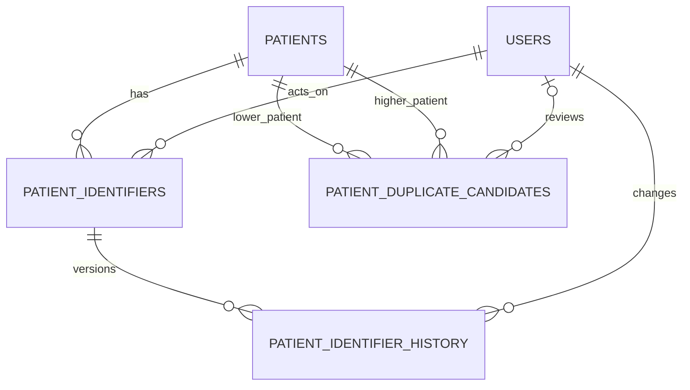

Migration `016_phase2_patient_identifiers_mpi_up.sql` is applied live and
checksum-tracked. It adopts Migration 014-owned tables with `IF NOT EXISTS`,
repairs normalized values/indexes, and seeds MPI permissions/settings. Its down
migration removes only the four 016-owned settings; retained medical history is
not dropped.

## Phase 2 Milestone 2.3 Relationship Addendum

| Table | Primary key | Foreign keys | Index highlights | Lifecycle |
|---|---|---|---|---|
| `patient_allergies` | `id BIGINT` | patient, optional source visit, recorded/verified/resolved users | unique active key; patient/status/severity; normalized substance; visit; verification | Versioned current state |
| `patient_allergy_history` | `id BIGINT` | allergy, patient, changed user | unique allergy/version; patient/time; actor/time | Append-only |
| `patient_alerts` | `id BIGINT` | patient, optional visit, creating/closing users | unique active key; patient/active/priority; effective dates; type/title; visit; confidentiality | Versioned current state |
| `patient_alert_history` | `id BIGINT` | alert, patient, changed user | unique alert/version; patient/time; actor/time | Append-only |

All 15 Migration 017 foreign keys were verified live. Patient, visit, and actor
relationships are restrictive on deletion and cascading on key updates.

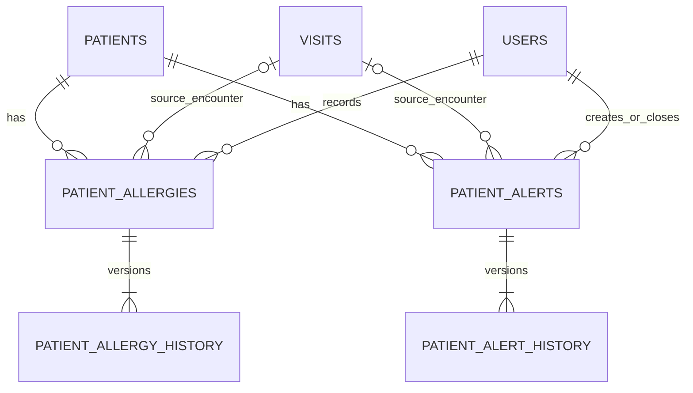

Migration `017_phase2_clinical_safety_up.sql` creates these tables and seeds
eight permissions/settings. Its down migration destroys retained safety
history; it is verified only on an empty isolated test database and is not an
automatic production rollback.

### Migration 018 relationship impact

`018_phase2_clinical_safety_hardening_up.sql` adds no table, index, constraint,
or foreign key. It adds one `system_settings` row and tightens validation
metadata on five existing rows. Clinical alert-history confidentiality is
derived from the classifications retained inside each append-only snapshot;
no duplicate history column was necessary.

## Phase 2.4 relational additions

| Table | State model | Primary relationships | Important constraints/indexes |
|---|---|---|---|
| `patient_problems` | Mutable current record | `patient_id → patients`; optional `source_visit_id → visits`; actor FKs → `users` | Unique active normalized patient/category/name key; patient/status/verification, severity, name, code, confidentiality and visit indexes |
| `patient_problem_history` | Append-only | problem, patient, actor, department and optional visit FKs | Unique `(problem_id, version_no)`; patient/time, actor/time, visit/time and confidentiality indexes |
| `patient_medical_history` | Mutable current record | `patient_id → patients`; optional `source_visit_id → visits`; recorder/verifier → `users` | Patient/type/status, patient/event, normalized title, confidentiality and visit indexes |
| `patient_medical_history_versions` | Append-only | entry, patient, actor, department and optional visit FKs | Unique `(history_entry_id, version_no)` plus patient/time, actor/time, visit/time and confidentiality indexes |

All patient and visit deletion actions are `RESTRICT`; no ordinary route
physically deletes longitudinal clinical records. History snapshots preserve
the confidentiality classification of each version.

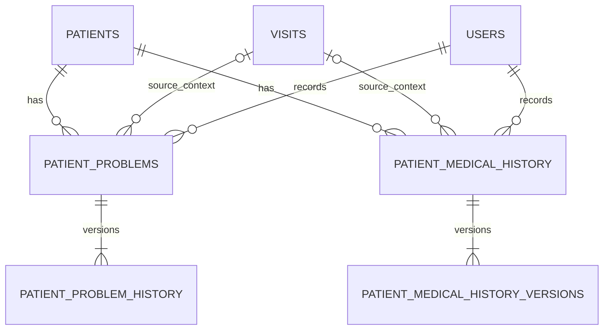


## Phase 2.5 relational additions

### `medical_documents`

Mutable logical current record owned by `MedicalDocumentService`.

| Column | Type/null/default | Purpose |
|---|---|---|
| `id` | BIGINT PK auto increment | Logical document identity |
| `patient_id` | INT, required | Longitudinal patient owner |
| `visit_id` | INT, nullable | Optional validated encounter context |
| `document_type` | VARCHAR(80), required | Settings-controlled type key |
| `title` | VARCHAR(200), required | Safe display title |
| `description` | TEXT, nullable | Authorized metadata description |
| `department_id` | INT, nullable | Uploading department context |
| `confidentiality_level` | ENUM, default `Standard` | Standard, Restricted, Confidential, Highly Confidential |
| `document_status` | ENUM, default `Active` | Active, Archived, Entered-in-error |
| `current_version` | INT, default 1 | Current immutable file-version number |
| `uploaded_by` | INT, required | Initial uploader |
| `archived_by`, `archived_at`, `archive_reason` | nullable | Lifecycle attribution |
| `version` | INT, default 1 | Optimistic metadata/lifecycle version |
| `created_at`, `updated_at` | timestamps | Record timestamps |

Secondary indexes: `idx_medical_documents_patient_status`,
`idx_medical_documents_visit_status`, `idx_medical_documents_type`,
`idx_medical_documents_confidentiality`, `idx_medical_documents_department`,
and `idx_medical_documents_uploader`.

### `medical_document_versions`

Append-only physical-file metadata. Ordinary routes never update or delete rows.

| Column | Type/null/default | Purpose |
|---|---|---|
| `id` | BIGINT PK auto increment | Version identity |
| `document_id`, `version_number` | BIGINT/INT, required | Parent and immutable sequence |
| `storage_provider` | VARCHAR(40), default `local` | Storage implementation key |
| `storage_key` | VARCHAR(191) ASCII, unique | Opaque non-public reference |
| `original_filename` | VARCHAR(255) | Sanitized display filename |
| `stored_filename` | VARCHAR(191) ASCII | Safe internal opaque filename |
| `mime_type`, `file_extension`, `file_size` | required | Server-inspected metadata |
| `sha256_checksum` | CHAR(64) ASCII | Integrity checksum |
| `upload_status` | ENUM, default `Pending` | Pending, Available, Quarantined, Rejected |
| `malware_scan_status` | ENUM, default `Not Scanned` | Scanner boundary; never fake-clean |
| `malware_scan_reference` | VARCHAR(191), nullable | Future scanner reference |
| `uploaded_by`, `uploaded_at` | required | Version actor/time |
| `replacement_reason` | TEXT, nullable | Required after initial version |
| `supersedes_version_id` | BIGINT, nullable | Prior immutable version |
| `created_at` | timestamp | Persistence timestamp |

Unique constraints cover `(document_id, version_number)` and `storage_key`.
Secondary indexes support chronology, availability/malware filtering,
uploader/date, checksum lookup, and supersession traversal.

| FK | Source → target | Update/delete |
|---|---|---|
| `fk_medical_documents_patient` | `medical_documents.patient_id → patients.id` | CASCADE / RESTRICT |
| `fk_medical_documents_visit` | `medical_documents.visit_id → visits.id` | CASCADE / RESTRICT |
| `fk_medical_documents_department` | `department_id → departments.id` | CASCADE / SET NULL |
| `fk_medical_documents_uploaded_by` | `uploaded_by → users.id` | CASCADE / RESTRICT |
| `fk_medical_documents_archived_by` | `archived_by → users.id` | CASCADE / RESTRICT |
| `fk_medical_document_versions_document` | `document_id → medical_documents.id` | CASCADE / RESTRICT |
| `fk_medical_document_versions_uploader` | `uploaded_by → users.id` | CASCADE / RESTRICT |
| `fk_medical_document_versions_supersedes` | `supersedes_version_id → medical_document_versions.id` | CASCADE / RESTRICT |

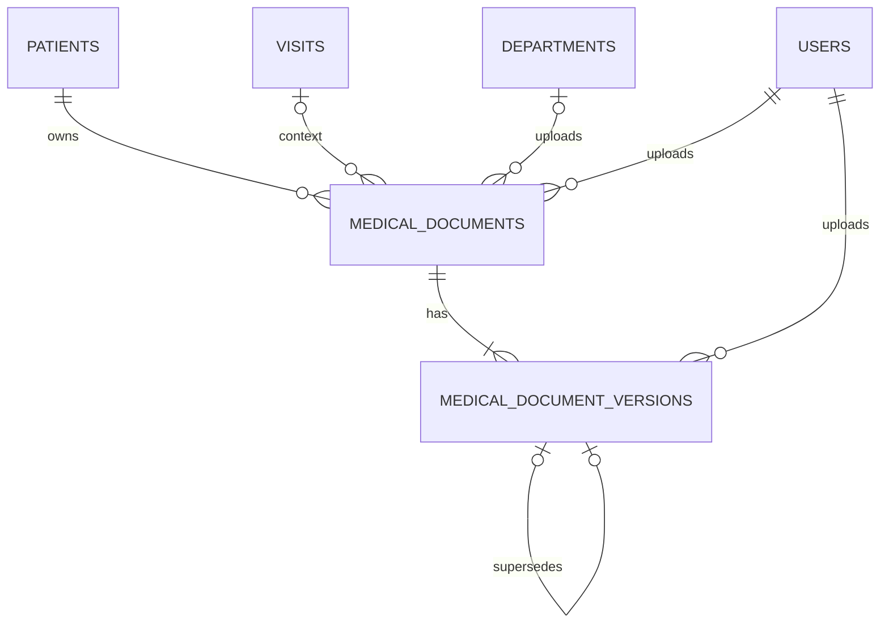

Migration 020 is ledger-applied and baseline-represented. Its isolated down/up
cycle passed with empty test tables. SQL backups do not contain document bytes.

## Phase 2.6 relational additions

| Table | Ownership | Lifecycle | Keys and query indexes |
|---|---|---|---|
| `clinical_notes` | Medical Records / `ClinicalNoteService` | Mutable current pointer/metadata; no ordinary delete | PK `id`; patient/status/date, visit/status/date, author/status/update, department/date, type/status/date, confidentiality/status |
| `clinical_note_versions` | Medical Records / `ClinicalNoteService` | Append-only and immutable | PK `id`; unique `(note_id, version_number)`; note/date, author/date, status/date, confidentiality/date, checksum, supersedes |
| `record_amendments` | Shared amendment ledger | Status-controlled request history | Existing record type/id and patient/status indexes |

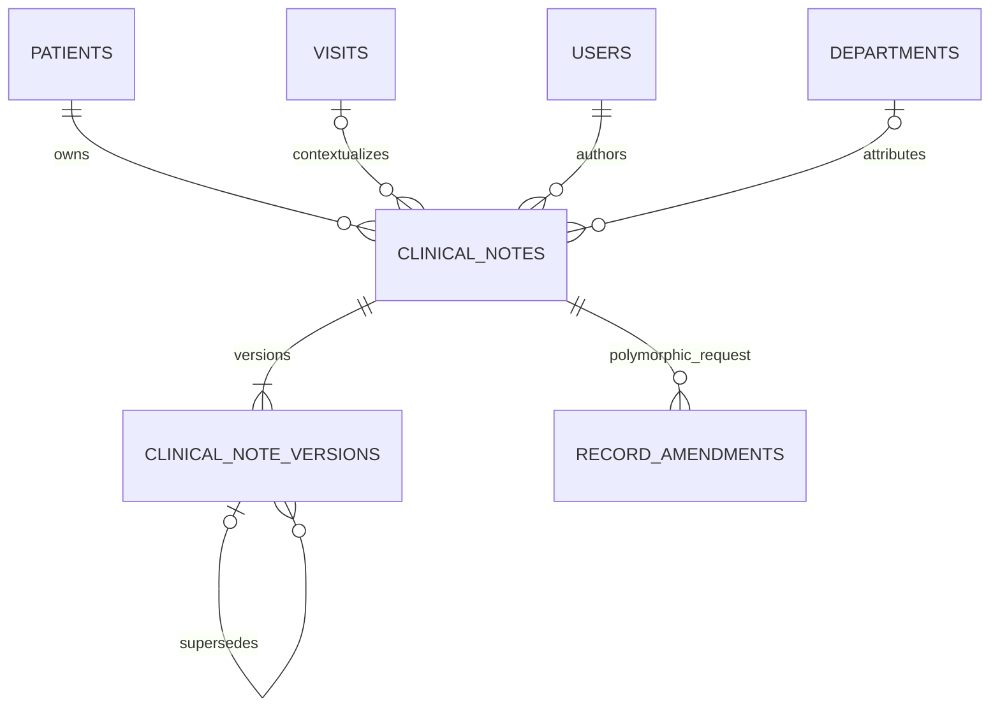

Migration 021 is ledger-applied, checksum-verified, baseline-represented, and
passed guarded isolated rollback/reapply. Its down migration is destructive
and restricted to an empty disposable test database or approved recovery.

## Phase 3.1 relational additions

| Table | Ownership | Lifecycle | Keys and query indexes |
|---|---|---|---|
| `consultations` | Consultation / `ConsultationService` | Draft mutable current record; Completed view-only | PK `id`; unique `visit_id`; patient/status/date, doctor/status/date, department/date |
| `department_notifications` | Visits workflow / `DepartmentNotificationService` | Status-controlled attention request | PK `id`; destination department/status/date, visit/date, patient/date, sender/date |

| FK | Source -> target | Update/delete |
|---|---|---|
| `fk_consultations_visit` | `consultations.visit_id -> visits.id` | CASCADE / RESTRICT |
| `fk_consultations_patient` | `consultations.patient_id -> patients.id` | CASCADE / RESTRICT |
| `fk_consultations_doctor` | `consultations.doctor_id -> users.id` | CASCADE / RESTRICT |
| `fk_consultations_department` | `department_id -> departments.id` | CASCADE / SET NULL |
| `fk_consultations_created_by` / `updated_by` / `completed_by` | actor columns -> `users.id` | CASCADE / RESTRICT |
| `fk_department_notifications_visit` | `department_notifications.visit_id -> visits.id` | CASCADE / RESTRICT |
| `fk_department_notifications_patient` | `patient_id -> patients.id` | CASCADE / RESTRICT |
| `fk_department_notifications_from_department` | `from_department_id -> departments.id` | CASCADE / SET NULL |
| `fk_department_notifications_to_department` | `to_department_id -> departments.id` | CASCADE / RESTRICT |
| notification actor FKs | `sent_by`, `read_by`, `resolved_by -> users.id` | CASCADE / RESTRICT |

```mermaid
erDiagram
    PATIENTS ||--o{ CONSULTATIONS : has
    VISITS ||--o| CONSULTATIONS : owns_one
    USERS ||--o{ CONSULTATIONS : clinical_doctor
    USERS ||--o{ CONSULTATIONS : actor
    DEPARTMENTS o|--o{ CONSULTATIONS : context
    PATIENTS ||--o{ DEPARTMENT_NOTIFICATIONS : has
    VISITS ||--o{ DEPARTMENT_NOTIFICATIONS : has
    DEPARTMENTS o|--o{ DEPARTMENT_NOTIFICATIONS : from
    DEPARTMENTS ||--o{ DEPARTMENT_NOTIFICATIONS : to
    USERS ||--o{ DEPARTMENT_NOTIFICATIONS : sends_or_resolves
```

## Phase 3.2 relational additions

| Table | Ownership | Lifecycle | Keys and query indexes |
|---|---|---|---|
| `vital_signs` | Encounter workflow / `VitalSignsService` | Mutable current records; multiple rows per visit | PK `id`; visit/patient/recorder/department/created_at indexes; blood-pressure and BMI are stored as ordinary nullable values, not separate tables |

| FK | Source -> target | Update/delete |
|---|---|---|
| `fk_vital_signs_visit` | `vital_signs.visit_id -> visits.id` | CASCADE / RESTRICT |
| `fk_vital_signs_patient` | `vital_signs.patient_id -> patients.id` | CASCADE / RESTRICT |
| `fk_vital_signs_department` | `vital_signs.department_id -> departments.id` | CASCADE / SET NULL |
| `fk_vital_signs_recorded_by` | `vital_signs.recorded_by -> users.id` | CASCADE / RESTRICT |

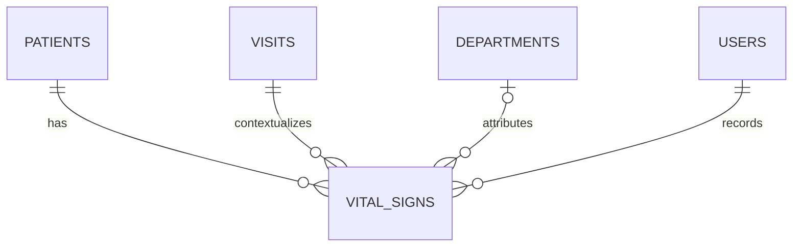

Migration 023 is baseline-represented for fresh installs and ledger-applied for
existing installations. The workspace, patient-chart and consultation
read-models use the latest record as a summary while the history page shows the
ordered visit ledger.

## Phase 3.3 relational additions

| Table | Ownership | Lifecycle | Keys and query indexes |
|---|---|---|---|
| `nursing_assessments` | Encounter workflow / `NursingService` | Mutable draft current record; one primary assessment per visit | PK `id`; unique `visit_id`; patient/nurse/department/status/created_at indexes; narrative nursing sections remain `TEXT` fields rather than normalized sub-tables |
| `radiology_requests` / `radiology_reports` | Encounter workflow / `RadiologyService` | Mutable request with immutable text report; multiple requests per visit allowed | PK `id`; visit/patient/requester/department/status/source indexes; report unique on request; study requested, clinical indication, findings, impression, and recommendation remain `TEXT` fields |

| FK | Source -> target | Update/delete |
|---|---|---|
| `fk_nursing_assessments_visit` | `nursing_assessments.visit_id -> visits.id` | CASCADE / RESTRICT |
| `fk_nursing_assessments_patient` | `nursing_assessments.patient_id -> patients.id` | CASCADE / RESTRICT |
| `fk_nursing_assessments_nurse` | `nursing_assessments.nurse_id -> users.id` | CASCADE / SET NULL |
| `fk_nursing_assessments_department` | `nursing_assessments.department_id -> departments.id` | CASCADE / SET NULL |
| `fk_nursing_assessments_created_by` | `nursing_assessments.created_by -> users.id` | CASCADE / RESTRICT |
| `fk_nursing_assessments_updated_by` | `nursing_assessments.updated_by -> users.id` | CASCADE / SET NULL |
| `fk_nursing_assessments_completed_by` | `nursing_assessments.completed_by -> users.id` | CASCADE / SET NULL |
| `fk_radiology_requests_visit` | `radiology_requests.visit_id -> visits.id` | CASCADE / RESTRICT |
| `fk_radiology_requests_patient` | `radiology_requests.patient_id -> patients.id` | CASCADE / RESTRICT |
| `fk_radiology_requests_requested_by` | `radiology_requests.requested_by -> users.id` | CASCADE / RESTRICT |
| `fk_radiology_requests_department` | `radiology_requests.department_id -> departments.id` | CASCADE / SET NULL |
| `fk_radiology_reports_request` | `radiology_reports.radiology_request_id -> radiology_requests.id` | CASCADE / RESTRICT |
| `fk_radiology_reports_visit` | `radiology_reports.visit_id -> visits.id` | CASCADE / RESTRICT |
| `fk_radiology_reports_patient` | `radiology_reports.patient_id -> patients.id` | CASCADE / RESTRICT |
| `fk_radiology_reports_performed_by` | `radiology_reports.performed_by -> users.id` | CASCADE / RESTRICT |
| `fk_radiology_reports_completed_by` | `radiology_reports.completed_by -> users.id` | CASCADE / SET NULL |

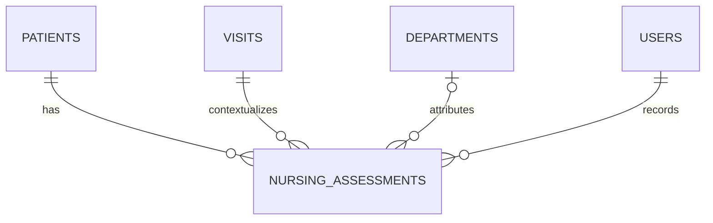

## Phase 3.6 relational additions

| Table | Ownership | Lifecycle | Keys and query indexes |
|---|---|---|---|
| `physiotherapy_records` | Encounter workflow / `PhysiotherapyService` | Mutable encounter record; one primary record per visit | PK `id`; unique `visit_id`; visit/patient/physiotherapist/department/source/status/created_at indexes; referral reason, presenting problem, assessment, treatment plan, goals, and precautions remain `TEXT` fields |
| `physiotherapy_sessions` | Encounter workflow / `PhysiotherapyService` | Append-only follow-up sessions per record | PK `id`; physiotherapy-record/visit/patient/recorded-by/session-date indexes; treatment given, patient response, progress notes, and next plan remain `TEXT` fields |

| FK | Source -> target | Update/delete |
|---|---|---|
| `fk_physiotherapy_records_visit` | `physiotherapy_records.visit_id -> visits.id` | CASCADE / RESTRICT |
| `fk_physiotherapy_records_patient` | `physiotherapy_records.patient_id -> patients.id` | CASCADE / RESTRICT |
| `fk_physiotherapy_records_physiotherapist` | `physiotherapy_records.physiotherapist_id -> users.id` | CASCADE / SET NULL |
| `fk_physiotherapy_records_department` | `physiotherapy_records.department_id -> departments.id` | CASCADE / SET NULL |
| `fk_physiotherapy_sessions_record` | `physiotherapy_sessions.physiotherapy_record_id -> physiotherapy_records.id` | CASCADE / RESTRICT |
| `fk_physiotherapy_sessions_visit` | `physiotherapy_sessions.visit_id -> visits.id` | CASCADE / RESTRICT |
| `fk_physiotherapy_sessions_patient` | `physiotherapy_sessions.patient_id -> patients.id` | CASCADE / RESTRICT |
| `fk_physiotherapy_sessions_recorded_by` | `physiotherapy_sessions.recorded_by -> users.id` | CASCADE / RESTRICT |

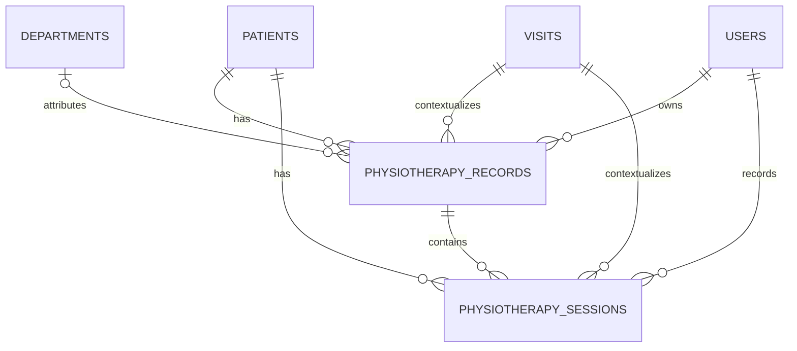

Migration 024 is baseline-represented for fresh installs and ledger-applied for
existing installations. The workspace, Patient Chart and nursing history views
use the latest record as a summary while preserving a single assessment per
visit.

## Phase 3.7 relational additions

| Table | Ownership | Lifecycle | Keys and query indexes |
|---|---|---|---|
| `theatre_records` | Encounter workflow / `TheatreService` | Mutable draft current record; one primary record per visit | PK `id`; unique `visit_id`; visit/patient/surgeon/department/status/created_at indexes; procedure name, indication, preoperative notes, procedure details, findings, complications, postoperative notes, postoperative plan, and anaesthesia notes remain `TEXT` fields |

| FK | Source -> target | Update/delete |
|---|---|---|
| `fk_theatre_records_visit` | `theatre_records.visit_id -> visits.id` | CASCADE / RESTRICT |
| `fk_theatre_records_patient` | `theatre_records.patient_id -> patients.id` | CASCADE / RESTRICT |
| `fk_theatre_records_surgeon` | `theatre_records.surgeon_id -> users.id` | CASCADE / SET NULL |
| `fk_theatre_records_department` | `theatre_records.department_id -> departments.id` | CASCADE / SET NULL |
| `fk_theatre_records_created_by` | `theatre_records.created_by -> users.id` | CASCADE / RESTRICT |
| `fk_theatre_records_updated_by` | `theatre_records.updated_by -> users.id` | CASCADE / SET NULL |
| `fk_theatre_records_completed_by` | `theatre_records.completed_by -> users.id` | CASCADE / SET NULL |

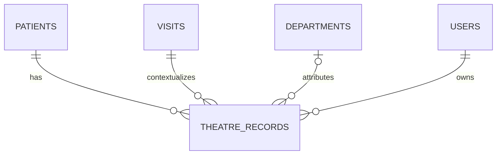
