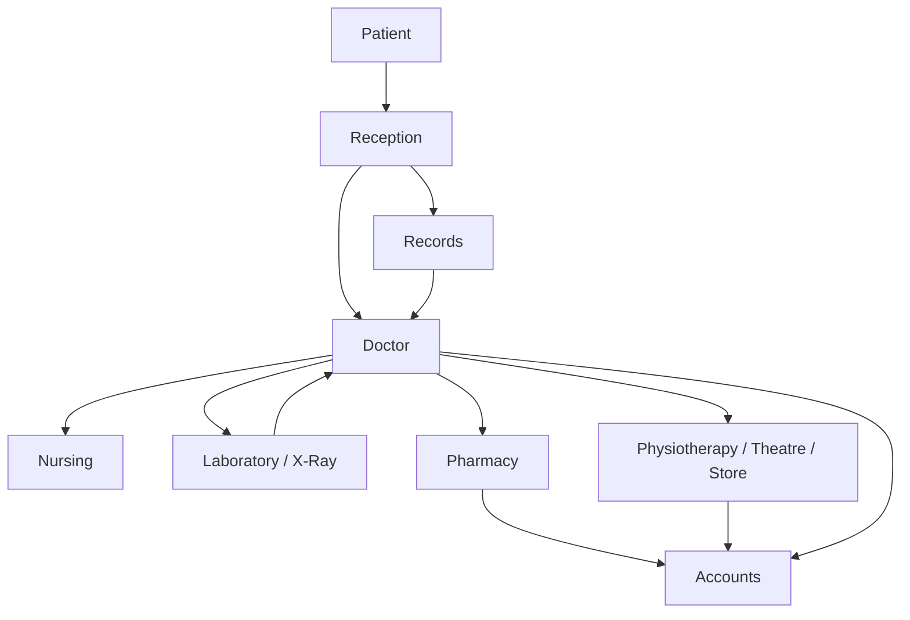
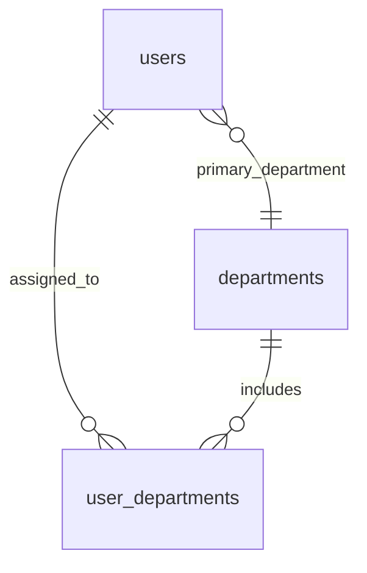
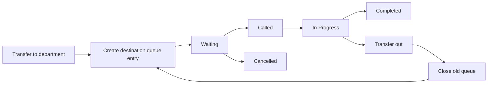
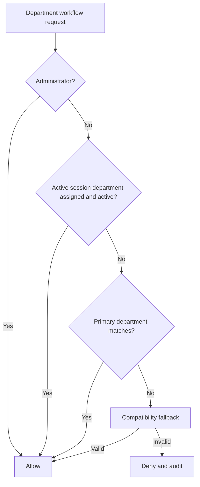
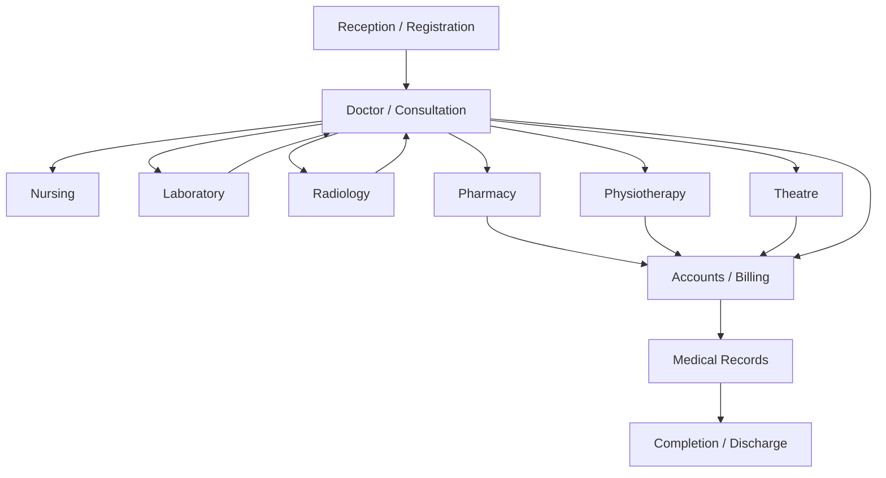

# Department Architecture

This document is the department workflow reference for the current implementation. General architecture and service relationships are documented in [SYSTEM_ARCHITECTURE.md](SYSTEM_ARCHITECTURE.md).

## Status Legend

| Status | Meaning |
|---|---|
| Implemented | Supported by current schema, service, and route behavior. |
| Partially implemented | Supporting infrastructure exists, but the complete departmental workflow is not yet present. |
| Planned | Reserved for a future clinical or operational module. |

## Hospital Organization

Departments are first-class administrative entities. Each department has a stable ID used by current encounters, transfers, queues, users, audit records, and encounter events.

Current department metadata includes:

- name;
- unique code;
- description;
- location;
- contact extension;
- department type;
- queue-enabled flag;
- active/inactive state;
- display order.

Department metadata can change without rewriting historical records.

## Department Catalogue

The current database contains the following departments. Codes are the synchronized Phase 1 codes generated from existing IDs.

| ID | Code | Department | Type | Current operational status |
|---:|---|---|---|---|
| 1 | DEPT-001 | Administrator | Administrative | Administration access |
| 2 | DEPT-002 | Reception | Clinical | Patient and encounter entry |
| 3 | DEPT-003 | Records | Clinical | Records responsibility; detailed module planned |
| 4 | DEPT-004 | Doctor | Clinical | Doctor assignment and future consultation |
| 5 | DEPT-005 | Nursing | Clinical | Nursing module planned |
| 6 | DEPT-006 | Laboratory | Diagnostic | Laboratory module planned |
| 7 | DEPT-007 | Pharmacy | Support | Pharmacy module planned |
| 8 | DEPT-008 | Physiotherapy | Clinical | Physiotherapy module planned |
| 9 | DEPT-009 | X-Ray | Diagnostic | Radiology module planned |
| 10 | DEPT-010 | Theatre | Support | Theatre module planned |
| 11 | DEPT-011 | Accounts | Administrative | Billing module planned |
| 12 | DEPT-012 | Store | Support | Inventory module planned |

The department type values and operational responsibilities can be edited by administrators. The table above reflects the current seeded metadata.

## Department Relationships



This diagram expresses the intended hospital workflow. Current code implements department ownership, transfer, receive, queue, and doctor assignment. Clinical module handoffs are planned.

## Department Responsibilities

| Department | Responsibility | Status |
|---|---|---|
| Administrator | Users, roles, permissions, departments, assignments | Implemented |
| Reception | Patient registration and encounter creation | Implemented |
| Records | Demographic/medical records operations | Partially implemented; patient pages exist, full records module planned |
| Doctor | Doctor assignment and future consultation | Assignment implemented; consultation planned |
| Nursing | Nursing assessment and care | Planned |
| Laboratory | Laboratory requests and results | Planned |
| X-Ray | Radiology requests and reports | Planned |
| Pharmacy | Medication verification and dispensing | Planned |
| Accounts | Billing and payments | Planned |
| Physiotherapy | Referral, treatment, and sessions | Planned |
| Theatre | Surgical scheduling and operation records | Planned |
| Store | Inventory and stock operations | Partially implemented as a department identity; inventory workflow planned |

## User Department Membership

`users.department_id` remains the compatibility primary department. `user_departments` stores all active and inactive memberships.



Implemented membership rules:

- a user cannot receive a duplicate user-department assignment;
- an inactive department cannot receive a new assignment;
- the primary department remains synchronized to `users.department_id`;
- user creation and editing create or reactivate the matching primary membership atomically;
- the primary membership cannot be removed directly;
- changing primary department clears other primary flags inside a transaction;
- department assignment and removal are audited;
- active department switching is stored in the session and audited.

Multiple-primary prevention is enforced through transactional row locking and service normalization. A future database-level partial uniqueness constraint may provide an additional defense if deployment standards permit it.

## Queue Behaviour

Queue ownership belongs to the department represented by `visit_queue.department_id`.



Implemented queue rules:

- duplicate active queue entries are rejected;
- closed encounters cannot enter a queue;
- pending transfer/receipt prerequisites are respected;
- row locking protects queue mutations;
- queue mutations produce audit and encounter events;
- completed/cancelled encounters become queue-read-only.

Dedicated queue dashboards for every department are planned. The current queue is exposed through `QueueService` and workspace components.

## Workspace Behaviour

The encounter workspace is an internal encounter page at:

```text
modules/visits/workspace.php?id=<visit_id>
```

It is not a permanent top-level workspace module. It displays encounter header, summary, status, queue state, quick actions, timeline, and future clinical tabs.

Workspace access requires authentication, encounter existence, permission, department access, and lifecycle compatibility. Closed encounters remain viewable in read-only mode. Pending receive state prevents clinical actions until receipt.

## Department Authorization



Department authorization is implemented through `PermissionService`. Transfer requires the current department. Receive requires the destination department and pending transfer. Doctor assignment requires the Doctor department, receipt, active encounter state, and doctor permission.

Inactive departments cannot receive new user assignments or authorize active departmental work. Historical encounter references remain valid.

## Department Administration

Implemented administration pages provide:

- department listing and search;
- department creation;
- department metadata editing;
- department view and summaries;
- activation/deactivation;
- active/inactive user counts;
- active encounter counts;
- queue-enabled display;
- user department assignment management;
- primary department changes.

All writes are transactional and audited with:

- `DEPARTMENT_CREATED`
- `DEPARTMENT_UPDATED`
- `DEPARTMENT_ACTIVATED`
- `DEPARTMENT_DEACTIVATED`
- `USER_DEPARTMENT_ASSIGNED`
- `USER_DEPARTMENT_REMOVED`
- `PRIMARY_DEPARTMENT_CHANGED`
- `ACTIVE_DEPARTMENT_SWITCHED`

## Future Clinical Workflow



Future departmental modules must:

1. operate within an encounter;
2. verify active department authorization;
3. validate encounter lifecycle prerequisites;
4. use service-layer transactions;
5. write module records with `visit_id`;
6. create encounter events and audit logs;
7. preserve historical department IDs and immutable history.

## Current Limitations

- Clinical department modules are not yet implemented.
- Department queue screens are not yet specialized by module.
- Session administration is not yet implemented.
- Department switching is session-based and not persisted as a user preference.
- A formal database constraint for one primary membership is not present; service locking enforces the rule.
- Reporting and cross-department operational analytics are planned.

## Records Department — Milestone 2.1

The Records department owns the implemented Patient Chart foundation,
versioned demographic corrections, demographic history, authorized patient
audit review, identifier review support, and Clinical Safety history access.
Problems, documents, notes, and merge workflows remain planned. Clinical
departments may view a chart only with the database permission and an active
treatment relationship.

## Department Clinical Safety Boundary — Milestone 2.3

Clinical Safety is longitudinal and patient-owned, not owned by the encounter's
current department. Department membership still limits access through
`PermissionService` and treatment-relationship rules.

- Doctors record/update/verify/resolve allergies and manage alerts; confidential
  detail requires a separate permission.
- Nurses record/update allergies and manage designated alerts; verification is
  disabled by default through settings.
- Records staff view safety data and history for correction support, without
  clinical verification by default.
- Reception and supported clinical/diagnostic departments receive
  minimum-necessary banner visibility when patient scope is valid.
- Accounts and Store receive no clinical detail by default.

Identifiers are implemented in Milestone 2.2 and Clinical Safety in Milestone
2.3. Problems, documents, notes, merge, and specialty automation remain
planned; earlier contrary planning text is superseded by this status.

## Records Department — Milestone 2.1

The Records department now owns the implemented Patient Chart foundation,
versioned demographic corrections, demographic history, and authorized patient
audit review. Clinical safety, problems, documents, notes, identifiers, and
merge workflows remain planned. Clinical departments may view a chart only
with the database permission and an active treatment relationship.

## Longitudinal clinical-record responsibilities

**Implemented in Phase 2.4.** Doctors manage and clinically verify Problem List
and structured-history records when Patient Chart/treatment access is valid.
Nurses receive view access and may manage structured history when the database
permission is assigned; Problem List mutation remains separately setting- and
permission-gated. Records Officers can view history and support correction review but do not
independently perform clinical verification. Diagnostic departments receive
minimum-necessary read access where seeded. Reception, Accounts and Store do
not receive broad clinical mutation rights.

Department assignment alone never grants access: PermissionService combines
role permission, active department/treatment relationship and confidentiality
rules. Administrator override is audited and does not bypass clinical data
integrity rules.

## Medical Document responsibilities (Phase 2.5)

Medical Documents retain the uploading `department_id` as provenance while
remaining patient-owned longitudinal records. An optional `visit_id` supplies
encounter context but does not transfer ownership to `VisitService`.

- Records manages indexing, replacement, archival/correction, history, and
  authorized confidential access.
- Doctors and Nurses manage clinically relevant documents within patient and
  treatment scope; only Doctors receive replacement/confidential grants by
  default.
- Reception and Accounts are restricted to approved document-type subsets.
- Laboratory, Radiology, Pharmacy, Theatre, and Physiotherapy receive
  encounter-relevant upload/view/download grants, not broad longitudinal scope.
- Store receives no Medical Document permission by default.

Encounter-linked operations validate the visit/patient pair and department
access. Historical department metadata may become null only if a department is
deleted through a separately authorized database operation; patient, visit,
uploader, and version history remain deletion-restricted.

## Clinical Notes department behavior

Clinical Notes preserve the author's active department on the logical record
and every immutable version. Patient-level access follows longitudinal chart
and treatment-relationship policy. Encounter-linked creation validates the
visit/patient pair and encounter access. Records Officers may review
amendments as a longitudinal records responsibility without being assigned to
the current encounter department; they are not clinical signers.
