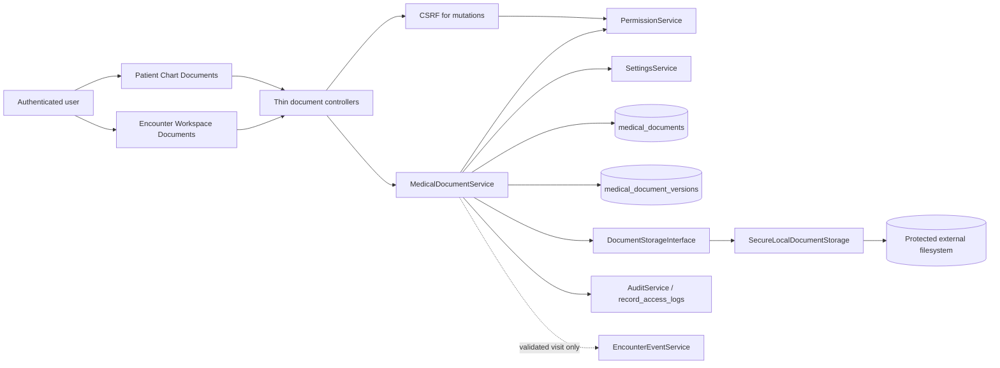
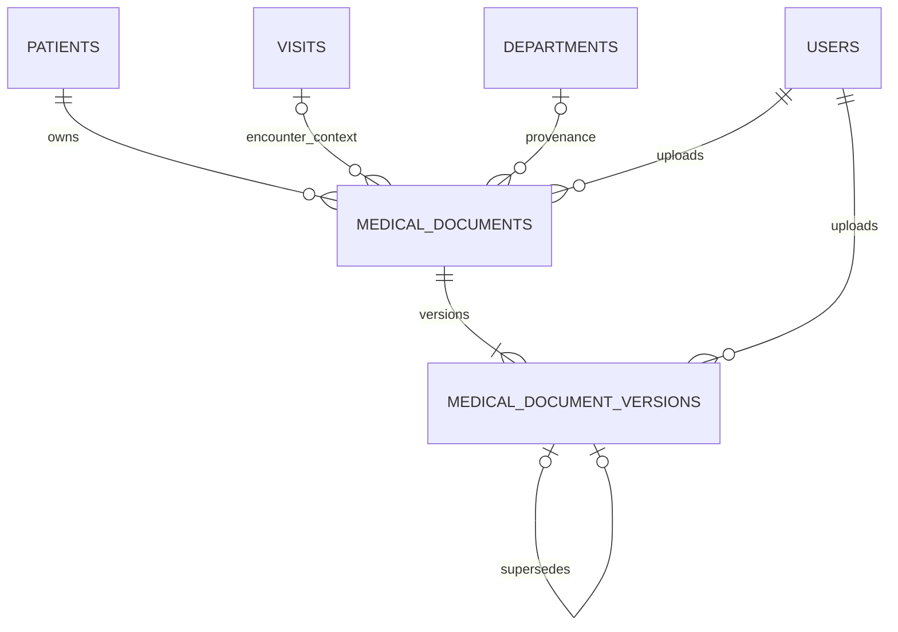
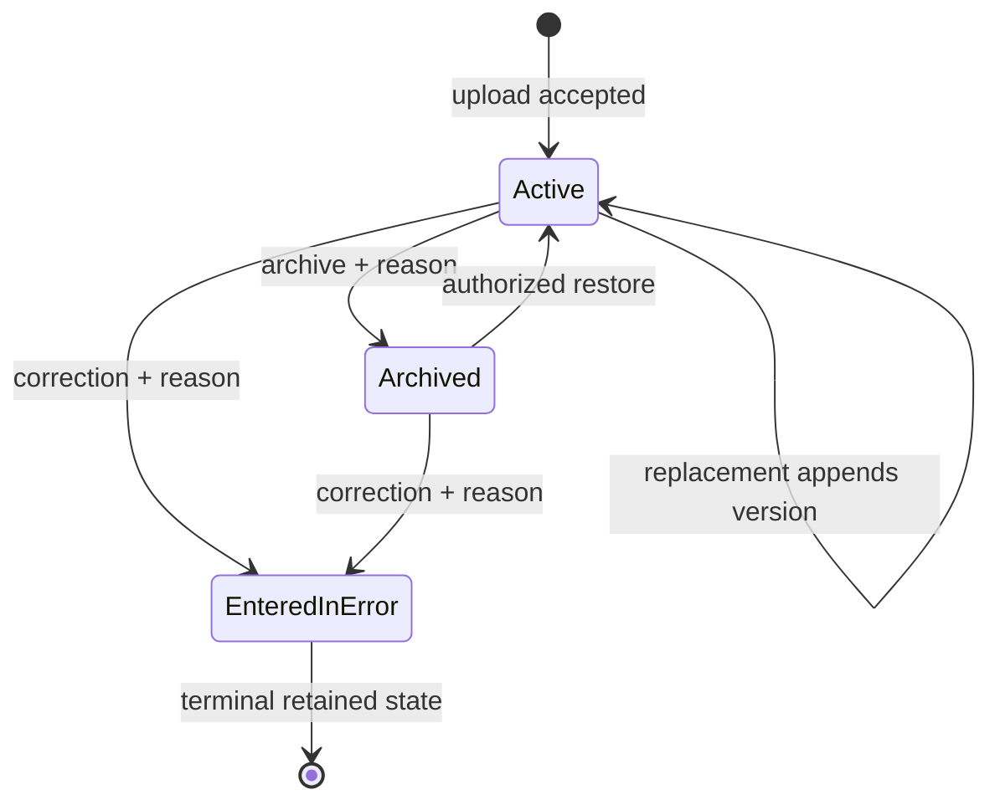
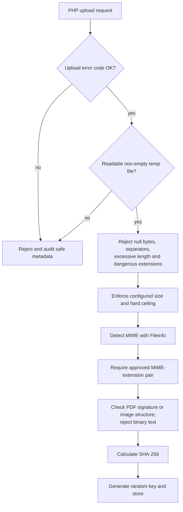
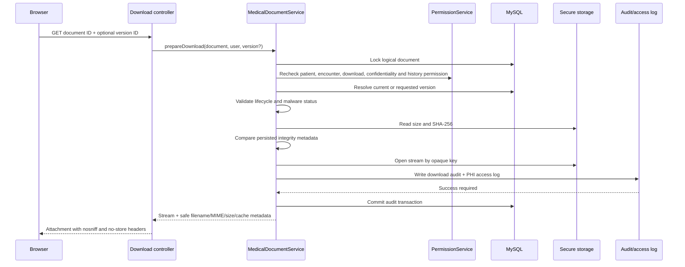
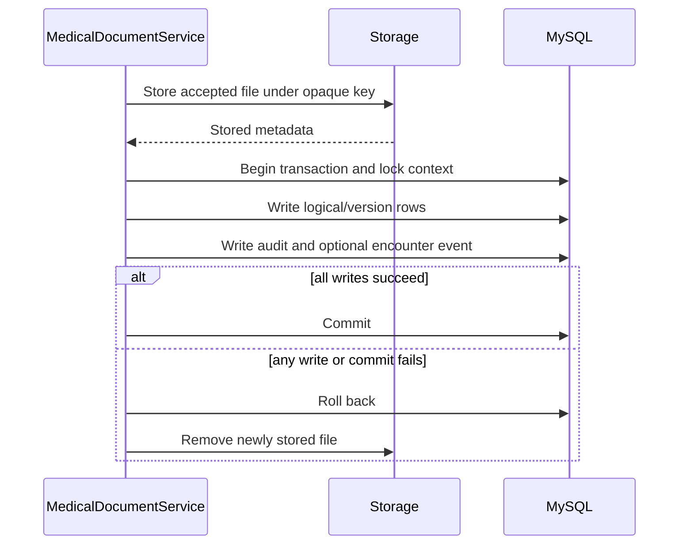

# Medical Documents Architecture

Official architectural checkpoint for Phase 2 Milestone 2.5.

This document describes the repository implementation as of August 5, 2026.
It complements `SYSTEM_ARCHITECTURE.md`, `DATABASE_RELATIONSHIPS.md`,
`API_CONTRACTS.md`, `PERMISSION_MATRIX.md`, and
`MEDICAL_DOCUMENTS_DEPLOYMENT.md`.

Status terms used here:

- **Implemented** — present in the current code, schema, routes, and tests.
- **Partially implemented** — a safe foundation exists but operational
  integration is incomplete.
- **Planned** — intentionally not implemented in Milestone 2.5.

## 1. Purpose and boundaries

The Medical Documents subsystem stores and retrieves patient-related files
without exposing them through public filesystem URLs or placing large binaries
inside MySQL. It supports longitudinal patient documents and documents linked
to one encounter.

The ownership boundaries are:

| Concern | Owner |
|---|---|
| Patient identity and demographics | `PatientService` / MPI |
| Encounter lifecycle | `VisitService` and encounter services |
| Longitudinal chart assembly | `MedicalRecordService` and Patient Chart |
| Document metadata, file versions, storage coordination and lifecycle | `MedicalDocumentService` |
| Physical file persistence | `DocumentStorageInterface` implementation |
| Authorization | `PermissionService` plus service-level context checks |
| Administrative/workflow audit | `AuditService` |
| Encounter timeline | `EncounterEventService`, only with validated encounter context |

Medical Documents do not implement Clinical Notes, note signing, Laboratory
results, Radiology reporting, Consultation records, or patient merging. Future
modules may attach or generate documents through this subsystem but continue to
own their domain data.

## 2. Component architecture



Both Patient Chart and Encounter Workspace use `MedicalDocumentService`. The
Workspace does not have a parallel table, storage path, or document service.

## 3. Storage architecture

### 3.1 Storage abstraction

**Implemented.** `DocumentStorageInterface` defines:

| Method | Responsibility |
|---|---|
| `store()` | Move an accepted temporary file to available or quarantine storage |
| `openStream()` | Open a validated opaque key as a read stream |
| `exists()` | Confirm a keyed file exists in the requested area |
| `deleteTemporaryFile()` | Remove an abandoned temporary upload safely |
| `quarantine()` | Move an available file into quarantine |
| `moveFromQuarantine()` | Promote a quarantined file to available storage |
| `remove()` | Compensating removal after a failed operation |
| `getMetadata()` | Return stored size and SHA-256 without exposing a path |

`SecureLocalDocumentStorage` is the only implemented provider. A future
provider can replace it through constructor injection without changing
controllers or document metadata contracts.

### 3.2 Local storage layout

The root is resolved from `HMS_DOCUMENT_STORAGE_ROOT`. Its default development
value is `C:\xampp\hms_secure_documents`, outside Apache's document root.

```text
<storage-root>/
├── available/
│   └── <2-character-prefix>/<64-random-hex>.<extension>
├── quarantine/
│   └── <2-character-prefix>/<64-random-hex>.<extension>
├── .htaccess
└── web.config
```

Storage keys match a strict pattern and contain 256 bits of random material.
Physical names do not contain patient names, hospital numbers, document IDs,
or original filenames. Keys and server paths are excluded from public service
responses and views.

Directories and files receive best-effort `0700` and `0600` permissions.
`.htaccess` and `web.config` deny direct web access and directory browsing.
Production deployments must additionally enforce OS ACLs and verify that no URL
maps to the storage root; see `MEDICAL_DOCUMENTS_DEPLOYMENT.md`.

### 3.3 Storage states

- `available` contains versions permitted for service-controlled download.
- `quarantine` contains versions awaiting an external safety decision.
- Temporary PHP upload files are never treated as permanent storage.

No public method accepts an arbitrary destination path. Path traversal is
blocked by strict key validation and root-bound path construction.

## 4. Database model

### 4.1 `medical_documents`

**Implemented.** This mutable table represents the logical document and its
current lifecycle state.

| Field group | Implemented purpose |
|---|---|
| `id`, `patient_id`, nullable `visit_id` | Logical identity and patient/optional encounter scope |
| `document_type`, `title`, `description` | Searchable/display metadata |
| `department_id` | Uploading department provenance |
| `confidentiality_level` | Standard, Restricted, Confidential, Highly Confidential |
| `document_status` | Active, Archived, Entered-in-error |
| `current_version` | Current immutable file-version number |
| `uploaded_by` | Original uploader |
| archive actor/time/reason | Non-destructive lifecycle attribution |
| `version` | Optimistic concurrency token for logical mutations |
| timestamps | Creation and last logical update |

Patient and visit deletion are `RESTRICT`. Department deletion uses `SET NULL`
to preserve the document. Uploader and archiver references are restrictive.

### 4.2 `medical_document_versions`

**Implemented.** This append-only table records each physical version.

| Field group | Implemented purpose |
|---|---|
| `document_id`, `version_number` | Parent and immutable sequence |
| `storage_provider`, `storage_key`, `stored_filename` | Internal physical reference |
| `original_filename` | Sanitized display filename, never a physical path |
| MIME, extension, size | Server-observed file metadata |
| `sha256_checksum` | Integrity check before download |
| `upload_status` | Pending, Available, Quarantined, Rejected |
| `malware_scan_status` | Not Scanned, Clean, Suspicious, Infected, Scan Failed |
| `malware_scan_reference` | Future external scanner reference |
| uploader/time | Version provenance |
| replacement reason | Clinical/administrative reason for a new version |
| `supersedes_version_id` | Link to the prior immutable version |

Unique constraints prevent duplicate version numbers per document and duplicate
storage keys. Checksums are indexed for integrity investigation and duplicate
warnings; equal checksums do not merge logical documents or physical files.



The complete column, index, and foreign-key catalogue is in
`DATABASE_RELATIONSHIPS.md`. Migration 020 is baseline-represented and
checksum-ledger applied.

## 5. Document and version lifecycle



An upload creates one logical document and version 1. Replacement locks the
logical row, checks its optimistic version, appends the next immutable file
version, and advances `current_version`. Existing version rows and files are
not overwritten.

Archive and restore change logical availability without deleting file versions.
Entered-in-error is terminal. Ordinary routes never physically delete document
metadata or history. Automated retention purge is **Planned**.

Upload status is distinct from logical document status. A logically Active
document may have a current version in Quarantined state and therefore remain
unavailable for download.

## 6. Upload validation

Validation occurs server-side inside `MedicalDocumentService`; browser checks
are usability hints only.



The implemented mandatory allowlist is:

| MIME | Extensions |
|---|---|
| `application/pdf` | `pdf` |
| `image/jpeg` | `jpg`, `jpeg` |
| `image/png` | `png` |
| `text/plain` | `txt` |

Settings may enable a subset but cannot add unsupported or executable content.
The configured default limit is 10 MiB; the hard service ceiling is 40 MiB.
`$_FILES['type']`, client paths, and client filenames are never trusted as file
type or storage location.

DOCX, archives, SVG, HTML, scripts, and executable formats are not supported.

## 7. Authorization model

Every state-changing controller requires authentication and CSRF. Controllers
perform early permission/context checks; `MedicalDocumentService` rechecks the
authorization during the operation, including after row locks for writes.

Implemented permissions:

| Permission | Purpose |
|---|---|
| `view_medical_documents` | View authorized minimum-necessary metadata |
| `upload_medical_documents` | Upload authorized patient/encounter documents |
| `replace_medical_documents` | Append replacement versions |
| `archive_medical_documents` | Archive, restore, and mark entered in error |
| `download_medical_documents` | Stream available authorized versions |
| `view_confidential_documents` | Reveal restricted/confidential details |
| `view_document_history` | Inspect and download authorized historical versions |

Authorization combines database permission, administrator override, Patient
Chart/treatment relationship, active department, role-specific scope, document
type, optional encounter access, confidentiality, and lifecycle state.

Reception is restricted to referral, identity, insurance, consent,
correspondence, and other general document types. Accounts is restricted to
insurance, correspondence, and other authorized types. Records Officers have a
specific records-management boundary. Store receives no document grants by
default. The complete role matrix is in `PERMISSION_MATRIX.md`.

Knowing a document or version ID is insufficient. Direct detail, history, and
download methods revalidate document ownership and encounter context.

## 8. Confidentiality and minimum necessary disclosure

Confidentiality levels are Standard, Restricted, Confidential, and Highly
Confidential. Any non-Standard document requires
`view_confidential_documents` for full disclosure.

List methods return minimum-necessary metadata and remove description,
filename, checksum, storage key, and stored filename. Unauthorized confidential
records receive a generic title and hidden-detail marker rather than protected
content. Version history masks filename, checksum, and replacement reason when
the user lacks confidential permission.

Full confidential detail and history access require fail-closed protected
access logging. Administrator override permits access but does not suppress the
strong audit trail.

Current limitation: confidentiality is defined on the logical document, not
independently per file version. Version-specific reclassification is therefore
not implemented.

## 9. Authorized download and streaming

All downloads use `modules/medical_records/documents/download.php` and
`MedicalDocumentService::prepareDownload()`. There are no direct storage links.



The controller sends `Content-Type`, safe `Content-Disposition`, reliable
`Content-Length`, `X-Content-Type-Options: nosniff`, restrictive cache headers,
and a sandbox content-security policy. It does not expose paths or keys.

Downloads are denied for Entered-in-error documents, unavailable/quarantined
versions, suspicious/infected/failed scans, missing files, checksum or size
mismatch, version/document mismatch, or unauthorized historical access. If
required access logging fails, streaming fails closed with a safe response.
Range handling is not implemented.

## 10. Transaction and filesystem atomicity

MySQL and the filesystem cannot share a transaction. The implemented workflow
uses compensation:



Storage failure occurs before metadata persistence. Audit or encounter-event
failure rolls back metadata and triggers file removal. Replacement never
removes the superseded file.

A process crash between storage and compensation can leave an unreferenced
file. Automated orphan reconciliation is **Planned** and documented technical
debt.

## 11. Audit, access-log, and encounter-event boundaries

`MedicalDocumentService` owns mutation and download audit writes; controllers
must not duplicate them.

| Event | Trigger | Atomic boundary |
|---|---|---|
| `MEDICAL_DOCUMENT_UPLOADED` | Accepted metadata/version creation | Same transaction as rows; optional encounter event |
| `MEDICAL_DOCUMENT_REPLACED` | New immutable current version | Same transaction; optional encounter event |
| `MEDICAL_DOCUMENT_DOWNLOADED` | Authorized stream preparation | Must commit before streaming |
| `MEDICAL_DOCUMENT_ARCHIVED` | Active → Archived | Same transaction; optional encounter event |
| `MEDICAL_DOCUMENT_RESTORED` | Archived → Active | Same transaction; no encounter event currently |
| `MEDICAL_DOCUMENT_ENTERED_IN_ERROR` | Terminal correction | Same transaction; no encounter event currently |
| `CONFIDENTIAL_DOCUMENT_VIEWED` | Authorized protected detail/history/download | Fail closed where required |
| `DOCUMENT_ACCESS_DENIED` | Rejected protected action | Best-effort security audit outside failed mutation |
| `DOCUMENT_UPLOAD_REJECTED` | Server upload validation rejection | Best-effort; no document row exists |

Authorized downloads also write `record_access_logs` with resource type
`MedicalDocument`. The current `AuditService::logPatientAccess()` contract also
emits its standard `MEDICAL_RECORD_VIEWED` audit entry.

Encounter events exist only for validated encounter-linked upload, replacement,
and archive actions. Patient-only documents and downloads do not create
timeline events. Events contain safe workflow metadata, not document contents,
storage keys, checksums, or confidential descriptions.

`getDocumentHistory()` currently aliases immutable file-version history. There
is no separate logical lifecycle-history table. Archive and entered-in-error
reasons are retained on the logical row; a restore requires a reason but clears
the archived reason and does not retain the supplied restoration reason beyond
the generic audit action. This is documented technical debt rather than an
unimplemented history claim.

Standard document metadata views are authorized but do not independently write
a document-specific access row inside `getDocumentByIdForUser()`. Patient Chart
access may already be logged by the chart service, while all downloads and all
confidential detail/history views have explicit document access/audit behavior.

## 12. Settings integration

Implemented settings are:

| Key | Default | Function |
|---|---|---|
| `documents.allowed_types` | Eleven seeded type keys | Enabled type subset |
| `documents.maximum_upload_bytes` | 10 MiB | Operational size limit |
| `documents.allowed_mime_types` | PDF/JPEG/PNG/text | Enabled MIME subset |
| `documents.allowed_extensions` | pdf/jpg/jpeg/png/txt | Enabled extension subset |
| `documents.confidentiality_levels` | Four levels | Enabled schema subset |
| `documents.default_confidentiality` | Standard | Upload default |
| `documents.malware_scanning_required` | false | Quarantine unscanned uploads when true |
| `documents.storage_provider` | local | Implemented non-editable provider |
| `documents.download_cache_policy` | no-store | Response cache policy |
| `documents.closed_encounter_uploads` | false | Closed-encounter mutation policy |
| `documents.retention_years` | 10 | Retention policy metadata only |

Hardcoded security minimums remain authoritative. Settings cannot add an unsafe
MIME, extension, provider, or confidentiality value. Retention purging is not
implemented merely because a retention value exists.

## 13. Patient Chart and Encounter Workspace integration

The Patient Chart Documents tab lists patient-level and encounter-linked
documents. It supports authorized upload, detail, replacement, history,
download, archive, restore, and entered-in-error actions.

The Encounter Workspace Documents tab calls
`listEncounterDocuments(visitId, user)` and only shows records linked to that
encounter. It can carry validated encounter context into upload and links back
to the full Patient Chart. Closed encounters remain readable; new or replacement
attachments are denied by default.

Neither view contains SQL or filesystem operations.

## 14. Malware-scanning boundary

No malware engine is integrated. New versions are accurately marked
`Not Scanned`; the system never fabricates a Clean result.

When `documents.malware_scanning_required=true`, uploads are stored in
quarantine with `upload_status=Quarantined` and cannot be downloaded. The
storage abstraction provides quarantine movement methods, and the schema has a
scan status/reference, but no scanner callback, administrator review route, or
promotion service method currently exists. Those capabilities are
**Partially implemented / Planned**.

A future scanner integration must operate on opaque storage references, update
scan metadata through an audited service workflow, promote only Clean files,
and never make infected/suspicious/failed files downloadable.

## 15. Future clinical-module integration

The following integrations are **Planned**. Milestone 2.5 only provides the
secure storage and document contracts.

### Laboratory

Laboratory users currently have general encounter-relevant document permission,
and `external_laboratory_result` is an enabled type. A future Laboratory module
should retain structured orders/results in its own tables and use Medical
Documents only for external reports, scanned referrals, or immutable rendered
artifacts. Generated reports must link to the patient and encounter and remain
subject to Laboratory authorization and document confidentiality.

### Radiology

Radiography users currently have encounter-relevant document permission, and
`external_radiology_report` is enabled. Future Radiology reporting and image
metadata remain outside this service. Large imaging studies should use a PACS
or specialized object store; Medical Documents may retain external reports,
small authorized attachments, or references—not substitute for DICOM storage.

### Consultation

Future Consultation may upload referrals, consent forms, correspondence, and
external evidence or generate a signed rendered summary. Structured clinical
notes and diagnoses must remain in their owning Consultation model. Replacing a
rendered document must not rewrite the signed source record.

### Theatre

Theatre users currently receive encounter-relevant generic document access.
Future integration may attach consent forms, operative external records, and
authorized perioperative artifacts. Theatre workflows must independently
enforce encounter state, signing, and clinical safety requirements before
calling the document service.

### Other clinical modules

Nursing, Pharmacy, Physiotherapy, and future modules may consume the same
service but must receive explicit permissions and minimum-necessary patient or
encounter scope. No module should create a parallel attachment table merely to
bypass this architecture.

## 16. Future external document storage

Object storage is **Planned**. A compatible provider should implement
`DocumentStorageInterface` while preserving:

- private containers/buckets and no permanent public URLs;
- opaque storage keys;
- authenticated server-side streaming or tightly controlled short-lived
  delivery after application authorization;
- size and checksum verification;
- quarantine/available separation;
- compensating cleanup;
- encrypted transport and encryption at rest;
- environment and tenant separation;
- provider access audit and key rotation;
- storage lifecycle rules that cannot purge retained database versions early.

Presigned URLs, if later used, must be short-lived, created only after the same
authorization/audit checks, bound to the exact object/version, and excluded
from application logs. This is not implemented by the local provider.

## 17. Security considerations

- All SQL uses prepared statements.
- Mutation routes require CSRF.
- Direct URL and version-ID access cannot bypass service authorization.
- Original filenames are sanitized for display and response headers only.
- Executable/scriptable content is rejected by immutable minimum policy.
- Confidential lists use minimum-necessary disclosure.
- Protected logging failure prevents confidential access/download.
- SHA-256 and size are verified before every stream.
- Storage exceptions and responses do not disclose server paths.
- Ordinary workflows retain historical versions and never physically delete
  clinical document history.

Checksums prove byte consistency, not clinical authenticity, malware safety, or
that two equal files represent the same clinical record.

## 18. Testing and verification

`test/phase2_medical_documents_test.php` runs only against the dedicated test
database and isolated test storage. It covers accepted PDF/JPEG/PNG uploads,
MIME spoofing, executable/double-extension/traversal rejection, size and missing
file errors, checksums, quarantine, patient/visit mismatch, permissions,
confidential masking, replacement/history, lifecycle, stale versions,
downloads, access-log failure, storage/audit/event rollback, orphan cleanup,
and fixture cleanup.

`test/phase2_migration020_cycle_test.php` validates down/up behavior only on an
empty dedicated test database after the mandatory destructive-test backup gate.
Database safety refusal tests and Phase 0–2.4 regression suites passed during
Milestone 2.5 verification. Repository-wide PHP syntax validation covered 306
files.

## 19. Current limitations and technical debt

| Priority | Item | Status |
|---|---|---|
| High | Real malware scanner and audited quarantine promotion workflow | Planned |
| High | Coordinated database-plus-file backup/restore verification | Operational process; automation planned |
| Medium | Scheduled orphan reconciliation after process-level crashes | Planned |
| Medium | Multi-process concurrency and browser multipart automation | Planned |
| Medium | Production ACL validation across Apache service accounts | Deployment responsibility |
| Medium | Per-version confidentiality classification | Not implemented |
| Medium | Dedicated logical lifecycle history and retained restore reason | Not implemented; audit action exists |
| Medium | Document-specific PHI log for direct Standard metadata views | Not implemented; downloads/confidential reads are logged |
| Low | Object-storage provider | Planned |
| Low | Automated retention purge | Planned; must preserve legal/clinical retention |
| Low | HTTP range support for large files | Not implemented |
| Low | Physical checksum deduplication | Not implemented by design |

## 20. Architectural decisions

1. File bytes remain outside MySQL to keep transactional tables efficient and
   make storage independently replaceable.
2. Logical documents and physical versions are separate so replacement cannot
   overwrite clinical history.
3. One service owns patient- and encounter-linked documents to prevent parallel
   attachment models.
4. Downloads are controller-mediated so authorization, confidentiality,
   integrity, audit, and response headers cannot be bypassed.
5. Settings narrow a hardcoded security allowlist; administrators cannot enable
   executable content through configuration.
6. Filesystem writes use compensation around the database transaction because
   the two resources cannot commit atomically.
7. No scanner result is fabricated. `Not Scanned` and Quarantined remain
   distinct, clinically honest states.
8. Encounter events are limited to encounter-linked workflow changes; document
   downloads remain audit/access events rather than timeline noise.
9. The storage interface is deliberately small so a future private object-store
   implementation can preserve existing service and controller contracts.

## 21. Implementation status

| Capability | Status |
|---|---|
| Secure local storage outside web root | Implemented |
| Patient- and encounter-linked metadata | Implemented |
| Immutable file versions and replacement | Implemented |
| Archive, restore, entered-in-error lifecycle | Implemented |
| Server-side allowlist validation | Implemented |
| Controller-mediated authorized streaming | Implemented |
| Confidential masking and protected access logging | Implemented |
| Patient Chart and Workspace integration | Implemented |
| SHA-256 integrity verification | Implemented |
| Quarantine storage and schema boundary | Partially implemented |
| Real malware scanning/promotion workflow | Planned |
| Laboratory/Radiology/Consultation/Theatre domain integration | Planned |
| External object-storage provider | Planned |
| Automated retention and orphan reconciliation | Planned |
| Clinical Notes and note signing | Implemented separately in Milestone 2.6; notes store no binary document content |
