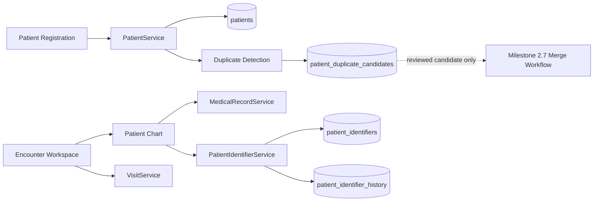
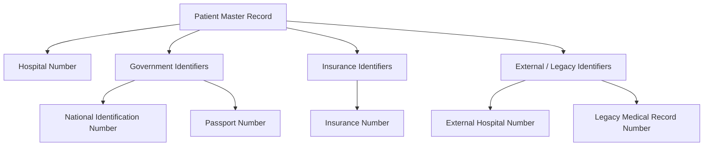
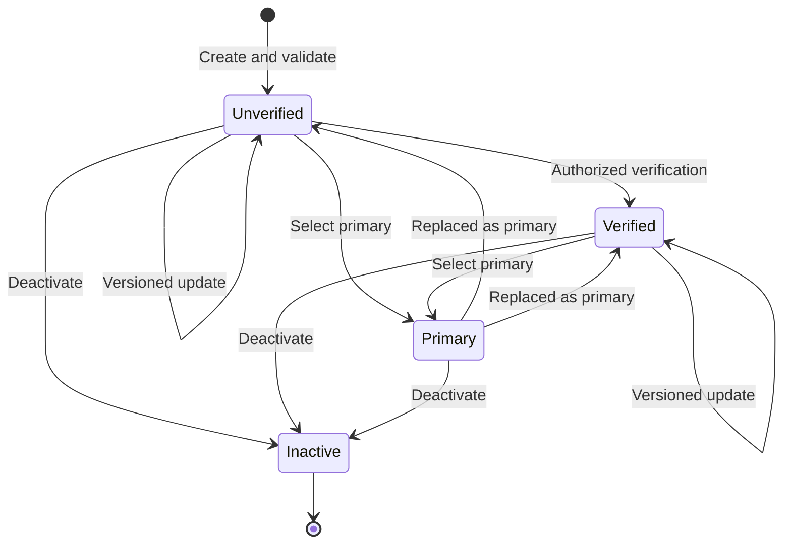
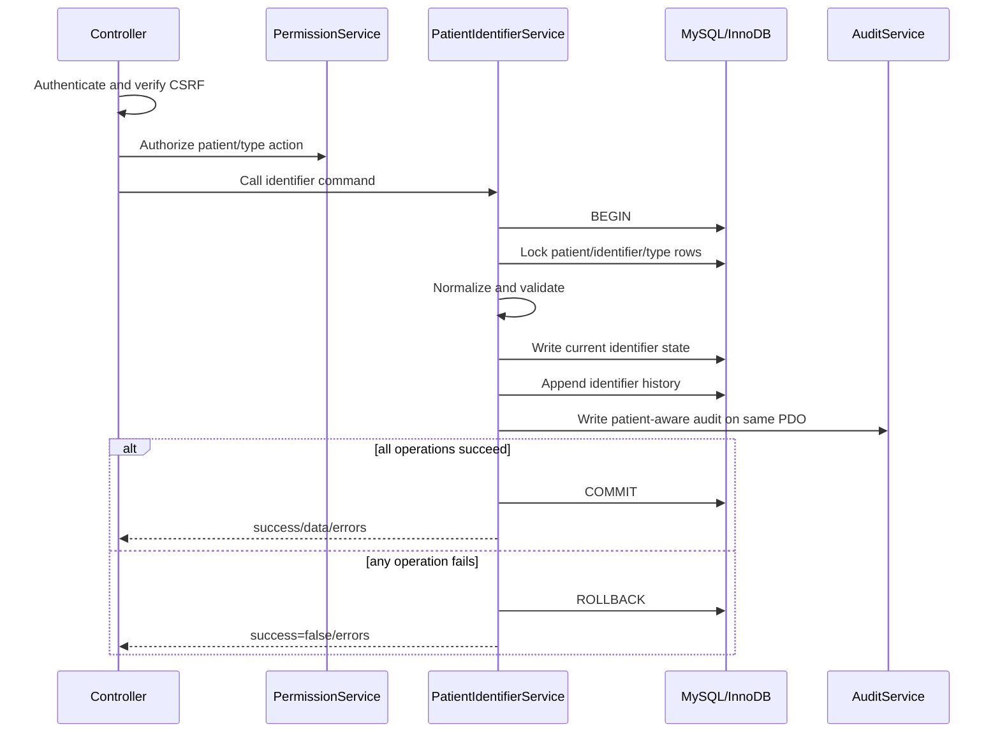
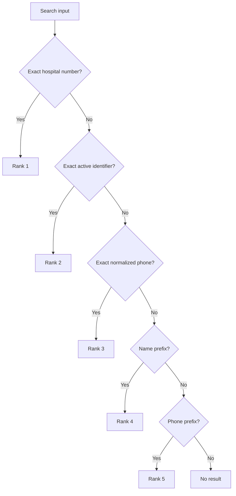
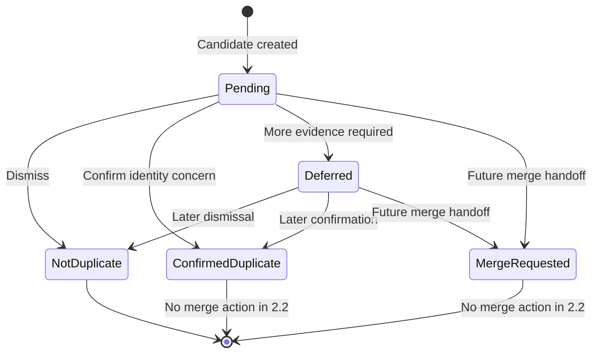
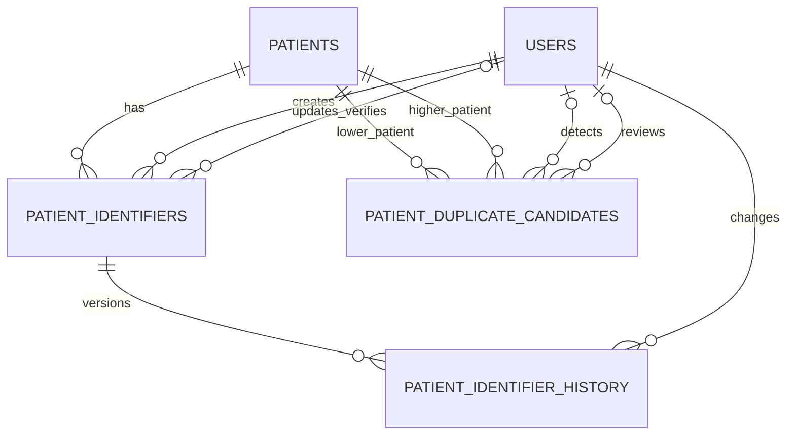
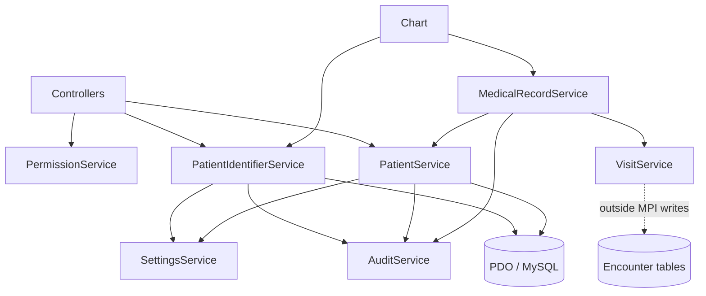
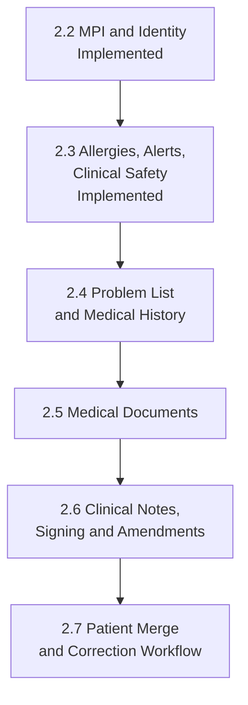

# Master Patient Index Architecture

**Status:** Phase 2 Milestone 2.2 implemented and verified  
**Scope:** Master Patient Index, alternate patient identifiers, exact-first
search, duplicate detection, and duplicate-case review  
**Future dependency:** Phase 2 Milestone 2.7 Patient Merge and Correction
Workflow

This document is the authoritative architectural reference for patient identity
management in the Hospital Management System. It describes the current
repository implementation. Future behavior is explicitly marked **Planned**.

Related references include [SYSTEM_ARCHITECTURE.md](SYSTEM_ARCHITECTURE.md),
[DATABASE_RELATIONSHIPS.md](DATABASE_RELATIONSHIPS.md),
[API_CONTRACTS.md](API_CONTRACTS.md), and
[PERMISSION_MATRIX.md](PERMISSION_MATRIX.md).

## 1. Purpose

### 1.1 Goals

The Master Patient Index (MPI) provides a controlled identity layer for finding
patients and reducing unsafe duplicate registration. Its implemented goals are:

- preserve `patients.hospital_number` as the authoritative local hospital
  number;
- associate alternate identifiers with an existing patient;
- normalize identifier and demographic values for reliable matching;
- rank exact identity matches before broader prefix matches;
- warn registration staff about possible existing patients;
- retain reviewable possible-duplicate cases without automatically combining
  records;
- preserve identifier changes through append-only history and patient-aware
  audit records.

The MPI does not decide that two people are the same solely from a score. A
score is a review aid, not a merge authorization.

### 1.2 Architectural boundaries

| Concern | Current owner | Boundary |
|---|---|---|
| Patient registration and demographic CRUD | `PatientService` | Creates the patient and hospital number; invokes duplicate evaluation before final creation. |
| Patient identity | `PatientIdentifierService` plus `patients.hospital_number` | Owns alternate identifier state, normalization, verification, primary selection, history, and identifier audit. |
| Patient search | `PatientService` | Provides the stable legacy search and additive exact-first paginated MPI search. |
| Longitudinal Patient Chart | `MedicalRecordService` and Medical Records pages | Assembles the longitudinal chart. Identifier presentation is integrated through `PatientIdentifierService`; it does not move identifier writes into `MedicalRecordService`. |
| Encounter Workspace | `VisitService` and visit modules | Remains encounter-specific. It links to the Patient Chart but does not own patient identity. |
| Duplicate detection and review | `PatientService` | Scores candidates, creates ordered candidate pairs, and records review decisions. |
| Patient merge | None | **Planned for Milestone 2.7.** No implemented review decision merges, redirects, deletes, or repoints a patient. |



### 1.3 Concept distinction

- **Patient registration** creates a patient master record and hospital number.
- **Patient identity** describes the identifiers associated with that patient.
- **Patient search** locates candidate patient records using exact-first and
  indexed prefix matching.
- **Duplicate detection** calculates an explainable similarity score and may
  create a case for human review.
- **Patient merge** would select a surviving record and reconcile references.
  It is not implemented in Milestone 2.2.

## 2. Identifier hierarchy



### 2.1 Hospital Number

| Property | Implemented behavior |
|---|---|
| Storage | `patients.hospital_number` |
| Purpose | Authoritative local hospital identity and highest-priority MPI search key. |
| Generation | `PatientService` formats `<hospital code>-<year>-<six-digit patient ID>`, using the configured hospital code. |
| Validation | Generated by the service after patient insertion; not entered as an alternate identifier. |
| Uniqueness | Unique database constraint in the patient master schema. |
| Verification | No separate verification state; issuance by the application is authoritative. |
| Lifecycle | Remains attached to the patient master. No normal deactivation route exists. |
| Primary status | Implicitly authoritative; it is outside the alternate-identifier primary mechanism. |

The hospital number is not duplicated into `patient_identifiers`.

### 2.2 Supported alternate identifiers

| Identifier type | Category | Current uniqueness scope | Authority required | Masked in ordinary display |
|---|---|---|---:|---:|
| National Identification Number | Government | Global | No | Yes |
| Passport Number | Government | Global | No | Yes |
| Insurance Number | Insurance | Issuing authority | Yes | Yes |
| External Hospital Number | External | Issuing authority | Yes | No by default |
| Legacy Medical Record Number | External/legacy | Issuing authority | Yes | No by default |

The enabled types and uniqueness categories come from `SettingsService`.
Additional types are structurally extensible through settings, but enabling a
new type requires an approved validation and uniqueness policy.

### 2.3 Format and validation

Current validation is intentionally generic:

1. trim the raw value;
2. uppercase it;
3. remove every character except `A-Z` and `0-9` for matching;
4. require at least four normalized characters;
5. require a supported identifier type;
6. require an actor, patient, and change reason;
7. validate issue and expiry dates as `YYYY-MM-DD`;
8. reject an expiry date earlier than the issue date;
9. require issuing authority for authority-scoped identifiers.

There are no implemented per-type regular expressions, checksum algorithms,
country-specific passport rules, or insurer-specific formats. Those must not be
assumed by future callers.

### 2.4 Uniqueness keys

`PatientIdentifierService` generates a deterministic `uniqueness_key`:

```text
Global:    <type>|G|<normalized value>
Authority: <type>|A|<normalized authority>|<normalized value>
Patient:   <type>|P|<patient ID>|<normalized value>
```

The database unique constraint on `uniqueness_key` is the final concurrent
duplicate guard. Authority names are normalized to lowercase for uniqueness.

### 2.5 Verification, activity, and primary rules

- Verification states are `Unverified`, `Verified`, and `Rejected` in the
  schema. Creation defaults to `Unverified`.
- `verifyIdentifier()` implements transition to `Verified` and records the
  verifier and timestamp.
- A public rejection command is not currently implemented; `Rejected` is
  schema-ready but operationally unused.
- Deactivation sets `is_active = 0` and clears primary status. Normal workflows
  do not delete identifier records.
- Primary status applies per patient and identifier type, not globally across
  every identifier type.
- The unique nullable `primary_key_value` enforces one primary identifier for a
  given patient/type combination.
- Expired identifiers are not automatically deactivated or excluded from exact
  search. Expiry is metadata at this milestone.

## 3. Identifier lifecycle



The diagram represents active and verification dimensions together for
readability. `is_active`, `is_primary`, and `verification_status` are separate
database fields.

### 3.1 Command flow



### 3.2 Current and historical ownership

| Record | Role | Mutability |
|---|---|---|
| `patient_identifiers` | Current identifier state | Mutable through versioned service commands. |
| `patient_identifier_history` | Previous/new snapshots and reason | Append-only by application policy. |
| `audit_logs` | Who performed the patient identity action | Append-only by application policy. |

Creation records history version 1. Updates increment `version` and reject a
stale expected version. Primary replacement versions and histories the prior
primary before selecting the new one. Deactivation and verification also
increment the version and append history.

Audit and history are separate: history describes record-state evolution;
audit describes the security/accountability event. A failed audit causes the
identifier write and history insert to roll back.

## 4. Search architecture

### 4.1 Search priority

Quick MPI search ranks results in this order:

1. exact hospital number;
2. exact active alternate identifier;
3. exact normalized phone;
4. normalized surname or first-name prefix;
5. normalized phone prefix;
6. optional bounded fuzzy search — **configured but not implemented**.



Dedicated filters can search hospital number, alternate identifier, phone,
email, first/middle/last-name prefix, date of birth, and supported gender.
Multiple dedicated filters are combined with `AND`.

### 4.2 Why leading wildcards are avoided

Primary matching uses equality or `prefix%`. It does not use `%term` or
`%term%`, because leading wildcards generally prevent effective use of B-tree
indexes and scale poorly as the patient population grows.

### 4.3 Normalized columns and indexes

`patients` stores normalized first, middle, and last name, phone, and email
alongside display values. `PatientService` maintains these values during create
and update operations. Migration 014/016 provides indexes for:

- `(normalized_last_name, normalized_first_name, date_of_birth)`;
- `normalized_phone`;
- `normalized_email`;
- `(date_of_birth, normalized_last_name, normalized_first_name)`.

Alternate identifier lookup uses
`(identifier_type, normalized_value, is_active)`.

### 4.4 Pagination contract

`searchPatientsPaginated()` clamps page size to 1–100 and returns:

```php
[
    'success' => true,
    'data' => [
        'records' => [],
        'current_page' => 1,
        'page_size' => 25,
        'total_results' => 0,
        'total_pages' => 1,
        'applied_filters' => []
    ],
    'records' => [],
    'current_page' => 1,
    'page_size' => 25,
    'total_results' => 0,
    'total_pages' => 1,
    'applied_filters' => [],
    'errors' => []
]
```

Top-level metadata is retained for compatibility. The MPI page uses
`mpi.search_page_size`, defaulting to 25.

## 5. Duplicate detection algorithm

### 5.1 Candidate preselection

Duplicate evaluation requires normalized first and last names. It retrieves at
most 50 existing patients matching at least one bounded condition:

- exact normalized first name + last name + date of birth;
- exact normalized phone;
- exact normalized email;
- exact hospital number, when provided;
- exact active alternate identifier, when provided.

When invoked during patient creation, this candidate query occurs inside the
registration transaction and uses `FOR UPDATE`. Public read-only duplicate
evaluation does not retain locks outside a transaction.

### 5.2 Weights

| Factor | Score |
|---|---:|
| Exact hospital number | Forces 100 |
| Exact active alternate identifier | Forces 100 |
| Exact normalized phone | +35 |
| Exact normalized email | +25 |
| Exact date of birth | +25 |
| Exact normalized surname | +20 |
| Exact normalized first name | +15 |
| Exact normalized middle name | +5 |
| Same gender | +5 |

Scores are capped at 100. The implementation does not currently score edit
distance, phonetic similarity, address similarity, or partial names. “Possible”
therefore means a lower weighted combination of exact normalized factors, not
an opaque fuzzy match.

### 5.3 Classifications

| Classification | Default range | Operational effect |
|---|---:|---|
| Exact Match | 100 | Requires explicit registration review acknowledgement. |
| Strong Possible Match | 80–99 | Requires explicit registration review acknowledgement. |
| Possible Match | 55–79 | Warning and review candidate; does not block continuation. |
| Low Confidence | Below 55 | Returned by evaluation but not persisted as a candidate. |

Thresholds come from `SettingsService`. The possible threshold reads
`mpi.duplicate_threshold` first and falls back to
`mpi.possible_match_threshold`.

### 5.4 Examples

| Input relationship | Score | Default classification |
|---|---:|---|
| Same phone, DOB, first name, surname, and gender | 100 after cap | Exact Match |
| Same DOB, first name, surname, and gender | 65 | Possible Match |
| Same phone and DOB | 60 | Possible Match |
| Same exact active passport number | 100 | Exact Match |
| Same surname only | Not preselected by surname alone | No candidate |

These examples describe the implemented weights. A legitimate family member
sharing a phone can still proceed after review; the score does not establish
identity.

### 5.5 Candidate creation

After a reviewed registration is inserted, every non-low-confidence result is
passed to `createDuplicateCandidate()` in the same patient-creation
transaction. The service:

1. rejects self-comparison;
2. stores the smaller patient ID as `patient_id_low`;
3. stores the larger ID as `patient_id_high`;
4. inserts with a unique ordered-pair constraint;
5. records score, classification, and JSON match factors;
6. audits candidate creation against both patient records.

`INSERT IGNORE` prevents concurrent duplicate pair creation. An already
existing pair is not automatically rescored or replaced.

**Duplicate detection never performs an automatic patient merge.**

## 6. Duplicate review workflow



Implemented decisions are `Confirmed Duplicate`, `Not Duplicate`, `Deferred`,
and `Merge Requested`. The reviewer must supply a reason. The service locks the
candidate row and compares its expected version before updating it.

### 6.1 Reviewer responsibilities

An authorized reviewer should compare both hospital numbers and displayed
demographic factors, record an evidence-based reason, and avoid requesting a
future merge when identity remains uncertain. The interface is a comparison
aid; it is not a legal identity-verification system.

### 6.2 Authorization and audit

- Viewing cases requires `view_duplicate_candidates`.
- Recording a decision requires `review_duplicate_candidates` and Records
  scope, unless the administrator override applies.
- `Not Duplicate` writes `DUPLICATE_DISMISSED` for both patients.
- Other decisions write `DUPLICATE_REVIEWED` for both patients.
- Candidate creation writes `DUPLICATE_CANDIDATE_CREATED` for both patients.

### 6.3 Review history limitation

The candidate row contains the latest decision, reason, reviewer, review time,
and optimistic version. There is no separate append-only duplicate-review
history table. Audit logs preserve review actions, but repeated reviews can
replace the current decision fields. A durable multi-review history is a
Milestone 2.7 design requirement, not an implemented Milestone 2.2 feature.

## 7. Database model

### 7.1 Entity relationship diagram



All three tables use InnoDB and `utf8mb4_unicode_ci`. Patient deletion is
restricted by foreign keys. Normal application workflows do not physically
delete these records.

### 7.2 `patient_identifiers`

**Purpose:** current alternate patient-identifier state.

| Column/group | Purpose |
|---|---|
| `id` | `BIGINT` primary key. |
| `patient_id` | Required patient owner. |
| `identifier_type`, `identifier_value`, `normalized_value` | Type, display value, and matching value. |
| `issuing_authority`, `issuing_authority_key` | Display and normalized authority. |
| `uniqueness_scope`, `uniqueness_key` | Global, authority, patient, or none scope and database-enforced key. |
| `issue_date`, `expiry_date` | Optional validity metadata. |
| `is_primary`, `primary_key_value` | Primary state and uniqueness-enforcement key. |
| `is_active` | Active/deactivated lifecycle. |
| `verification_status`, `verified_by`, `verified_at` | Verification state and provenance. |
| `created_by`, `updated_by` | Actor references. |
| `version` | Optimistic concurrency counter. |
| `created_at`, `updated_at` | Current-state timestamps. |

Constraints and indexes:

- primary key `id`;
- unique `uq_patient_identifier_uniqueness(uniqueness_key)`;
- unique `uq_patient_identifier_primary(primary_key_value)`;
- `idx_patient_identifiers_patient(patient_id, is_active, identifier_type)`;
- `idx_patient_identifiers_lookup(identifier_type, normalized_value, is_active)`;
- `idx_patient_identifiers_authority(identifier_type, issuing_authority_key, normalized_value)`;
- `idx_patient_identifiers_verification(verification_status, verified_at)`;
- patient, verifier, creator, and updater foreign keys use `ON UPDATE CASCADE`
  and `ON DELETE RESTRICT`.

### 7.3 `patient_identifier_history`

**Purpose:** append-only identifier versions and correction reasons.

| Column | Purpose |
|---|---|
| `id` | `BIGINT` primary key. |
| `identifier_id`, `patient_id` | Required identifier and patient references. |
| `version_no` | Version copied from current identifier state. |
| `action` | `Created`, `Updated`, `Verified`, `Deactivated`, `PrimaryChanged`, or `PrimaryCleared` as generated by the service. |
| `previous_snapshot`, `new_snapshot` | JSON-encoded full row snapshots stored as long text. |
| `reason` | Required business reason. |
| `changed_by`, `created_at` | Actor and immutable event timestamp. |

Constraints and indexes:

- unique `(identifier_id, version_no)`;
- `(patient_id, created_at)` history lookup;
- `(changed_by, created_at)` actor lookup;
- identifier, patient, and actor foreign keys are restrictive.

### 7.4 `patient_duplicate_candidates`

**Purpose:** current review state for one deterministic patient pair.

| Column | Purpose |
|---|---|
| `id` | `BIGINT` primary key. |
| `patient_id_low`, `patient_id_high` | Ordered patient pair. |
| `match_score`, `classification`, `matched_factors` | Explainable detection result. |
| `status` | Pending or current review outcome. |
| `review_decision`, `review_reason` | Current human decision and reason. |
| `detected_by`, `detected_at` | Detection provenance. |
| `reviewed_by`, `reviewed_at` | Review provenance. |
| `version` | Optimistic review concurrency counter. |
| `created_at`, `updated_at` | Row timestamps. |

Constraints and indexes:

- unique `(patient_id_low, patient_id_high)`;
- check `patient_id_low < patient_id_high`;
- `(status, classification, detected_at)` review queue;
- `(patient_id_low, status)` and `(patient_id_high, status)` warnings;
- patient, detector, and reviewer foreign keys are restrictive.

### 7.5 Migration ownership

Migration 014 originally introduced normalized search fields, MPI tables,
permissions, and initial settings. Migration 016 is the formal Milestone 2.2
release boundary: it safely adopts those retained structures using additive
guards, repairs normalized data/indexes where needed, and seeds the final
required settings and permissions. Migration 016's down migration intentionally
retains medical identity history.

## 8. Service architecture

### 8.1 Dependency map



### 8.2 `PatientIdentifierService`

Constructor dependencies are `PDO`, optional `AuditService`, and optional
`SettingsService`. Defaults are created against the same PDO connection.

| Public method | Input/output contract | Transaction and side effects |
|---|---|---|
| `addIdentifier(array $data, int $actorId): array` | Structured write response with `identifier_id` and `patient_id`. | Own transaction; locks patient/type; writes current row, history, and `IDENTIFIER_CREATED`. |
| `updateIdentifier(int $id, array $data, int $expectedVersion, int $actorId): array` | Structured response; conflict metadata on stale version. | Own transaction; row lock; current write, history, `IDENTIFIER_UPDATED`. |
| `deactivateIdentifier(int $id, string $reason, int $actorId): array` | Structured response. | Own transaction; row lock; deactivation/history/`IDENTIFIER_DEACTIVATED`. |
| `verifyIdentifier(int $id, string $reason, int $actorId): array` | Structured response. | Own transaction; verifier state/history/`IDENTIFIER_VERIFIED`. |
| `setPrimaryIdentifier(int $id, string $reason, int $actorId): array` | Structured response. | Own transaction; deterministic type locks; histories old/new primary; `PRIMARY_IDENTIFIER_CHANGED`. Already-primary is idempotent. |
| `getIdentifierById(int $id): ?array` | Current raw row or `null`. | Read only. |
| `getPatientIdentifiers(int $patientId, bool $includeInactive = false): array` | Rows include derived `masked_value`. | Read only. |
| `listIdentifiers(...)` | Alias of `getPatientIdentifiers()`. | Read only. |
| `getIdentifierHistory(int $identifierId): array` | History newest first with actor name. | Read only. |
| `findPatientByIdentifier(string $type, string $value): ?array` | First patient with exact active type/value. | Read only. |
| `searchIdentifiers(string $query, int $limit = 25): array` | Exact then prefix identifier rows, limit 1–100. | Read only. |
| `searchIdentifier(...)` | Alias of `searchIdentifiers()`. | Read only. |
| `normalizeIdentifier(...)` | Uppercase alphanumeric string. | Pure transformation. |
| `maskIdentifier(...)` | Configured masked or original display string. | Reads settings; no persistence. |

Authorization is expected before command invocation. The service validates
identity data and business integrity but does not accept a user object or call
`PermissionService` itself.

### 8.3 Additive `PatientService` methods

| Method | MPI responsibility |
|---|---|
| `findPatientByHospitalNumberExact()` | Exact authoritative hospital-number lookup. |
| `searchPatientsPaginated()` | Exact-first and prefix MPI search with metadata. |
| `findPossibleDuplicates()` | Public deterministic candidate evaluation. |
| `getDuplicateCandidates()` | Paginated case queue. |
| `getDuplicateCandidate()` | Two-patient comparison data. |
| `getUnresolvedDuplicateWarning()` | Patient Chart warning for high-confidence unresolved cases. |
| `reviewDuplicateCandidate()` | Versioned human review and transactional audit. |

`createPatient()` was extended internally to re-evaluate duplicates inside its
transaction and create candidate rows after a reviewed registration succeeds.
The existing public registration and search APIs remain compatible.

### 8.4 `MedicalRecordService`

No MPI-specific public method was added to `MedicalRecordService` in Milestone
2.2. It remains the read-oriented longitudinal chart assembler from Milestone
2.1. `modules/medical_records/chart.php` calls `PatientIdentifierService`
directly for authorized identifier presentation and calls `PatientService` for
the unresolved duplicate warning.

### 8.5 `PermissionService` and `AuditService`

`PermissionService` adds patient-aware identifier checks and duplicate-case
checks documented in Section 9. `AuditService` was not given MPI-specific
convenience methods; MPI services use its existing `logPatient()` contract so
audit writes participate in the caller's transaction.

### 8.6 Why `VisitService` is outside the boundary

Identifiers and duplicate cases belong to the longitudinal patient identity,
not to one encounter. `VisitService` therefore does not create, update, search,
or review MPI records. No encounter event is generated unless a future action
has a separately approved encounter-specific meaning. The Workspace reaches
identity information through the Patient Chart link.

## 9. Authorization model

### 9.1 Permission catalogue

| Permission | Purpose | Seeded roles |
|---|---|---|
| `view_patient_identifiers` | View identifiers for an authorized patient. | Records Officer, Receptionist, Doctor, Nurse |
| `manage_patient_identifiers` | Add, update, deactivate, and select primary identifiers. | Records Officer, Receptionist |
| `verify_patient_identifiers` | Verify identifier evidence. | Records Officer |
| `view_duplicate_candidates` | View candidate queue and comparisons. | Records Officer, Receptionist |
| `review_duplicate_candidates` | Record review decisions. | Records Officer |

Migration 016 formally seeds the three Milestone 2.2 permissions
`manage_patient_identifiers`, `view_duplicate_candidates`, and
`review_duplicate_candidates`; Migration 014 retains the view and verify
permissions used by the current implementation.

### 9.2 Effective permission matrix

| Action | Administrator | Records Officer / Records | Reception | Doctor/Nurse | Other departments |
|---|---:|---:|---:|---:|---:|
| Search MPI landing page | Override | With `view_medical_record` | With `view_medical_record` | With `view_medical_record` | Database permission dependent |
| View patient identifiers | Yes | Yes | Yes | Only with permission and treatment relationship | No by default |
| Manage identifiers | Yes | Yes | Yes | No | No |
| Verify identifiers | Yes | Yes | No | No | No |
| View duplicate cases | Yes | Yes | Yes | No | No |
| Review duplicate cases | Yes | Yes | No | No | No |

### 9.3 Evaluation order

1. administrator override;
2. database permission lookup;
3. compatibility fallback only when no database permission record exists;
4. patient chart/treatment relationship checks where a patient-specific view is
   involved;
5. Records/Reception department restrictions for identifier management;
6. Records restriction for verification and duplicate review.

Doctors and nurses may view identifiers only when both the database permission
and `canViewMedicalRecord()` treatment relationship pass. Records and Reception
have broader patient-record scope under the current Medical Records policy.

The MPI search landing page checks `view_medical_record` but has no patient ID
against which to evaluate a treatment relationship. Opening a returned Patient
Chart performs the patient-specific authorization check.

## 10. Audit architecture

| Event | Owner | Trigger | Patient association |
|---|---|---|---|
| `IDENTIFIER_CREATED` | `PatientIdentifierService` | Successful alternate identifier creation | Identifier's patient |
| `IDENTIFIER_UPDATED` | `PatientIdentifierService` | Successful versioned update | Identifier's patient |
| `IDENTIFIER_DEACTIVATED` | `PatientIdentifierService` | Successful deactivation | Identifier's patient |
| `IDENTIFIER_VERIFIED` | `PatientIdentifierService` | Successful verification | Identifier's patient |
| `PRIMARY_IDENTIFIER_CHANGED` | `PatientIdentifierService` | Successful primary change | Identifier's patient |
| `DUPLICATE_CANDIDATE_CREATED` | `PatientService` | New ordered pair inserted | One audit row for each patient |
| `DUPLICATE_REVIEWED` | `PatientService` | Confirmed, deferred, or merge-requested review | One audit row for each patient |
| `DUPLICATE_DISMISSED` | `PatientService` | `Not Duplicate` decision | One audit row for each patient |

Audit descriptions do not include full sensitive alternate identifiers. The
identifier creation description reveals only the type and last four raw
characters; other identifier events describe a masked identifier.

Audit calls use the same PDO connection and execute before commit. A false
audit result or thrown error rolls back the current identifier/candidate write
and history. Focused tests inject an audit failure and verify that no identifier
row survives.

Identifier history is owned by `PatientIdentifierService`, while duplicate
review accountability currently relies on the candidate current-state row plus
patient audit records.

MPI reads do not currently generate `MPI_SEARCH_PERFORMED`, candidate-view, or
identifier-view audit events. Opening the Patient Chart remains subject to the
Milestone 2.1 PHI access log.

## 11. Settings integration

### 11.1 Implemented and consumed settings

| Setting key | Default | Current consumer/behavior |
|---|---|---|
| `mpi.enabled_identifier_types` | NIN, Insurance, Passport, External Hospital, Legacy MRN | Primary enabled-type list used by `PatientIdentifierService`. |
| `mpi.identifier_definitions` | Same five types | Migration 016 fallback when the compatibility key above is absent. |
| `mpi.global_unique_types` | NIN, Passport | Builds globally unique identifier keys. |
| `mpi.authority_unique_types` | Insurance, External Hospital, Legacy MRN | Builds authority-scoped keys and requires authority. |
| `mpi.exact_match_threshold` | 100 | Exact Match classification threshold. |
| `mpi.strong_match_threshold` | 80 | Strong Possible Match threshold. |
| `mpi.duplicate_threshold` | 55 | Primary Possible Match threshold. |
| `mpi.possible_match_threshold` | 55 | Compatibility fallback for possible-match threshold. |
| `mpi.search_page_size` | 25 | MPI page result size. Service still clamps 1–100. |
| `mpi.mask_identifier_types` | NIN, Insurance, Passport | Ordinary-display masking policy. |
| `mpi.exact_match_priority` | `true` | Enables rank 1–5 ordering for quick MPI search. |

### 11.2 Configured but not operational

| Setting key | Default | Status |
|---|---:|---|
| `mpi.fuzzy_search_threshold` | 70 | **Planned use.** Seeded and validated, but no bounded fuzzy search executes in Milestone 2.2. |

Matching field weights are currently constants in `PatientService`; they are
not settings. Per-type format rules are also not settings in the implemented
service. Future changes must retain safe defaults and avoid allowing arbitrary
configuration to weaken globally unique identifiers.

## 12. Performance considerations

### 12.1 Current query strategy

- Exact and prefix predicates use prepared SQL.
- Quick search ranks matching rows with a SQL `CASE` expression.
- Count and page queries are separate, avoiding loading all records for
  pagination.
- Results are capped at 100 per page.
- Identifier search is capped at 100 rows.
- Duplicate candidate preselection is capped at 50 patients before PHP scoring.
- Candidate queues are paginated and ordered by score/detection time.
- Exact identifier query-plan use is asserted by `phase2_mpi_test.php`.

### 12.2 Scaling characteristics

The design is suitable for indexed MySQL operation without an external search
engine. Exact hospital-number, identifier, phone, and left-anchored name
queries have supporting indexes. Duplicate scoring is deterministic and bounded
per request.

The quick-search `OR` expression may produce index-merge or optimizer-dependent
plans at larger volumes. Production-like `EXPLAIN ANALYZE` measurements should
precede structural optimization. Potential future improvements include:

- separate exact-query branches combined with a bounded `UNION ALL`;
- keyset pagination for very deep result pages;
- normalized search maintenance checks/backfill monitoring;
- batched duplicate detection for imported legacy data;
- carefully bounded phonetic/fuzzy matching after false-positive validation;
- asynchronous duplicate-candidate rescoring when matching policy changes.

No external search engine, FULLTEXT index, or background matcher is currently
implemented.

## 13. Security considerations

### 13.1 PHI and identifier protection

- Alternate identifier raw values are stored in MySQL because exact matching
  is required. Encryption at rest is not implemented at the application field
  level.
- Configured sensitive types are masked in ordinary Patient Chart and
  identifier displays.
- Service read rows contain raw values; controllers/views must use
  `masked_value` or `maskIdentifier()` unless a separately approved use case
  requires the raw value.
- Identifier history snapshots contain full current/previous rows and are
  restricted through patient identifier permissions.
- Audit descriptions avoid full identifier values.

### 13.2 Request security

- All identifier and duplicate-review write routes require authentication via
  the shared bootstrap.
- State-changing forms include the shared CSRF field and controllers call
  `requireCsrfToken()`.
- Controllers enforce `PermissionService`; hiding buttons is not the security
  boundary.
- Services validate values again and use database constraints for concurrent
  uniqueness.
- SQL values are bound through PDO prepared statements. Dynamic SQL fragments
  are internal fixed clauses, not user-provided SQL.
- Errors returned to users are structured and do not expose stack traces or raw
  SQL errors.

### 13.3 Search confidentiality

MPI results include demographic and contact information. Access to the MPI
page requires `view_medical_record`; opening a chart applies patient-specific
authorization and logs chart access. The current broad MPI search itself does
not create a PHI access log or search audit. More granular search auditing and
purpose-of-use capture remain future security hardening considerations.

## 14. Integration points

| Subsystem | Current integration |
|---|---|
| Patient Chart | Displays hospital number and authorized alternate identifiers; shows unresolved exact/strong duplicate warning; links to identifier history/actions. |
| Encounter Workspace | Links to the Patient Chart. No MPI write or encounter event is generated. |
| Patient registration | Review page evaluates duplicates; final service write rechecks under transaction; strong/exact matches require explicit acknowledgement. |
| Patient search | Legacy search remains available; Medical Records MPI uses the additive exact-first paginated API. |
| Administration | Role/permission matrix controls MPI permissions; generic Settings administration controls MPI settings. |
| Security Administration | MPI audit records appear through the immutable audit viewer and patient-aware filters. |
| Audit | `AuditService::logPatient()` records identity and duplicate actions. |
| Settings | `SettingsService` supplies type, scope, threshold, page-size, masking, and ranking configuration. |
| Permissions | `PermissionService` supplies administrator override, database permission lookup, department scope, and treatment relationship checks. |
| Medical Documents | **Implemented in Milestone 2.5.** Logical documents use the resolved `patient_id` and optional validated `visit_id`; they do not duplicate MPI identity. |
| Future Clinical Notes | **Planned.** Notes may rely on the resolved patient ID and Patient Chart but no note table is implemented. |
| Future Patient Merge | **Planned for 2.7.** Candidate status is only an input/handoff; no merge operation exists. |

## 15. Future roadmap



| Milestone | Identity dependency | Status |
|---|---|---|
| 2.2 MPI and Patient Identity | Establishes patient resolution, alternate identifiers, warnings, and candidate review. | **Implemented** |
| 2.3 Clinical Safety | Allergies/alerts attach to the resolved patient and surface through one Chart/Workspace banner path. | **Implemented** |
| 2.4 Problem List and Medical History | Longitudinal clinical records will attach to the resolved patient. | **Planned; not started** |
| 2.5 Medical Documents | Metadata and immutable versions rely on resolved patient and optional encounter identity. | **Implemented; no merge behavior** |
| 2.6 Clinical Notes | Patient/encounter notes and versions will depend on stable patient identity. | **Planned; not started** |
| 2.7 Patient Merge and Correction | Will consume reviewed candidates and require survivor selection, approvals, reference reconciliation, immutable merge history, alias/redirection policy, concurrency controls, and rollback/recovery policy. | **Planned; no implementation** |

Milestone 2.7 must not reinterpret `Confirmed Duplicate` or `Merge Requested`
as automatic authorization. It requires an explicitly designed, independently
authorized workflow. Historical patient, audit, identifier, encounter, and
clinical references must remain traceable.

## 16. Verification

This document was cross-checked against the current repository implementation:

| Area | Sources checked | Result |
|---|---|---|
| Services | `PatientIdentifierService`, `PatientService`, `MedicalRecordService`, `PermissionService`, `AuditService` | Public methods, transaction ownership, weights, permissions, and audit events documented. |
| Schema | Migrations 014 and 016; database relationship documentation | Tables, columns, constraints, indexes, settings, and migration overlap documented. |
| Routes/pages | Medical Records `identifiers/`, `mpi/`, Patient Chart, patient registration review/save | Authorization, CSRF, navigation, candidate review, and registration integration documented. |
| Permissions | Migration seeds and `PermissionService` database/fallback behavior | Effective role and patient-scope behavior documented. |
| Settings | Migration seeds and actual service reads | Consumed, fallback, and currently unused fuzzy settings distinguished. |
| Tests | `test/phase2_mpi_test.php`, `tests/phase2_milestone_2_2_test.php`, Phase 2.1 and regression suites | Verified behaviors and test boundaries documented. |

### 16.1 Verified implementation limitations and discrepancies

These findings are documentation of current behavior, not changes made during
this checkpoint:

1. `mpi.fuzzy_search_threshold` exists, but fuzzy matching is not implemented.
2. `mpi.identifier_definitions` overlaps the older
   `mpi.enabled_identifier_types`; the service prefers the older key and uses
   the newer key as fallback.
3. Identifier formats use one generic normalization/minimum-length rule; there
   are no type-specific regex or checksum validators.
4. Duplicate match weights are hardcoded in `PatientService`, not configurable
   settings.
5. Duplicate candidate rows retain only the current review fields/version;
   there is no append-only duplicate-review history table.
6. An existing candidate pair is not automatically rescored when detected
   again because pair insertion is duplicate-safe and ignored.
7. `verification_status = Rejected` is schema-ready, but no public rejection
   command or route is implemented.
8. Expiry dates are metadata and do not automatically deactivate or exclude an
   identifier from lookup.
9. MPI search access is permission-protected, but search reads themselves are
   not separately audited as PHI access events.
10. `PermissionService` contains an insurance-specific branch for role name
    `Accounts`, while the seeded role catalogue uses `Accountant`; the branch
    therefore does not currently grant insurer-specific management by itself.
11. `MedicalRecordService` has no MPI-specific public API; the Patient Chart
    integrates through `PatientIdentifierService` and `PatientService`.

These limitations should be assessed in their appropriate future milestones.
None authorizes implementing patient merge or any later milestone during this
checkpoint.

## Milestone 2.3 Integration Reference

Clinical Safety is implemented beside the MPI boundary. MPI determines the
patient identity; `ClinicalSafetyService` owns that patient's allergies and
alerts. Neither service modifies the other's tables. The Patient Chart composes
both domains, while `VisitService` remains outside the longitudinal boundary.

Duplicate warnings do not suppress or copy safety information. Future merge
planning must explicitly reconcile allergy and alert histories; Milestone 2.3
introduces no automatic reassignment or merge behavior.

### Authorization naming alignment

The seeded financial role is canonically `Accountant`. Identifier authorization
accepts legacy `Accounts` as a compatibility alias while continuing to require
the relevant permission and insurance-identifier scope. This naming correction
does not change MPI matching, duplicate review, or merge behavior.

## Phase 2.4 integration reference

MPI continues to establish patient identity before `ProblemListService` reads or
writes longitudinal problems and structured history. All new tables reference
the immutable patient ID and do not duplicate hospital or alternate identifier
values. Duplicate review and future merge work must treat these four clinical
tables and their append-only histories as retained dependants; Milestone 2.4
does not reassign records or implement merging.
