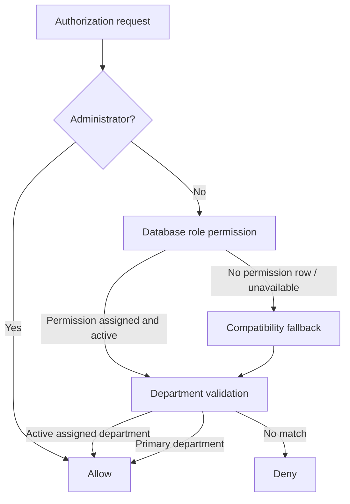

# Permission Matrix

This document is the authorization reference for the current implementation. The broader authorization architecture is documented in [SYSTEM_ARCHITECTURE.md](SYSTEM_ARCHITECTURE.md).

## Authorization Overview

`PermissionService` is the central authorization service. Existing controllers and services continue to call its public methods. Authorization is evaluated in this order:

Database permissions are checked first for known permission keys. If the permission catalogue cannot be read or the permission key does not exist, the existing hardcoded compatibility rules are used. If a known database permission exists but is not assigned to a role, the database result is authoritative and denies access.

## Roles

Current roles in the database:

| Role | Current status | Intended responsibility |
|---|---|---|
| System Administrator | Implemented | Full administrative access through explicit override. |
| Receptionist | Implemented | Patient and encounter registration, reception workflow. |
| Records Officer | Implemented | Records-oriented access; detailed records module implemented separately. |
| Doctor | Implemented | Doctor assignment, Consultation, clinical requests, prescriptions, and clinical view access. |
| Nurse | Implemented | Nursing assessments, Vital Signs, and clinical view access. |
| Laboratory Scientist | Implemented | Laboratory request/result worklist and CRUD. |
| Pharmacist | Implemented | Pharmacy prescription worklist, direct prescriptions, and dispensing. |
| Physiotherapist | Implemented | Physiotherapy records, sessions, and direct/clinical workflows. |
| Radiographer | Implemented | Radiology request/report workflow. |
| Theatre Staff | Implemented | Theatre workflow. |
| Accountant | Implemented | Price catalogue and Billing / Patient Accounts. |
| Store Officer | Implemented | Store inventory item catalogue, stock movements, ledger, and department balances. |

Role activation/deactivation is implemented through `RoleService`. Role inheritance is not implemented.

## Permission Catalogue

| Permission key | Module | Current state |
|---|---|---|
| `view_encounter` | Visits | Implemented |
| `create_encounter` | Visits | Implemented |
| `transfer_encounter` | Visits | Implemented |
| `receive_encounter` | Visits | Implemented |
| `assign_doctor` | Visits | Implemented |
| `change_encounter_status` | Visits | Implemented |
| `reopen_encounter` | Visits | Implemented |
| `edit_encounter` | Visits | Implemented |
| `manage_users` | Administration | Implemented for administrator override; role assignment available |
| `manage_roles` | Administration | Implemented for administrator override; role assignment available |
| `manage_permissions` | Administration | Implemented for administrator override; role assignment available |
| `manage_settings` | Administration | Implemented for administrator override; role assignment available |

Most current clinical, financial, inventory, and reporting permissions are now
database-backed. Future permissions should be added only when a new workflow
requires a distinct authorization decision.

## Current Permission Matrix

The migration seeds the common encounter permissions for non-administrator roles and gives `Receptionist` and `Nurse` encounter creation permission. `Doctor` has doctor-assignment permission. The administrator is not dependent on role-permission rows because of the explicit override. Encounter creation may place the patient into the selected active department queue, but that does not grant the creating user broad access to browse that department's full worklist.

| Role | View | Create | Transfer | Receive | Assign doctor | Status | Edit | Manage users | Manage roles | Manage permissions | Manage settings |
|---|---:|---:|---:|---:|---:|---:|---:|---:|---:|---:|---:|
| System Administrator | Yes | Yes | Yes | Yes | Yes | Yes | Yes | Yes | Yes | Yes | Yes |
| Receptionist | Yes | Yes | Yes | Yes | No | Yes | Yes | No | No | No | No |
| Records Officer | Yes | No | Yes | Yes | No | Yes | Yes | No | No | No | No |
| Doctor | Yes | No | Yes | Yes | Yes | Yes | Yes | No | No | No | No |
| Nurse | Yes | Yes | Yes | Yes | No | Yes | Yes | No | No | No | No |
| Laboratory Scientist | Yes | No | Yes | Yes | No | Yes | Yes | No | No | No | No |
| Pharmacist | Yes | No | Yes | Yes | No | Yes | Yes | No | No | No | No |
| Physiotherapist | Yes | No | Yes | Yes | No | Yes | Yes | No | No | No | No |
| Radiographer | Yes | No | Yes | Yes | No | Yes | Yes | No | No | No | No |
| Theatre Staff | Yes | No | Yes | Yes | No | Yes | Yes | No | No | No | No |
| Accountant | Yes | No | Yes | Yes | No | Yes | Yes | No | No | No | No |
| Store Officer | Yes | No | Yes | Yes | No | Yes | Yes | No | No | No | No |

The matrix describes current seeded behavior, not a final clinical permission model. Future modules will narrow permissions to their specific department operations.

## Sidebar Visibility Policy

Sidebar destinations are permission-driven, but department-wide module links
also respect ownership. Patient-specific cross-view permissions may allow a
user to see another department's record inside the Encounter Workspace, but
that does not automatically expose the other department's full sidebar
worklist. The application does not maintain a separate sidebar-customization
table.

| Sidebar destination | Visibility rule |
|---|---|
| Patients / Encounters | Authenticated user; encounter actions still require their own permissions |
| Department Worklist | Authenticated user with active department context |
| Medical Records | `view_medical_record` plus Records ownership; Administrator override |
| Laboratory | `view_laboratory` plus Laboratory department ownership; Administrator override |
| Radiology | `view_radiology` plus X-Ray/Radiology department ownership; Administrator override |
| Physiotherapy | `view_physiotherapy` plus Physiotherapy department ownership; Administrator override |
| Theatre | `view_theatre` plus Theatre department ownership; Administrator override |
| Accounts | `view_billable_items` plus Accounts ownership; Administrator override |
| Store | `view_inventory` plus Store ownership; Administrator override |
| Admissions | `view_admissions` plus Reception/Records/Doctor/Nursing ownership; Administrator override |
| Pharmacy | `view_pharmacy` plus Pharmacy ownership; Administrator override |
| Billing | `view_billing` plus Accounts ownership; Administrator override |
| Reports | Report permission plus Accounts, Store, or Records ownership depending on report type; Administrator override |
| Administration | System Administrator only |

This keeps patient-specific clinical context useful without giving every
clinical user every department's full worklist. Page-level permission checks
remain authoritative even when a sidebar link is visible.

## Module Permission Requirements

| Module/action | Required authorization | Status |
|---|---|---|
| Administration user management | `manage_users` / administrator | Implemented |
| Role management | `manage_roles` / administrator | Implemented |
| Permission matrix | `manage_permissions` / administrator | Implemented |
| Department management | administrator route guard | Implemented |
| System settings | `manage_settings` / administrator | Implemented |
| User department assignment | administrator route guard | Implemented |
| Active department switching | active assigned membership | Implemented |
| Patient registration | Reception workflow and existing route validation | Implemented |
| Encounter creation | `create_encounter` | Implemented |
| Encounter workspace | `view_encounter` plus department/lifecycle validation | Implemented |
| Transfer | `transfer_encounter` plus current department | Implemented |
| Receive | `receive_encounter` plus destination department and pending transfer | Implemented |
| Doctor assignment | `assign_doctor` plus Doctor department, receipt, and active state | Implemented |
| Queue operations | Queue service permission and lifecycle checks | Partially implemented |
| Consultation | Doctor/Admin CRUD permissions and active encounter lock | Implemented |
| Nursing | Nursing-specific clinical permission | Implemented |
| Laboratory | Laboratory request/result permissions | Implemented |
| Radiology | Radiology-specific permission | Implemented |
| Pharmacy | Prescription and dispensing permissions | Implemented |
| Billing | Charge, invoice, payment, receipt permissions | Implemented |
| Reporting | Reporting permissions and data scopes | Implemented |

## Department Authorization

For non-administrators, department authorization uses:

1. the active department stored in session, if it is an active membership;
2. the user's active department membership;
3. `users.department_id` as the backward-compatible primary department;
4. the existing compatibility logic when the new membership data is unavailable.

Changing a department's metadata does not change historical encounter ownership. Deactivating a department prevents new user assignments and prevents active authorization through that department, while preserving historical records.

## Permission Administration

Implemented administration pages provide:

- permission listing;
- permission creation and editing;
- role listing and editing;
- role permission matrix;
- bulk assignment and removal;
- duplicate assignment prevention through a database unique constraint.

All permission and matrix writes use transactions and audit events:

- `PERMISSION_CREATED`
- `PERMISSION_UPDATED`
- `PERMISSION_ASSIGNED`
- `PERMISSION_REMOVED`
- `ROLE_PERMISSION_UPDATED`

## Remaining Future Permissions

Current Phase 2 through Phase 4.5 permissions are implemented for the practical
CRUD-first workflow. Remaining future permission groups may include admission
and ward management, advanced medication administration, refunds/reversals,
insurance/HMO, report export governance, break-glass access, advanced security
operations, and external integration administration. These should not be added
until their workflows are implemented.

## Medical Records Foundation Permissions

| Permission | Status | Seeded roles |
|---|---|---|
| `view_medical_record` | Implemented | Reception, Records, Doctor, Nurse, Laboratory, Pharmacy, Physiotherapy, Radiology, Theatre; treatment scope applies outside Records/Reception |
| `edit_patient_demographics` | Implemented | Receptionist, Records Officer |
| `view_patient_audit_history` | Implemented | Records Officer |

Administrators retain the existing override. Chart authorization then requires
the database permission and either Records/Reception scope or an active
treatment relationship through the current encounter department or assigned
doctor. Patient audit history remains more restrictive than general chart view.

## Radiology Permissions

| Permission | Status | Seeded roles |
|---|---|---|
| `view_radiology` | Implemented | Records Officer plus clinical roles: Doctor, Nurse, Laboratory Scientist, Radiographer, Physiotherapist, Theatre Staff, Pharmacist |
| `create_radiology_request` | Implemented | Doctor, Radiographer |
| `process_radiology_request` | Implemented | Radiographer |
| `enter_radiology_report` | Implemented | Radiographer |
| `edit_radiology_report` | Implemented | Radiographer |
| `complete_radiology_request` | Implemented | Radiographer |

## Physiotherapy Permissions

| Permission | Status | Seeded roles |
|---|---|---|
| `view_physiotherapy` | Implemented | Records Officer plus clinical roles: Doctor, Nurse, Laboratory Scientist, Radiographer, Physiotherapist, Theatre Staff, Pharmacist |
| `create_physiotherapy` | Implemented | Doctor, Physiotherapist |
| `edit_physiotherapy` | Implemented | Physiotherapist |
| `manage_physiotherapy_sessions` | Implemented | Physiotherapist |
| `complete_physiotherapy` | Implemented | Physiotherapist |

## Theatre Permissions

| Permission | Status | Seeded roles |
|---|---|---|
| `view_theatre` | Implemented | Records Officer plus clinical roles: Doctor, Nurse, Laboratory Scientist, Radiographer, Physiotherapist, Theatre Staff, Pharmacist |
| `create_theatre` | Implemented | Doctor, Theatre Staff |
| `edit_theatre` | Implemented | Doctor, Theatre Staff |
| `complete_theatre` | Implemented | Doctor, Theatre Staff |

Radiology permissions are encounter-scoped and respect active-encounter
locking. Direct requests are limited to Radiographer or Administrator users,
while clinical requests remain Doctor-initiated through the encounter context.

## MPI and Identifier Permissions

| Permission | Administrator | Records Officer | Receptionist | Doctor/Nurse | Status |
|---|---:|---:|---:|---:|---|
| `manage_patient_identifiers` | Override | Yes | Yes | No | Implemented |
| `view_duplicate_candidates` | Override | Yes | Yes | No | Implemented |
| `review_duplicate_candidates` | Override | Yes | No | No | Implemented |

The retained `view_patient_identifiers` and
`verify_patient_identifiers` permissions from Migration 014 remain active
compatibility contracts. Viewing also requires Medical Records/treatment
scope. POST routes enforce server-side permission and CSRF checks. No
permission in this milestone authorizes patient merging.

## Clinical Safety Permissions

| Permission | Administrator | Records | Reception | Doctor | Nurse | Diagnostic/Pharmacy | Accounts/Store |
|---|---:|---:|---:|---:|---:|---:|---:|
| `view_clinical_safety` | Override | Yes | Basic/banner | Yes | Yes | Basic/banner when scoped | No |
| `record_allergies` | Override | No | No | Yes | Yes | No | No |
| `update_allergies` | Override | No | No | Yes | Yes | No | No |
| `verify_allergies` | Override | No | No | Yes | Policy-controlled; default No | No | No |
| `resolve_allergies` | Override | No | No | Yes | No | No | No |
| `manage_clinical_alerts` | Override | No | No | Yes | Yes | No | No |
| `view_confidential_alerts` | Override | No | No | Yes | No | No | No |
| `view_clinical_safety_history` | Override | Yes | No | Yes | Yes | No | No |

Non-administrator grants additionally require Patient Chart/treatment scope and
active-department authorization. Nurse verification is denied unless
`clinical_safety.nurse_may_verify_allergies` is enabled. Restricted alert
mutation/history routes require the confidential permission. Denials return
HTTP 403 and are audited as `CLINICAL_SAFETY_ACCESS_DENIED`.

### Milestone 2.3.1 authorization clarification

`view_confidential_alerts` is evaluated inside user-aware service queries, not
only in controllers. Alert history evaluates each stored version. Administrator
override grants access but does not bypass the default prohibition on verifying
one's own allergy entry. `resolve_allergies` also governs deactivate/reactivate
transitions. `Accountant` is the canonical seeded role name; `Accounts` remains
an identifier-authorization compatibility alias only.

## Phase 2.4 permissions

| Permission | Administrator | Doctor | Nurse | Records Officer | Other clinical roles |
|---|---:|---:|---:|---:|---:|
| `view_problem_list` | Yes | Yes, treatment relationship | Yes, treatment relationship | Yes | Yes, treatment relationship where seeded |
| `manage_problem_list` | Yes | Yes | No by default; requires setting and explicit permission | No | No |
| `verify_problem_list` | Yes, separation policy still applies in service | Yes | No | No | No |
| `resolve_problem_list` | Yes | Yes | No | No | No |
| `view_medical_history` | Yes | Yes | Yes | Yes | Yes where seeded |
| `manage_medical_history` | Yes | Yes | Yes where permission is assigned | No | No |
| `verify_medical_history` | Yes, separation policy still applies | Yes | No | No | No |
| `view_confidential_medical_history` | Yes, audited | Yes, audited | No by default | No by default | No |
| `view_problem_history` | Yes | Yes | Yes | Yes | No by default |

Administrator override does not remove stale-version, lifecycle, patient/visit,
or self-verification controls. Non-administrators also require Patient Chart
access and the existing treatment/department relationship.

## Phase 2.5 Medical Document permissions

| Permission | Administrator | Records Officer | Doctor | Nurse | Reception | Other clinical | Accounts | Store |
|---|---:|---:|---:|---:|---:|---:|---:|---:|
| `view_medical_documents` | Yes | Yes | Treatment scope | Treatment scope | Yes | Treatment scope | Authorized scope | No |
| `upload_medical_documents` | Yes | Yes | Yes | Yes | Limited types | Encounter-relevant | Insurance/correspondence | No |
| `replace_medical_documents` | Yes | Yes | Yes | No | No | No | No | No |
| `archive_medical_documents` | Yes | Yes | No | No | No | No | No | No |
| `download_medical_documents` | Yes | Yes | Yes | Yes | Restricted scope | Encounter-relevant | Authorized scope | No |
| `view_confidential_documents` | Yes, audited | Yes, audited | Yes, audited | No | No | No by default | No | No |
| `view_document_history` | Yes | Yes | Yes | No | No | No | No | No |

All grants still require service-level patient scope. Encounter-linked access
also validates visit ownership and encounter access; Records Officers retain
their explicit records-management boundary. Confidential metadata is masked
unless `view_confidential_documents` succeeds. Authorization is rechecked
immediately before access audit and stream creation.

## Clinical Notes permissions — implemented

| Permission | Administrator | Records Officer | Doctor | Nurse | Others |
|---|---:|---:|---:|---:|---:|
| `view_clinical_notes` | Yes | Yes | Relationship | Relationship | No default |
| `create_patient_notes` / `create_encounter_notes` | Yes | Restricted types | Yes | Yes | No |
| `edit_own_note_drafts` | Yes | Yes | Yes | Yes | No |
| `edit_any_note_draft` | Yes | Yes | No | No | No |
| `sign_clinical_notes` | **No signer override** | No | Yes | No | No |
| `amend_signed_notes` | Yes | Yes | Yes | No | No |
| `approve_note_amendments` | Yes | Yes | No | No | No |
| `mark_note_entered_in_error` | Yes | Yes | Yes | No | No |
| `view_confidential_notes` | Yes/audited | Yes | Yes | No | No |
| `view_note_history` | Yes | Yes | Yes | Yes | No |

Administrator oversight does not create clinical signing authority. Patient,
treatment-relationship, department, visit, draft-owner, and per-version
confidentiality checks remain additive to permission keys.

## Phase 3.1 Consultation permissions

| Permission | Administrator | Doctor | Nurse | Laboratory | Radiology/X-Ray | Pharmacy | Other clinical roles | Other roles |
|---|---:|---:|---:|---:|---:|---:|---:|---:|
| `view_consultation` | Yes | Yes | Yes | Yes | Yes | Yes | Yes | No default |
| `create_consultation` | Active encounters only | Active assigned/accessible encounters | No | No | No | No | No | No |
| `edit_consultation` | Draft + active encounters only | Draft + active assigned/accessible encounters | No | No | No | No | No | No |
| `complete_consultation` | Draft + active encounters only | Draft + active assigned/accessible encounters | No | No | No | No | No | No |

Administrator actions are actor-attributed but do not replace the assigned
clinical doctor. Completed and cancelled encounters are read-only for normal
Consultation mutations.

Department notifications use encounter and active-department access rather than
a new permission key in Phase 3.1. Sending requires access to the encounter;
read/resolve requires access to the destination department. Administrator
override remains available for development/testing.

## Phase 3.2 Vital Signs permissions

| Permission | Administrator | Doctor | Nurse | Laboratory | Radiology/X-Ray | Pharmacy | Other clinical roles | Records Officer | Other roles |
|---|---:|---:|---:|---:|---:|---:|---:|---:|---:|
| `view_vital_signs` | Yes | Yes | Yes | Yes | Yes | Yes | Yes | Yes | No default |
| `create_vital_signs` | Yes | Yes | Yes | No | No | No | No | No default | No default |
| `edit_vital_signs` | Yes | Yes | Yes | No | No | No | No | No default | No default |

All three permissions still require an accessible encounter for mutation.
Completed/cancelled encounters remain read-only. The Encounter Workspace and
Patient Chart only show the Vital Signs tab when `view_vital_signs` resolves
true for the current patient context. Administrator override remains active,
but the service still validates encounter status and patient/visit matching.

## Phase 3.4 Laboratory permissions

| Permission | Administrator | Laboratory Scientist | Doctor | Nurse | Radiology/X-Ray | Pharmacy | Other clinical roles | Other roles |
|---|---:|---:|---:|---:|---:|---:|---:|---:|
| `view_laboratory` | Yes | Yes | Yes | Yes | Yes | Yes | Yes | No default |
| `create_laboratory_request` | Yes | Direct requests | Clinical requests | No | No | No | No | No |
| `process_laboratory_request` | Yes | Yes | No | No | No | No | No | No |
| `enter_laboratory_result` | Yes | Yes | No | No | No | No | No | No |
| `edit_laboratory_result` | Yes | Yes | No | No | No | No | No | No |
| `complete_laboratory_request` | Yes | Yes | No | No | No | No | No | No |

Laboratory requests remain encounter-linked. Direct Laboratory patients do not
require a Consultation or Doctor assignment. Laboratory notifications request
attention only and do not transfer encounter ownership.

## Phase 4.1 Accounts / Price Catalogue permissions

| Permission | Administrator | Accountant | Doctor | Nurse | Laboratory | Radiology | Physiotherapy | Theatre | Pharmacy | Store | Other |
|---|---:|---:|---:|---:|---:|---:|---:|---:|---:|---:|---:|
| `view_billable_items` | Yes | Yes | Yes | Yes | Yes | Yes | Yes | Yes | Yes | Yes | No default |
| `create_billable_items` | Yes | Yes | No | No | No | No | No | No | No | No | No |
| `edit_billable_items` | Yes | Yes | No | No | No | No | No | No | No | No | No |
| `manage_billable_item_status` | Yes | Yes | No | No | No | No | No | No | No | No | No |

Accounts is a standalone sidebar destination. The module is not an Encounter
Workspace tab, and it does not create patient charges, invoices, payments, or
receipts.

## Phase 4.2 Store / Inventory permissions

| Permission | Administrator | Store Officer | Accountant | Doctor | Nurse | Laboratory | Radiology | Physiotherapy | Theatre | Pharmacy | Reception | Records | Other |
|---|---:|---:|---:|---:|---:|---:|---:|---:|---:|---:|---:|---:|---:|
| `view_inventory` | Yes | Yes | Yes | Yes | Yes | Yes | Yes | Yes | Yes | Yes | Yes | Yes | No default |
| `manage_inventory_items` | Yes | Yes | No | No | No | No | No | No | No | No | No | No | No |
| `receive_stock` | Yes | Yes | No | No | No | No | No | No | No | No | No | No | No |
| `issue_stock` | Yes | Yes | No | No | No | No | No | No | No | No | No | No | No |
| `return_stock` | Yes | Yes | No | No | No | No | No | No | No | No | No | No | No |
| `adjust_stock` | Yes | Yes | No | No | No | No | No | No | No | No | No | No | No |
| `view_stock_ledger` | Yes | Yes | Yes | No | No | No | No | No | No | No | No | No | No |
| `view_external_sales` | Yes | Yes | Yes | No | No | No | No | No | No | No | No | No | No |
| `create_external_sale` | Yes | Yes | No | No | No | No | No | No | No | No | No | No | No |
| `cancel_external_sale` | Yes | Yes | No | No | No | No | No | No | No | No | No | No | No |
| `view_external_sale_receipts` | Yes | Yes | Yes | No | No | No | No | No | No | No | No | No | No |

Store is a standalone sidebar module. It is not an Encounter Workspace tab.
Store owns stock movements, department balances, inventory item catalogue, and
external non-patient sales receipts. It does not own patient pricing,
dispensing, patient charges, invoices, or patient Billing receipts.

## Phase 4.3 Pharmacy permissions

| Permission | Administrator | Pharmacist | Doctor | Nurse | Laboratory | Radiology/X-Ray | Other clinical roles | Other roles |
|---|---:|---:|---:|---:|---:|---:|---:|---:|
| `view_pharmacy` | Yes | Yes | Yes | Yes | Yes | Yes | Yes | No default |
| `create_prescription` | Yes | Direct prescriptions | Clinical prescriptions | No | No | No | No | No |
| `edit_prescription` | Yes | Direct prescriptions before dispensing | Clinical prescriptions before dispensing | No | No | No | No | No |
| `dispense_prescription` | Yes | Yes | No | No | No | No | No | No |

Pharmacy owns prescriptions and dispensing only. Dispensing reduces Pharmacy
department stock through Store inventory logic and does not create patient
charges directly. Accounts remains the price owner.

## Phase 4.4 Billing permissions

| Permission | Administrator | Accountant | Reception | Clinical roles | Other |
|---|---:|---:|---:|---:|---:|
| `view_billing` | Yes | Yes | Limited/basic when granted | View only when granted | No default |
| `create_patient_charge` | Yes | Yes | No default | No default | No |
| `cancel_patient_charge` | Yes | Yes | No | No | No |
| `create_invoice` | Yes | Yes | No default | No | No |
| `record_payment` | Yes | Yes | No default | No | No |
| `view_receipts` | Yes | Yes | No default | No default | No |

Billing owns patient charges, invoices, payments, and receipt views. Financial
totals are derived from posted charges and payments and cannot be manually
edited. Billing can remain mutable after clinical encounter completion for
settlement purposes.

## Encounter cancellation permissions

Only Receptionist, Records Officer, Doctor, and System Administrator may cancel
an encounter through the exposed workspace action. Cancellation is no longer a
transfer type; transfer remains department handoff only.

## Encounter reopen permissions

Reopen is a controlled lifecycle correction, not ordinary department CRUD.
Only completed encounters can be reopened; cancelled encounters remain closed.
A reopen reason is required, and the action writes audit and encounter timeline
records.

Default access:

- System Administrator: full override.
- Records Officer: may reopen completed encounters for record correction.
- Doctor: may reopen only when granted `reopen_encounter` and assigned as the
  encounter's attending doctor.
- Receptionist, Nurse, Laboratory, Radiology, Pharmacy, Store, Accounts, and
  other roles: no default reopen access.

Reopening returns the encounter to its current department status and queue.
Clinical records, discharge text, financial records, charges, invoices, and
payments are not reversed or deleted automatically.

## Phase 4.5 Basic Dashboards / Reports permissions

| Permission | Administrator | Accounts | Store Officer | Clinical Roles |
| --- | --- | --- | --- | --- |
| `view_reports` | Full | Yes | Yes | Yes, where granted |
| `view_financial_reports` | Full | Yes | No | No |
| `view_inventory_reports` | Full | No | Yes | No |
| `view_clinical_reports` | Full | No | No | Yes, aggregate only |

Reports are read-only. Financial reports use Billing records. Inventory
reports use Store stock tables. Clinical reports show counts only and do not
display clinical narratives, note text, laboratory result text, or radiology
report text.

## Inpatient Admissions permissions

| Permission | Administrator | Receptionist | Records Officer | Doctor | Nurse | Other |
| --- | ---: | ---: | ---: | ---: | ---: | ---: |
| `view_admissions` | Yes | Yes | Yes | Yes | Yes | No default |
| `create_admission` | Yes | Yes | Yes | Yes | Yes | No default |
| `transfer_admission` | Yes | No | Yes | No default | Yes | No default |
| `discharge_admission` | Yes | No default | Yes | Yes when granted | Yes | No default |
| `manage_wards_beds` | Yes | No | Yes | No | Yes | No default |

Admissions manage inpatient ward and bed occupancy for an existing encounter.
They do not replace encounter completion/discharge documentation.
