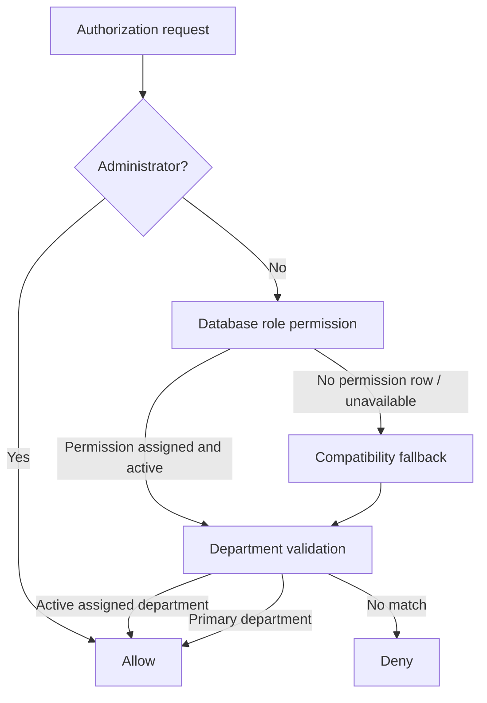

# Permission Matrix

This document is the authorization reference for the current implementation. The broader authorization architecture is documented in [SYSTEM_ARCHITECTURE.md](SYSTEM_ARCHITECTURE.md).

## Authorization Overview

`PermissionService` is the central authorization service. Existing controllers and services continue to call its public methods. Authorization is evaluated in this order:

Database permissions are checked first for known permission keys. If the permission catalogue cannot be read or the permission key does not exist, the existing hardcoded compatibility rules are used. If a known database permission exists but is not assigned to a role, the database result is authoritative and denies access.

## Roles

Current roles in the database:

| Role | Current status | Intended responsibility |
|---|---|---|
| System Administrator | Implemented | Full administrative access through explicit override. |
| Receptionist | Implemented | Patient and encounter registration, reception workflow. |
| Records Officer | Implemented | Records-oriented access; detailed records module planned. |
| Doctor | Implemented | Doctor assignment and future clinical work. |
| Nurse | Implemented | Future nursing work. |
| Laboratory Scientist | Implemented | Future laboratory work. |
| Pharmacist | Implemented | Future pharmacy work. |
| Physiotherapist | Implemented | Future physiotherapy work. |
| Radiographer | Implemented | Future radiology work. |
| Theatre Staff | Implemented | Future theatre work. |
| Accountant | Implemented | Future billing and payment work. |
| Store Officer | Implemented | Future store/inventory work. |

Role activation/deactivation is implemented through `RoleService`. Role inheritance is not implemented.

## Permission Catalogue

| Permission key | Module | Current state |
|---|---|---|
| `view_encounter` | Visits | Implemented |
| `create_encounter` | Visits | Implemented |
| `transfer_encounter` | Visits | Implemented |
| `receive_encounter` | Visits | Implemented |
| `assign_doctor` | Visits | Implemented |
| `change_encounter_status` | Visits | Implemented |
| `edit_encounter` | Visits | Implemented |
| `manage_users` | Administration | Implemented for administrator override; role assignment available |
| `manage_roles` | Administration | Implemented for administrator override; role assignment available |
| `manage_permissions` | Administration | Implemented for administrator override; role assignment available |
| `manage_settings` | Administration | Implemented for administrator override; role assignment available |

Future permissions will be added for consultation, nursing, laboratory, radiology, pharmacy, billing, records, inventory, reporting, specialized dashboards, and granular security administration.

## Current Permission Matrix

The migration seeds the common encounter permissions for non-administrator roles and gives `Receptionist` encounter creation and `Doctor` doctor-assignment permission. The administrator is not dependent on role-permission rows because of the explicit override.

| Role | View | Create | Transfer | Receive | Assign doctor | Status | Edit | Manage users | Manage roles | Manage permissions | Manage settings |
|---|---:|---:|---:|---:|---:|---:|---:|---:|---:|---:|---:|
| System Administrator | Yes | Yes | Yes | Yes | Yes | Yes | Yes | Yes | Yes | Yes | Yes |
| Receptionist | Yes | Yes | Yes | Yes | No | Yes | Yes | No | No | No | No |
| Records Officer | Yes | No | Yes | Yes | No | Yes | Yes | No | No | No | No |
| Doctor | Yes | No | Yes | Yes | Yes | Yes | Yes | No | No | No | No |
| Nurse | Yes | No | Yes | Yes | No | Yes | Yes | No | No | No | No |
| Laboratory Scientist | Yes | No | Yes | Yes | No | Yes | Yes | No | No | No | No |
| Pharmacist | Yes | No | Yes | Yes | No | Yes | Yes | No | No | No | No |
| Physiotherapist | Yes | No | Yes | Yes | No | Yes | Yes | No | No | No | No |
| Radiographer | Yes | No | Yes | Yes | No | Yes | Yes | No | No | No | No |
| Theatre Staff | Yes | No | Yes | Yes | No | Yes | Yes | No | No | No | No |
| Accountant | Yes | No | Yes | Yes | No | Yes | Yes | No | No | No | No |
| Store Officer | Yes | No | Yes | Yes | No | Yes | Yes | No | No | No | No |

The matrix describes current seeded behavior, not a final clinical permission model. Future modules will narrow permissions to their specific department operations.

## Module Permission Requirements

| Module/action | Required authorization | Status |
|---|---|---|
| Administration user management | `manage_users` / administrator | Implemented |
| Role management | `manage_roles` / administrator | Implemented |
| Permission matrix | `manage_permissions` / administrator | Implemented |
| Department management | administrator route guard | Implemented |
| System settings | `manage_settings` / administrator | Implemented |
| User department assignment | administrator route guard | Implemented |
| Active department switching | active assigned membership | Implemented |
| Patient registration | Reception workflow and existing route validation | Implemented |
| Encounter creation | `create_encounter` | Implemented |
| Encounter workspace | `view_encounter` plus department/lifecycle validation | Implemented |
| Transfer | `transfer_encounter` plus current department | Implemented |
| Receive | `receive_encounter` plus destination department and pending transfer | Implemented |
| Doctor assignment | `assign_doctor` plus Doctor department, receipt, and active state | Implemented |
| Queue operations | Queue service permission and lifecycle checks | Partially implemented |
| Consultation | Doctor-specific clinical permission | Planned |
| Nursing | Nursing-specific clinical permission | Planned |
| Laboratory | Laboratory-specific permission | Planned |
| Radiology | Radiology-specific permission | Planned |
| Pharmacy | Pharmacy-specific permission | Planned |
| Billing | Billing-specific permission | Planned |
| Reporting | Reporting permissions and data scopes | Planned |

## Department Authorization

For non-administrators, department authorization uses:

1. the active department stored in session, if it is an active membership;
2. the user's active department membership;
3. `users.department_id` as the backward-compatible primary department;
4. the existing compatibility logic when the new membership data is unavailable.

Changing a department's metadata does not change historical encounter ownership. Deactivating a department prevents new user assignments and prevents active authorization through that department, while preserving historical records.

## Permission Administration

Implemented administration pages provide:

- permission listing;
- permission creation and editing;
- role listing and editing;
- role permission matrix;
- bulk assignment and removal;
- duplicate assignment prevention through a database unique constraint.

All permission and matrix writes use transactions and audit events:

- `PERMISSION_CREATED`
- `PERMISSION_UPDATED`
- `PERMISSION_ASSIGNED`
- `PERMISSION_REMOVED`
- `ROLE_PERMISSION_UPDATED`

## Future Permissions

Planned permission groups include:

- consultation: start, edit, diagnose, complete;
- nursing: record vitals, assessments, medication administration;
- laboratory: request, receive, collect, process, release results;
- radiology: request, perform, report, approve;
- pharmacy: verify, dispense, reverse dispense;
- billing: create invoice, receive payment, void payment;
- records: manage documents and release records;
- inventory: receive stock, issue stock, adjust stock;
- reporting: view operational, financial, clinical, and audit reports;
- security: view sessions, lockouts, failed logins, and audit logs.

These are planned and are not currently authorization keys in the database.

## Medical Records Foundation Permissions

| Permission | Status | Seeded roles |
|---|---|---|
| `view_medical_record` | Implemented | Reception, Records, Doctor, Nurse, Laboratory, Pharmacy, Physiotherapy, Radiology, Theatre; treatment scope applies outside Records/Reception |
| `edit_patient_demographics` | Implemented | Receptionist, Records Officer |
| `view_patient_audit_history` | Implemented | Records Officer |

Administrators retain the existing override. Chart authorization then requires
the database permission and either Records/Reception scope or an active
treatment relationship through the current encounter department or assigned
doctor. Patient audit history remains more restrictive than general chart view.

## MPI and Identifier Permissions

| Permission | Administrator | Records Officer | Receptionist | Doctor/Nurse | Status |
|---|---:|---:|---:|---:|---|
| `manage_patient_identifiers` | Override | Yes | Yes | No | Implemented |
| `view_duplicate_candidates` | Override | Yes | Yes | No | Implemented |
| `review_duplicate_candidates` | Override | Yes | No | No | Implemented |

The retained `view_patient_identifiers` and
`verify_patient_identifiers` permissions from Migration 014 remain active
compatibility contracts. Viewing also requires Medical Records/treatment
scope. POST routes enforce server-side permission and CSRF checks. No
permission in this milestone authorizes patient merging.

## Clinical Safety Permissions

| Permission | Administrator | Records | Reception | Doctor | Nurse | Diagnostic/Pharmacy | Accounts/Store |
|---|---:|---:|---:|---:|---:|---:|---:|
| `view_clinical_safety` | Override | Yes | Basic/banner | Yes | Yes | Basic/banner when scoped | No |
| `record_allergies` | Override | No | No | Yes | Yes | No | No |
| `update_allergies` | Override | No | No | Yes | Yes | No | No |
| `verify_allergies` | Override | No | No | Yes | Policy-controlled; default No | No | No |
| `resolve_allergies` | Override | No | No | Yes | No | No | No |
| `manage_clinical_alerts` | Override | No | No | Yes | Yes | No | No |
| `view_confidential_alerts` | Override | No | No | Yes | No | No | No |
| `view_clinical_safety_history` | Override | Yes | No | Yes | Yes | No | No |

Non-administrator grants additionally require Patient Chart/treatment scope and
active-department authorization. Nurse verification is denied unless
`clinical_safety.nurse_may_verify_allergies` is enabled. Restricted alert
mutation/history routes require the confidential permission. Denials return
HTTP 403 and are audited as `CLINICAL_SAFETY_ACCESS_DENIED`.

### Milestone 2.3.1 authorization clarification

`view_confidential_alerts` is evaluated inside user-aware service queries, not
only in controllers. Alert history evaluates each stored version. Administrator
override grants access but does not bypass the default prohibition on verifying
one's own allergy entry. `resolve_allergies` also governs deactivate/reactivate
transitions. `Accountant` is the canonical seeded role name; `Accounts` remains
an identifier-authorization compatibility alias only.

## Phase 2.4 permissions

| Permission | Administrator | Doctor | Nurse | Records Officer | Other clinical roles |
|---|---:|---:|---:|---:|---:|
| `view_problem_list` | Yes | Yes, treatment relationship | Yes, treatment relationship | Yes | Yes, treatment relationship where seeded |
| `manage_problem_list` | Yes | Yes | No by default; requires setting and explicit permission | No | No |
| `verify_problem_list` | Yes, separation policy still applies in service | Yes | No | No | No |
| `resolve_problem_list` | Yes | Yes | No | No | No |
| `view_medical_history` | Yes | Yes | Yes | Yes | Yes where seeded |
| `manage_medical_history` | Yes | Yes | Yes where permission is assigned | No | No |
| `verify_medical_history` | Yes, separation policy still applies | Yes | No | No | No |
| `view_confidential_medical_history` | Yes, audited | Yes, audited | No by default | No by default | No |
| `view_problem_history` | Yes | Yes | Yes | Yes | No by default |

Administrator override does not remove stale-version, lifecycle, patient/visit,
or self-verification controls. Non-administrators also require Patient Chart
access and the existing treatment/department relationship.

## Phase 2.5 Medical Document permissions

| Permission | Administrator | Records Officer | Doctor | Nurse | Reception | Other clinical | Accounts | Store |
|---|---:|---:|---:|---:|---:|---:|---:|---:|
| `view_medical_documents` | Yes | Yes | Treatment scope | Treatment scope | Yes | Treatment scope | Authorized scope | No |
| `upload_medical_documents` | Yes | Yes | Yes | Yes | Limited types | Encounter-relevant | Insurance/correspondence | No |
| `replace_medical_documents` | Yes | Yes | Yes | No | No | No | No | No |
| `archive_medical_documents` | Yes | Yes | No | No | No | No | No | No |
| `download_medical_documents` | Yes | Yes | Yes | Yes | Restricted scope | Encounter-relevant | Authorized scope | No |
| `view_confidential_documents` | Yes, audited | Yes, audited | Yes, audited | No | No | No by default | No | No |
| `view_document_history` | Yes | Yes | Yes | No | No | No | No | No |

All grants still require service-level patient scope. Encounter-linked access
also validates visit ownership and encounter access; Records Officers retain
their explicit records-management boundary. Confidential metadata is masked
unless `view_confidential_documents` succeeds. Authorization is rechecked
immediately before access audit and stream creation.

## Clinical Notes permissions — implemented

| Permission | Administrator | Records Officer | Doctor | Nurse | Others |
|---|---:|---:|---:|---:|---:|
| `view_clinical_notes` | Yes | Yes | Relationship | Relationship | No default |
| `create_patient_notes` / `create_encounter_notes` | Yes | Restricted types | Yes | Yes | No |
| `edit_own_note_drafts` | Yes | Yes | Yes | Yes | No |
| `edit_any_note_draft` | Yes | Yes | No | No | No |
| `sign_clinical_notes` | **No signer override** | No | Yes | No | No |
| `amend_signed_notes` | Yes | Yes | Yes | No | No |
| `approve_note_amendments` | Yes | Yes | No | No | No |
| `mark_note_entered_in_error` | Yes | Yes | Yes | No | No |
| `view_confidential_notes` | Yes/audited | Yes | Yes | No | No |
| `view_note_history` | Yes | Yes | Yes | Yes | No |

Administrator oversight does not create clinical signing authority. Patient,
treatment-relationship, department, visit, draft-owner, and per-version
confidentiality checks remain additive to permission keys.

## Phase 3.1 Consultation permissions

| Permission | Administrator | Doctor | Other roles |
|---|---:|---:|---:|
| `view_consultation` | Yes | Yes | No by default |
| `create_consultation` | Active encounters only | Active assigned/accessible encounters | No by default |
| `edit_consultation` | Draft + active encounters only | Draft + active assigned/accessible encounters | No by default |
| `complete_consultation` | Draft + active encounters only | Draft + active assigned/accessible encounters | No by default |

Administrator actions are actor-attributed but do not replace the assigned
clinical doctor. Completed and cancelled encounters are read-only for normal
Consultation mutations.

Department notifications use encounter and active-department access rather than
a new permission key in Phase 3.1. Sending requires access to the encounter;
read/resolve requires access to the destination department. Administrator
override remains available for development/testing.

## Phase 3.2 Vital Signs permissions

| Permission | Administrator | Doctor | Nurse | Records Officer | Other roles |
|---|---:|---:|---:|---:|---:|
| `view_vital_signs` | Yes | Yes | Yes | Yes | No default |
| `create_vital_signs` | Yes | Yes | Yes | No default | No default |
| `edit_vital_signs` | Yes | Yes | Yes | No default | No default |

All three permissions still require an accessible encounter for mutation.
Completed/cancelled encounters remain read-only. The Encounter Workspace and
Patient Chart only show the Vital Signs tab when `view_vital_signs` resolves
true for the current patient context. Administrator override remains active,
but the service still validates encounter status and patient/visit matching.
