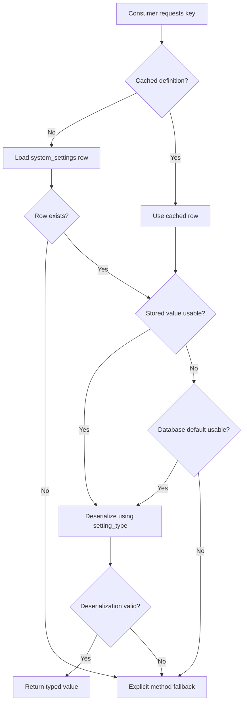
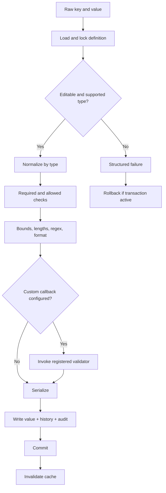
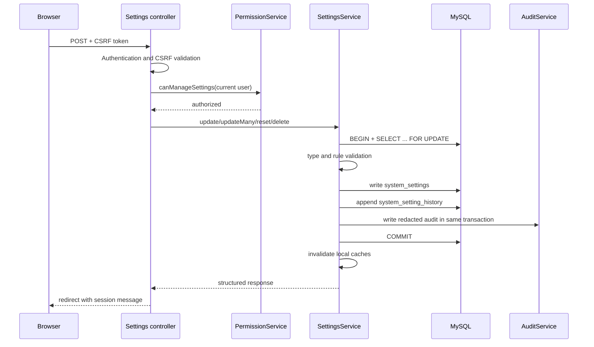

# Settings Architecture

> Current implementation coverage: **Phase 2.6**, including Clinical Notes.

> Official reference for the configuration subsystem as implemented through Phase 2.4. For broader layering and administration context, see [SYSTEM_ARCHITECTURE.md](SYSTEM_ARCHITECTURE.md) and [ADMINISTRATION_ARCHITECTURE.md](ADMINISTRATION_ARCHITECTURE.md).

## Overview

The settings subsystem provides typed, validated, auditable database configuration through `SettingsService`. It is intended to replace values that are operational policy rather than deployment secrets or bootstrap requirements.

The implementation currently has three configuration domains:

| Domain | Source | Intended content | Status |
|---|---|---|---|
| Deployment/bootstrap configuration | `config/app.php`, `config/database.php`, PHP/session configuration | Database connection, base URL, environment, startup defaults | Implemented |
| Runtime system configuration | `system_settings` through `SettingsService` | Hospital identity, security policy, queue policy, formatting and operational defaults | Implemented, with limited consumers |
| Per-call fallback | Argument supplied to typed or generic getters | Safe compatibility value when no usable database value/default exists | Implemented |

Database settings do not automatically override every configuration file value. A service must explicitly consume a key. At present, `AuthService` consumes `security.lockout_threshold`, `SessionService` consumes `security.session_timeout_minutes`, and the Administration settings UI consumes the complete catalogue. Most other modules still use config values or hardcoded compatibility defaults.

Environment selection remains outside `SettingsService`. `config/app.php` accepts only `development`, `testing`, or `production` from the protected `HMS_APP_ENV` process/server variable and defaults missing or invalid values to production. `config/auth.php` creates the synthetic development administrator only when the environment is explicitly development and `HMS_ENABLE_DEV_AUTH_BYPASS=true`. Browser request data cannot enable it, and production/testing always require real authentication.

## Configuration Hierarchy

### Implemented resolution order

For `SettingsService::get($key, $fallback)` the actual order is:

1. Non-null, non-empty `system_settings.setting_value`.
2. Non-null, non-empty `system_settings.default_value`.
3. The explicit `$fallback` supplied by the caller.

If the key does not exist, the explicit fallback is returned. If deserialization fails, the explicit fallback is returned. `getString()`, `getInteger()`, `getBoolean()`, `getFloat()`, and `getArray()` pass their default argument into this same mechanism and then enforce the requested PHP type.

| Behavior | Status | Notes |
|---|---|---|
| Database value and database default resolution | Implemented | Empty string is treated as absent during retrieval. |
| Explicit method fallback | Implemented | Used for missing rows and malformed values. |
| Application/environment fallback | Partially implemented | Only when a consumer reads config and passes it as the explicit fallback. |
| Automatic environment override of a database key | Planned | No precedence or naming convention exists yet. |
| Tenant/branch override | Planned | The schema has no tenant or branch scope. |

## Settings Data Model

### `system_settings`

| Column | Type | Null | Default | Purpose |
|---|---|---:|---|---|
| `id` | `BIGINT` | No | auto increment | Primary key. |
| `setting_key` | `VARCHAR(191)` | No | none | Stable unique key, normally `group.name`. |
| `setting_value` | `LONGTEXT` | Yes | `NULL` | Serialized current value. |
| `setting_type` | `VARCHAR(30)` | No | `string` | `string`, `integer`, `boolean`, `float`, or `array`. |
| `setting_group` | `VARCHAR(100)` | No | none | Administration category. |
| `description` | `TEXT` | Yes | `NULL` | Human-readable purpose. |
| `default_value` | `LONGTEXT` | Yes | `NULL` | Serialized database fallback. |
| `validation_rules` | `TEXT` | Yes | `NULL` | JSON validation rule object. |
| `is_public` | `TINYINT(1)` | No | `0` | Whether unauthenticated/public presentation may consume it; this is metadata, not an access-control mechanism by itself. |
| `is_editable` | `TINYINT(1)` | No | `1` | Whether update/reset/delete workflows may modify it. |
| `is_system` | `TINYINT(1)` | No | `0` | Marks platform-owned definitions. System status does not itself make a setting immutable. |
| `is_sensitive` | `TINYINT(1)` | No | `0` | Requires history, audit, and export redaction. |
| `is_encrypted` | `TINYINT(1)` | No | `0` | Future encryption marker. Creation with encryption enabled is currently rejected. |
| `sort_order` | `INT` | No | `0` | Stable display ordering within a group. |
| `created_by` | `INT` | Yes | `NULL` | Creating administrator. |
| `updated_by` | `INT` | Yes | `NULL` | Last updating administrator. |
| `created_at` | `TIMESTAMP` | No | current timestamp | Creation time. |
| `updated_at` | `TIMESTAMP` | Yes | current/update timestamp | Last update time. |

Constraints and indexes: primary key `id`; unique `setting_key`; group ordering index `(setting_group, sort_order, setting_key)`; public lookup `(is_public, setting_group)`; system/editability lookup `(is_system, is_editable)`; foreign keys from `created_by` and `updated_by` to `users.id`, both `ON UPDATE CASCADE ON DELETE SET NULL`.

### `system_setting_history`

| Column | Type | Null | Default | Purpose |
|---|---|---:|---|---|
| `id` | `BIGINT` | No | auto increment | Primary key. |
| `setting_id` | `BIGINT` | Yes | `NULL` | Related definition; retained as `NULL` if definition is deleted. |
| `setting_key` | `VARCHAR(191)` | No | none | Stable historical key. |
| `setting_group` | `VARCHAR(100)` | No | none | Historical category. |
| `action` | `VARCHAR(50)` | No | none | `SETTING_CREATED`, `SETTING_UPDATED`, `SETTING_DELETED`, or `SETTING_RESET`. |
| `old_value` | `LONGTEXT` | Yes | `NULL` | Previous serialized value, or `[REDACTED]`. |
| `new_value` | `LONGTEXT` | Yes | `NULL` | New serialized value, or `[REDACTED]`. |
| `is_sensitive` | `TINYINT(1)` | No | `0` | Records whether redaction was required. |
| `changed_by` | `INT` | Yes | `NULL` | Acting user. |
| `created_at` | `TIMESTAMP` | No | current timestamp | Change time. |

Indexes support setting history, key history, group history, and actor history, each ordered by creation time. `setting_id` references `system_settings.id` with `ON DELETE SET NULL`; `changed_by` references `users.id` with `ON DELETE SET NULL`. History is treated as append-only by services and UI.

## Settings Categories

The migration seeds 34 definitions. “Consumer” means runtime code that presently reads the value, not merely an administration screen that edits it.

| Category | Implemented keys and types | Validation summary | Current consumers/status |
|---|---|---|---|
| Hospital | `hospital.name` string; `hospital.code` string; `hospital.logo` string; `hospital.address` string; `hospital.contact_phone` string; `hospital.website` string; `hospital.email` string | Required/length rules where applicable; email format for email; URL/filename are strings rather than specialized validators | Administration UI only. Public metadata is implemented; runtime layouts still use compatibility configuration/hardcoded values. |
| General | `general.timezone` string; `general.date_format` string; `general.time_format` string; `general.currency` string; `general.language` string | Timezone validator; length rules; currency regex for three uppercase letters; language allowed value `en` | Administration UI only. Formatting helpers do not yet consume these keys. |
| Security | `security.session_timeout_minutes` integer; `security.password_min_length` integer; `security.password_complexity` string; `security.lockout_threshold` integer; `security.password_expiry_days` integer; `security.two_factor_enabled` boolean | Numeric ranges; complexity allowed values `basic`, `standard`, `strong`; required booleans | Session timeout and lockout threshold are consumed. Password settings and 2FA are seeded/future-ready but not enforced through this service. |
| Encounters | `encounters.number_format` string; `encounters.default_department_id` integer; `encounters.queue_rules` array | Required/maximum length; minimum department ID; valid JSON array | Administration UI only. Visit numbering and default routing remain compatibility logic. |
| Queue | `queue.auto_queue` boolean; `queue.prefix` string; `queue.reset_rule` string | Required boolean; prefix length; reset allowed values `daily`, `weekly`, `monthly`, `never` | Administration UI only. `QueueService` does not currently read these keys. |
| Notifications | `notifications.email_enabled`, `notifications.sms_enabled`, `notifications.internal_enabled` booleans | Required boolean | No notification subsystem consumes them. Partially implemented as definitions only. |
| Reporting | `reporting.default_date_range_days` integer; `reporting.export_limit` integer | Ranges 1–366 and 100–1,000,000 respectively | No reporting module consumes them. Definitions only. |
| Backup | `backup.frequency` string; `backup.retention_days` integer | Frequency allowed values `manual`, `daily`, `weekly`, `monthly`; retention 1–3650 | No backup engine consumes them. Definitions only. |
| System | `system.maintenance_mode` boolean; `system.debug_mode` boolean; `system.version` string | Required booleans; version regex | Administration UI only. Maintenance/debug/version bootstrap behavior still comes from application code/config. |

## `SettingsService` Contract

All methods are public on `SettingsService`; detailed generic contract examples are in [API_CONTRACTS.md](API_CONTRACTS.md).

| Signature | Purpose and return | Validation/cache | Transaction, history and audit |
|---|---|---|---|
| `__construct(PDO $db)` | Injects PDO and initializes a cache namespace for that connection object. | No authorization. | No transaction. |
| `get(string $key, mixed $default = null): mixed` | Returns deserialized current/default/fallback value. | Lazy individual-row cache. Invalid deserialization returns caller fallback. | Read only. |
| `set(string $key, mixed $value, array $metadata = [], ?int $actorUserId = null): array` | Creates a definition; delegates to `update()` when the key exists. | Validates key, type, metadata and rules. Existing-key delegation does not update metadata. | Own transaction; history and `SETTING_CREATED` audit atomically written. |
| `update(string $key, mixed $value, ?int $actorUserId = null): array` | Changes one editable value. | Locks definition; type/rule validation; clears caches. | Own transaction; history and `SETTING_UPDATED` audit atomically written. |
| `updateMany(array $settings, ?int $actorUserId = null): array` | Atomically changes multiple existing editable values. | Validates all entries before commit; duplicate keys collapse according to PHP array semantics. | One transaction for all rows, histories and audits; complete rollback on any failure. |
| `delete(string $key, ?int $actorUserId = null): array` | Deletes a non-system, editable definition. | Rejects protected or missing keys; clears caches. | Own transaction; captures redacted history and `SETTING_DELETED` audit before/with deletion. History FK becomes `NULL`. |
| `reset(string $key, ?int $actorUserId = null): array` | Restores `setting_value` to serialized `default_value`. | Rejects non-editable/missing definitions; validates default. | Own transaction; `SETTING_RESET` history/audit. |
| `exists(string $key): bool` | Tests definition existence. | Uses definition cache. | Read only. |
| `getGroup(string $group): array` | Returns definitions in display order with deserialized effective values. | Lazy group cache. | Read only. |
| `listGroups(): array` | Returns grouped counts/order metadata. | Group-list cache. | Read only. |
| `getPublicSettings(): array` | Returns active public metadata/value map. | Not persistently cached. `is_public` controls selection. | Read only; callers remain responsible for safe output. |
| `getSystemSettings(): array` | Returns system-owned definitions. | Not persistently cached. | Read only; controller authorization expected. |
| `getSettingDefinition(string $key): ?array` | Returns complete row plus deserialized values/rules. | Individual-row cache. | Read only. |
| `search(string $query = '', ?string $group = null): array` | Searches key, description and group. | Direct database query. | Read only. |
| `getHistory(?string $key = null, ?string $group = null, int $page = 1, int $perPage = 50): array` | Paginated immutable history result and pagination metadata. | Bounds page/page size; direct query. | Read only. Authorization expected in controller. |
| `exportSettings(?string $group = null): array` | Produces an export-ready data structure, redacting sensitive values. | Direct query; no file write or signature. | Read only. Export auditing is separate. |
| `getString(string $key, string $default = ''): string` | Typed string getter. | Coerces effective value to string. | Read only. |
| `getInteger(string $key, int $default = 0): int` | Typed integer getter. | Coerces effective value to integer. | Read only. |
| `getBoolean(string $key, bool $default = false): bool` | Typed boolean getter. | Recognizes stored boolean representation. | Read only. |
| `getFloat(string $key, float $default = 0.0): float` | Typed float getter. | Coerces effective value to float. | Read only. |
| `getArray(string $key, array $default = []): array` | Typed JSON-array getter. | Invalid/non-array values return fallback. | Read only. |
| `registerValidator(string $name, callable $validator): void` | Registers a process-local custom validation callback. | Callback must be registered on that service instance before use. | No database write or audit. |
| `clearCache(?string $key = null): void` | Clears one definition or all request/process-local setting caches. | Does not affect another PHP process. | No database write. |
| `recordExport(?int $actorUserId, ?string $group = null): bool` | Audits a completed export operation. | Does not generate/export a file itself. | Writes `SETTING_EXPORTED` through `AuditService`; controller invokes it. |

Service authorization is deliberately absent: administration controllers authenticate, require `PermissionService::canManageSettings()`, validate CSRF for mutations, and then invoke the service. Consumers performing internal reads do not need administrative permission.

## Caching Strategy

`SettingsService` uses static PHP arrays namespaced by `spl_object_id($pdo)`:

- Individual definition cache: populated lazily by `getSettingDefinition()`/`get()`.
- Group cache: populated lazily by `getGroup()`.
- Group-list cache: populated lazily by `listGroups()`.
- Mutating operations invalidate caches after successful commit.
- `clearCache($key)` invalidates the key and related group/list state; `clearCache()` clears all caches in the service namespace.

This is request-local under ordinary PHP-FPM/Apache request execution and may be process-local in long-running PHP. There is no Redis/APCu/file cache, TTL, cache version, or cross-process invalidation. Persistent cross-request caching is **Planned**.

## Validation Architecture

Supported validation is implemented before SQL mutation:

| Rule | Implemented behavior |
|---|---|
| Type | `string`, `integer`, `boolean`, `float`, and JSON `array`. |
| `required` | Rejects absent/empty values according to the type. |
| `allowed` | Strictly restricts values to the configured list. |
| `min` / `max` | Numeric bounds. |
| `min_length` / `max_length` | String length bounds. |
| `regex` | Applies configured regular expression. |
| `format: email` | PHP email validation. |
| `format: timezone` | Membership in PHP's timezone identifiers. |
| `callback` | Invokes a callback registered with `registerValidator()`. Future-ready because no seeded rule currently depends on a custom callback. |

`updateMany()` performs the set as one transaction. Any invalid or non-editable key causes the entire bulk operation to roll back.

## Security and Sensitive Settings

- `is_public` is an output classification used by `getPublicSettings()`; it does not bypass authorization on administration routes.
- Private/system settings require authenticated, authorized settings administration controllers.
- All state-changing forms require CSRF through the shared helpers.
- Sensitive old/new values are stored as `[REDACTED]` in history and omitted/redacted from audit descriptions and exports.
- `is_editable = 0` blocks ordinary update/reset/delete operations.
- Encryption at rest is **not implemented**. `is_encrypted` is schema metadata and encrypted setting creation is rejected.
- The current seed contains no sensitive/encrypted setting.

Planned secure-secret support should use authenticated encryption, keep master keys outside MySQL and source control, support key identifiers and staged rotation, reveal only masked values in UI, separate secrets by environment, and ensure exports/imports never expose plaintext. Environment-specific secrets should remain in a secrets manager or protected environment rather than general editable settings.

## Settings Request Flow

The import page is an explicit non-functional placeholder and accepts no file. Export is implemented as a read-generated download plus an export audit event.

## Consumer Integration

### Current consumers

| Consumer | Keys | Behavior |
|---|---|---|
| `AuthService` | `security.lockout_threshold` | Database value with `config/app.php` maximum-failure value passed as fallback. |
| `SessionService` | `security.session_timeout_minutes` | Database minutes with configured timeout seconds converted/passed as fallback. |
| Administration settings pages | All definitions, groups, history, search and export | Full management subject to permission and CSRF. |

### Incremental migration plan (no code implemented by this document)

1. **Auth/User security:** make password minimum/complexity/expiry consumers explicit in `AuthService` and `UserService`; preserve current minimum-eight behavior as fallback.
2. **Session policy:** retain current timeout integration and add a clearly tested policy refresh strategy for long-lived sessions.
3. **Queue:** consume auto-queue, prefix and reset rules only after defining backward-compatible queue numbering semantics.
4. **Visits:** replace `COUNT(*) + 1` encounter numbering with a concurrency-safe sequence, then apply `encounters.number_format`.
5. **Hospital/general presentation:** inject hospital name, currency, timezone and formats into layout/view formatting without querying settings repeatedly.
6. **Defaults:** validate `encounters.default_department_id` against active departments before use.
7. **Future clinical modules:** register module-owned keys through migrations and consume them only through `SettingsService`; never query `system_settings` from controllers/views.

Remaining hardcoded candidates include encounter and hospital number formats, currency symbol, date/time formats, password minimum length, some queue behavior, application/hospital names, and environment/debug behavior. Database credentials, base URL and deployment environment should remain deployment configuration.

## Future Settings Architecture

All items below are **Planned**, not implemented:

- Encrypted values with external key storage and rotation.
- Persistent distributed cache and cross-node invalidation.
- Signed, schema-versioned, validated imports with dry-run reporting.
- Tenant-specific and branch-specific scopes.
- Explicit environment override policy.
- Feature flags with rollout/audit semantics.
- Secret masking/re-entry workflows.
- Configuration snapshots and controlled rollback.

Any future change must preserve stable setting keys, use additive migrations, audit mutations transactionally, and provide compatibility defaults for already deployed modules.

## Clinical Safety Settings — Implemented

| Setting key | Type | Default | Consumer |
|---|---|---|---|
| `clinical_safety.allergy_types` | array | Drug, Food, Environmental, Biological, Other | Forms and validation |
| `clinical_safety.severity_values` | array | Mild, Moderate, Severe, Life-threatening, Unknown | Forms, validation, banner ordering |
| `clinical_safety.nurse_may_verify_allergies` | boolean | `false` | Permission policy |
| `clinical_safety.alert_types` | array | Seven approved categories | Forms and validation |
| `clinical_safety.alert_priorities` | array | Low, Medium, High, Critical | Forms, validation, banner ordering |
| `clinical_safety.confidentiality_levels` | array | Standard, Restricted, Confidential | Forms and validation |
| `clinical_safety.default_alert_expiry_days` | integer | `0` | Alert preparation; zero means no default expiry |
| `clinical_safety.legacy_allergy_warning` | boolean | `true` | Compatibility banner display |

`ClinicalSafetyService` consumes these through request-local SettingsService
caching and safe code defaults. Settings do not authorize actions;
PermissionService remains authoritative. Module-specific alert automation is
not implemented.

### Clinical Safety hardening settings

| Key | Type | Default | Enforced behavior |
|---|---|---|---|
| `clinical_safety.allow_self_allergy_verification` | boolean | `false` | Recorder/latest author cannot verify unless explicitly enabled; administrators are not implicitly exempt. |
| Clinical Safety array settings | array | Migration 017 values | Migration 018 `schema_values` rules reject unknown values and duplicates. Enabled subsets are allowed. |

For ENUM-backed Clinical Safety domains, the schema vocabulary is authoritative.
Settings control enabled subsets, not schema extension. Forms and service
validation consume the same safe intersection. Persistent cache behavior is
unchanged; request-local caches are invalidated by SettingsService writes.

## Phase 2.4 settings

| Key | Type | Default/policy |
|---|---|---|
| `problem_list.categories` | array | Schema-supported problem categories |
| `problem_list.severities` | array | Mild, Moderate, Severe, Unknown |
| `problem_list.allow_self_verification` | boolean | `false` |
| `problem_list.nurse_may_manage` | boolean | `false` |
| `problem_list.show_resolved_in_workspace` | boolean | `false` |
| `medical_history.types` | array | Schema-supported history types |
| `medical_history.confidentiality_levels` | array | Standard, Restricted, Confidential |
| `medical_history.allow_self_verification` | boolean | `false` |

Database ENUM values are authoritative. Settings enable supported subsets and
cannot introduce schema-invalid values because `schema_values` validation and
service-side intersections fail closed. Workspace currently displays active
confirmed problems and non-entered-in-error history; resolved-problem display
remains disabled by the seeded policy.

## Phase 2.5 Medical Document settings

| Key | Type/default | Enforced use |
|---|---|---|
| `documents.allowed_types` | array / 11 keys | Enabled subset of supported document types |
| `documents.maximum_upload_bytes` | integer / 10 MiB | Bounded by mandatory 40 MiB ceiling |
| `documents.allowed_mime_types` | array / PDF, JPEG, PNG, text | Subset of immutable MIME allowlist |
| `documents.allowed_extensions` | array / pdf, jpg, jpeg, png, txt | Subset paired with detected MIME |
| `documents.confidentiality_levels` | array / four levels | Enabled schema-supported subset |
| `documents.default_confidentiality` | string / Standard | New-upload default |
| `documents.malware_scanning_required` | boolean / false | True keeps unscanned files quarantined |
| `documents.storage_provider` | string / local | Non-editable implemented provider |
| `documents.download_cache_policy` | string / no-store | Safe response policy |
| `documents.closed_encounter_uploads` | boolean / false | Closed-encounter mutation policy |
| `documents.retention_years` | integer / 10 | Policy only; no automatic purge |

Settings can narrow security policy but cannot add MIME types, extensions,
executable formats, providers, or schema-invalid confidentiality values.
`schema_values` validation and service-side intersections enforce the policy
consumed by forms. Persistent cross-request caching remains planned.

## Clinical Notes settings — implemented

The Medical Records group includes `clinical_notes.enabled_types`,
`default_type`, `maximum_content_length`, `confidentiality_levels`,
`default_confidentiality`, `allow_self_signing`,
`amendment_approval_required`, `allow_self_amendment_approval`,
`closed_encounter_new_notes`, `draft_visibility`, and system-controlled
`auto_lock_on_signing`. Arrays use `schema_values` and service-side
intersection. Settings may narrow policy but cannot enable executable formats,
unknown confidentiality values, or non-Doctor signing.
