# Hospital Management System — System Architecture

## Document Status

This is the master architectural reference for the current repository. It describes the implementation as it exists today and distinguishes implemented, partially implemented, and planned capabilities.

| Status | Meaning |
|---|---|
| Implemented | Present in the repository and actively used by current routes or services. |
| Partially implemented | Some supporting structures exist, but the complete enterprise capability is not yet present. |
| Planned | Described by the project context or future module structure, but not implemented. |

## Project Overview

The Hospital Management System is an Enterprise Hospital Management Information System built with PHP 8+, PDO, MySQL, HTML, CSS, and vanilla JavaScript. The system is encounter-centered: a patient may have many encounters, and transfers, queues, assignments, clinical activities, audit records, and timeline events are associated with an encounter.

The system is workflow-driven rather than a collection of isolated screens. State-changing actions validate business rules, use transactions, and record operational history through audit logs and encounter events where applicable. Future modules use a CRUD-first + selective structure approach: start with a practical table/service/page workflow, then add extra structure only when current security, financial, stock, patient-identity, signed-record, legal, audit, or integration requirements justify it.

The current repository contains implemented authentication, patient management, encounter management, transfer and receive workflows, queue infrastructure, doctor assignment, encounter timelines, audit logging, and the first administration capabilities for users, roles, permissions, departments, and department assignments.

## System Layers

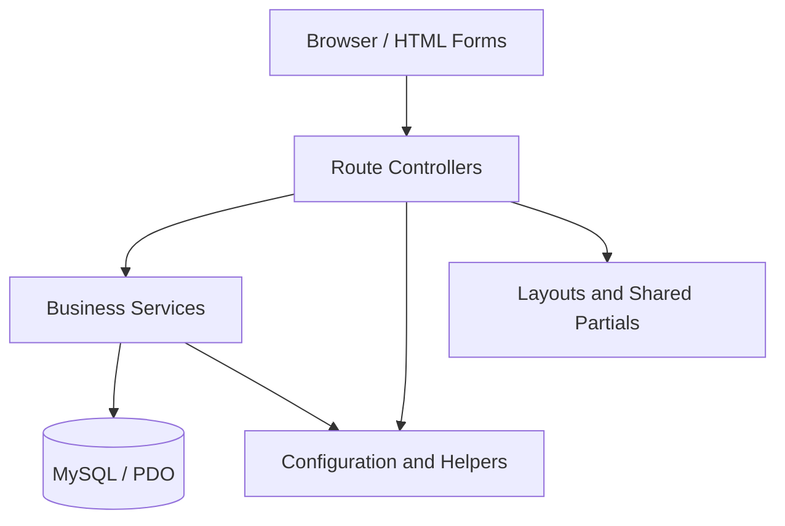

### Presentation Layer

PHP pages render HTML forms, tables, dashboards, encounter workspaces, and administration screens. Views use escaping helpers and shared layouts. They must not contain SQL or business rules.

### Controllers

Controllers are route files such as `save.php`, `update.php`, `transfer_save.php`, and administration action endpoints. Their intended responsibility is:

1. authenticate the request;
2. verify CSRF for state-changing requests;
3. collect and minimally validate request input;
4. call a service;
5. store a flash/error result;
6. redirect or return the appropriate HTTP response.

Some legacy pages still contain presentation and route-specific checks, so controller thinness is an ongoing improvement area.

### Services

Services own business rules, database writes, transactions, state validation, authorization integration, and audit/event coordination. They use PDO prepared statements.

### Database

MySQL/InnoDB stores users, roles, departments, patients, encounters, transfers, queues, audit records, and encounter events. Foreign keys protect historical relationships.

### Configuration

`config/app.php` contains application, hospital, environment, and database settings. `config/database.php` creates the PDO connection with exceptions, associative fetches, and native prepared statements.

### Helpers

`config/helpers.php` contains escaping, URL, CSRF, redirect, flash, and security failure helpers. Business logic does not belong in helpers.

### Layouts and Shared Components

`layouts/` provides the header, sidebar, navbar, and footer. Module partials provide reusable encounter, queue, patient, department, and user presentation components.

## Request Flow

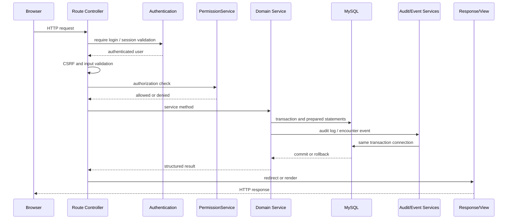

## Service Architecture

### `VisitService`

The central encounter service. It preserves the public APIs `createVisit()`, `transferVisit()`, `receiveVisit()`, `assignDoctor()`, `updateStatus()`, `getVisitById()`, and `getVisitTimeline()`. It handles encounter creation, updates, status transitions, transfers, receiving, doctor assignment, history, doctor lookup, and compatibility queue wrappers.

It delegates lifecycle rules to `EncounterStateService`, queue operations to `QueueService`, and workflow history to `EncounterEventService` and `AuditService` integrations.

### `UserService`

Handles authentication lookup, user listing, user CRUD, account activation/deactivation, locking/unlocking, password reset, forced password change, role and department lookup, and uniqueness checks.

Administrative writes are transactional and audited. `users.department_id` remains the backward-compatible primary department field.

### `RoleService`

Provides role creation, update, activation, deactivation, retrieval, searching, and listing. Role writes are transactional and audited. Role permissions are managed through `PermissionService`.

### `PermissionService`

The centralized authorization boundary. It supports existing permission methods such as `canAccessEncounter()`, `canTransferEncounter()`, `canReceiveEncounter()`, `canAssignDoctor()`, `canChangeEncounterStatus()`, `canEditEncounter()`, `canViewEncounter()`, `canManageUsers()`, and `isAdministrator()`.

It first checks database-backed role permissions, then falls back to the legacy hardcoded rules if the database permission is unavailable. Administrators have an explicit override. Department checks use the active session department, assigned memberships, and the legacy primary department.

It also manages permission records and role-permission assignments.

### `DepartmentService`

Manages department metadata, search, listing, activation, deactivation, and department summaries. Historical encounter references are not changed when department metadata is edited.

### `UserDepartmentService`

Manages multi-department assignments, primary department changes, assignment removal, membership listing, active department switching, and current department resolution. It keeps `users.department_id` synchronized with the primary membership.

### `QueueService`

Owns centralized encounter queue operations: enqueue, dequeue, call, start, complete, cancel, queue lookup, department queue lookup, transfer queue closure, and lifecycle queue closure. It uses row locks and records queue events and audits through shared services.

### `EncounterStateService`

Centralizes encounter states, terminal-state protection, status transitions, transfer validation, receive validation, editability checks, and doctor assignment prerequisites.

### `EncounterEventService`

The only intended service for inserting encounter timeline events. It validates event inputs, writes to `encounter_events`, and retrieves chronological event records.

### `AuditService`

Writes operational audit records and provides recent audit and encounter audit queries. It records user, encounter, module, action, description, IP address, and timestamp.

### `SessionService`

Manages session creation, authentication state, active department session state, flash messages, timeout expiry, logout, and forced password-change redirects. Persistent expiry consumes the configured settings timeout with a compatibility fallback; shared session bootstrap enforces strict cookie-only, HttpOnly, SameSite cookies and enables Secure cookies over HTTPS.

### `AuthService`

Authenticates by username or employee ID, checks account status and lock state, verifies passwords, and preserves the existing login response structure.

### `DashboardService`

Aggregates live administrator dashboard statistics for users, roles, departments, encounters, queues, security, and audit activity. Dashboard reads use grouped SQL queries and do not mutate workflow state; viewing the dashboard is audited.

### `SettingsService`

Provides centralized typed system settings, grouped retrieval, validation, request-local caching, bulk updates, immutable setting history, export, reset, and transactional audit integration. Existing modules retain their current configuration paths for compatibility; new modules must consume configurable values through this service.

### Timeline Service Status

No `TimelineService.php` class is currently implemented. Timeline behavior is partially implemented through `VisitService::getVisitTimeline()`, `EncounterEventService::getTimelineEvents()`, and encounter timeline partials. A dedicated timeline service is planned when more modules contribute events.

### Future or Empty Services

`BillingService.php`, `ConsultationService.php`, `LaboratoryService.php`, and `PharmacyService.php` are service contracts with different implementation maturity. `LaboratoryService.php` is implemented for laboratory request/result CRUD and worklist operations; the others remain planned or partial depending on module status.

## Module Architecture

| Module | Current status | Main implementation |
|---|---|---|
| Authentication | Implemented | `authentication/`, `AuthService`, `SessionService`, CSRF helpers |
| Patients | Implemented | `modules/patients/`, `PatientService` |
| Encounters | Implemented | `modules/visits/`, `VisitService` |
| Workspace | Implemented | `modules/visits/workspace.php` and partials |
| Queue | Partially implemented | `QueueService`, queue workspace component, queue fields/table |
| Transfers | Implemented | transfer routes and `VisitService::transferVisit()` |
| Receive | Implemented | receive routes and `VisitService::receiveVisit()` |
| Doctor Assignment | Implemented | assignment routes and `VisitService::assignDoctor()` |
| Audit | Implemented | `AuditService`, `audit_logs` |
| Encounter Events | Implemented | `EncounterEventService`, `encounter_events` |
| Administration | Implemented | users, roles, permissions, departments, assignments, security, dashboard, and system settings |
| Security Administration | Implemented | persistent sessions, login/security history, lockouts, password history, audit viewer |
| Reporting | Planned | no reporting implementation |
| Consultation | Planned | empty service placeholder and workspace tab only |
| Nursing | Planned | workspace tab/directory only |
| Laboratory | Implemented | laboratory request/result CRUD, worklist, workspace integration |
| Radiology | Planned | workspace tab/directory only |
| Pharmacy | Planned | empty service placeholder and workspace tab |
| Accounts | Implemented | standalone sidebar price catalogue (`billable_items`) |
| Accounts/Billing | Planned | encounter-specific billing/charges later |
| Physiotherapy | Implemented | `PhysiotherapyService`, record/session CRUD, worklist, workspace integration |
| Theatre | Implemented | `TheatreService`, single-record CRUD, workspace integration |
| Store/Inventory | Implemented | standalone sidebar inventory items, stock movements, and department balances |

Modules communicate through services and shared encounter identifiers. Future clinical modules should attach records to `visit_id`, validate encounter state, authorize department access, use transactions, create audit logs, and create encounter events.

## Database Architecture

### Core Entities

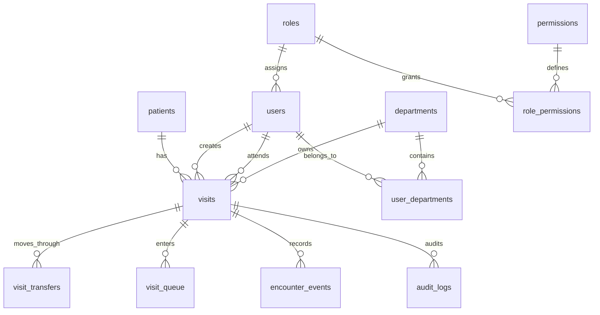

### Main Tables

- `patients`: permanent patient identity and demographics.
- `visits`: central encounter record, current department, status, receiving state, attending doctor, and visit number.
- `departments`: department identity and administrative metadata.
- `users`: system users, primary department, role, account status, failed login state, password state, and lock state.
- `roles`: named roles and active state.
- `permissions`: database-backed permission catalogue.
- `role_permissions`: unique role-permission assignments.
- `user_departments`: active and historical user department memberships.
- `visit_transfers`: transfer history and receipt history.
- `visit_queue`: department-owned queue entries and queue timestamps.
- `encounter_events`: chronological encounter event history.
- `audit_logs`: actor and action audit history.
- `active_sessions`: persistent session registry, activity, expiry, department, and termination state.
- `password_history`: immutable password-change/reset history containing password hashes only.
- `system_settings`: typed, grouped, validated enterprise configuration catalogue.
- `system_setting_history`: immutable configuration change history with sensitive-value redaction.

### Foreign Keys and Historical Integrity

Encounter history references `visits` and department IDs through foreign keys. Department metadata changes do not update historical transfer, queue, audit, or event records. Departments are not physically deleted through the administration UI.

### Indexing

Indexes cover primary and foreign keys, encounter lookup, current department and receive status, transfer pending queries, event timelines, queue department/status/position, queue visit state, user status/lock state, permissions, role assignments, user memberships, and composite audit filtering by module, event type, severity, encounter, and date.

### Migration Strategy

`database/hospital.sql` is the fresh-install Phase 0 baseline. Future changes are delivered through numbered migration pairs in `database/migrations/`.

Current migration sequence:

1. `002_phase0_live_schema_alignment`
2. `003_phase0_queue_workflow`
3. `004_phase0_store_status`
4. `005_phase1_user_management`
5. `006_phase1_roles_permissions`
6. `007_phase1_departments_assignments`
7. `008_phase1_security_administration`
8. `009_phase1_system_settings`
9. `010_phase1_production_indexes`
10. `011_phase1_visit_status_repair`
11. `012_phase1_patient_gender_remediation`

The missing `001` number is historical and is not reused. Existing migrations are one-time alignment scripts and require deployment tracking before execution. Down migrations must be reviewed against production data before use.

## Transaction Architecture

State-changing service methods establish transaction boundaries around the complete business operation. A typical workflow is:

```text
BEGIN
  lock encounter or administrative row
  validate state and authorization
  write current state/history
  write encounter event when applicable
  write audit record
COMMIT

On any exception:
  ROLLBACK all writes
```

`AuditService` and `EncounterEventService` use the same PDO connection supplied by the caller, so their inserts participate in the caller's transaction. An audit failure inside a caller-owned transaction is rethrown to force rollback; standalone audit calls retain their boolean failure contract. `QueueService`, `VisitService`, `RoleService`, `DepartmentService`, and `UserDepartmentService` use row locking for state-sensitive operations.

Concurrency is addressed through InnoDB transactions, `SELECT ... FOR UPDATE`, unique constraints, and duplicate checks. Persistent session administration is implemented. A formal migration runner and broader concurrent-worker stress suite remain future hardening work.

## Encounter Lifecycle

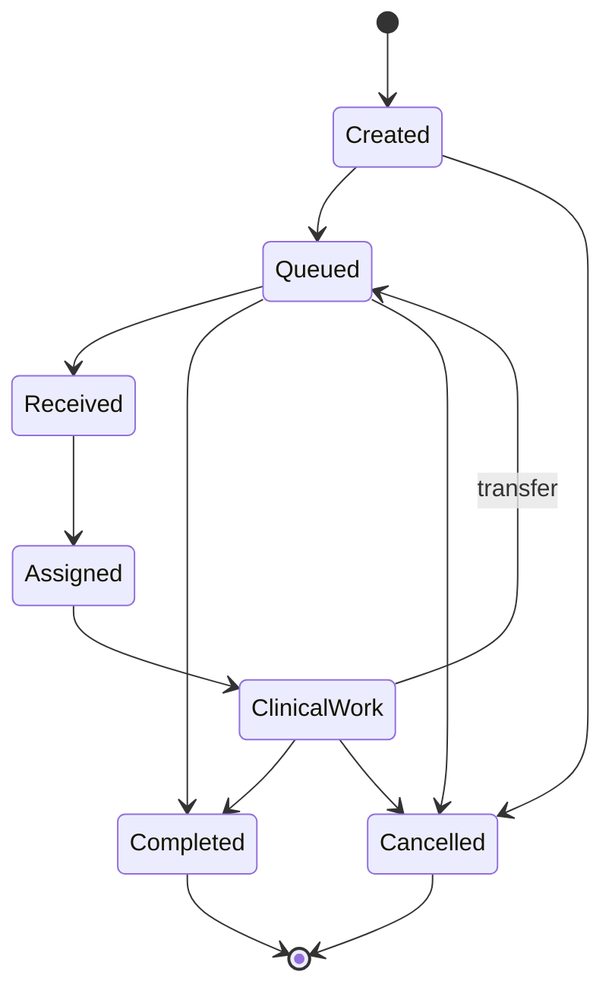

The database `visit_status` values represent department and terminal states such as `Waiting`, `Reception`, `Doctor`, `Nursing`, `Laboratory`, `Completed`, and `Cancelled`. Queue state and transfer receipt state provide additional workflow detail.

1. Encounter creation validates the patient and department, writes the visit, event, audit, and initial queue entry.
2. Queue operations represent waiting, called, in-progress, completed, and cancelled queue states.
3. Transfer closes the current queue, records transfer history, changes current department/status, and creates a destination queue.
4. Receive validates a pending transfer and marks departmental responsibility received.
5. Doctor assignment validates current department, receipt, doctor identity, and active encounter state.
6. Clinical work is a future integration point.
7. Completion closes the encounter and makes it read-only under lifecycle rules.

## Queue Architecture

Queue ownership belongs to `visit_queue.department_id`. An encounter may have historical queue entries across departments but only one active queue entry is intended at a time.

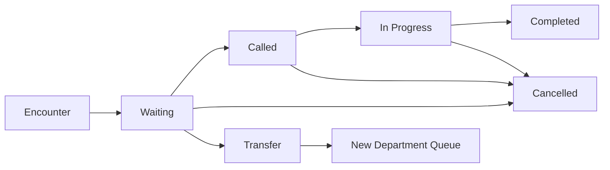

`QueueService` prevents duplicate active queue entries, checks closed encounter state, checks pending transfer/receipt rules, locks queue and encounter rows, and records queue events such as `QUEUED`, `CALLED`, `SERVICE_STARTED`, `SERVICE_COMPLETED`, and `QUEUE_CANCELLED`.

The workspace displays queue state. Dedicated department queue pages and a separate `QueueService` consumer module are partially implemented/planned rather than complete.

## Audit and Event Pipeline

Audit logs answer who performed an administrative or workflow action, when it happened, from which IP, and against which module or encounter. Encounter events answer what happened to a particular encounter and form the timeline.

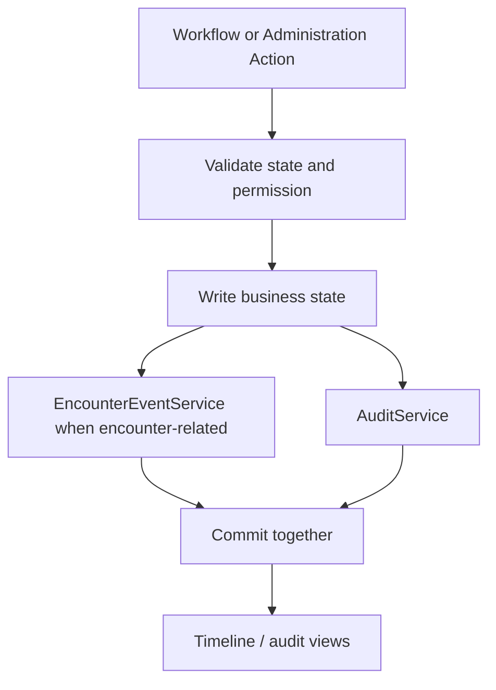

Direct inserts into `encounter_events` outside `EncounterEventService` are prohibited by the architecture. Audit events include authentication, encounter workflows, queue operations, user management, role management, permission management, department management, and department assignments.

## Authorization Architecture

Authentication is handled by `AuthService`, `UserService`, `SessionService`, and `config/auth.php`. Missing or invalid environment configuration resolves to production, where every protected route requires a real session. The synthetic development administrator is available only when the server process explicitly sets `HMS_APP_ENV=development` and `HMS_ENABLE_DEV_AUTH_BYPASS=true`; browser request data cannot enable it. `SessionService` records active sessions, activity, expiry, user agent, IP address, active department, and termination state.

For local development, configure the Apache/PHP process outside the web
application, for example in the protected Apache virtual-host configuration:

```apache
SetEnv HMS_APP_ENV development
SetEnv HMS_ENABLE_DEV_AUTH_BYPASS true
```

Restart Apache after changing process configuration. Production should set
`HMS_APP_ENV=production` (or leave it absent, which resolves to production) and
must not set the bypass flag to a truthy value. Query strings, cookies and form
fields are never environment sources.

Patient demographic writes use `PatientService` as the transaction and audit owner. Patient gender is constrained to `Male`, `Female`, `Other`, or `Unknown` consistently in PHP, forms, the baseline and migration 012. Controllers perform request/CSRF handling but do not write duplicate patient audit records.

Security administration provides administrator-only views for all sessions, login history, failed logins, lockouts, password history, security summaries, and immutable audit records. Non-administrators are limited to their own session and security history views.

Authorization is centralized in `PermissionService`:

1. administrator override;
2. database role-permission lookup;
3. active department assignment validation;
4. primary department compatibility;
5. legacy hardcoded fallback if database permission data is unavailable.

CSRF validation is centralized in `config/helpers.php` and is required by state-changing administration, authentication, patient, and encounter forms.

Legacy `config/permissions.php` contains role/department helper functions and remains a compatibility layer. New controllers should use `PermissionService` for business authorization.

## Future Module Integration

Future modules should follow this sequence:

```text
Open encounter workspace
  -> verify authentication and PermissionService access
  -> verify department and EncounterStateService prerequisites
  -> perform service transaction
  -> write module record linked to visit_id
  -> write encounter event
  -> write audit log
  -> render through the workspace/timeline integration
```

Planned integrations include Medical Records, Consultation, Nursing, Laboratory, Radiology, Pharmacy, Billing/Charges, Reporting, dashboards, notifications, appointments, APIs, and discharge. Accounts and Store are already implemented as standalone sidebar modules for price and stock master data respectively.

Future module implementation should avoid unnecessary normalization of
clinical narrative text. Keep narrative sections such as consultation history,
examination findings, assessment, treatment plan, radiology findings,
radiology impression, nursing narrative, and referral notes as `TEXT` unless
the application must independently search, calculate, filter, validate,
report, route, or integrate that data.

Before adding a new service, table, history table, workflow engine, approval
process, or settings group, first ask whether ordinary CRUD using an existing
service or one simple module service solves the current requirement.

## Architectural Decisions

| Decision | Rationale |
|---|---|
| Encounter-centered workflow | Provides one traceable clinical journey across departments and future modules. |
| Thin controllers and service-owned business rules | Prevents duplicated validation and keeps workflows testable. |
| Preserve `VisitService` public methods | Existing routes and controllers depend on these APIs. |
| Additive migrations | Protects live data and historical workflow records. |
| `users.department_id` remains primary | Preserves compatibility while enabling multi-department membership. |
| Database permissions with fallback | Enables incremental authorization migration without breaking existing workflows. |
| Separate audit logs and encounter events | Audit records describe system actions; encounter events describe clinical workflow history. |
| Queue ownership by department | Supports department-specific work queues while retaining encounter continuity. |
| Row locking and unique constraints | Prevents duplicate workflow execution and conflicting administrative assignments. |
| Metadata changes instead of historical rewrites | Preserves historical department IDs and encounter meaning. |
| Dedicated TimelineService delayed | Current timeline needs are served by existing event and visit services; abstraction will be added when multiple modules require it. |
| Workflow fields cannot be changed by generic encounter edit | Department ownership changes must use transfer/receive, and doctor changes must use assignment, preserving queue, event, audit, and lifecycle history. |
| CRUD-first future modules | Consultation, Nursing, Laboratory, Radiology, Pharmacy, Inventory and Billing should start with practical CRUD plus permissions, validation, transactions and audit. Additional structures are added only when real workflow, reporting or integrity requirements need them. |
| Patient merge postponed | The current MPI duplicate-candidate workflow is sufficient for this version. Full merge, canonical survivor logic, merge reversal and foreign-key remapping require separate future approval. |

## Phase 2 Milestone 2.1 — Medical Records Foundation

The implemented Patient Chart is longitudinal and remains separate from the
encounter-specific Workspace. `MedicalRecordService` assembles chart reads by
collaborating with `PatientService`, `VisitService`, and `AuditService`.
Demographic writes remain in `PatientService` and atomically create an applied
amendment, append-only history version, current-row version increment, and
patient-aware audit. Chart views create PHI access and audit records but no
encounter event. Later clinical chart domains remain planned.

## Database safety checkpoint (2026-08-05)

Automated database verification is CLI-only and requires an explicit
`hms_test_*` database different from live. SQL is preflighted for database
creation/deletion and hardcoded live selection. Destructive recreation requires
explicit confirmation plus a verified backup or explicit acknowledgement.
Tests load `config/test_database.php`; normal database bootstrap fails closed
in testing mode. Migration checksums are retained in `schema_migrations`.

## Phase 2 Milestone 2.2 — Master Patient Index

The MPI is patient-level and does not use `EncounterEventService`.
`PatientIdentifierService` owns alternate-identifier validation,
normalization, scoped uniqueness, row locking, versioned updates, append-only
history, and transactional patient-aware audit. The existing
`patients.hospital_number` remains the authoritative local identifier.

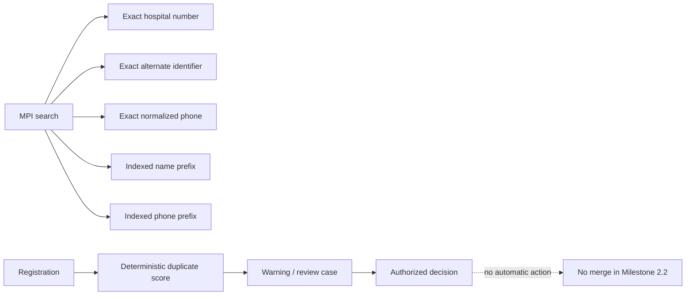

`PatientService::searchPatientsPaginated()` is additive; `searchPatients()`
remains unchanged. Registration rechecks duplicates inside its transaction,
requires explicit review acknowledgement for strong matches, and stores one
deterministically ordered candidate pair. Review decisions classify or dismiss
a case only and never combine records. Migration 016 adopts the retained
Migration 014 structures and seeds approved permissions/settings.

## Phase 2 Milestone 2.3 — Clinical Safety

**Implemented.** Longitudinal allergies and clinical alerts are owned by
`ClinicalSafetyService`; they are not encounter-owned clinical documentation.
The service performs validation, row locking, optimistic version checks,
current-state writes, append-only history, audit logging, and optional
encounter-event recording in one transaction.

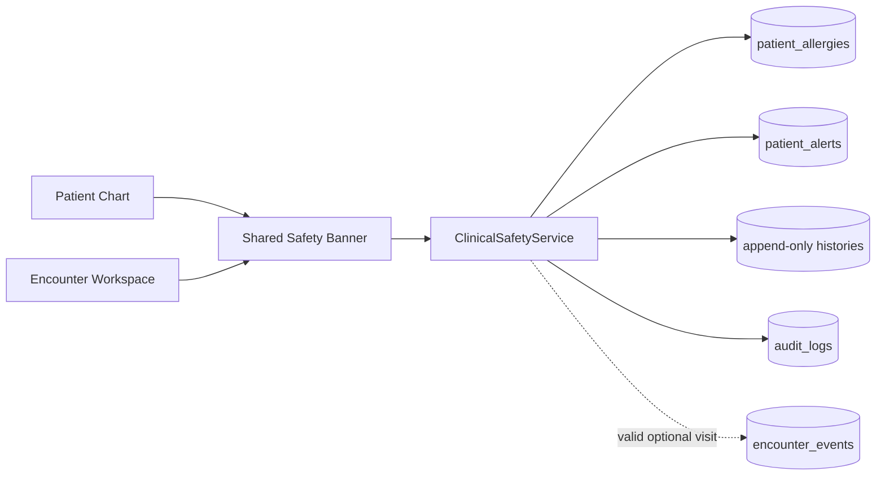

The same banner partial and aggregation query path are used by the Patient
Chart and Encounter Workspace. It orders active critical alerts first, then
life-threatening/severe allergies, other allergies, unverified warnings, and
legacy allergy text. Restricted details become a generic warning unless
`view_confidential_alerts` is effective.

`patients.allergies` remains compatibility-only free text. It is displayed as
unverified legacy information and is never parsed, overwritten, or promoted
into a structured record automatically. Migration 017 is the additive release
boundary for Clinical Safety. Problems, documents, and notes were implemented
in later Phase 2 milestones; patient merge and specialty automation remain
planned/postponed.

## Phase 2 Milestone 2.3.1 alignment

Clinical Safety reads now use user-aware service contracts. Confidential alert
details and per-version history require explicit authorization; compatibility
lookups always mask protected content. Required safety-access auditing fails
closed. Allergy self-verification is disabled by default, material edits reset
verification, and governed deactivate/reactivate transitions complete the
`Inactive` lifecycle. Optional encounter context is validated at the route and
again by the service before any timeline event. Migration 018 changes settings
policy only and does not rebuild clinical tables.

## Phase 2.4 — Longitudinal Problems and Structured Medical History

**Implemented.** `ProblemListService` is the transactional owner of longitudinal
patient problems and structured historical facts. The Patient Chart provides
the full record; Encounter Workspace consumes read-only, minimum-necessary
summaries. Neither `VisitService` nor encounter status owns this clinical data.

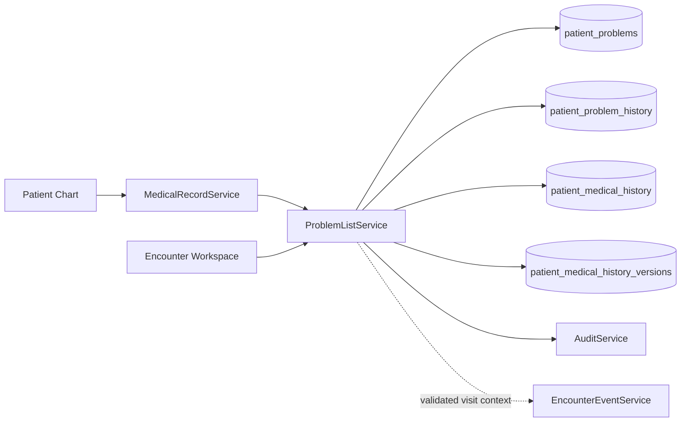

Problems are patient-level current records with explicit Active, Inactive,
Resolved, and terminal Entered-in-error states. Medical-history entries are
current records with immutable versions. Consultation diagnoses remain planned
and may only be promoted through a future explicit authorized action.

## Phase 2.5 — Secure Medical Documents

**Implemented.** Medical Documents are longitudinal patient records with an
optional validated encounter association. `MedicalDocumentService` owns
metadata, immutable versions, authorization-aware retrieval, storage
coordination, audit/access logging, lifecycle changes, and optional encounter
events. `VisitService` remains outside this boundary.

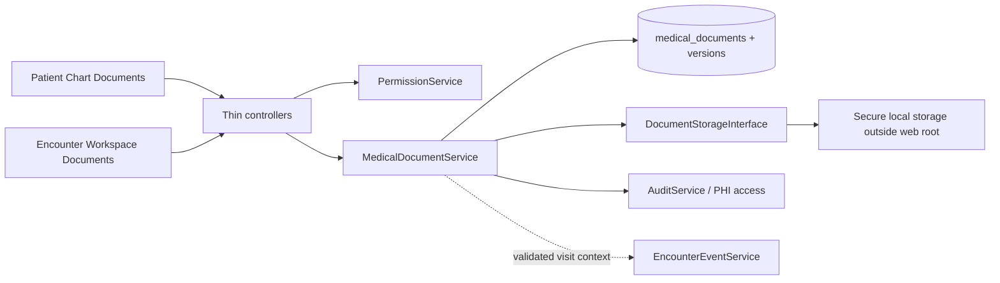

Downloads always pass through an authenticated controller. The service checks
patient/encounter scope, confidentiality, lifecycle, version ownership, malware
state, size, and SHA-256 before opening a stream. Files are not stored in MySQL
or exposed by direct URLs. Replacement appends a physical and relational
version; archive and entered-in-error transitions never erase history. See
`MEDICAL_DOCUMENTS_DEPLOYMENT.md` for the deployment boundary.

## Phase 2.6 — Clinical Notes Foundation

**Implemented.** `ClinicalNoteService` owns patient-level and encounter-linked
plain-text notes, immutable versions, Doctor signing, locking, amendments,
entered-in-error correction, confidentiality, and read models. Patient Chart
and Workspace use the same service; `VisitService` contains no note business
logic. `RecordAmendmentService` reuses `record_amendments` while content
remains in `clinical_note_versions`. Draft actions do not create encounter
events; signed, amended, and entered-in-error transitions do so only for a
validated linked visit. See
[CLINICAL_NOTES_ARCHITECTURE.md](CLINICAL_NOTES_ARCHITECTURE.md).

## Phase 2 Lean Closeout

**Implemented.** Phase 2 is closed for the current version. MPI duplicate
handling remains review-only: exact unsafe duplicates are blocked, possible
duplicates can be reviewed, and no patient records are merged. Full patient
merge is postponed.

## CRUD-First Future Roadmap

| Phase | Scope | Initial model |
|---|---|---|
| Phase 3 | Consultation and Nursing | `consultations`, `vital_signs`, one nursing assessment table |
| Phase 4 | Radiology | `radiology_orders`, `radiology_reports` |
| Phase 5 | Pharmacy and Inventory | prescriptions, dispensing, items, stock transactions |
| Phase 6 | Billing | charges, invoices, payments, receipts |
| Later / Optional | advanced analytics, integrations | Implement only when operationally required |

Consultation is the next implementation target. Its first version should be a
simple encounter-linked CRUD module with narrative `TEXT` fields for history,
examination, assessment, treatment plan, advice, follow-up plan and referral
notes. Do not create separate tables for every consultation section.

Phase 3.2 Vital Signs is also implemented as a small CRUD module with one
`vital_signs` table, doctor/nurse CRUD permissions, workspace and patient-chart
read views, and read-only consultation context display. It remains encounter-
centered and does not add workflow engines, history tables, or timeline events
for routine measurement updates.

## Phase 3.1 — Consultation and Department Notifications

**Implemented.** Consultation follows the CRUD-first, encounter-centered
pattern: one table, one service, thin controllers, textarea-based narrative
fields, permission checks, CSRF, transaction-owned writes, audit logging, a
review-before-save step, and meaningful encounter events for start/complete
only.

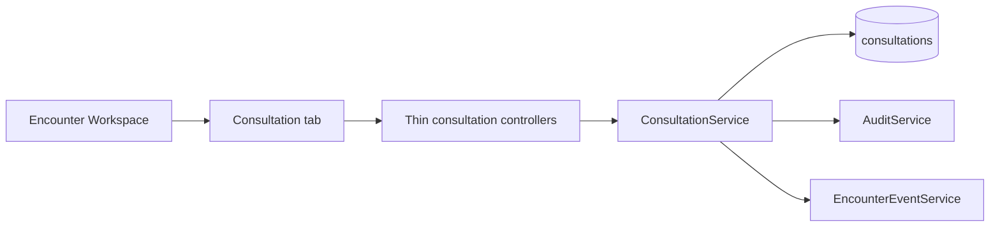

Department notifications are a separate simple CRUD-style attention workflow:

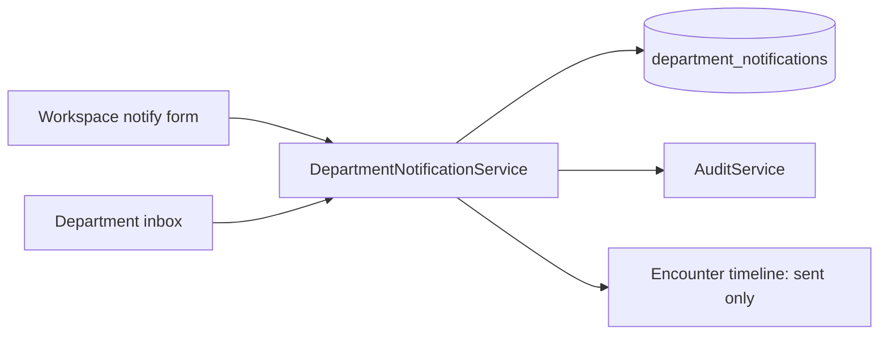

Notifications do not transfer patients, alter queue ownership, or replace the
existing transfer/receive workflow.
