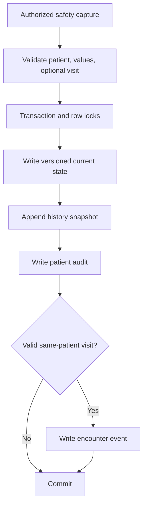
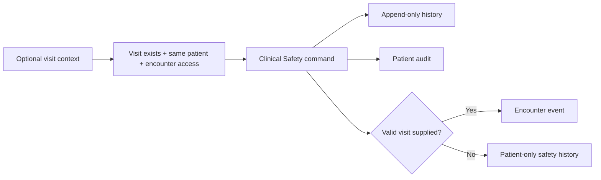
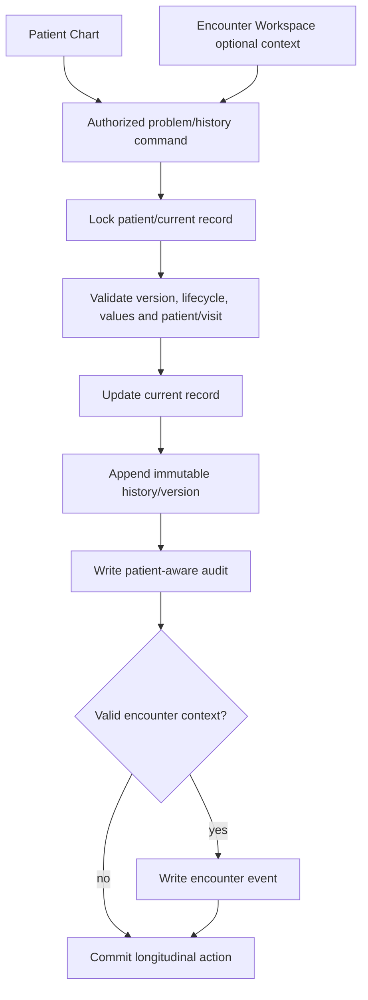
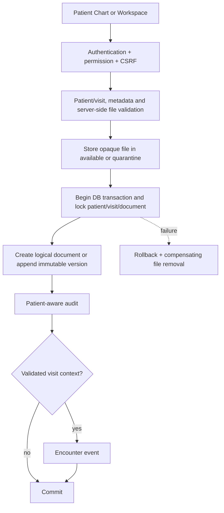

# Workflow Context

> **Read this document before implementing or modifying any workflow.**
>
> This document defines the business processes, workflow rules, state transitions, permissions, validations, and audit requirements for the Enterprise Hospital Management Information System (E-HMIS).

---

# Purpose

This project models the workflow of a real hospital.

The system is workflow-driven, and future module implementation is
CRUD-first unless the current requirement justifies additional structure.

Every clinical and administrative activity belongs to a single **Encounter (Visit)**, which serves as the central record throughout the patient's journey.

---

# Workflow Philosophy

A patient moves through the hospital in controlled stages.

Each stage must:

* Validate business rules.
* Record audit history.
* Create encounter events.
* Preserve workflow integrity.
* Prevent unauthorized actions.
* Be fully traceable.

Every workflow action must be reproducible from the encounter timeline.

Generic encounter editing is administrative only. It must not change department ownership or doctor assignment. Department changes use the transfer and receive workflows; doctor changes use the doctor-assignment workflow.

For future modules, start with the smallest maintainable workflow:

```text
Database Table
-> Service
-> List
-> Create
-> View
-> Edit
-> Save / Update
-> Basic Status
-> Permission
-> CSRF
-> Validation
-> Audit
```

Add extra history tables, approval processes, settings groups, state machines,
or abstractions only for security, financial integrity, stock integrity,
patient identity, signed clinical records, legal/audit requirements, or actual
current workflow needs.

Clinical narrative information should remain `TEXT` unless it must be
independently searched, calculated, filtered, routed, validated, reported, or
integrated with another module.

---

# Core Workflow

```
Patient Registration
        │
        ▼
Create Encounter
        │
        ▼
Transfer to Department
        │
        ▼
Department Receives Patient
        │
        ▼
Assign Doctor (where applicable)
        │
        ▼
Clinical Activities
        │
        ▼
Billing
        │
        ▼
Discharge
        │
        ▼
Encounter Completed
```

---

# Encounter Lifecycle

States

```
Created

↓

Transferred

↓

Pending Reception

↓

Received

↓

Assigned

↓

Clinical Work

↓

Completed

↓

Closed
```

Once an encounter is completed or cancelled, it becomes read-only except for authorized administrative actions.

---

# Patient Registration Workflow

Responsible Department

* Reception

Steps

1. Search for existing patient.
2. Register new patient if not found.
3. Generate hospital number.
4. Save demographics.
5. Record audit log.

Output

```
Patient Record
```

---

# Encounter Creation Workflow

Responsible Department

* Reception

Steps

1. Select patient.
2. Choose visit type.
3. Select initial department.
4. Generate visit number.
5. Create encounter.
6. Mark the initial department as received.
7. Create the initial department queue entry.
8. Create encounter events.
9. Create audit logs.

Validation

* Patient must exist.
* Department must exist.
* Visit type required.

Output

```
Active Encounter
```

---

# Transfer Workflow

Responsible Department

Current department staff.

Purpose

Move an encounter from one department to another.

Steps

1. Validate encounter.
2. Validate destination.
3. Prevent transfer to same department.
4. Prevent transfer of closed encounters.
5. Save transfer history.
6. Update encounter.
7. Reset department receive status.
8. Create encounter event.
9. Create audit log.

Transfer Types

```
Forward

Return

Referral

Discharge

Completion

Cancellation
```

Transfer Record

Stores

* From Department
* To Department
* Transfer Type
* Remarks
* Transferred By
* Transfer Time
* Received By
* Received Time

---

# Receive Workflow

Responsible Department

Receiving department.

Purpose

Officially accepts responsibility for the patient.

Rules

Cannot receive twice.

Cannot receive cancelled encounters.

Must have pending transfer.

Steps

1. Validate encounter.
2. Find pending transfer.
3. Mark transfer received.
4. Update encounter receive fields.
5. Create encounter event.
6. Create audit log.

After receiving

```
Department Workspace Unlocks
```

Before receiving

Department workspace remains locked.

---

# Department Workspace Gate

Every department must verify

```
current_department_received_status == Received
```

If Pending

Display

```
Receive Patient
```

Hide

* Consultation
* Laboratory
* Pharmacy
* Nursing
* Billing
* Clinical forms

---

# Doctor Assignment Workflow

Responsible Department

Doctor Department

Rules

Doctor must exist.

Doctor must belong to current department.

Encounter must be active.

Encounter must already be received.

Steps

1. Select doctor.
2. Assign doctor.
3. Record event.
4. Record audit.

Output

```
attending_doctor_id
```

---

# Consultation Workflow

Responsible

Doctor

Prerequisites

Encounter received.

Doctor assigned.

Workflow

Open consultation.

↓

History

↓

Examination

↓

Diagnosis

↓

Orders

↓

Prescription

↓

Save consultation.

Future Outputs

* Diagnosis
* Procedures
* Notes
* Orders
* Follow-up

---

# Nursing Workflow

Responsible

Nurse

Activities

Vitals

Pain assessment

Weight

Height

Observations

Fluid chart

Medication administration

Each save creates

Encounter Event

Audit Log

---

# Laboratory Workflow

Doctor

↓

Creates laboratory request.

↓

Laboratory receives request.

↓

Sample collection.

↓

Analysis.

↓

Results.

↓

Doctor reviews.

Every stage recorded.

---

# Radiology Workflow

Doctor

↓

Request

↓

Radiology

↓

Imaging

↓

Report

↓

Doctor review

---

# Pharmacy Workflow

Doctor issues prescription.

↓

Pharmacy verifies.

↓

Dispense medication.

↓

Update stock.

↓

Record dispensing history.

---

# Billing Workflow

Every bill belongs to

```
visit_id
```

Sources

Consultation

Laboratory

Radiology

Pharmacy

Physiotherapy

Theatre

Payments recorded separately.

---

# Physiotherapy Workflow

Referral

↓

Assessment

↓

Treatment

↓

Sessions

↓

Completion

---

# Theatre Workflow

Surgical request.

↓

Scheduling.

↓

Operation.

↓

Operation note.

↓

Recovery.

---

# Discharge Workflow

Requirements

No pending orders.

No pending bills.

Doctor approval.

Steps

1. Generate summary.
2. Billing complete.
3. Mark discharged.
4. Encounter event.
5. Audit log.

---

# Cancellation Workflow

Only authorized users.

Requires reason.

Creates

Audit

Encounter Event

---

# Timeline Rules

Every workflow action creates an encounter event.

Examples

Encounter Created

Transferred

Received

Doctor Assigned

Consultation Started

Diagnosis Recorded

Laboratory Requested

Sample Collected

Result Available

Prescription Issued

Medication Dispensed

Invoice Generated

Payment Made

Discharged

Timeline is chronological.

Timeline never deletes history.

---

# Audit Rules

Audit logs are separate from encounter events.

Audit answers

WHO

WHEN

WHAT

WHERE

Examples

Login

Logout

Transfer

Receive

Assign Doctor

Delete

Update

Discharge

---

# Permission Model

Reception

* Register Patient
* Create Encounter
* Transfer

Records

* Update demographics
* View records

Doctor

* Consultation
* Orders
* Prescriptions

Nursing

* Nursing notes
* Vitals

Laboratory

* Results

Radiology

* Reports

Pharmacy

* Dispense medication

Accounts

* Billing
* Payments

Administrator

Full access

---

# Business Rules

Never

Delete encounters.

Delete audit logs.

Delete encounter events.

Overwrite history.

Every workflow creates history.

---

# Validation Rules

Every workflow validates

Encounter exists.

User authorized.

Department correct.

Encounter active.

Workflow sequence valid.

---

# Error Handling

Business errors return

```
success = false

errors = [...]
```

Database errors

Rollback transaction.

Return meaningful error.

---

# Future Workflow Extensions

Appointments

Bed Management

Admissions

Emergency Department

ICU

Operating Theatre

Insurance

Inventory

Patient Portal

SMS Notifications

REST API

Multi-Hospital

Multi-Branch

Telemedicine

Referral Network

Clinical Decision Support

---

# AI Development Guidelines

Before implementing a workflow

1. Understand the business process.
2. Preserve workflow order.
3. Validate every transition.
4. Record encounter event.
5. Record audit log.
6. Use database transactions.
7. Prevent invalid state transitions.
8. Never duplicate workflow logic.
9. Keep controllers thin.
10. Place business logic inside Services.

---

# Development Principle

This project should behave like an enterprise Electronic Medical Record (EMR), where every patient movement, clinical action, financial transaction, and administrative decision is fully traceable.

The system should prioritize:

* Patient safety
* Workflow integrity
* Auditability
* Maintainability
* Scalability
* Production readiness

Every new module must integrate into the encounter lifecycle rather than operate as an isolated feature.

## Demographic Amendment Workflow

Authentication -> CSRF -> authorization -> validated input -> patient row lock
-> expected-version comparison -> applied amendment -> append-only demographic
history -> current row/version update -> patient-aware audit -> commit. A stale
submission is rejected and audited without overwriting newer data. Patient
Chart access is longitudinal PHI access and does not create an encounter event.

## Master Patient Index Workflow

```text
Registration/Search Input
    -> normalize bounded search values
    -> exact hospital-number lookup
    -> exact active alternate-identifier lookup
    -> exact normalized phone lookup
    -> indexed name/phone prefix lookup
    -> deterministic duplicate score
    -> warning or controlled candidate review
```

Strong registration matches require explicit review acknowledgement and are
rechecked inside the patient-creation transaction. Non-low-confidence matches
create one ordered candidate pair. Authorized staff can confirm, dismiss,
defer, or request a future merge; none of these decisions modifies or combines
either patient. Identifier changes use transaction -> row lock -> validation
and version check -> current write -> append-only history -> audit -> commit.
Patient-level MPI actions do not create encounter events.

## Clinical Safety Workflow



Allergies begin Active/Unverified. Authorized users may clarify active records,
confirm them, resolve them, or mark them entered in error; ordinary deletion is
not available. Alerts may be updated while active, closed with a reason, and
reactivated with a reason. Version mismatches reject stale writes.

Patient Chart and Encounter Workspace render one shared banner aggregate.
Expired/closed alerts and resolved allergies remain in history but not active
warnings. Confidential details are masked without their dedicated permission.
Legacy allergy text is shown last as unverified and is never silently parsed.

### Clinical Safety hardening workflow



Confidential reads now authorize inside the service and evaluate historical
classification per version. Required read-audit failure prevents rendering.
Allergy self-verification is denied by default; material edits return confirmed
records to Unverified. Inactive allergies can be explicitly reactivated, while
Resolved and Entered-in-error records remain terminal. Alert expiry remains a
derived state and does not generate an incidental closure event.

## Longitudinal Problem and Medical-History Workflow (Phase 2.4)



Problem states are Active, Inactive, Resolved and terminal Entered-in-error.
Inactive and Resolved may be explicitly reactivated; resolution requires a
reason and valid date. Structured history uses Active, Historical and terminal
Entered-in-error current states; corrections are version actions, not silent
overwrites. Both domains reject stale versions.

An encounter diagnosis remains a future encounter-specific concept. It is not
created, inferred, or automatically promoted by this workflow. A future
`Promote Encounter Diagnosis to Problem List` command must be explicit,
authorized and audited.

## Medical Document Workflow (Phase 2.5)



Documents may be patient-level or encounter-linked. Encounter closure remains
read-only by default for new/replacement attachments. Replacement creates a new
version and never overwrites an existing file. Active documents may be archived
and restored; Entered-in-error is terminal. Downloads do not create encounter
timeline events and always pass through authorization, integrity verification,
audit/access logging, and controller streaming.

Malware scanning is an integration boundary: unscanned files are accurately
labelled `Not Scanned`; when scanning is required they remain quarantined and
unavailable. Generated module reports remain unimplemented.

## Clinical Notes workflow — implemented

```text
Draft -> immutable draft versions -> Doctor signing and lock
-> optional amendment proposal -> independent approval/rejection
-> immutable amended version -> entered-in-error correction when required
```

Draft actions are audited but excluded from encounter timelines. Signed,
amended, and entered-in-error actions create encounter events only for a valid
linked visit. Closed encounters remain readable; new/edit draft mutations are
disabled by default and signed content is corrected through amendment.

## Phase 2 Lean Closeout

Phase 2 is complete for the current version. The existing MPI workflow supports
exact duplicate blocking, alternate-identifier duplicate detection, possible
duplicate candidates, candidate review, review statuses, and registration
warnings. Full patient merging is postponed and must not be implemented until a
future explicit approval.

## CRUD-First Roadmap

### Phase 3 - Consultation and Nursing

Consultation starts as CRUD around one `consultations` table linked to
`visit_id` and `patient_id`. Narrative fields such as presenting complaint,
history of presenting complaint, examination findings, assessment, treatment
plan, advice, follow-up plan, and referral notes remain `TEXT`.

Vital signs use a simple `vital_signs` table because measurements need
trending and calculation. Nursing assessment starts as one primary assessment
table with narrative sections kept as text.

Phase 3.3 Nursing CRUD is implemented using the same encounter-centered
pattern. Nursing assessments remain read-only once completed. Laboratory,
Radiology, Physiotherapy, and Theatre are also implemented in the same
practical CRUD style, each remaining encounter-linked and transaction-safe.

### Phase 4 - Radiology

Radiology is implemented with `radiology_requests` and `radiology_reports` using:

```text
Request -> Worklist -> Report -> Complete
```

Radiology study requested, clinical indication, findings, impression, and
recommendation remain text. PACS, DICOM, and advanced imaging logistics are
postponed.

### Phase 3.7 - Theatre

Theatre is implemented as a single encounter-linked record with Draft and
Completed states. Procedure name, indication, preoperative notes, procedure
details, findings, complications, postoperative notes, postoperative plan,
and anaesthesia notes remain text fields. Consultation and Workspace entry
points open the same theatre record, and the patient chart shows read-only
theatre history.

### Phase 3.6 - Physiotherapy

Physiotherapy is implemented with one `physiotherapy_records` table for the
primary encounter record and one `physiotherapy_sessions` table for follow-up
sessions. The workflow is:

```text
Referral -> Assessment -> Treatment Plan -> Sessions -> Complete
```

Clinical referrals and direct physiotherapy encounters are both supported.
Narrative assessment, goals, precautions, treatment given, patient response,
and progress notes remain text fields. The workspace, consultation context,
and patient chart all surface the same physiotherapy record and session
summary without duplicating the data model.

### Phase 4.2 / 4.3 - Store and Pharmacy

Store is implemented as the operational stock owner. It uses inventory items,
stock transactions, and transaction-safe department balance updates. Pharmacy is
implemented with prescriptions and dispensing. Pharmacy consumes Store stock
when dispensing and does not maintain a separate stock system.

### Phase 4.4 - Billing

Billing is implemented with charges, invoices, payments, and receipt views:

```text
Charge -> Invoice -> Payment -> Receipt
```

Departments may create non-financial Billing Requests when they need Accounts
to add a charge for work performed or items/services used:

```text
Department work -> Billing Request -> Accounts review -> Patient Charge
```

A Billing Request is only a recommendation. It does not affect invoice totals,
patient balance, payments, or receipts until Accounts/Admin converts it into an
official patient charge using the Accounts price catalogue.

Advanced insurance and financial approval chains are postponed.

### Later / Optional

advanced analytics, FHIR, HL7, PACS, patient portal, SMS/email integration,
full patient merging, advanced terminology, and complex approval systems are
deferred unless current hospital operations require them.

## Phase 3.1 Consultation and Department Notifications

Consultation is now the first operational department CRUD module after Doctor
assignment. The workflow is:

```text
Encounter Workspace -> Consultation tab -> Start Consultation
-> Review Consultation -> Save Draft -> View -> Complete -> View-only
```

Consultation writes are allowed only while the encounter is not `Completed` or
`Cancelled`. The consultation belongs to the encounter and patient and normally
uses the assigned encounter doctor as clinical owner. Administrator actions are
permitted for development/testing but retain separate actor attribution.

The Workspace header also provides a top-right `Complete Visit` action that
posts through the existing encounter status transition route. It closes the
visit itself and is separate from consultation completion.

Department notifications are attention requests:

```text
Workspace -> Notify Department -> Receiving department inbox
-> Mark Read -> Resolve
```

They create an audit record and `DEPARTMENT_NOTIFICATION_SENT` timeline event
but never perform a transfer, queue movement, or encounter ownership change.

## Phase 3.2 Vital Signs

Vital signs are recorded directly against an active encounter through the
Encounter Workspace or the Vital Signs module. The workflow is intentionally
simple:

```text
Workspace or Patient Chart -> Vital Signs tab -> Record New / Edit Latest
-> Save -> Audit
```

Encounters that are `Completed` or `Cancelled` remain read-only for vital-signs
mutation. Patient Chart and Consultation views reuse the latest encounter
vital-signs summary as read-only context, while the dedicated history view
lists prior entries in reverse chronological order.

## Nursing Dressing Book

Dressing Book is a small Nursing-owned repeated-care workflow:

```text
Workspace -> Nursing tab -> New Dressing Record
-> Save -> View / Edit -> Dressing Book History
```

Dressing records are linked to the same patient and encounter, remain visible
from the Nursing workspace tab, and appear as read-only history in the Patient
Chart. They do not create separate encounter ownership, transfer, billing, or
timeline workflows. Create/edit uses the existing Nursing permissions and is
blocked when the encounter is completed or cancelled.

## Nursing Drug Chart / MAR

Drug Chart is a Nursing-owned medication administration workflow that reads
Pharmacy prescriptions where available:

```text
Pharmacy Prescription -> Workspace Nursing tab -> New Drug Chart Entry
-> Given / Missed / Refused / Held -> Drug Chart History
```

Entries are stored in `medication_administration_records`, linked to the
patient and encounter, and may optionally link to a prescription. Nursing can
record the administered dose, route, time, status, and notes. This does not
dispense medication, reduce stock, create charges, or replace Pharmacy. It is
the bedside/administered-dose record and appears in the Nursing workspace tab
and Patient Chart Drug Chart tab.

## Patient Chart Blood Card

Blood Card is currently a read-only Patient Chart summary, not a separate
Laboratory/Blood Bank workflow. It shows:

- blood group and genotype from patient demographics;
- blood-related Laboratory requests/results when visible to the user;
- blood-related Medical Documents when visible to the user.

Medical Documents now supports first-class blood-related document types:
`blood_card`, `blood_group_result`, `crossmatch_form`, and
`transfusion_record`. These uploads can appear in the Blood Card summary
without creating a structured Blood Bank workflow yet.

Structured blood requests, crossmatch records, transfusion records, and
Blood Bank workflow remain later Laboratory-owned work.

Accounts owns the reusable price catalogue. It is a sidebar-only master-data
module and does not live inside the Encounter Workspace. Billing consumes
`billable_items` by copying the current catalogue price into each posted
patient charge.

Store owns the operational stock ledger. It is a sidebar-only inventory
module for item catalogue maintenance, stock receipt, issue, return,
adjustment, and department balance tracking. It does not live inside the
Encounter Workspace and it does not create patient charges or dispensing
actions.
## Phase 4.5 Basic Dashboards / Reports

Reports are read-only operational summaries. They do not create encounter
timeline events and do not change clinical, inventory, or financial workflow
ownership. Financial figures come from Billing, prices remain owned by
Accounts, stock remains owned by Store, and dispensing remains owned by
Pharmacy.

## Current encounter completion and discharge workflow

Encounter completion is exposed through a workspace action for authorized
users. Completion opens a small review form rather than directly closing the
encounter. The form captures:

- final/discharge diagnosis;
- discharge or completion notes;
- follow-up instructions.

The data is stored on `visits` for the current simple encounter model:
`completed_at`, `completed_by`, `discharge_diagnosis`, `discharge_notes`, and
`follow_up_instructions`. This is not a full admission, ward, bed-management,
or inpatient-discharge module.

Cancelled encounters are terminal for normal clinical CRUD. Cancellation is a
workspace status action for Receptionist, Records Officer, Doctor, and System
Administrator. Cancellation is not a transfer type and does not represent a
department handoff.

## Current ownership boundaries

- Accounts owns PRICE through `billable_items`.
- Store owns STOCK through inventory items, stock transactions, and maintained
  department balances.
- Store may sell stock to external non-patient customers through External
  Store Sales. External sales reduce Store stock and produce a receipt, but do
  not create fake patients, encounters, invoices, or patient charges.
- Pharmacy owns PRESCRIPTIONS and DISPENSING, and consumes Store stock when
  dispensing.
- Billing owns PATIENT CHARGES, INVOICES, PAYMENTS, receipt views, and
  non-financial Billing Requests awaiting Accounts review.
- Reports are read-only summaries over already-posted operational records.
- Admissions own inpatient ward and bed occupancy. An admission is attached to
  an existing encounter; it does not replace the encounter, consultation, or
  discharge-summary workflow. Admission movements record admit, transfer,
  discharge, and cancellation actions.

Financial settlement may continue after clinical encounter completion. This is
an intentional exception to the normal clinical CRUD lock: clinical records are
read-only after completion/cancellation, while Billing may still receive
payments against outstanding invoices.

## Clinical cross-view policy

Migration 038 aligns the live role matrix with the encounter-centered workflow:
Doctor, Nurse, Laboratory Scientist, Radiographer/X-Ray, Physiotherapist,
Theatre Staff, Pharmacist, and Records Officer may view the core clinical
context needed to safely handle a patient encounter. This includes
Consultation, Vital Signs, Nursing, Laboratory, Radiology, Physiotherapy,
Theatre, Pharmacy, and Medical Records view context where the normal encounter
or treatment relationship allows it.

Mutation remains department-owned. Users can only create, edit, complete,
dispense, or process the tab/workflow their role is responsible for.
Vital Signs are the shared exception for mutation and can only be created or
edited by Doctor, Nurse, and Administrator.

## Current UI and route cleanup notes

The active Encounter Workspace is `modules/visits/workspace.php`; the older
`workspace/index.php` contains legacy placeholder content and should not be
treated as the current workspace. Empty legacy `dashboard/`, `includes/`, and
`workspace/` helper files remain cleanup candidates. User self-service forgot
password is not implemented; administrator password reset is the current
recovery workflow.
